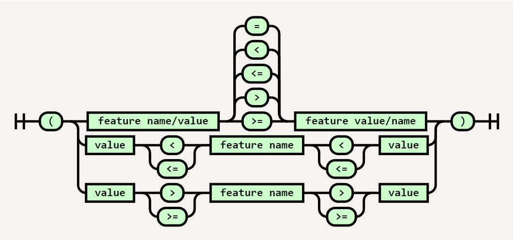

**目录：**

- [5. 媒体查询](#5-媒体查询)
  - [5.1. 媒体查询](#51-媒体查询)
    - [5.1.1. 组合媒体查询](#511-组合媒体查询)
    - [5.1.2. 媒体查询修饰词](#512-媒体查询修饰词)
      - [5.1.2.1. not](#5121-not)
      - [5.1.2.2. only](#5122-only)
    - [5.1.3. 媒体类型](#513-媒体类型)
    - [5.1.4. 媒体特征](#514-媒体特征)
      - [5.1.4.1. 媒体特征类型](#5141-媒体特征类型)
      - [5.1.4.2. 在布尔上下文中估值媒体特征](#5142-在布尔上下文中估值媒体特征)
      - [5.1.4.3. 在范围上下文中估值媒体特征](#5143-在范围上下文中估值媒体特征)
      - [5.1.4.4. min 和 max 前缀](#5144-min-和-max-前缀)
    - [5.1.5. 组合媒体查询](#515-组合媒体查询)
  - [5.2. 媒体查询语法](#52-媒体查询语法)
  - [5.3. 视口/页面尺寸特征](#53-视口页面尺寸特征)
    - [5.3.1. width](#531-width)
    - [5.3.2. height](#532-height)
    - [5.3.3. aspect-ratio](#533-aspect-ratio)
    - [5.3.4. orientation](#534-orientation)
  - [5.4. 显示质量特征](#54-显示质量特征)
    - [5.4.1. resolution](#541-resolution)
    - [5.4.2. scan](#542-scan)
    - [5.4.3. grid](#543-grid)
    - [5.4.4. update](#544-update)
    - [5.4.5. overflow-block](#545-overflow-block)
    - [5.4.6. overflow-inline](#546-overflow-inline)
  - [5.5. 彩色媒体特征](#55-彩色媒体特征)
    - [5.5.1. color](#551-color)
    - [5.5.2. monochrome](#552-monochrome)
    - [5.5.3. color-gamut](#553-color-gamut)
  - [5.6. 交互媒体特征](#56-交互媒体特征)
    - [5.6.1. pointer](#561-pointer)
    - [5.6.2. hover](#562-hover)
    - [5.6.3. any-pointer 和 any-hover](#563-any-pointer-和-any-hover)

# 5. 媒体查询

注意：本章为 [Media Queries Level 4](https://www.w3.org/TR/mediaqueries-4/)。

HTML4[HTML401]定义了一种机制来支持依赖于媒体的样式表，为不同的媒体类型量身定做。例如，一个文档可以为屏幕和印刷品使用不同的样式表。在 HTML 中，这可以被写成：

```html
<link rel="stylesheet" type="text/css" media="screen" href="style.css" />
<link rel="stylesheet" type="text/css" media="print" href="print.css" />
```

CSS 通过其@media 和@import 规则适应并扩展了这一功能，增加了查询单个特征值的能力。

在一个 CSS 样式表内，人们可以声明某些部分适用于某些媒体类型：

```css
@media screen {
  * {
    font-family: sans-serif;
  }
}
```

同样地，样式表可以根据媒体查询有条件地导入：

```css
@import 'print-styles.css' print;
```

媒体查询可用于 HTML、XHTML、XML[xml-stylesheet]和 CSS 的@import 和@media 规则。

下面是用 HTML、XHTML、XML、@import 和@media 写的同一个例子：

```html
<link
  media="screen and (color), projection and (color)"
  rel="stylesheet"
  href="example.css"
/>

<link
  media="screen and (color), projection and (color)"
  rel="stylesheet"
  href="example.css"
/>
```

```xml
<?xml-stylesheet media="screen and (color), projection and (color)"
                 rel="stylesheet" href="example.css" ?>
```

```css
@import url(example.css) screen and (color), projection and (color);

@media screen and (color), projection and (color) { … }
```

## 5.1. 媒体查询

**媒体查询** 是一种检测用于显式文档的用户代理或设备的特征的方法。媒体查询(几乎)总是独立于文档的内容、其样式或任何其他内部方面；它们只依赖于“外部”信息，除非另一个特征明确指定它影响媒体查询的分辨率。

媒体查询的语法由一个可选的媒体查询修饰词、一个可选的媒体类型和 0 个或多个媒体特征组成：


媒体查询是一个逻辑表达式，要么是真，要么是假。在下列情况下，一个媒体查询是真的：

- 媒体类型，如果指定的话，与用户代理正在运行的设备的媒体类型相匹配，并且

- 媒体特征为真

这是一个用 HTML 写的例子：

```html
<link rel="stylesheet" href="example.css" media="screen and (color)" />
```

这个例子表示某个样式表(example.css)适用于具有某种特征(必须是彩色屏幕)的特定媒体类型(屏幕)的设备。

这个例子和上面的例子是相同的，不过使用 CSS 导入规则来写：

```css
@import url('example.css') screen and (color);
```

用户代理必须根据他们所知道的用户环境的变化来重新估值媒体查询，例如，如果设备从横向平铺到纵向，就相应地改变任何依赖于这些媒体查询的行为。

### 5.1.1. 组合媒体查询

若干个媒体查询可以组合成一个以逗号分隔的 **媒体查询序列**。

如果一个媒体查询序列的任何一个组成部分都是真的，那么它就是真的，只有当它的所有组成部分的媒体查询都是假的，才是假的。

例如，如果媒体类型是屏幕并且是彩色设备，或者媒体类型是投影并且是彩色设备，下面的媒体查询序列就是真的：

```css
@media screen and (color), projection and (color) { … }
```

一个空的媒体查询序列被估值为真。

例如，以下 2 条媒体查询示相同的：

```css
@media all {
}
@media {
}
```

### 5.1.2. 媒体查询修饰词

一个媒体查询可以选择以一个媒体查询修饰语为前缀，修饰语是一个单独的关键词，它改变了下面媒体查询的含义。

#### 5.1.2.1. not

一个单独的媒体查询可以通过在它前面加上关键字 not 来否定其结果。如果媒体查询通常会估值为真，那么在它前面加上 not 会使它估值为假，反之亦然。

例如，以下内容将适用于除彩色屏幕以外的所有东西。注意，整个媒体查询被否定了，而不仅仅是媒体类型。

```html
<link rel="stylesheet" media="not screen and (color)" href="example.css" />
```

#### 5.1.2.2. only

媒体查询的概念起源于 HTML4[HTML401]。该规范只定义了媒体类型，但有一个向前兼容的语法，可以容纳未来的概念，如媒体特征：它将消费媒体查询的字符，直到第一个非字母数字字符，并将其解释为媒体类型，忽略其余部分。例如，媒体查询'screen and (color)' 将被截断为只有 'screen'。

不幸的是，这意味着使用这种错误处理行为的传统用户代理将忽略媒体查询中的任何媒体特征，即使它们比查询中的媒体类型重要得多。这可能会导致样式在不适当的情况下被意外地应用。

为了从传统的用户代理那里隐藏这些媒体查询，可以在媒体查询的前缀加上关键字 only。only 关键字对媒体查询的结果没有影响，但会导致媒体查询被传统的用户代理解析为指定未知的媒体类型 "only"，从而被忽略。

在这个例子中，由`<link>`元素指定的样式表不会被传统的用户代理使用，即使他们通常会与屏幕媒体类型相匹配。

```html
<link rel="stylesheet" media="only screen and (color)" href="example.css" />
```

注意：注意 only 关键字只能用在媒体类型之前。一个仅由媒体特征组成的媒体查询，或者一个带有其他媒体查询修饰语(如 not)的媒体查询，将被传统的用户代理自动视为假的。

注意：在发布本规范时，这样的遗留用户代理极为罕见，因此使用 only 修饰符是很少的，如果有必要的话。

### 5.1.3. 媒体类型

媒体类型是一个广泛的用户代理设备类别，可以在其上显示文档。最初的一组媒体类型是在 HTML4 中定义的，用于<link>元素的媒体属性。

不幸的是，媒体类型已被证明不足以区分具有不同风格需求的设备。有些类别原本是很有区别的，比如屏幕和手持设备，在发明之后的几年里已经有了很大的融合。其他的，如 tty 或 tv，暴露了与全功能计算机显示器的标准的有用差异，因此对不同风格的目标有潜在的用处，但媒体类型的定义是相互排斥的，这使得很难以合理的方式使用它们；相反，它们的排斥性方面最好表达为媒体特征，如 "grid" 或 "scan"。

因此，以下媒体类型被定义为在媒体查询中使用：

- **all**
  匹配所有的设备。

- **print**
  匹配打印机，以及旨在复制打印显示的设备，例如在“打印预览”中显示文档的网络浏览器。

- **screen**
  匹配所有没有被打印匹配的设备。

此外，还定义了以下废弃的媒体类型。作者不得使用这些媒体类型；相反，建议他们选择适当的媒体特征，以更好地代表他们试图针对的设备方面的样式。

用户代理必须承认以下媒体类型是有效的，但必须使它们什么都不匹配。

tty
tv
projection
handheld
braille
embossed
aural
speech

注：预计所有的媒体类型也将被废弃，因为适当的媒体特征被定义后，可以捕捉到媒体类型之间的重要差异。

### 5.1.4. 媒体特征

媒体特征是一个比媒体类型更细的检测，媒体特征可以检测用户代理或显示设备的一个特定特征。

从语法上讲，媒体特性类似于 CSS 属性：它们由一个特性名称、一个冒号和一个检测值组成。它们也可以写成布尔形式，仅仅是一个特征名称，或者用比较运算符写成范围形式。


然而，属性和媒体特征之间有几个重要的区别：

- 属性是用来提供关于如何呈现文档的信息。媒体特征用于描述输出设备的要求。
- 媒体特征总是用圆括号包裹，并与和或关键字结合，如(颜色)和(最小宽度：600px)，而不是用分号分隔。
- 一个媒体特征可以只给出它的名字(省略冒号和值)，以便在布尔环境中估值该特征。这是一个方便的速记，用于表示有一个代表 0 或 'none' 的合理值的特征。例如，如果彩色媒体特征不为 0，(color)为真。
- 具有“范围”类型的媒体特征可以写在范围上下文中，它使用标准的数学比较运算符而不是冒号，或者在其特征名称前加上 "min-"或 "max-"。

属性有时接受复杂的值，例如，涉及其他几个值的计算。媒体特征只接受单一的值：一个关键词，一个数字，等等。
如果一个媒体特征引用了一个在 UA 运行的设备上不存在的概念(例如，语音 UA 没有 "width" 的概念)，该媒体特征必须总是估值为 false。

媒体特征 device-aspect-ratio 只适用于视觉设备。因此，在语音设备上，涉及 device-aspect-ratio 的表达式将总是错误的：

```html
<link
  media="speech and (device-aspect-ratio: 16/9)"
  rel="stylesheet"
  href="example.css"
/>
```

#### 5.1.4.1. 媒体特征类型

每个媒体特征在其定义表中都将其“类型”定义为“范围”或“离散”。

“离散”媒体特征，像指针一样，从一个集合中获取其值。这些值可能是关键字或布尔数字(0 和 1)，但共同点是它们没有内在的 "顺序"--没有一个值是 "小于" 或 "大于" 彼此的。

另一方面，像宽度这样的“范围”媒体特征，从一个范围中获取它们的值。任何两个值都可以进行比较，看看哪个更小，哪个更大。

这两种类型的唯一显著区别是，“范围”媒体特征可以在一个范围内被估值，并在其名称上接受 "min-"和 "max-"前缀。做到这些中的任何一个，都会改变特征的含义--当特征与给定值完全匹配时，媒体特征不是真的，而是当特征大于/小于/等于给定值时才匹配。

当视口的宽度为 600px 或以上时，`(width >= 600px)` 媒体特征为真。

另一方面，`(width: 600px)` 本身只有在视口的宽度正好是 600px 时才是真的。如果它小于或大于 600px，它将是假的。

#### 5.1.4.2. 在布尔上下文中估值媒体特征

虽然媒体特征通常有一个类似于 CSS 属性的语法，但它们也可以更简单地写成只有特征名称，如(color)。

当这样写的时候，媒体特征是在一个布尔环境中被估值的。如果该特性对于数字 0、数值为 0 的`<dimension>`或关键字 none 以外的任何数值都是真的，那么媒体特性就会被估值为真。否则，它将被估值为假。

一些媒体特征被设计成这样的写法：

例如，`update` 通常被写成 `(update)` 来测试是否有任何形式的更新，或者不写 `(update)` 来检查相反的情况。

它也可以被赋予一个明确的值，`(update: fast)` 或 `(update: slow)` 等于 `(update)`，而 `(update: none)` 等于 `not (update)`。

一些数字媒体特征，比如说宽度，在布尔上下文中很少有意义，因为它们的值几乎总是大于零。其他的，比如 `color`，有意义的零值：`(color)` 与 `(color>0)` 是相同的，表明设备根本能够显示颜色。

只有一些接受关键字的媒体特征在布尔上下文中是有意义的。

例如，`(pointer)` 是有用的，因为 'pointer' 有一个 'none' 的值，表示设备上根本没有指向设备。另一方面，`(scan)` 只是永远是真的或永远是假的(取决于它是否适用于设备)，因为没有一个值表示“假”。

#### 5.1.4.3. 在范围上下文中估值媒体特征



具有“范围”类型的媒体特征可以交替写在一个范围的上下文中，利用它们的值是有序的这一事实，使用普通的数学比较运算符。

注意：这种语法是 Mediaqueries 第 4 级的新语法，因此目前没有像 min-/max-前缀那样被广泛支持。

基本形式是由一个特征名称、一个比较运算符和一个值组成，如果关系为真，则返回真。

例如，`(height > 600px)` (或者 `(600px < height)`) 如果视口高度大于 600px 则返回 true。

其余的形式，特征名称嵌套在两个值的比较之间，如果两个比较都为真，则返回真。

例如，`(400px < width < 1000px)` 如果视口宽度在 400px 和 1000px 之间(但不等于其中之一)，则返回真。
一些具有“范围”类型的媒体特征在负值范围内被说成是假的。这意味着负值是有效的，必须被解析，而且查询媒体特征是否等于、小于、小于或等于任何这样的负值必须估值为假。如果关系是真实的，查询媒体特征是否大于或大于或等于一个负值，则估值为真。

注意：如果负值在解析时被拒绝，那么根据错误处理规则，它们将被视为未知。然而，在现实中，一个设备的分辨率是否为-300dpi 并不是未知的，它是已知的假的。同样，对于任何视觉设备来说，已知目标显示区域的宽度大于 -200px 上述规则反映了这一点，使直觉与 UA 的做法相匹配。

下面的例子在所有视觉设备上都会产生绿色背景:

```css
@media not (width <= -100px) {
  body {
    background: green;
  }
}

@media (height > -100px) {
  body {
    background: green;
  }
}

@media not (resolution: -300dpi) {
  body {
    background: green;
  }
}
```

与媒体查询第三级[MEDIAQUERIES-3]相比，这是一个行为上的变化，当时这些属性上的负值会导致语法错误。在第 3 级中，语法错误(包括禁止值)会导致整个媒体查询为假，而不是本级中定义的未知处理。从第 3 级更新的实现应该确保在增加对第 2.5 节中定义的更丰富的语法的支持时改变对相关属性的负值的处理，以避免引入非预期的语义。

#### 5.1.4.4. min 和 max 前缀

与上述在范围上下文中估值“范围”类型的媒体特征不同，该特征可以被写成普通的媒体特征，但在特征名称上有 `min-`或 `max-` 的前缀。

这相当于在一个范围上下文中估值该特征，如下所示。

在特征名称上使用 `min-` 前缀等同于使用 `>=` 运算符。例如，`(min-height: 600px)` 相当于 `(height >= 600px)`。

在特征名称上使用 `max-` 前缀等同于使用 `<=` 运算符。例如，`(max-width: 40em)` 相当于 `(width <= 40em)`。

注意：因为 `min-` 和 `max-` 都等同于包含数值的范围比较，所以在某些情况下它们可能会有限制。

例如，作者试图使用 `min-` 和 `max-` 在视口宽度的断点上定义不同的样式，通常会抵消他们所比较的值，以确保两个查询不会同时估值为真。假设断点在 320px，作者可以在概念上使用：

```css
@media (max-width: 320px) {
  /* 样式适用于是视口宽度小于等于 320px */
}

@media (min-width: 321px) {
  /* 样式适用于是视口宽度大于等于 321px */
}
```

虽然这确保了当视口宽度为 320px 时，两套样式不会同时应用，但它没有考虑到由于非整数像素密度(例如在高 DPI 显示器上或由于缩放的结果)而可能出现的零星视口尺寸。任何在 320px 和 321px 之间的视口宽度都会导致没有任何样式被应用。

解决这个问题的一个方法是提高用于比较的数值的精度。使用上面的例子，将第二个比较值改为 320.01px，可以大大减少设备上的视口宽度会落在缝隙之间的变化：

```css
@media (max-width: 320px) {
  /* 样式适用于是视口宽度小于等于 320px */
}

@media (min-width: 320.01px) {
  /* 样式适用于是视口宽度大于等于 321px */
}
```

然而，在这些情况下，范围上下文查询(不限于 `>=` 和 `<=` 的比较)提供了一个更合适的解决方案：

```css
@media (width <= 320px) {
  /* 样式适用于是视口宽度小于等于 320px */
}

@media (width > 320px) {
  /* 样式适用于是视口宽度大于等于 321px */
}
```

“离散”类型属性不接受 `min-` 或 `max-` 前缀。在“离散”类型的媒体特性上添加这样的前缀，只会导致一个未知的特性名称。

例如，`(min-grid: 1)` 是无效的，因为 grid 是一个“离散”媒体特征，所以不接受前缀。(尽管 grid 媒体特征似乎是数字的，因为它接受 0 和 1 的值)。

试图在布尔上下文中估值 min/max 前缀的媒体特征是无效的，是一个语法错误。

### 5.1.5. 组合媒体查询

多个媒体特征可以使用完整的布尔代数(not、and、or)组合成一个媒体特征。

任何媒体特征都可以通过在其前面放置 `not` 来否定。例如，`not (color)` 反转了 `(color)` 的含义：因为 `(color)` 匹配的是具有任何种类的彩色显示器的设备，而 `not (color)` 匹配的是没有任何种类的彩色显示器的设备。

两个或更多的媒体特征可以连接在一起，这样，只有当所有的媒体特征都是真的时候，查询才是真的，方法是把 `and` 放在它们之间。例如，`(width < 600px) and (height < 600px)` 只匹配屏幕在两个尺寸上都小于 600px 宽的设备。

另外，两个或更多的媒体特征可以被连接起来，这样，如果任何一个媒体特征为真，查询就为真，方法是将 `or` 放在它们之间。例如，`(update: slow) or (hover: none)` 如果设备更新屏幕的速度很慢(比如电子阅读器)，或者主要的指向设备没有悬停功能，就可以与之匹配，也许这表明应该使用一个显示更多信息的布局，而不是紧凑地隐藏信息直到用户悬停。

媒体特征可以通过用小括号 `()` 包裹来分组，然后可以像单个媒体查询一样嵌套在一个条件中。例如，`(not (color)) or (hover)` 在单色和/或有悬停功能的设备上是真的。如果人们想查询一个单色且没有悬停功能的设备，则必须写成 `not ((color) or (hover))` 或者 `(not (color)) and not (hover))`。

在媒体查询的同一优先级上，混合使用 `and` 和 `or` 是无效的。例如，`(color) and (pointer) or (hover)` 是非法的，因为不清楚是什么意思。相反，小括号可以用来用一个特定的连接关键词来分组，产生 `(color) and ((pointer) or (hover))` 或者 `((color) and (pointer)) or (hover)`。这两个有非常不同的含义：如果只有 `(hover)` 是真的，第一个估值为假，但第二个估值为真。

## 5.2. 媒体查询语法

媒体查询语法的非正式描述出现在前几节的散文和铁路图中。正式的媒体查询语法在本节中描述，规则/属性语法在[CSS-SYNTAX-3]和[CSS-VALUES-3]中定义。

要解析一个`<media-query-list>`产生式，先解析一个逗号分隔的组件值列表，然后将返回列表中的每个条目解析为一个`<media-query>`。它的值是这样产生的`<media-query>`的列表。

注意：这种对`<media-query-list>`解析的明确定义对于使媒体查询列表的错误恢复行为得到良好的定义是必要的。

注意：这个`<media-query-list>`解析的定义有意接受一个空列表。

注意：根据[CSS-SYNTAX-3]，标记是不区分 ASCII 大小写的。

```bnf
<media-query> = <media-condition>
             | [ not | only ]? <media-type> [ and <media-condition-without-or> ]?
<media-type> = <ident>

<media-condition> = <media-not> | <media-in-parens> [ <media-and>* | <media-or>* ]
<media-condition-without-or> = <media-not> | <media-in-parens> <media-and>*
<media-not> = not <media-in-parens>
<media-and> = and <media-in-parens>
<media-or> = or <media-in-parens>
<media-in-parens> = ( <media-condition> ) | <media-feature> | <general-enclosed>

<media-feature> = ( [ <mf-plain> | <mf-boolean> | <mf-range> ] )
<mf-plain> = <mf-name> : <mf-value>
<mf-boolean> = <mf-name>
<mf-range> = <mf-name> <mf-comparison> <mf-value>
           | <mf-value> <mf-comparison> <mf-name>
           | <mf-value> <mf-lt> <mf-name> <mf-lt> <mf-value>
           | <mf-value> <mf-gt> <mf-name> <mf-gt> <mf-value>
<mf-name> = <ident>
<mf-value> = <number> | <dimension> | <ident> | <ratio>
<mf-lt> = '<' '='?
<mf-gt> = '>' '='?
<mf-eq> = '='
<mf-comparison> = <mf-lt> | <mf-gt> | <mf-eq>

<general-enclosed> = [ <function-token> <any-value> ) ] | ( <ident> <any-value> )
```

`<media-type>`产生式不包括关键字 only、not、and、and or。

在 "<" 或">" `<delim-token>`和后面的"="`<delim-token>`之间不允许有空格，如果它存在的话。

注意：在 "not"、"and"、"or "关键字和下面的"("字符之间需要留白，因为如果没有留白，就会被解析为`<function-token>`。这一点没有被明确规定为无效，因为它已经被上面的语法所覆盖。然而，在()和后面的关键词之间有空白是可以的。

当解析`<media-in-parens>`产生式时，只有当输入不匹配前面的任何一个分支时，才必须选择`<general-enclosed>`分支。`<general-enclosed>`的存在是为了允许将来以合理的兼容方式对语法进行扩展。

## 5.3. 视口/页面尺寸特征

### 5.3.1. width

| 属性名 | width      |
| ------ | ---------- |
| 用于   | @media     |
| 值     | `<length>` |
| 类型   | 范围       |

宽度媒体特征描述了输出设备的目标显示区域的宽度。对于连续媒体，这是视口的宽度，包括渲染的滚动条的尺寸(如果有)。对于分页媒体，这是页面框的宽度。

width 在负值范围内是假的。

例如，这个媒体查询表达了该样式表用于宽度超过 25cm 的打印输出:

```html
<link rel="styleheet" media="print and (min-width: 25cm)" href="http://..." />
```

这个媒体查询表达了样式表用于视口(屏幕/纸张上呈现文档的部分)宽度在 400 和 700 像素之间的设备上:

```css
@media (400px <= width <= 700px) {
}
```

这个媒体查询表示，如果视口的宽度大于 20em，就使用样式表。

```css
@media (min-width: 20em) {
}
```

em 值是相对于 font-size 的初始值而言的。

### 5.3.2. height

| 属性名 | height     |
| ------ | ---------- |
| 用于   | @media     |
| 值     | `<length>` |
| 类型   | 范围       |

高度媒体特征描述了输出设备的目标显示区域的高度。对于连续媒体，这是视口的高度，包括渲染的滚动条的大小(如果有的话)。对于分页媒体，这是指页面框的高度。

height 在负值范围内是假的。

### 5.3.3. aspect-ratio

| 属性名 | aspect-ratio |
| ------ | ------------ |
| 用于   | @media       |
| 值     | `<ratio>`    |
| 类型   | 范围         |

长宽比媒体特征被定义为宽度媒体特征值与高度媒体特征值的比率。

### 5.3.4. orientation

| 属性名 | orientation |
| ------ | ----------- | ---------- |
| 用于   | @media      |
| 值     | `portrait   | landscape` |
| 类型   | 离散        |

- **portrait**
  当高度媒体特征的值大于或等于宽度媒体特征的值时，方向媒体特征为纵向。

- **landscape**
  否则方向是横向的。

下面的媒体查询测试的是“纵向方向”，就像一个直立的手机:

```css
@media (orientation: portrait);
```

## 5.4. 显示质量特征

### 5.4.1. resolution

| 属性名 | resolution    |
| ------ | ------------- | --------- |
| 用于   | @media        |
| 值     | `<resolution> | infinite` |
| 类型   | 范围          |

分辨率媒体特征描述了输出设备的分辨率，即像素的密度，考虑到了页面缩放，但假设手指捏合缩放为 1.0。

分辨率媒体特征在负值范围内是假的。

当查询具有非正方形像素的媒体时，分辨率查询垂直维度的密度。

对于打印机来说，这对应于加网分辨率(打印任意颜色的点的分辨率)。打印机对于灰度打印可能有不同的分辨率。

对于那些对分辨率没有物理限制的输出媒介(比如输出到矢量图)，这个特征必须与无限值相匹配。为了在范围上下文中估值这个媒体特征，无限必须被视为大于任何可能的 `<resolution>`。(也就是说，像`(resolution>1000dpi)`这样的查询对于一个无限的媒体来说将是真的)。

这个媒体查询只是检测“高分辨率”的屏幕(那些硬件像素与 CSS px 的比例至少为 2)：

```css
@media (resolution >= 2dppx);
```

例如，这个媒体查询表达了一个样式表在分辨率大于 300 点数/CSS 的设备上使用：

```css
@media (min-resolution: 300dpi);
```

这个媒体查询是等效的，但使用的是 CSS 厘米单位：

```css
@media print and (min-resolution: 118dpcm);
```

`<resolution>` 不是指每个物理长度单位的设备像素数，而是指每个 css 单位的设备像素数。这种映射是由用户代理完成的，所以它总是为用户代理所知。

如果用户代理不知道物理像素的几何形状，或者知道物理像素的几何形状，并且它们是(足够接近)正方形的，它就不会沿着每个轴映射每 css 像素的不同设备像素数，因此垂直和水平分辨率之间就没有区别。

否则，如果 UA 选择沿每个轴映射一个不同的数字，这将是对物理像素也不是正方形的回应。UA 是如何获得这一知识的超出了范围，但有足够的信息来做出这一决定，如果设备被旋转 90 度，它就可以反过来进行映射。

### 5.4.2. scan

| 属性名 | scan       |
| ------ | ---------- | ------------ |
| 用于   | @media     |
| 值     | `interlace | progressive` |
| 类型   | 离散       |

扫描媒体功能描述了一些输出设备的扫描过程。

- **interlace**
  CRT 和某些类型的等离子电视屏幕使用 "隔行扫描 "渲染，视频帧在只指定屏幕上的 "偶数 "线和只指定 "奇数 "线之间交替进行，利用各种自动心理图像校正能力来产生平滑运动。这使他们能够以一半的带宽成本模拟出更高的 FPS 广播。

- **progressive**
  使用“逐行”渲染的屏幕可以完全显示每个屏幕，不需要特殊处理。

大多数现代屏幕，以及所有的计算机屏幕都使用逐行渲染。

例如，衬线字体中字母的“feet”是非常小的特征，在隔行扫描设备上会引发“twitter”。扫描媒体功能可以用来检测这一点，并使用另一种出现“twitter”的可能性较小的字体。

```css
@media (scan: interlace) {
  body {
    font-family: sans-serif;
  }
}
```

注意：在撰写本文时，所有已知的实现都与 scan: progressive 相匹配，而不是 scan: interlace。

### 5.4.3. grid

| 属性名 | grid           |
| ------ | -------------- |
| 用于   | @media         |
| 值     | `<mq-boolean>` |
| 类型   | 离散           |

网格媒体特征用于查询输出设备是网格还是位图。如果输出设备是基于网格的(例如，“tty”终端，或只有一种固定字体的电话显示器)，该值将是 1。否则，该值将是 0。

`<mq-boolean>` 值类型是 `<integer>`，值为 0 或 1。任何其他的整数值都是无效的。注意，-0 在 CSS 中总是等同于 0，所以也被接受为一个有效的 `<mq-boolean>` 值。

注意：`<mq-boolean>` 类型的存在只是为了遗留的目的。如果这个功能是今天设计的，它将使用适当的命名关键字来表示它的值。

下面是一个检测狭窄控制台屏幕的例子：

```css
@media (grid) and (max-width: 15em);
```

注意：在写这篇文章的时候，所有已知的实现都匹配 `grid: 0`，而不是 ``grid: 1`.。

### 5.4.4. update

| 属性名 | update |
| ------ | ------ | ---- | ----- |
| 用于   | @media |
| 值     | ` none | slow | fast` |
| 类型   | 离散   |

刷新媒体功能用于查询输出设备在内容被渲染后修改其外观的能力。它接受以下值：

- **none**
  一旦它被渲染，版面就不能再被刷新。例如：打印在纸上的文件。

- **slow**
  布局可以根据 CSS 的通常规则动态变化，但输出设备无法快速渲染或显示变化，以至于不能被视为平滑的动画。例如。电子墨水屏幕或功率严重不足的设备。

- **fast**
  布局可以根据 CSS 的通常规则动态变化，而输出设备在速度上没有异常的限制，所以可以使用定期刷新的东西，如 CSS 动画。例如：电脑屏幕。

例如，如果一个页面将其链接的样式改为只在悬停时添加下划线，那么它可能希望在打印时始终显示下划线：

```css
@media (update) {
  a {
    text-decoration: none;
  }

  a:hover,
  a:focus {
    text-decoration: underline;
  }
}
/* 在非刷新的UA中，链接在任何时候都会得到其默认的下划线。*/
```

### 5.4.5. overflow-block

| 属性名 | overflow-block |
| ------ | -------------- | ------ | ------ |
| 用于   | @media         |
| 值     | `none          | scroll | paged` |
| 类型   | 离散           |

溢出块媒体特征描述了当内容溢出块轴中的初始包含块时，设备的行为：

- **none**
  块轴没有溢出；任何溢出的内容都不会被显示。例如：广告牌

- **scroll**
  块轴中的溢出内容通过允许用户滚动来显示。例子：电脑屏幕

- **paged**
  内容被分割成不连续的页面；块轴中溢出一页的内容被显示在下一页。例如：打印机、电子书阅读器
  匹配无或滚动的媒体被称为连续媒体，而匹配分页的媒体则被称为分页媒体

注意：这个媒体特征的其他值可能会在未来被添加，以描述具有混合行为的用户代理类别，结合连续和分页媒体的各个方面。例如，Presto 布局引擎(现已停产)采用了类似于连续的半分页表现模式行为，除了它尊重强制分页。由于不知道目前有什么用户代理具有这种类型的行为，工作组决定不在这个级别中增加这样一个值，以避免误导任何这样的用户代理。我们鼓励任何实施一个没有被上述任何数值充分描述的用户代理的人与工作组联系，以便考虑对这个媒体特性的扩展。

### 5.4.6. overflow-inline

| 属性名 | overflow-inline |
| ------ | --------------- | ------- |
| 用于   | @media          |
| 值     | `none           | scroll` |
| 类型   | 离散            |

溢出行内媒体特征描述了当内容溢出行内轴中的初始包含块时，设备的行为。

- **none**
  在行内轴中没有溢出的能力；任何溢出的内容都不会被显示。

- **scroll**
  行内轴中的溢出内容会通过允许用户滚动来显示。

注意：没有已知的行内溢出内容的分页实现，而且这个概念似乎没有什么意义，所以故意没有为 overflow-inline 提供分页值。

## 5.5. 彩色媒体特征

### 5.5.1. color

| 属性名 | color       |
| ------ | ----------- |
| 用于   | @media      |
| 值     | `<integer>` |
| 类型   | 范围        |

彩色媒体特征描述了输出设备的每一个颜色组成的位数。如果设备不是彩色设备，该值为零。

color 在负值范围内是假的。

例如，这两个媒体查询表达了一个样式表适用于所有颜色设备：

```css
@media (color) {
}

@media (min-color: 1) {
}
```

这个媒体查询表达了一个样式表适用于每个颜色组成至少有 8 位的颜色设备：

```css
@media (color >= 8) {
}
```

如果不同的颜色组成由不同的位数表示，则使用最小的数字。

例如，如果一个 8 位颜色系统用 3 位表示红色组成，用 3 位表示绿色组成，用 2 位表示蓝色组成，那么彩色媒体特征的值将是 2。

在具有索引颜色的设备中，使用查找表中每个颜色分量的最小比特数。

注意：所描述的功能只能在表面上描述颜色能力。color-gamut，一般来说与作者的需求更相关。如果需要进一步的功能，RFC2879[RFC2879]提供了更具体的媒体功能，这些功能可能在以后的阶段得到支持。

### 5.5.2. monochrome

| 属性名 | monochrome  |
| ------ | ----------- |
| 用于   | @media      |
| 值     | `<integer>` |
| 类型   | 范围        |

单色媒体特征描述了单色帧缓冲器中每个像素的位数。如果设备不是单色设备，输出设备值将为 0。

monochrome 在负值范围内是假的。

例如，下面这个样式表适用于所有单色设备：

```css
@media (monochrome) {
}
```

表示一个样式表适用于每像素超过 2 位数的单色设备：

```css
@media (monochrome >= 2) {
}
```

表示有一个样式表用于彩色页面，另一个用于单色：

```html
<link rel="style sheet" media="print and (color)" href="http://..." />
<link rel="styleheet" media="print and (monochrome)" href="http://..." />
```

### 5.5.3. color-gamut

| 属性名 | color-gamut |
| ------ | ----------- | --- | -------- |
| 用于   | @media      |
| 值     | `srgb       | p3  | rec2020` |
| 类型   | 离散        |

color-gamut 媒体特征描述了 UA 和输出设备所支持的色域。也就是说，如果 UA 接收到具有指定空间的颜色的内容，它可以使输出设备渲染适当的颜色，或适当地接近的颜色。

注意：该查询使用近似的范围，有几个原因。首先，显示硬件有很多差异。例如，一个设备可能声称支持 "Rec.2020"，但实际上渲染的全色域范围要低得多。其次，不同的设备支持很多不同的色彩范围，列举它们将是很乏味的。在大多数情况下，作者不需要知道显示器的确切能力，只需要知道它是否优于 sRGB，或明显优于 sRGB。这样，他们就可以向用户提供适当的图像，并贴上颜色配置文件的标签。

- **srgb**
  UA 和输出设备可以支持大约 sRGB 色域或更多。

注：预计绝大多数的彩色显示器都能对这种类型的查询返回真值。

- **p3**
  UA 和输出设备可以支持 DCI P3 色彩空间所指定的近似色域或更多。

注：P3 色域大于并包括 srgb 色域。

- **rec2020**
  UA 和输出设备可以支持 ITU-R 建议的 BT.2020 色彩空间所规定的大约色域或更多。

注：rec2020 色域大于并包括 p3 色域。

注：上表没有包含足够的信息来完全描述这些色彩空间，但足以确定输出设备是否大约涵盖了它们各自的色域。关于 sRGB 的更多信息，请参见[SRGB]；关于 DCI P3 的更多信息，请参见[SMPTE-EG-432-1-2010]和[SMPTE-RP-431-2-2011]；关于 ITU-R Recommendation BT.2020 的更多信息，请参见[ITU-R-BT-2020-2]。

例如，当显示器支持 DCI P3 色域时，这个媒体查询适用：

```css
@media (color-gamut: p3) {
}
```

注意：如果一个输出设备的完整输出色域足够大，或者一个色域是另一个支持的色域的子集，那么这个媒体特性的多个值都可以返回真。因此，这个特性最好以“升序”的方式使用，当 `(color-gamut: srgb)` 为真时，设置一个基础值，然后在`(color-gamut: p3)` 为真时覆盖它，等等。

注意：有些输出设备，如单色显示器，甚至不能支持 srgb 色域。为了测试这些设备，你可以用否定布尔上下文的方式使用这个功能：`not (color-gamut)`。

## 5.6. 交互媒体特征

交媒体特征反映了用户与页面互动的各个方面。

匹配指针和悬停组合的设备的典型例子：

|                | `poniter: none`                          | `poniter: coarse`         | `poniter: fine`                                                               |
| -------------- | ---------------------------------------- | ------------------------- | ----------------------------------------------------------------------------- |
| `hover: none`  | 只用键盘控制，顺序/空间（d-pad）焦点导航 | 智能手机，触摸屏          | 基本的触控笔数字化仪（Cintiq、Wacom 等）                                      |
| `hover: hover` |                                          | 任天堂 Wii 控制器，Kinect | 鼠标、触摸板、先进的触控笔数字化仪（Surface、三星 Note、Wacom Intuos Pro 等） |

'pointer' 和 'hover' 功能与“主要”指向设备的特性有关，而 `any-pointer` 和 `any-hover` 可用于查询所有潜在可用的指向设备的属性。

注意：虽然本规范没有定义用户代理应该如何决定什么是“主要”指向设备，但期望用户代理应该通过结合他们正在运行的设备/环境的知识、可用的指向设备的数量和类型，以及这些设备中通常和/或当前正在使用的概念，来做出这一决定。在一个设备的主要输入机制不是指向设备，但有一个次要的--不经常使用的--输入是指向设备的情况下，用户代理可以决定将非指向设备作为主要的（导致 `pointer: none`）。用户代理也可以决定动态地改变哪种类型的指向设备被认为是主要的，以响应用户环境的变化或用户与 UA 交互的方式。

注意：'pointer', 'hover', 'any-pointer' 和 'any-hover' 特征只与指向设备的特性或完全不存在有关，不能用于检测非指向设备输入机制（如键盘）的存在。作者应该考虑到非指向设备输入的潜在存在，无论在查询这些特征时哪些值是匹配的。

虽然 'pointer' 和 'hover' 可以用来设计页面的主要风格和交互模式，以适应主要的输入机制（基于主要指向设备的特征或完全不存在），但作者应强烈考虑使用任意指针和任意悬停，以考虑到所有已检测到的可能的指向设备类型。

### 5.6.1. pointer

| 属性名 | pointer |
| ------ | ------- | ------ | ----- |
| 用于   | @media  |
| 值     | `none   | coarse | fine` |
| 类型   | 离散    |

'pointer' 媒体特征用于查询指向设备(如鼠标)的存在和准确性。如果存在多个指向设备，'pointer' 媒体特征必须反映“主要”指向设备的特性，这是由用户代理决定的。(要查询任何可用的指向设备的能力，请参见 'any-pointer' 媒体特征)。

- **none**
  该设备的主要输入机制不包括指向设备。

- **coarse**
  该设备的主要输入机制包括一个精度有限的指向设备。例如，触摸屏和运动检测传感器(如 Xbox 的 Kinect 外围设备。)

- **fine**
  设备的主要输入机制包括一个精确的指向设备。例子包括鼠标、触摸板和绘图手写笔。

'coarse' 的和 'fine' 都表示有一个指向设备的存在，但在精确度上有所不同。在放缩系数为 1 的情况下，如果一个指向设备很难或不可能可靠地从几个相邻的小目标中挑选一个，那么它就可以被称为 'coarse'。改变缩放级别不影响该媒体特征的价值。

注意：由于 UA 可能为用户提供缩放的能力，或者由于次级指向设备可能具有不同的精度，即使该媒体特征的值是 coarse，用户也能进行准确的点击。这个媒体特征并不表明用户永远无法准确地点击，只是表明他们不方便这样做。作者应通过设计不依赖准确点击的页面来对 coarse 值作出反应。

出于可访问性的原因，即使在指向设备可以被描述为 'fine' 的设备上，UA 也可以给这个媒体查询一个 'coarse' 或 'none' 的值，以表明用户难以准确或根本无法操纵指向设备。此外，即使主要的指向设备具有 'fine' 的指向精度，用户也可能有额外的 'coarse' 指向设备可用。作者可能希望查询任意指针媒体功能，以考虑到这些其他 'coarse' 潜在指向设备。

```css
/* 如果我们有一个不准确的主要指向设备，让单选按钮和复选框变大 */
@media (pointer: coarse) {
  input[type='checkbox'],
  input[type='radio'] {
    min-width: 30px;
    min-height: 40px;
    background: transparent;
  }
}
```

### 5.6.2. hover

| 属性名 | hover  |
| ------ | ------ | ------ |
| 用于   | @media |
| 值     | `none  | hover` |
| 类型   | 离散   |

'hover' 媒体功能用于查询用户使用主要指向设备在页面上悬停元素的能力。如果一个设备有多个指向设备，'hover' 媒体功能必须反映“主要”指向设备的特性，这由用户代理决定。(要查询任何可用的指向设备的能力，请参见 'any-hover' 媒体功能)。

- **none**
  表示主要的指向设备不能悬停，或者没有指向设备。例子包括触摸屏和使用基本绘图手写笔的屏幕。
  可以悬停的指向设备，但这样做是不方便的，也不是正常使用方式的一部分，也符合这个值。例如，一个长按被视为悬停的触摸屏将匹配 `hover: none`。

- **hover**
  表示主要的指向设备可以很容易地在页面的某些部分上悬停。例子包括鼠标和物理上指向屏幕的设备，如任天堂 Wii 控制器。

例如，在一个也可以由可选鼠标控制的触摸屏设备上，悬停媒体功能应该与悬停：无相匹配，因为主要的指向设备(触摸屏)不允许用户悬停。

然而，尽管如此，可选的鼠标确实允许用户悬停。因此，作者应该小心，不要认为 `:hover` 伪类在 `hover:none` 为真的设备上永远不会匹配，但他们应该设计不依赖悬停的布局，使其完全可用。

出于可访问性的考虑，即使在支持悬停的设备上，UA 也可以给这个媒体查询一个 `hover:none` 的值，以选择在没有悬停的情况下也能正常工作的布局。请注意，即使主要的输入机制具有 `hover: hover` 的能力，用户可能还有其他不提供 hover 功能的输入机制。

```css
/* 只在能够方便地悬停的设备上使用悬停激活的下拉菜单。*/
@media (hover) {
  .menu > li {
    display: inline-block;
  }

  .menu ul {
    display: none;
    position: absolute;
  }

  .menu li:hover ul {
    display: block;
    list-style: none;
    padding: 0;
  }
  /* ... */
}
```

### 5.6.3. any-pointer 和 any-hover

| 属性名 | any-pointer |
| ------ | ----------- | ------ | ----- |
| 用于   | @media      |
| 值     | `none       | coarse | fine` |
| 类型   | 离散        |

| 属性名 | any-hover |
| ------ | --------- | ------ |
| 用于   | @media    |
| 值     | `none     | hover` |
| 类型   | 离散      |

'any-pointer' 和 'any-hover' 媒体特征与指针和悬停媒体特征相同，但它们对应于用户可用的所有指向设备的能力的结合。在 'any-pointer' 的情况下，如果不同的指向设备有不同的特性，可以匹配多个值。

'any-pointer' 和 'any-hover' 只能在所有的指向设备都与相应的查询中的 none 相匹配，或者根本就没有指向设备的情况下，才能匹配 none。

'any-pointer' 是用来查询指向设备的存在和准确性。它不考虑任何额外的非指向设备的输入，也不能用来测试其他输入机制的存在，如 D-pad 或纯键盘控制，它们不会移动屏幕上的指针。`any-pointer:none` 只有在完全没有指向设备的情况下才会估值为真。

在一个有鼠标和键盘的传统桌面环境中，`any-pointer:none` 将是假的(由于鼠标的存在)，尽管非指针输入(键盘)也存在。

`any-hover:none` 只有在没有指向设备，或者所有指向设备都缺乏悬停功能的情况下才会估值为真。因此，它应该被理解为测试是否有任何可悬停的指向设备存在的查询，而不是任何指向设备是否不能悬停的查询。后者的情况目前无法使用 any-hover 或任何其他交互媒体功能来确定。此外，它没有考虑到任何非指向设备的输入，如 D-pad 或纯键盘控制，就其本质而言，这些设备也是不能悬停的。

在带有鼠标和触摸屏的触摸功能的笔记本电脑上，`any-hover:none` 将估值为假(由于存在可悬停的鼠标)，即使也存在不可悬停的指向设备(触摸屏)。目前不可能为不同的指向设备具有不同的悬停能力的情况提供不同的样式。

仅仅因为 'any-hover' 或 'any-pointer' 表明至少有一种可用的输入机制具有这些能力，就设计一个依赖悬停或准确指向的页面，这很可能会导致糟糕的体验。然而，作者可以利用这一信息，根据用户可用的任何额外的指向设备，来决定他们希望提供的风格和功能。

一些智能电视带有控制屏幕光标的方法，但它通常是相当基本的控制器，很难准确操作。

这样的智能电视中的浏览器会把 'coarse' 作为 'pointer' 和 'any-pointer' 的值，允许作者提供一个具有大的和容易到达的点击目标的布局。

用户可能还将蓝牙鼠标与电视配对，并偶尔使用它以获得额外的便利，但这个鼠标并不是操作电视的主要方式。'pointer' 仍然匹配 'coarse'，而 'any-pointer' 现在既匹配 'coarse' 也匹配 'fine'。

基于`(any-pointer: fine)`现在是真的这一事实而切换到小的点击目标并不合适。这不仅会让用户感到惊讶，因为它提供的体验与他们在电视上所期望的不一致，而且还可能相当不方便：鼠标不是控制电视的主要方式，它可能无法触及，被藏在沙发的某个垫子下面......

相比之下，考虑在同一台电视上滚动。如果没有一个准确的指向设备，滚动条是很难操作的。在准备了另一种方式来表示基于`(pointer: coarse)`为真，有更多的内容要看，如果 `(any-pointer: fine)` 为真，作者可能希望仍然显示额外的滚动条，或者如果 `(any-pointer: fine)` 为假，则完全隐藏它们以减少视觉混乱。
