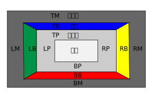

**目录：**

- [5. 盒模型](#5-盒模型)
  - [5.1. 盒子尺寸](#51-盒子尺寸)
  - [5.2. 外边距长度](#52-外边距长度)
    - [5.2.1. 外边距折叠](#521-外边距折叠)
  - [5.3. 内边距长度](#53-内边距长度)
  - [5.4. 边框属性](#54-边框属性)
    - [5.4.1. 边框长度](#541-边框长度)
    - [5.4.2. 边框颜色](#542-边框颜色)
    - [5.4.3. 边框样式](#543-边框样式)
    - [5.4.4. 边框简写属性](#544-边框简写属性)
  - [5.5. 行内元素与 direction](#55-行内元素与-direction)

# 5. 盒模型

本章阐述盒模型。CSS 盒模型描述了文档树中的元素生成的矩形盒子，并根据视觉格式化模型进行布局。

## 5.1. 盒子尺寸

每个盒子都有一个内容区（如文本、图像等）和可选的内边距、边框和外边距。每个区域的大小由下面定义的属性指定。下图显示了这些区域的关系，以及用来指代这些区域的术语。



外边距、边框和内边距可以细分为上、右、下、左四个部分（例如，在图中，"LM" 表示左外边距，"RP" 表示右内边距，"TB" 表示上边框，等等）。

四个区域（内容、内边距、边框和外边距）中的每个区域的周长被称为 "边缘"，因此每个盒子都有四个边缘。

- **内容边缘或内边**
  内容边缘围绕着盒子的宽度和高度所给出的矩形，这往往取决于元素的渲染内容。四条内容边缘定义了盒子的 **内容盒**。
- **内边距边缘**
  内边距边缘围绕着盒子的内边距。如果内边距的宽度为 0，则内边距边缘与内容边缘相同。四个内边距边缘定义了盒子的 **内边距盒**。
- **边框边缘**
  边框边缘围绕着盒子的边框。如果边框的宽度为 0，则边框边缘与内边距边缘相同。四条边框边缘定义了盒子的 **边框盒子**。
- **边距边或外边**
  外边距边缘围绕着盒子的外边距。如果外边距的宽度为 0，那么外边距边缘与边框边缘相同。四条外边距边缘定义了盒子的 **外边距盒子**。

每种边缘都可以细分为上、右、下、左四个边缘。

盒子的内容区的尺寸--内容宽度和内容高度--取决于几个因素：生成盒子的元素是否设置了 "width" 或 "height"属性，盒子是否包含文本或其他盒子，盒子是否是一个表格，等等。盒子的宽度和高度将在视觉格式化模型章节中讨论。

盒子的内容、内边距和边框区域的背景样式由生成元素的 "background" 属性指定。外边距的背景总是透明的。

## 5.2. 外边距长度

外边距属性指定一个盒子的外边距区域的宽度。margin 简写属性设置了所有四边的外边距，而其他的外边距属性只设置了各自的边。这些属性适用于所有元素，但垂直外边距不会对非替换的行内元素产生任何影响。

本节中定义的属性指的是 `<margin-width>` 值类型，它可以取以下值之一。

`<margin-width>` 的值类型，它可以采取以下值之一：

- **<length>**
  指定一个固定的宽度。

- **<percentage>**
  该百分比是相对于生成盒的包含块的宽度计算的。注意，这对 'margin-top' 和 'margin-bottom' 也是如此。

- **auto**
  参见第 7 章的 "计算宽度和外边距行为" 部分。

margin 属性的负值是允许的，但可能有特定的实施限制。

| 属性名   | margin-top, margin-bottom                                                            |
| -------- | ------------------------------------------------------------------------------------ | -------- |
| 值       | `<margin-width>                                                                      | inherit` |
| 初始值   | 0                                                                                    |
| 适用元素 | 所有元素，但具有除 table-caption、table 和 inline-table 以外的表格显示类型的元素除外 |
| 可继承   | 否                                                                                   |
| 百分数   | 相对于包含块的 width 属性值                                                          |
| 计算值   | 指定的百分数或绝对长度                                                               |

这些属性对非替换性行内元素没有效果：

| 属性名   | margin-left, margin-right                                                            |
| -------- | ------------------------------------------------------------------------------------ | -------- |
| 值       | `<margin-width>                                                                      | inherit` |
| 初始值   | 0                                                                                    |
| 适用元素 | 所有元素，但具有除 table-caption、table 和 inline-table 以外的表格显示类型的元素除外 |
| 可继承   | 否                                                                                   |
| 百分数   | 相对于包含块的 width 属性值                                                          |
| 计算值   | 指定的百分数或绝对长度                                                               |

| 属性名   | margin                                                                               |
| -------- | ------------------------------------------------------------------------------------ | -------- |
| 值       | `<margin-width>{1,4}                                                                 | inherit` |
| 初始值   | 0                                                                                    |
| 适用元素 | 所有元素，但具有除 table-caption、table 和 inline-table 以外的表格显示类型的元素除外 |
| 可继承   | 否                                                                                   |
| 百分数   | 相对于包含块的 width 属性值                                                          |
| 计算值   | 指定的百分数或绝对长度                                                               |

margin 属性是一个简写属性，用于在样式表的同一位置设置 "margin-top"、"margin-right"、"margin-bottom "和 "margin-left"。

如果只有一个组件值，它适用于所有的边。如果有两个值，顶部和底部的边距被设置为第一个值，而右侧和左侧的边距被设置为第二个值。如果有三个值，顶部被设置为第一个值，左边和右边被设置为第二个值，底部被设置为第三个值。如果有四个值，它们分别适用于顶部、右侧、底部和左侧。

```css
body {
  margin: 2em;
} /* 所有边距都设置为2em */
body {
  margin: 1em 2em;
} /* 顶部和底部=1em，右侧和左侧=2em */
body {
  margin: 1em 2em 3em;
} /* 顶部=1em，右侧=2em /* top=1em, right=2em, bottom=3em, left=2em */
```

上面例子的最后一条规则等同于下面的例子。

```css
body {
  margin-top: 1em;
  margin-right: 2em;
  margin-bottom: 3em;
  margin-left: 2em; /*从对面（右边）复制过来 */
}
```

### 5.2.1. 外边距折叠

在 CSS 中，两个或多个盒（可能是也可能不是同级别的）的相邻外边距可以合并成一个外边距。以这种方式组合的外边距被称为折叠，由此产生的组合外边距被称为 **折叠外边距**。

相邻的垂直外边距会折叠，除了以下情况：

- 根元素盒子的外边距不会折叠。
- 如果一个有间隙的元素的顶部和底部外边距是相邻的，它的外边距就会与下面的兄弟元素的相邻外边距一起折叠，但产生的外边距不会与父块的底部外边距一起折叠。
- 如果一个具有非 0 计算的 "min-height" 和 "auto" 计算的 "height" 的盒子的顶部外边距与它的最后一个正常流中的子块的底部外边距折叠，那么子块的底部外边距不会与父块的底部外边距折叠。

水平外边距永远不会折叠。

两个边距是 **相邻的**，当且仅当：

- 两者都属于参与同一块格式化环境的正常流中的块级盒子
- 没有行盒子，没有间隙，没有内边距，也没有边框将它们分开（注意，某些 0 高度的行盒子（见 9.4.2）在此被忽略）。
- 两者都属于垂直相邻的盒子边缘，即形成以下一对之一：
  - 盒子的上边缘和它的第一个正常流中的子的上边缘
  - 盒子的底边和它的下一个正常流中的兄弟盒子的顶边
  - 如果父元素有 "auto" 计算的高度，最后一个正常流中的子方的底边和父方的底边
  - 没有建立一个新的块格式化上下文，并且计算的 "min-height" 为 0，计算的 "height" 为 0 或 "auto"，并且没有正常流中的子代的盒子的顶部和底部外边距。

如果一个折叠的外边距与另一个外边距相邻，它的任何组成部分的外边距都被视为与该外边距相邻。

注意。邻接外边距可以由没有兄弟或父关系的元素产生。

注意上述规则意味着：

- 浮动盒子和任何其他盒子之间的外边距不会折叠（甚至在浮动盒子和它的正常流中的子之间也不会折叠）。
- 建立新的块格式化上下文的元素（如浮动和具有 'visible' 以外的 'overflow' 的元素）的外边距不会与它们的正常流中的子代一起折叠。
- 绝对定位的盒子的边距不会折叠（甚至不会与它们的正常流中的子元素折叠）。
- inline-block 盒子的边距不会折叠（甚至不会与它们的正常流中的子元素一起折叠）。
- 一个正常流中的块级元素的底外边距总是与它的下一个正常流中的块级同级元素的顶边距一起折叠，除非该同级元素有间隙。
- 如果一个正常流中的块元素没有上边框，没有顶部内边距，并且该元素没有间隙，那么该元素的上外边距将与它的第一个正常流中的块级子元素的上外边距一起折叠。
- 高度为'auto'的正常流中的块盒子的底外边距与它的最后一个正常流中的块级子元素的底外边距一起折叠，如果：
  - 盒子没有底部内边距，以及
  - 盒子没有底部边框，以及
  - 子节点的底外边距既不会与有间隙的顶外边距一起折叠，也不会（如果盒子的最小高度不为 0）与盒子的顶外边距一起折叠。
- 如果一个盒子的 'min-height' 属性为 0，并且它既没有顶部或底部边框，也没有顶部或底部内边距，并且它的 'height' 为 0 或 'auto'，并且它不包含一个行盒子，并且它的所有正常流中的子盒子的边框（如果有的话）都会折叠。

当两个或多个外边距折叠时，产生的外边距宽度是折叠的外边距宽度的最大值。如果是负的外边距，负的相邻外边距的绝对值的最大值将从正的相邻外边距的最大值中扣除。如果没有正外边距，相邻外边距的绝对值的最大值被从 0 中扣除。

如果一个盒子的顶部和底部的外边距是相邻的，那么外边距有可能通过它折叠。在这种情况下，元素的位置取决于它与其他元素的外边距被折叠的关系：

- 如果元素的边距与它的父元素的上外边距一起折叠，那么盒子的上边框边缘就被定义为与父元素的边框相同。
- 否则，要么元素的父级不参与外边距折叠，要么只涉及父级的底边。元素的上边框边缘的位置与该元素有非 0 下边框时的位置相同。

注意，被折叠过的元素的位置对其他元素的位置没有影响，它们的外边距被折叠了。顶层边框边缘的位置只在放置这些元素的子元素时需要。

## 5.3. 内边距长度

内边距属性指定了一个盒子的内边距区域的宽度。padding 简写属性设置了所有四边的内边距，而其他内边距属性只设置各自的一边。

本节中定义的属性指的是`<padding-width>`值类型，它可以取以下值之一。

- `<length>`
  指定一个固定的宽度。

- `<percentage>`
  百分比是相对于生成的盒子的包含块的宽度计算的，即使是 'padding-top' 和 'padding-bottom'。

与外边距属性不同，内边距的值不能是负数。和外边距属性一样，内边距属性的百分数指的是生成盒子的包含块的宽度。

| 属性名   | padding-top, padding-right, padding-bottom, padding-left                                                                   |
| -------- | -------------------------------------------------------------------------------------------------------------------------- | -------- |
| 值       | `<padding-width>                                                                                                           | inherit` |
| 初始值   | 0                                                                                                                          |
| 适用元素 | 除了 table-row-group、table-header-group、table-footer-group、table-row、table-column-group 和 table-column 以外的所有元素 |
| 可继承   | 否                                                                                                                         |
| 百分数   | 相对于包含块的 width 属性值                                                                                                |
| 计算值   | 指定的百分数或绝对长度                                                                                                     |

| 属性名   | padding                                                                                                                    |
| -------- | -------------------------------------------------------------------------------------------------------------------------- | -------- |
| 值       | `<padding-width>{1,4}                                                                                                      | inherit` |
| 初始值   | 0                                                                                                                          |
| 适用元素 | 除了 table-row-group、table-header-group、table-footer-group、table-row、table-column-group 和 table-column 以外的所有元素 |
| 可继承   | 否                                                                                                                         |
| 百分数   | 相对于包含块的 width 属性值                                                                                                |
| 计算值   | 指定的百分数或绝对长度                                                                                                     |

padding 属性是一个简写属性，用于在样式表的同一位置设置 'padding-top'、'padding-right'、'padding-bottom'和'padding-left'。

如果只有一个组件值，它适用于所有的边。如果有两个值，顶部和底部的内边距被设置为第一个值，右侧和左侧的内边距被设置为第二个值。如果有三个值，顶部被设置为第一个值，左右被设置为第二个，底部被设置为第三个。如果有四个值，它们分别适用于顶部、右侧、底部和左侧。

内边距区域的表面颜色或图像是通过 "background" 属性指定的。

```css
h1 {
  background: white;
  padding: 1em 2em;
}
```

上面的例子指定了一个'1em'的垂直内边距（'padding-top'和'padding-bottom'）和一个'2em'的水平内边距（'padding-right'和'padding-left'）。em 单位是相对于元素的字体大小而言的：'1em' 等于使用的字体大小。

## 5.4. 边框属性

边框属性指定了一个盒子的边框区域的宽度、颜色和样式。这些属性适用于所有元素。

### 5.4.1. 边框长度

边框宽度属性指定了边框区域的宽度。本节中定义的属性指的是 `<border-width>` 值类型，它可以取以下值之一。

- thin
  一个薄的边框。

- medium
  一个中等厚度的边框。

- thick
  一个厚边框。

- `<length>`
  边框的厚度有一个明确的值。明确的边框宽度不能是负值。

前三个值的解释取决于用户代理。不过，以下关系必须成立。

'thin'<='medium'<='thick'。

此外，这些宽度在整个文档中必须是恒定的。

| 属性名   | border-top-width, border-right-width, border-bottom-width, border-left-width |
| -------- | ---------------------------------------------------------------------------- | -------- |
| 值       | `<border-width>                                                              | inherit` |
| 初始值   | medium                                                                       |
| 适用元素 | 所有                                                                         |
| 可继承   | 否                                                                           |
| 百分数   | 不适用                                                                       |
| 计算值   | 绝对长度；如果 border-style 为'none'或'hidden'，则为'0'。                    |

这个属性设置了一个盒子的顶部、右侧、底部和左侧边框的宽度：

| 属性名   | border-width                                              |
| -------- | --------------------------------------------------------- | -------- |
| 值       | `<border-width>{1,4}                                      | inherit` |
| 初始值   | medium                                                    |
| 适用元素 | 所有                                                      |
| 可继承   | 否                                                        |
| 百分数   | 不适用                                                    |
| 计算值   | 绝对长度；如果 border-style 为'none'或'hidden'，则为'0'。 |

这个属性是在样式表的同一个地方设置 "border-top-width"、"border-right-width"、"border-bottom-width "和 "border-left-width "的简写属性。

如果只有一个组件值，它适用于所有边框。如果有两个值，顶部和底部的边框被设置为第一个值，右侧和左侧被设置为第二个值。如果有三个值，顶部被设置为第一个值，左边和右边被设置为第二个值，底部被设置为第三个值。如果有四个值，它们分别适用于顶部、右侧、底部和左侧。

在下面的例子中，注释指出了顶部、右侧、底部和左侧边框的结果宽度。

```css
h1 {
  border-width: thin;
} /* thin thin thin thin */
h1 {
  border-width: thin thick;
} /* thin thick thick */
h1 {
  border-width: thin thick medium;
} /* thin thick medium thick */
```

### 5.4.2. 边框颜色

边框颜色属性指定了一个盒子的边框的颜色。

| 属性名   | border-top-color, border-right-color, border-bottom-color, border-left-color |
| -------- | ---------------------------------------------------------------------------- | ----------- | -------- |
| 值       | `<color>                                                                     | transparent | inherit` |
| 初始值   | color 属性的值                                                               |
| 适用元素 | 所有                                                                         |
| 可继承   | 否                                                                           |
| 百分数   | 不适用                                                                       |
| 计算值   | 当取自'color'属性时，是'color'的计算值；否则，按照规范执行                   |

| 属性名   | border-color                                               |
| -------- | ---------------------------------------------------------- | ----------------- | -------- |
| 值       | `[<color>                                                  | transparent]{1,4} | inherit` |
| 初始值   | color 属性的值                                             |
| 适用元素 | 所有                                                       |
| 可继承   | 否                                                         |
| 百分数   | 不适用                                                     |
| 计算值   | 当取自'color'属性时，是'color'的计算值；否则，按照规范执行 |

border-color 属性设置了四个边框的颜色。值有以下含义。

- `<color>`
  指定一个颜色值。

- transparent
  边框是透明的（尽管它可能有宽度）。

border-color 属性可以有 1 到 4 个分量值，值的设置与 "border-width" 一样在不同的边上。

如果一个元素的边框颜色没有用 border 属性指定，用户代理必须使用该元素的'color'属性的值作为边框颜色的计算值。

在这个例子中，边框将是一条实心黑线。

```css
p {
  color: black;
  background: white;
  border: solid;
}
```

### 5.4.3. 边框样式

边框样式属性指定了盒子的边框的线条样式（实线、双线、虚线，等等）。本节中定义的属性指的是`<border-style>`值类型，它可以取以下值之一：

- none
  没有边框；计算出的边框宽度为零。

- hidden
  与'无'相同，除了在表格元素的边界冲突解决方面。

- dotted
  边框是一系列的点。

- dashed
  边框是一系列的短线段。

- solid
  边框是一个单一的线段。

- double
  边框是两条实线。两条线和它们之间的空间之和等于'border-width'的值。

- groove
  边框看起来好像是刻在画布上的。

- ridge
  与'凹槽'相反：边框看起来就像从画布里出来的一样。

- inset
  边框使盒子看起来好像嵌入了画布中。

- outset
  与 "inset" 相反：边框使盒子看起来像是从画布中出来的。

所有的边框都是在盒子的背景上画的。对于'groove'、'ridge'、'inset'和'outset'的值所绘制的边框的颜色取决于元素的边框颜色属性，但是用户可以选择自己的算法来计算实际使用的颜色。例如，如果'border-color'的值是'silver'，那么用户可以使用从白色到深灰色的渐变色来表示一个倾斜的边框。

| 属性名   | border-top-style, border-right-style, border-bottom-style, border-left-style |
| -------- | ---------------------------------------------------------------------------- | -------- |
| 值       | `<border-style>                                                              | inherit` |
| 初始值   | none                                                                         |
| 适用元素 | 所有                                                                         |
| 可继承   | 否                                                                           |
| 百分数   | 不适用                                                                       |
| 计算值   | 按照规范执行                                                                 |

| 属性名   | border-color         |
| -------- | -------------------- | -------- |
| 值       | `<border-style>{1,4} | inherit` |
| 初始值   | none                 |
| 适用元素 | 所有                 |
| 可继承   | 否                   |
| 百分数   | 不适用               |
| 计算值   | 按照规范执行         |

border-style 属性设置了四个边框的样式。它可以有 1 到 4 个分量的值，而且这些值是在不同的边上设置的，就像上面的 'border-width'。

```css
#xy34 {
  border-style: solid dotted;
}
```

在上面的例子中，水平边框将是'solid'，垂直边框将是'dotted'。

由于边框样式的初始值是 'none'，所以除非设置了边框样式，否则不会有边框可见。

### 5.4.4. 边框简写属性

| 属性名   | border-top, border-right, border-bottom, border-left |
| -------- | ---------------------------------------------------- | --- | -------------- | --- | ---------------------- | -------- |
| 值       | `[ <border-width>                                    |     | <border-style> |     | <'border-top-color'> ] | inherit` |
| 初始值   | 见单个属性                                           |
| 适用元素 | 所有                                                 |
| 可继承   | 否                                                   |
| 百分数   | 不适用                                               |
| 计算值   | 见单个属性                                           |

这是一个简写属性，用于设置一个盒子的顶部、右侧、底部和左侧边界的宽度、样式和颜色。

```css
h1 {
  border-bottom: thick solid red;
}
```

上述规则将设置 h1 元素下方边框的宽度、样式和颜色。省略的值被设置为其初始值。因为下面的规则没有指定边框的颜色，所以边框将具有'color'属性所指定的颜色。

```css
h1 {
  border-bottom: thick solid;
}
```

| 属性名   | border            |
| -------- | ----------------- | --- | -------------- | --- | ---------------------- | -------- |
| 值       | `[ <border-width> |     | <border-style> |     | <'border-top-color'> ] | inherit` |
| 初始值   | 见单个属性        |
| 适用元素 | 所有              |
| 可继承   | 否                |
| 百分数   | 不适用            |
| 计算值   | 见单个属性        |

border 属性是一个简写属性，用于为一个盒子的所有四个边框设置相同的宽度、颜色和样式。与简写的'margin'和'padding'属性不同，'border'属性不能在四个边框上设置不同的值。要做到这一点，必须使用一个或多个其他的边框属性。

例如，下面的第一条规则等同于它后面显示的四条规则集合。

```css
p {
  border: solid red;
}

p {
  border-top: solid red;
  border-right: solid red;
  border-bottom: solid red;
  border-left: solid red;
}
```

因为在某种程度上，这些属性有重叠的功能，所以指定规则的顺序很重要。

考虑一下这个例子。

```css
blockquote {
  border: solid red;
  border-left: double;
  color: black;
}
```

在上面的例子中，左边边框的颜色是黑色，而其他边框是红色。这是由于'border-left'设置了宽度、样式和颜色。由于颜色值不是由'border-left'属性给出的，它将从'color'属性中获取。事实上，'color'属性是在'border-left'属性之后设置的，这与此无关。

## 5.5. 行内元素与 direction

对于每个行内盒子，用户代理必须采取为每个元素生成的行内盒子，并按照视觉顺序（而不是逻辑顺序）渲染边距、外边距和内边距。

当元素的'direction'属性为'ltr'时，元素出现的第一个行内盒子的最左边生成的盒子有左外边距、左边框和左内边距，而元素出现的最后一个行内盒子的最右边生成的盒子有右内边距、右边框和右外边距。

当元素的'direction'属性为'rtl'时，元素出现的第一个行内盒子的最右边生成的盒子有右内边距、右边框 和右外边距，而元素出现的最后一个行内盒子的最左边生成的盒子有左外边距、左边框 和左内边距。
