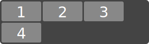
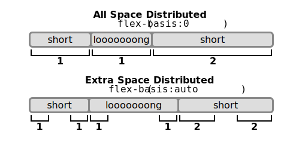

**目录：**

- [9. 弹性布局](#9-弹性布局)
  - [9.1. 弹性盒子盒模型以及术语](#91-弹性盒子盒模型以及术语)
  - [9.2. 弹性容器](#92-弹性容器)
  - [9.3. 弹性子项](#93-弹性子项)
    - [9.3.1. 绝对定位的弹性子项](#931-绝对定位的弹性子项)
    - [9.3.2. 弹性子项的内外边距](#932-弹性子项的内外边距)
    - [9.3.3. 弹性子项 Z-轴顺序](#933-弹性子项-z-轴顺序)
    - [9.3.4. 折叠子项](#934-折叠子项)
    - [9.3.5. 弹性子项的自动最小大小](#935-弹性子项的自动最小大小)
  - [9.4. 顺序和方向](#94-顺序和方向)
    - [9.4.1. flex-direction 属性](#941-flex-direction-属性)
    - [9.4.2. flex-wrap 属性](#942-flex-wrap-属性)
    - [9.4.3. flex-flow 属性](#943-flex-flow-属性)
    - [9.4.4. order 属性](#944-order-属性)
      - [9.4.4.1. 重新排序和可访问性](#9441-重新排序和可访问性)
  - [9.5. 弹性行](#95-弹性行)
  - [9.6. 弹性度](#96-弹性度)
    - [9.6.1. flex 简写属性](#961-flex-简写属性)
      - [9.6.1.1. flex 的基本值](#9611-flex-的基本值)
    - [9.6.2. 弹性度的组件](#962-弹性度的组件)
      - [9.6.2.1. flex-grow](#9621-flex-grow)
      - [9.6.2.2. flex-shrink](#9622-flex-shrink)
      - [9.6.2.3. flex-basis](#9623-flex-basis)
  - [9.7. 对齐](#97-对齐)
    - [9.7.1. 自动外边距对齐](#971-自动外边距对齐)
    - [9.7.2. justify-content 属性](#972-justify-content-属性)
    - [9.7.3. align-items 和 align-self 属性](#973-align-items-和-align-self-属性)
    - [9.7.4. align-content 属性](#974-align-content-属性)
    - [9.7.5. 弹性容器基线](#975-弹性容器基线)
  - [9.8. 弹性布局算法](#98-弹性布局算法)
    - [9.8.1. 初始设置](#981-初始设置)
    - [9.8.2. 确定弹性行长度](#982-确定弹性行长度)
    - [9.8.3. 确定主尺寸](#983-确定主尺寸)
    - [9.8.4. 确定交叉尺寸](#984-确定交叉尺寸)
    - [9.8.5. 主轴对齐](#985-主轴对齐)
    - [9.8.6. 交叉轴对齐](#986-交叉轴对齐)
    - [9.8.7. 解析弹性长度](#987-解析弹性长度)
    - [9.8.8. 确定的和不确定的尺寸](#988-确定的和不确定的尺寸)
    - [9.8.9. 固有尺寸](#989-固有尺寸)

# 9. 弹性布局

注意：本章为 [Flexible Box Layout Module Level 1](https://www.w3.org/TR/css-flexbox-1/)。

CSS 2.1 定义了四种布局模式：根据盒子与同级和祖先盒子的关系来确定盒子的大小和位置的算法：

- 块布局，设计用于布居文档
- 行内布局，设计用于布局文本
- 表格布局，设计用于以表格的形式布局 2D 数据
- 定位布局，设计用于非常明确的定位，而不考虑文档中的其他元素

本模块引入了一种新的布局模式：**弹性布局**，它是为布局更复杂的应用程序和网页而设计的。

弹性布局从表面上看与块布局相似。它缺乏许多可用于块布局的更复杂的以文本或文档为中心的属性，如浮动和列。作为回报，它获得了简单而强大的工具，用于分配空间，并以网络应用和复杂网页经常需要的方式对齐内容。弹性容器的内容：

- 可以按任何流动方向布局(向左、向右、向下，甚至向上！)。
- 可以在样式层颠倒显示顺序或重新排列(即视觉顺序可以独立于源和语音顺序)。
- 可以沿单一(主)轴线性布局，或沿次要(交叉)轴包装成多个行
- 可以“放缩”它们的尺寸以应对可用的空间
- 可以相对于它们的容器或彼此在副轴(交叉轴)上对齐
- 可以沿主轴动态地折叠或松开，同时保留容器的交叉尺寸

## 9.1. 弹性盒子盒模型以及术语

**弹性容器** 是由一个 display 计算为 flex 或 inline-flex 的元素生成的盒子。弹性容器的流内子项被称为 **弹性子项**，并使用弹性布局模型进行布局。

与块和行内布局不同，其布局计算偏向于块和行流内动方向，而弹性布局则偏向于 **弹性方向**。为了更容易地谈论弹性布局，本节定义了一组与弹性流相关的术语。Flex-flow 值和书写模式决定了这些术语如何映射到物理方向(上/右/下/左)、轴(垂直/水平)和尺寸(宽/高)。


- **主轴/主尺寸**
  弹性容器的 **主轴** 是布置弹性子项的主要轴线。它在 **主尺寸** 上延伸。
- **主起点/主终点**
  弹性子项被放置在容器内，从主起点一侧开始，向主终点一侧前进。
- **主大小/主大小属性**
  弹性容器或弹性子项的宽度或高度(以主尺寸为准)是该盒子的主尺寸。因此，它的主大小属性是它的宽度或高度属性，无论哪一个在主尺寸中。同样，它的最小和最大主尺寸属性是它的最小宽度/最大宽度或最小高度/最大高度属性，以在主尺寸上为准，并确定其最小/最大主尺寸。
- **交叉轴/交叉尺寸**
  垂直于主轴的轴称为交叉轴。它在交叉尺寸中延伸。
- **交叉起点/交叉终点**
  弹性行装满物品，从弹性容器的交叉起点一侧开始，向交叉终点一侧放入容器中。
- **交叉大小/交叉大小属性**
  一个弹性容器或弹性子项的宽度或高度，无论哪一个在交叉尺寸中，都是该盒子的交叉尺寸。因此，它的交叉尺寸属性是它的宽度或高度属性，无论哪一个在交叉尺寸中。同样，它的最小和最大交叉尺寸属性是它的最小宽度/最大宽度或最小高度/最大高度属性，以在交叉尺寸中的哪个为准，并确定其最小/最大交叉尺寸。

本规范中使用的其他尺寸术语在 CSS 内在和外在尺寸中定义。[CSS-SIZING-3]

## 9.2. 弹性容器

| 属性名     | display |
| ---------- | ------- | ------------ |
| 新的属性值 | `flex   | inline-flex` |

- **flex**
  这个值会使一个元素产生一个弹性容器，当放置在流布局中时是块级的。
- **inline-flex**
  此值使元素在流布局中产生一个弹性容器，它是行内级的。

一个弹性容器为其内容建立一个新的弹性格式化上下文。这与建立一个块格式化上下文是一样的，只是使用的是弹性布局而不是块布局。例如，浮动盒子不会侵入弹性容器，弹性容器的外边距不会随其内容的外边距折叠。弹性容器为其内容形成一个包含块，就像块容器一样。[CSS21] 'overflow' 属性适用于弹性容器。

弹性容器不是块容器，因此，一些以块布局为假设而设计的属性并不适用于弹性布局。特别是：

- float 和 clear 不会创建浮动或清除弹子项，也不会使其脱离流。

- vertical-align 对弹性子项没有影响。

- ::first-line 和 ::first-letter 伪元素不适用于弹性容器，并且弹性容器不会为其祖先盒子提供第一个格式化的行或第一个字母。

如果一个元素的指定显示方式是 inline-flex，那么它的显示属性在某些情况下会计算为 flex：CSS 2.1 第 9.7 节中的表格被修改为包含一个额外的行，inline-flex 在 "指定值" 列，flex 在 "计算值 "列。

## 9.3. 弹性子项

宽泛地讲，一个弹性容器的弹性子项是代表其流内的内容的盒子。

弹性容器的每个流内子项都成为一个弹性子项，而每个连续的子文本运行序列都被包裹在一个匿名的块容器弹性子项中。然而，如果整个子文本运行序列只包含空白(即可以被 white-space 属性影响的字符)，它反而不会被渲染(就像它的文本节点是 display:none 一样)。

```html
<div style="display:flex">
  <!-- 弹性子项: block child -->
  <div id="item1">block</div>

  <!-- 弹性子项: floated element; floating is ignored -->
  <div id="item2" style="float: left;">float</div>

  <!-- 弹性子项: anonymous block box around inline content -->
  anonymous item 3

  <!-- 弹性子项: inline child -->
  <span>
    item 4
    <!-- 弹性子项s do not split around blocks -->
    <q style="display: block" id="not-an-item">item 4</q>
    item 4
  </span>
</div>
```


请注意，元素间的空白消失了：它没有成为自己的弹性子项，尽管元素间的文本确实被包裹在一个匿名弹性子项中。

还要注意的是，匿名子项的盒子是不可添加样式的，因为没有元素可以分配样式规则。然而，它的内容将从弹性容器中继承样式（如设置 font 属性）。

一个弹性子项为其内容建立了一个独立的格式化上下文。然而，弹性子项本身是弹性级的盒子，而不是块级盒子：它们参与其容器的弹性格式化上下文，而不是块格式化上下文。

注意：阅读本规范的作者可能想跳过下面的盒子生成和静态位置细节。

弹性子项的 'display' 值是块化的：如果生成弹性容器的元素的流内子项的指定 'display' 是一个行内级的值，它就会被计算成块级的等值。(参见 CSS2.1§9.7[CSS21]和 CSS 显示[CSS3-DISPLAY]中关于这种类型的显示值转换的细节）。

注意：某些 'display' 值通常会触发在原始盒子周围创建匿名盒子。如果这样的盒子是一个弹性子项，它首先被封锁，所以匿名盒子的创建将不会发生。例如，两个连续的显示为 table-cell 的弹性子项将成为两个独立的显示为 block 的弹性子项，而不是被包裹成一个匿名表格。

在 `display: table` 的弹性子项中，表格包装盒会成为弹性子项，并且顺序和 align-self 属性适用于它。任何标题框的内容都有助于计算表格包装盒的最小内容和最大内容尺寸。然而，就像宽度和高度一样，灵活的长方形也适用于表格框，具体如下：弹性子项的最终尺寸是通过执行布局来计算的，就像表格包含盒子的边缘和表格框的内容边缘之间的距离都是表格框的边界+填充区域的一部分，而表格框就是弹性子项。

### 9.3.1. 绝对定位的弹性子项

由于它是流外的，一个绝对定位的弹性容器的子项不参与弹性布局。

一个绝对定位的弹性容器的子项的静态位置是这样确定的：假设子项和弹性容器都是固定尺寸的盒子，那么子项的位置就如同它是弹性容器中唯一的弹性子项。为了这个目的，'auto' 外边距被视为 0。

换句话说，一个绝对定位的弹性容器的子项的静态位置矩形是弹性容器的内容盒子，其中静态位置矩形是用于确定绝对定位的盒子的静态位置偏移的对齐容器。

(在块布局中，静态位置矩形对应于 CSS2.1 §10.3.7 中描述的 "假设盒子" 的位置。因为它没有对齐属性，所以 CSS2.1 总是在静态位置矩形中使用绝对定位的盒子的块开始内行开始对齐。请注意，这个定义最终会转移到 CSS 定位模块中）。

这样做的效果是，如果你在一个弹性容器的绝对定位的子项上设置，例如，`align-self: center;`，子项上的自动偏移将使其在弹性容器的交叉轴上居中。

然而，由于绝对定位的盒子被认为是“固定尺寸”的，'stretch' 的值被视为与 flex-start 相同。

### 9.3.2. 弹性子项的内外边距

相邻弹性子项的外边距不会折叠。

弹性子项上的百分比外边距和内边距，就像块盒子上的外边距和内边距一样，是根据其包含块的行内尺寸来确定的，例如，在水平书写模式下，左/右/上/下的百分比都是根据其包含块的宽度来确定的。

'auto' 外边距在相应的尺寸上扩展以吸收额外的空间。它们可用于对齐，或将相邻的弹性子项分开。请参阅使用 'auto' 外边距进行对齐。

### 9.3.3. 弹性子项 Z-轴顺序

弹性子项与行内块[CSS21]完全相同，只是使用了修改过的文档顺序来代替原始文档顺序，并且除了自动以外的 z-index 值会创建一个堆叠上下文，即使位置是静态的（行为与相对位置完全一样）。

注意：定位在弹性子项之外的子代仍然参与弹性子项建立的任何堆叠上下文。

### 9.3.4. 折叠子项

在弹性子项上指定 `visibility:collapse` 会使其成为一个折叠的弹性子项，产生类似于 table-row 或 table-column 的 visibility:collapse 的效果：折叠的弹性子项被完全从渲染中移除，但会留下一个 "支柱 "以保持弹性行的交叉尺寸稳定。因此，如果一个弹性容器只有一条弹性行，动态折叠或解除折叠的项目可能会改变弹性容器的主尺寸，但保证对其交叉尺寸没有影响，也不会导致页面布局的其他部分 "摇摆"。然而，在折叠后会重新进行弹性行包装，因此具有多条线的弹性容器的交叉尺寸可能会也可能不会改变。

尽管折叠的弹性子项不会被渲染，但它们确实出现在格式化结构中。因此，与 display:none 项[CSS21]不同的是，依赖于方框出现在格式化结构中的效果（如递增计数器或运行动画和过渡）仍然在折叠的项上运行。

为了计算支杆的大小，首先在所有项目都不折叠的情况下进行弹性布局，然后在每个折叠的项目被一个支杆取代的情况下重新运行，该支杆保持了该项目原来的行的交叉尺寸。关于 visibility:collapse 如何与 flex layout 交互的规范性定义，请参见 Flex Layout Algorithm。

注意：在任何弹性子项上使用 visibility:collapse 将导致弹性布局算法在中途重复，重新运行最昂贵的步骤。建议作者继续使用 display:none 来隐藏项目，如果这些项目不会被动态折叠和取消折叠，因为这对布局引擎来说更有效率。(因为当可见性改变时，只有部分步骤需要重复，然而，对于动态情况，仍然推荐使用 "可见性：折叠")。

### 9.3.5. 弹性子项的自动最小大小

注意：代表自动最小尺寸的 'auto' 关键字，是 'min-width' 和 'min-height' 属性的新初始值。该关键字以前在本规范中定义，但现在在 CSS 尺寸模块中定义。

为了给弹性子项提供一个更合理的默认最小尺寸，在不是滚动容器的弹性子项上，主轴自动最小尺寸的使用值是基于内容的最小尺寸；对于滚动容器，自动最小尺寸照例是 0。

一般来说，弹性子项的基于内容的最小尺寸是其内容尺寸建议和其指定尺寸建议中较小的一个。然而，如果盒子有一个长宽比并且没有指定的尺寸，其基于内容的最小尺寸是其内容尺寸建议和其转移尺寸建议中的较小者。如果盒子既没有指定尺寸建议，也没有长宽比，其基于内容的最小尺寸就是内容尺寸建议。

在此计算中使用的内容尺寸建议、指定尺寸建议和转移尺寸建议考虑了相关的最小/最大/首选尺寸属性，以便基于内容的最小尺寸不干扰任何作者提供的约束，并定义如下：

- **指定尺寸建议**
  如果项目的计算的主尺寸属性是确定的，那么指定的尺寸建议就是该尺寸（如果它是确定的，则由其最大主尺寸属性钳制）。否则，它是未定义的。
- **转移的尺寸建议**
  如果项目有一个内在的长宽比，并且它的计算的交叉尺寸属性是确定的，那么转移的尺寸建议是那个尺寸（如果它的最小和最大交叉尺寸属性是确定的，则由其夹紧），通过长宽比转换。否则，它是未定义的。
- **内容尺寸建议**
  内容尺寸建议是主轴中的最小内容尺寸，如果它有长宽比，则由通过长宽比转换的任何明确的最小和最大交叉尺寸属性钳制，然后由最大主尺寸属性进一步钳制，如果该属性是明确的。

为了计算盒子的固有尺寸（例如盒子的最小内容尺寸），基于内容的最小尺寸导致盒子在该轴上的尺寸变得不确定（即使例如其宽度属性指定了一个确定的尺寸）。请注意，这意味着针对该尺寸计算的百分比将表现为自动。

尽管如此，尽管在某些情况下可能需要额外的布局传递来重新解决百分比问题，但这个值（就像[CSS-SIZEING-3]中定义的 min-content、max-content 和 fit-content 值一样）并不妨碍解决项目中的百分比尺寸。

请注意，虽然基于内容的最小尺寸通常是合适的，并有助于防止内容重叠或溢出其容器之外，但在某些情况下它并不合适。

特别是，如果一个文档的主要内容区域使用了弹性尺寸，那么最好设置一个明确的字体相关的最小宽度，如：`min-width: 12em`。基于内容的最小宽度可能会导致一个大的表格或大的图像将整个内容区的尺寸拉伸到一个溢出区，从而使文本行无端地变长，难以阅读。

还要注意的是，当基于内容的尺寸被用在一个有大量内容的项目上时，布局引擎必须在找到其最小尺寸之前遍历所有这些内容，而如果作者设置了一个明确的最小尺寸，这就没有必要。(然而，对于内容较少的项目，这种遍历是微不足道的，因此不存在性能问题）。

## 9.4. 顺序和方向

弹性容器的内容可以以任何方向和任何顺序排列。这使得作者可以简单地实现以前需要复杂或脆弱的方法的效果，如使用 'float' 和 'clear' 属性的黑科技。这个功能是通过 'flex-direction'、'flex-wrap' 和 'order' 属性来实现的。

注意：弹性布局的重新排序功能有意地只影响视觉渲染，而让语音顺序和导航基于源顺序。这允许作者在操纵视觉呈现的同时，为非 CSS UA 和线性模型（如语音和顺序导航）保留源顺序。关于使用这种二分法来提高可及性的例子，请参见重新排序和可及性以及弹性布局概述。

作者不得使用 'order' 或 'flex-flow'/'flex-direction' 的 '\*-reverse' 值来替代正确的源排序，因为这样会破坏文档的可访问性。

### 9.4.1. flex-direction 属性

| 属性名   | flex-direction |
| -------- | -------------- | ----------- | ------ | --------------- |
| 值       | `row           | row-reverse | column | column-reverse` |
| 初始值   | row            |
| 适用元素 | 弹性容器       |
| 可继承性 | 否             |
| 百分数值 | 不适用         |
| 适用媒体 | 视觉           |
| 计算值   | 规定关键字     |

Flex-direction 属性通过设置弹性容器的主轴方向来指定如何在弹性容器中放置弹性子项。这决定了弹性子项的布局方向。

- **row**
  弹性性容器的主轴与当前书写模式的行内轴方向相同。主开始和主结束方向分别等同于当前书写模式的行内开始和行内结束方向。
- **row-reverse**
  与 row 相同，只是主开始和主结束的方向互换。
- **column**
  弹性容器的主轴与当前书写模式的块轴方向相同。主开始和主结束方向分别等同于当前书写模式的块开始和块结束方向。
- **column-reverse**
  与 column 相同，只是主开始和主结束方向互换。

注意：反转值不会反转盒子的顺序：与书写模式和方向[CSS3-WRITING-MODES]一样，它们只改变流动的方向。绘制顺序、讲话顺序和顺序导航顺序不受影响。

### 9.4.2. flex-wrap 属性

| 属性名   | flex-wrap  |
| -------- | ---------- | ---- | ------------- |
| 值       | `nowrap    | wrap | wrap-reverse` |
| 初始值   | nowrap     |
| 适用元素 | 弹性容器   |
| 可继承性 | 否         |
| 百分数值 | 不适用     |
| 适用媒体 | 视觉       |
| 计算值   | 规定关键字 |

'flex-wrap' 属性控制弹性容器是单行还是多行，以及交叉轴的方向，它决定了新行的堆叠方向。

- **nowrap**
  弹性容器是单行的。
- **wrap**
  弹性容器是多行的。
- **wrap-reverse**
  与 wrap 相同。

对于不是 wrap-reverse 的值，交叉开始方向相当于当前书写模式的 inline-start 或 block-start 方向（以交叉轴为准），交叉结束方向是交叉开始的相反方向。当弹性包覆为包覆反转时，交叉开始和交叉结束的方向会互换。

### 9.4.3. flex-flow 属性

| 属性名   | flex-flow           |
| -------- | ------------------- | --- | -------------- |
| 值       | `<'flex-direction'> |     | <'flex-wrap'>` |
| 初始值   | 见单个属性          |
| 适用元素 | 见单个属性          |
| 可继承性 | 见单个属性          |
| 百分数值 | 见单个属性          |
| 适用媒体 | 见单个属性          |
| 计算值   | 见单个属性          |

'flex-flow' 属性是设置 'flex-direction' 和 'flex-wrap' 属性的简写属性，它们共同定义了弹性容器的主轴和交叉轴。

### 9.4.4. order 属性

默认情况下，弹性子项是按照它们在源文档中出现的相同顺序显示和布局的。'order' 属性可以用来改变这种顺序。

| 属性名   | order       |
| -------- | ----------- |
| 值       | `<integer>` |
| 初始值   | 0           |
| 适用元素 | 弹性子项    |
| 可继承性 | 否          |
| 百分数值 | 不适用      |
| 适用媒体 | 视觉        |
| 计算值   | 规定整数    |

'order' 属性通过将其分配给有序数组来控制弹性子项在弹性容器中的出现顺序。它接受一个单一的`<integer>`值，该值指定了该弹性子项属于哪个序数组。

一个弹性容器按照修改过的文档顺序排列其内容，从编号最低的序数组开始向上排列。具有相同序号组的项目将按照它们在源文档中出现的顺序排列。这也会影响到绘画顺序[CSS21]，就像弹性子项在源文档中被重新排序一样。弹性容器的绝对定位的子项被视为具有顺序：0，以确定其相对于弹性子项的绘画顺序。

#### 9.4.4.1. 重新排序和可访问性

'order' 属性不影响非视觉媒体（如语音）的排序。同样地，'order' 也不影响顺序导航模式的默认遍历顺序（比如循环浏览链接，见例如 tabindex [HTML]）。

作者必须只在视觉媒体上使用 'order'，而不是在逻辑上对内容进行重新排序。使用 'order' 来执行逻辑重新排序的样式表是不符合要求的。

注意：这样做是为了让非视觉媒体和非 CSS UAs（它们通常以线性方式呈现内容）可以依赖逻辑源顺序，而顺序则用于定制视觉顺序。(由于视觉感知是二维和非线性的，所以所需的视觉顺序并不总是符合逻辑的)。

许多网页在标记中都有一个类似的形状，上面是页眉，下面是页脚，然后是内容区和中间的一个或两个附加列。一般来说，在页面的源代码中，最好是先有内容，再有附加列。然而，这使得许多常见的设计，如简单地将附加列放在左边，内容区放在右边，很难实现。多年来，这个问题已经通过许多方式得到了解决，当有两个附加列时，常常被称为 "圣杯布局"。'order' 使这个问题变得微不足道。例如，以下面一个页面的代码和所需布局的草图为例：

```html
<!DOCTYPE html>
<header>...</header>
<main>
  <article>...</article>
  <nav>...</nav>
  <aside>...</aside>
</main>
<footer>...</footer>
```


这种布局可以通过弹性布局轻松实现：

```css
main {
  display: flex;
}
main > article {
  order: 2;
  min-width: 12em;
  flex: 1;
}
main > nav {
  order: 1;
  width: 200px;
}
main > aside {
  order: 3;
  width: 200px;
}
```

作为一个额外的奖励，默认情况下，所有的列都是等高的，主要内容将根据需要的宽度来填充屏幕。此外，这还可以与媒体查询相结合，在窄屏幕上切换到全垂直布局：

```css
@media (max-width: 600px) {
  /* Too narrow to support three columns */
  main {
    flex-flow: column;
  }
  main > article,
  main > nav,
  main > aside {
    /* Return them to document order */
    order: 0;
    width: auto;
  }
}
```

为了在所有的演示模式中保留作者预期的顺序，创作工具--包括所见即所得的编辑器以及基于网络的创作辅助工具--必须对基础文件源进行重新排序，而不能使用顺序来执行重新排序，除非作者明确表示基础文件的顺序（决定了语音和导航顺序）应该与视觉顺序不同步。

例如，一个工具可以同时提供弹性子项的拖放式重新排序，以及处理媒体查询，以便在每个屏幕尺寸范围内进行交替布局。

由于大多数情况下，重新排序应该影响所有的屏幕范围以及导航和语音顺序，该工具将在 DOM 层执行拖放式重新排序。然而，在某些情况下，作者可能希望每个屏幕尺寸有不同的视觉顺序。该工具可以通过与媒体查询一起使用顺序来提供这一功能，但也可以将最小的屏幕尺寸的顺序与底层的 DOM 顺序联系起来（因为这最有可能是一个逻辑的线性呈现顺序），同时使用顺序来决定其他尺寸范围内的视觉呈现顺序。

这个工具是符合要求的，而一个只使用顺序来处理拖放重新排序的工具（不管这样实现起来有多方便）将是不符合要求的。

注意：用户代理，包括浏览器、无障碍技术和扩展，可以提供空间导航功能。本节并不排除在这种空间导航模式中确定元素排序时尊重顺序属性；事实上，为了使这种功能发挥作用，需要考虑到这一点。但是顺序并不是这种空间导航功能需要考虑的唯一（甚至是主要）的 CSS 属性。一个实施良好的空间导航功能需要考虑 CSS 中所有修改空间关系的布局特性。

## 9.5. 弹性行

弹性容器中的弹性子项在弹性行内布局和对齐，弹性行是布局算法用于分组和对齐的假想容器。一个弹性容器可以是单行的，也可以是多行的，取决于'flex-wrap' 属性。

一个单行的弹性容器（即一个具有 'flex-wrap: nowrap' 的容器）将其所有的子项排成一行，即使这将导致其内容溢出。

多行弹性容器（即具有 'flex-wrap: wrap' 或 'flex-wrap: wrap-reverse' 的容器）将其弹性子项分成多行，类似于当文本变得太宽而无法容纳在现有行中时被分成新行的情况。当额外的行被创建时，它们会根据 'flex-wrap' 属性沿着交叉轴堆叠在弹性容器中。每一行至少包含一个弹性子项，除非弹性容器本身是完全空的。

这个例子显示了四个不适合水平并排的按钮，因此会包成多行：

```css
#flex {
  display: flex;
  flex-flow: row wrap;
  width: 300px;
}

.item {
  width: 80px;
}
```

```html
<div id="flex">
  <div class="item">1</div>
  <div class="item">2</div>
  <div class="item">3</div>
  <div class="item">4</div>
</div>
```

由于容器的宽度为 300px，只有三个项目适合在一行中出现。它们占据了 240px，剩下 60px 的剩余空间。因为 flex-flow 属性指定了一个多行的弹性容器（由于其值中出现了 wrap 关键字），弹性容器将创建一个额外的行来容纳最后一个项目。



一旦内容被分成几行，每一行都是独立布局的；弹性度和 `justify-content` 以及 `align-self` 属性每次只考虑单行上的子项。

在多行弹性容器中（即使是只有一行的容器），每行的交叉尺寸是包含该行弹性子项所需的最小尺寸（由于 `align-self` 而对齐后），并且这些行在弹性容器中用 `align-content` 属性对齐。在一个单行的弹性容器中，行的交叉尺寸是弹性容器的交叉尺寸，而 `align-content` 没有影响。行的主尺寸总是与弹性容器的内容盒子的主尺寸相同。

下面是与前一个相同的例子，只是弹性子项都被赋予了 'flex: auto'。第一行有 60px 的剩余空间，所有的项目都有相同的弹性度，所以该行的三个项目都将获得 20px 的额外宽度，每个项目最后都是 100px 宽。剩下的项目是在自己的行上，将伸展到该行的整个宽度，即 300px：


## 9.6. 弹性度

弹性布局的决定性方面是使弹性子项“弹性化”的能力，改变它们的宽度/高度以填补主尺寸的可用空间。这是由 'flex' 属性完成的。一个弹性容器将自由空间分配给它的子项（与它们的 'flex-grow' 系数成比例）以填充容器，或缩小它们（与它们的 'flex-shrink' 系数成比例）以防止溢出。

如果一个弹性子项的 'flex-grow' 值和 'flex-shrink' 值都为 0，那么它就是完全不弹性，否则就是弹性的。

### 9.6.1. flex 简写属性

| 属性名   | flex       |
| -------- | ---------- | -------------------------------- | --- | ----------------- |
| 值       | `none      | [ <'flex-grow'> <'flex-shrink'>? |     | <'flex-basis'> ]` |
| 初始值   | 0 1 auto   |
| 适用元素 | 弹性子项   |
| 可继承性 | 否         |
| 百分数值 | 见单个属性 |
| 适用媒体 | 视觉       |
| 计算值   | 见单个属性 |

flex 属性指定了弹性长度的组件：弹性系数（grow 和 shrink）和弹性基。当一个盒子是一个弹性子项时，会参考'flex'，而不是主尺寸属性来决定盒子的主尺寸。如果一个盒子不是一个弹性子项，'flex' 就没有作用。

- <'flex-grow'>
  这个`<number>`组件设置了 flex-grow 冗长属性，并指定了 flex 增长因子，该因子决定了在分配正自由空间时，弹性子项相对于弹性容器中其他弹性子项的增长程度。当省略时，它被设置为 1。
  介于 0 和 1 之间的 flex 值有一个有点特殊的行为：当行上的 flex 值之和小于 1 时，它们将占用小于 100%的自由空间。
- <'flex-shrink'>
  这个`<number>`组件设置了 flex-shrink 冗长属性，并指定了 flex 收缩系数，该系数决定了在分配负自由空间时，弹性子项相对于弹性容器中其他弹性子项的收缩程度。当省略时，它被设置为 1。
  注意：在分配负空间时，弹性收缩系数要乘以 flex-basis 尺寸。这与项目能够缩小的程度成比例地分配负空间，因此，例如，一个小弹性子项不会在一个较大的弹性子项被明显缩小之前就缩小到 0。
- <'flex-basis'>
  这个组件设置了 flex-basis，它指定了弹性基：在自由空间根据 flex 因子分配之前，弹性子项目的初始主尺寸。
  <'flex-base'>接受与宽度和高度属性相同的值（除了 auto 的处理方式不同），再加上内容关键字：
  - auto
    当在一个弹性子项上指定时，auto 关键字会检索主尺寸属性的值作为使用的 flex-basis。如果该值本身是 auto，那么使用的值就是 content。
  - content
    表示基于弹性子项内容的自动尺寸。(它通常等同于最大内容尺寸，但会进行调整以处理长宽比、内在尺寸限制和正交流；详情见§9 Flex 布局算法）。
    注意：这个值在最初发布的 Flexible Box Layout 中并不存在，因此一些旧的实施方案将不支持它。通过使用 auto 和 auto 的主尺寸（宽度或高度），可以达到同等效果。
  - <'width'>
    对于所有其他值，flex-basis 的解决方式与宽度和高度的解决方式相同。当从 'flex' 简写属性中省略时，其指定值为 0。
- none
  关键字 none 展开为 0 0 auto。



flex 组件的初始值等同于 `flex: 0 1 auto`。

注意：'flex-grow' 和 'flex-basis' 的初始值在 flex 简写属性中被省略时，与它们的默认值不同。这是为了使 flex 简写属性能够更好地适应最常见的情况。

一个无单位的 0，如果前面没有两个弹性系数，必须被解释为一个弹性系数。为了避免误解或无效的声明，作者必须指定一个带有单位的 0<'flex-basis'>组件，或在其前面加上两个 flex 系数。

#### 9.6.1.1. flex 的基本值

本节是信息性的。

下面的列表总结了四个代表最常见的效果的 flex 值的效果。

- `flex: initial`
  相当于 flex: 0 1 auto。(这是初始值。) 根据宽度/高度属性确定项目的大小。(如果项目的主尺寸属性计算为 auto，这将根据其内容来确定 弹性子项的尺寸)。当有正数的自由空间时，使弹性子项不具有灵活性，但当空间不足时，允许它收缩到最小尺寸。对齐能力或自动外边距可用于沿主轴对齐弹性子项。
- `flex: auto`
  相当于 flex: 1 1 auto。根据宽度/高度属性确定项目的大小，但使它们完全灵活，以便它们沿主轴吸收任何自由空间。如果所有项目都是 flex: auto、flex: initial 或 flex: none，那么在项目被调整大小后，任何正的自由空间都将被平均分配给 flex: auto 的项目。
- `flex: none`
  相当于 flex: 0 0 auto。这个值根据宽度/高度属性来确定项目的大小，但使 弹性子项完全没有灵活性。这与 initial 类似，只是不允许 弹性子项收缩，即使在溢出的情况下。
- `flex: <positive-number>`
  相当于 flex: <正数> 1 0。使得 弹性子项变得灵活，并将 flex 基础设置为 0，从而使项目获得 弹性容器中指定比例的自由空间。如果弹性容器中的所有项目都使用这种模式，它们的大小将与指定的弹性系数成比例。
  默认情况下，弹性子项不会缩减到低于其最小内容尺寸（最长的单词或固定尺寸元素的长度）。要改变这一点，请设置 min-width 或 min-height 属性。(参见第 4.5 节 "弹性子项的自动最小尺寸"）。

### 9.6.2. 弹性度的组件

灵活性的各个组成部分可以由独立的长柄属性来控制。

我们鼓励作者使用 flex 速记法来控制灵活性，而不是直接使用其长柄属性，因为速记法可以正确地重置任何未指定的组件以适应常见的使用。

#### 9.6.2.1. flex-grow

| 属性名   | flex-grow  |
| -------- | ---------- |
| 值       | `<number>` |
| 初始值   | 0          |
| 适用元素 | 弹性子项   |
| 可继承性 | 否         |
| 百分数值 | 不适用     |
| 适用媒体 | 视觉       |
| 计算值   | 见规定     |

我们鼓励作者使用 flex 简写属性 来控制灵活性，而不是直接使用 flex-grow，因为 简写属性 可以正确地重置任何未指定的组件以适应常见的使用。

flex-grow 属性将弹性增长因子设置为所提供的 `<number>`。负数是无效的。

#### 9.6.2.2. flex-shrink

| 属性名   | flex-shrink |
| -------- | ----------- |
| 值       | `<number>`  |
| 初始值   | 1           |
| 适用元素 | 弹性子项    |
| 可继承性 | 否          |
| 百分数值 | 不适用      |
| 适用媒体 | 视觉        |
| 计算值   | 见规定      |

我们鼓励作者使用 flex 速记法而不是直接使用 flex-shrink 来控制灵活性，因为速记法可以正确地重置任何未指定的组件以适应常见的用途。

flex-shrink 属性将弹性收缩系数设置为所提供的 `<number>`。负数是无效的。

#### 9.6.2.3. flex-basis

| 属性名   | flex-basis |
| -------- | ---------- |
| 值       | `<number>` |
| 初始值   | 1          |
| 适用元素 | 弹性子项   |
| 可继承性 | 否         |
| 百分数值 | 不适用     |
| 适用媒体 | 视觉       |
| 计算值   | 见规定     |

我们鼓励作者使用 flex 简写属性来控制灵活性，而不是直接使用 flex-basis，因为简写属性可以正确地重置任何未指定的组件以适应常见的使用。

flex-base 属性设置了弹性基。它接受与宽度和高度属性相同的值，外加内容。

对于除 auto 和 content（以上定义）以外的所有值，flex-basis 的解析方式与水平书写模式中的 width 相同[CSS21]，只是如果一个值在宽度上会解析为 auto，而在 flex-basis 上会解析为 content。例如，flex-base 的百分比值是针对 弹性子项的包含块（即它的 弹性容器）进行解析的；如果该包含块的大小是不确定的，那么 flex-base 的使用值就是 content。作为另一个推论，除非另有规定，例如通过 box-sizing [CSS3UI]，否则弹性基决定了内容盒子的大小。

## 9.7. 对齐

在一个弹性容器的内容完成了它们的放缩，并且所有弹性子项的尺寸被确定后，它们就可以在弹性容器中被对齐。

margin 属性可用于对齐子项，其方式类似于块布局中的外边距，但比它更强大。弹性子项也尊重 CSS CSS Box Alignment 的属性，它允许在主轴和交叉轴上对子项进行简单的基于关键字的对齐。这些属性使许多常见的对齐方式变得简单，包括一些在 CSS 2.1 中非常困难的事情，如水平和垂直居中。

注意：虽然这些对齐属性在 CSS Box Alignment [CSS-ALIGN-3]中被定义，但 Flexible Box Layout 在这里复制了相关的定义，以避免产生规范性依赖，从而延缓规范的进展。这些属性只适用于弹性布局，直到 CSS Box Alignment Level 3 完成并定义了它们对其他布局模式的影响。此外，在 CSS Box Alignment 模块中定义的任何新值将适用于弹性盒子布局；换句话说，CSS Box Alignment 模块一旦完成，将取代这里的定义。

### 9.7.1. 自动外边距对齐

本节为非规范性章节。关于外边距如何影响弹性子项的规范性定义，见弹性布局算法部分。

弹性子项上的自动外边距与块流中的自动外边距有非常相似的效果：

- 在计算弹性基和弹性长度时，自动外边距被视为 0。
- 在通过 justify-content 和 align-self 进行对齐之前，任何正的自由空间都被分配到该尺度的自动外边距中。
- 溢出的盒子会忽略其自动外边距，并向末端方向溢出。

注意：如果自由空间被分配给了自动外边距，那么对齐属性在该尺度上将没有任何作用，因为外边距将窃取放缩后剩余的所有自由空间。

### 9.7.2. justify-content 属性

| 属性名   | justify-content |
| -------- | --------------- | -------- | ------ | ------------- | ------------- |
| 值       | `flex-start     | flex-end | center | space-between | space-around` |
| 初始值   | 1               |
| 适用元素 | 弹性容器        |
| 可继承性 | 否              |
| 百分数值 | 不适用          |
| 适用媒体 | 视觉            |
| 计算值   | 见规定          |

justify-content 属性沿弹性容器的当前行的主轴对齐弹性子项。这是在解析了任何弹性长度和任何自动外边距之后进行的。通常情况下，当一行中的所有弹性子项都是不弹性的，或者是弹性得但已达到其最大尺寸时，它有助于分配剩余的自由空间。当子项溢出行时，它也会对子项的排列进行一些控制。

- flex-start
  弹性子项被堆放到行的开始位置。行中第一个弹性子项的主起始边缘与行的主起始边缘齐平，随后的每个弹性子项都与前一个项目齐平。
- flex-end
  弹性子项被堆放到行的末端。最后一个弹性子项的主端边缘与该行的主端边缘齐平，每个前面的弹性子项与后面的项目齐平。
- center
  弹性子项被堆放到行的中心。行中的弹性子项彼此齐平，并在行的中心位置对齐，在行的主起始边缘和行的第一个项目之间以及行的主端边缘和行的最后一个项目之间有相等的空间。(如果剩余的自由空间为负数，则弹性子项将在两个方向上平均溢出)。
- space-between
  弹性子项在行中均匀分布。如果剩余的自由空间为负数，或者行中只有一个弹性子项，该值与 flex-start 相同。否则，行中第一个弹性子项的主起始边缘与行的主起始边缘齐平，行中最后一个弹性子项的主端边缘与行的主端边缘齐平，行中其余的弹性子项的分布使任何两个相邻项目之间的间距相同。
- space-around
  弹性子项在行中均匀分布，两端有半尺寸的空间。如果剩余的自由空间为负数，或者行中只有一个弹性子项，该值与 center 相同。否则，行中的弹性子项分布为：行中任何两个相邻的弹性子项之间的间距相同，第一个/最后一个弹性子项与弹性容器边缘之间的间距为弹性子项之间间距的一半大小。


### 9.7.3. align-items 和 align-self 属性

| 属性名   | align-items |
| -------- | ----------- | -------- | ------ | -------- | -------- |
| 值       | `flex-start | flex-end | center | baseline | stretch` |
| 初始值   | stretch     |
| 适用元素 | 弹性容器    |
| 可继承性 | 否          |
| 百分数值 | 不适用      |
| 适用媒体 | 视觉        |
| 计算值   | 见规定      |

| 属性名   | align-self |
| -------- | ---------- | ---------- | -------- | ------ | -------- | -------- |
| 值       | `auto      | flex-start | flex-end | center | baseline | stretch` |
| 初始值   | auto       |
| 适用元素 | 弹性子项   |
| 可继承性 | 否         |
| 百分数值 | 不适用     |
| 适用媒体 | 视觉       |
| 计算值   | 见规定     |

弹性子项可以在弹性容器当前行的交叉轴上对齐，与 'justify-content' 类似，但在垂直方向上。'align-items' 为弹性容器的所有项目设置默认对齐，包括匿名的弹性子项。(对于匿名的弹性子项，'align-self' 总是与它们相关的弹性容器上的 'align-items' 的值相匹配。)

如果弹性子项的交叉轴外边距是 'auto'，'align-self' 就没有作用。

值有以下含义：

- auto
  将交叉轴对齐控制推迟到父盒子上的 'align-items' 的值。(这是 align-self 的初始值）。
- flex-start
  弹性子项的交叉轴边缘与行的交叉轴边缘齐平。
- flex-end
  弹性子项的交叉端边缘与行的交叉端边缘齐平。
- center
  弹性子项的外边距盒子在行内的交叉轴上居中。(如果弹性行的交叉尺寸小于弹性子项的尺寸，它将在两个方向上平均溢出)。
- baseline
  弹性子项参与基线对齐：行中所有参与的弹性子项都被对齐，使其基线对齐，其基线与交叉轴边距最大的项目被置于行的交叉轴边上平齐。如果该项目在必要的轴线上没有基线，那么将从该弹性子项的边框中合成一条基线。
- strech
  如果弹性子项的交叉尺寸属性计算为自动，并且交叉轴的边距都不是自动，则弹性子项被拉伸。它的使用值是使该项目边框的交叉尺寸尽可能接近于行的大小，同时仍然尊重最小高度/最小宽度/最大高度/最大宽度的约束所必需的长度。

注意：如果弹性容器的高度受到限制，该值可能会导致弹性子项的内容溢出该项目。

弹性子项的交叉起始边缘与行的交叉起始边缘齐平。


### 9.7.4. align-content 属性

| 属性名   | align-content |
| -------- | ------------- | -------- | ------ | ------------- | ------------ | -------- |
| 值       | `flex-start   | flex-end | center | space-between | space-around | stretch` |
| 初始值   | auto          |
| 适用元素 | 弹性子项      |
| 可继承性 | 否            |
| 百分数值 | 不适用        |
| 适用媒体 | 视觉          |
| 计算值   | 见规定        |

'align-content' 属性在交叉轴有额外空间时，在弹性容器内对齐弹性容器的行，类似于 'justify-content' 在主轴内对齐单个子项的方式。注意，这个属性对单行的弹性容器没有影响。这个值有以下含义：

- flex-start
  行被堆放到弹性容器的开始处。弹性容器中第一行的交叉起始边缘与 弹性容器的交叉起始边缘齐平，随后的每一行都与前一行齐平。
- flex-end
  行被打包到弹性容器的末端。最后一行的交叉端边缘与弹性容器的交叉端边缘齐平，每个前面的行都与后面的行齐平。
- center
  行被打包到弹性容器的中心。弹性容器中的行相互齐平，并在弹性容器中心对齐，在弹性容器的交叉起始内容边缘和弹性容器中的第一行之间，以及在弹性容器的交叉末端内容边缘和弹性容器中的最后一行之间有等量的空间。(如果剩余的自由空间为负数，这些行将在两个方向上平均溢出。)
- space-between
  行数均匀地分布在弹性容器中。如果剩余的自由空间为负数，或者在弹性容器中只有一条弹性行，这个值与 'flex-start' 相同。否则，弹性容器中第一行的交叉起始边缘与弹性容器的交叉起始内容边缘齐平，弹性容器中最后一行的交叉末端边缘与弹性容器的交叉末端内容边缘齐平，弹性容器中其余的行被分布，以便任何相邻两行之间的间距相同。
- space-around
  行在弹性容器中均匀分布，两端有一半大小的空间。如果剩余的自由空间为负数，这个值与 center 相同。否则，弹性容器中的行分布，使得任何相邻两行之间的间距相同，第一/最后一行与弹性容器边缘之间的间距是弹性行条之间间距的一半大小。
- strech
  行拉伸以占据剩余的空间。如果剩余的自由空间为负数，该值与 'flex-start' 相同。否则，自由空间被平均分配给所有的线，增加它们的交叉尺寸。

注意：只有多行弹性容器在交叉轴上有自由空间供行对齐，因为在单行弹性容器中，唯一的行会自动拉伸以填补空间。


### 9.7.5. 弹性容器基线

为了让弹性容器本身参与基线对齐（例如，当弹性容器本身是外部弹性容器中的一个弹性子项时），它需要提交最能代表其内容的基线的位置。为此，弹性容器的基线被确定如下（在用顺序重新排序后，并考虑到弹性方向）:

- 第一/最后一条主轴基线设置

1. 当弹性容器的内联轴与它的主轴相匹配时，它的基线就按如下方式确定:
   如果弹性容器最开始/最末端的弹性行上的任何弹性子项参与了基线对齐，那么弹性容器的第一/最后一条主轴基线集就从这些弹性子项的共享对齐基线中产生。

2. 否则，如果弹性容器至少有一个弹性子项，则弹性容器的第一/最后一条主轴基线集从最开始/最后一条弹性子项的对齐基线生成。(如果该项目没有与弹性容器的主轴平行的对齐基线，那么首先从其边界边缘合成一个基线)。

3. 否则，该弹性容器没有设置第一/最后一条主轴基线，如果需要，将根据其对齐方式的规则合成一条基线。

- 第一个/最后一个交叉轴基线设置

1. 当弹性容器的内联轴与它的交叉轴相匹配时，它的基线将被确定如下:
   如果该弹性容器至少有一个弹性子项，则该弹性容器的第一/最后一条交叉轴基线集是由最开始/最后一个弹性子项的对齐基线生成。(如果该项目没有平行于弹性容器交叉轴的对齐基线，那么首先从其边框边缘合成一个。)

2. 否则，该弹性容器没有设置第一个/最后一个交叉轴基线，如果需要，将根据其对齐方式的规则合成一个。

当根据上述规则计算基线时，如果贡献基线的盒子有一个允许滚动的溢出值，那么为了确定其基线，该盒子必须被视为处于其初始滚动位置。

在确定表格单元的基线时，弹性容器会像线框或表格行一样提供一个基线。[CSS21]

关于基线的更多信息，请参见 CSS 书写模式 3 §4.1 基线介绍和 CSS 框对齐 3 §9 基线对齐细节。

## 9.8. 弹性布局算法

### 9.8.1. 初始设置

1. **生成匿名弹性子项**，详见弹性子项一节。

### 9.8.2. 确定弹性行长度

2. **确定弹性子项的可用主空间和交叉空间**。对于每个尺度，如果弹性容器的内容盒子的该尺度是一个确定的尺寸，则使用该尺寸；如果弹性容器的该尺度是在最小或最大内容约束下确定的尺寸，则该尺度的可用空间就是该约束；否则，从弹性容器在该尺度的可用空间中减去弹性容器的外边距、边框和内边距，然后使用该值。这可能会导致一个无限的值。

例如，在一个浮动的自动尺寸的弹性容器中，一个弹性子项的可用空间是：

- 弹性容器中的块的宽度减去弹性容器在水平方向上的外边距、边框和内边距。
- 在垂直方向上是无限的

3. **确定每个子项的弹性基本尺寸和假设主尺寸**：

A. 如果子项有显式使用的 'flex-basis'，这就是弹性基本尺寸。
B. 如果该弹性子项有：

- 一个固有的长宽比。
- 一个已使用的 'content' 的 'flex basis'，以及
- 一个明确的交叉尺寸。
  那么'flex basis'尺寸是由其内部交叉尺寸和弹性子项的固有长宽比计算出来的。
  C. 如果是 'content' 使用了 'flex basis' 或取决于其可用空间，并且弹性容器在最小内容或最大内容约束下被调整大小（例如，在执行自动表格布局[CSS21]时），则在该约束下调整子项的大小。'flex basis' 尺寸是该子项的结果主尺寸。
  D. 否则，如果是 'content' 使用了 'flex basis' 或取决于其可用空间，可用的主尺寸是无限的，并且弹性子项的行内轴与主轴平行，则使用正规流的盒子规则[CSS3-WRITING-MODES]来布局该子项。弹性基本尺寸是项目的最大内容主尺寸。

注意：这种情况发生在英语文档（水平书写模式）中，其中包含一个列的弹性容器，其中包含一个垂直的日语（垂直书写模式）弹性子项。

E. 否则，使用其使用的 'flex basis' 代替其主尺寸，将内容值视为最大内容，将子项的尺寸放入可用空间。如果需要一个交叉尺寸来确定主尺寸（例如，当弹性子项的主尺寸在其块轴上时），并且弹性子项的交叉尺寸是 'auto'而不是确定的，在此计算中，使用 'fit-content' 作为弹性子项的交叉尺寸。弹性基本尺寸是子项的主尺寸。

在确定弹性基本尺寸时，项目的最小和最大主尺寸被忽略（不发生夹持）。此外，在应用盒子尺寸时，将内容盒子的底层尺寸定为 0 的尺寸计算也被忽略。(例如，一个指定尺寸为 0、正的内边距和 `box-sizing: border-box` 的子项将有一个外部弹性尺寸为 0，因此有一个负的内部弹性尺寸。)

假设主尺寸是根据其使用的最小和最大主尺寸钳制的子项的'flex basis'尺寸（并将内容盒子的尺寸设为 0）。

4. 使用它所参与的格式化上下文的规则来 **确定弹性容器的主尺寸**。在此计算中，弹性子项的自动外边距被视为 0。

### 9.8.3. 确定主尺寸

5. **收集弹性子项至弹性行**：

- 如果弹性容器是单行的，将所有的弹性子项收集到一个弹性行中。
- 否则，从第一个未收集的子项开始，一个接一个地收集连续的子项，直到下一个收集的子项第一次不能放入弹性容器的内部主尺寸（或直到遇到强制中断，见片段化弹性布局）。如果第一个未收集到的子项溢出，就只收集它到行中。

在这个步骤中，弹性子项的尺寸是其外部假设主尺寸。(注意：这可以是负数。)

重复以上步骤，直到所有的弹性子项都被收集到弹性行中。

请注意，“收集尽可能多的”行将收集 0 尺寸的弹性子项到前一行的末尾，即使最后一个非 0 的项目正好“填满”该行。

6. **解析所有弹性子项的弹性长度**，以找到它们使用的主尺寸。参见解析弹性长度。

### 9.8.4. 确定交叉尺寸

7. 通过使用主尺寸和可用空间执行布局，**确定每个子项的假设交叉尺寸**，将 'auto' 处理为 'fit-content'。
8. 计算每个弹性行的交叉尺寸。

如果弹性容器是单行的并且有明确的交叉尺寸，那么弹性行的交叉尺寸就是弹性容器的内部交叉尺寸。

否则，对于每条弹性行：
   1.  收集所有行内轴与主轴平行、'align-self' 为基线、交叉轴外边距均为非 'auto' 弹性子项。找到每个子项的基线和其假设的外侧交叉开始边缘之间的最大距离，以及每个子项的基线和其假设的外侧交叉结束边缘之间的最大距离，并将这两个值相加。
   2.  在所有未被上一步骤收集的子项中，找出最大的外部假设交叉尺寸。
   3.  弹性行的使用交叉尺寸是前两个步骤中找到的数字中最大的一个和 0。

如果弹性容器是单行的，那么就夹住该行的交叉尺寸，使其在容器计算的最小和最大交叉尺寸之内。请注意，如果 CSS 2.1 对最小/最大宽度/高度的定义更普遍地适用，这种行为会自动消失。

9. 处理 'align-content: stretch'。如果弹性容器有明确的交叉尺寸，'align-content' 是 'strech'，并且弹性行的交叉尺寸之和小于弹性容器的内部交叉尺寸，则将每个弹性行的交叉尺寸等量增加，使其交叉尺寸之和正好等于弹性容器的内部交叉尺寸。
10. 折叠 'visibility:collapse' 项目。如果任何弹性子项有 'visibility:collapse'，注意它们所在行的交叉尺寸作为项目的支柱尺寸，并从头重新开始布局。

在这第二轮布局中，当将子项收集到行中时，将折叠的子项视为具有 0 主尺寸。在这一步之后的其余算法中，除了在计算行的交叉尺寸后，如果任何行的交叉尺寸小于该行中所有折叠项的最大支柱尺寸，则将其交叉尺寸设置为该支柱尺寸外，完全忽略折叠子项（就像它们是 'display:none' 一样）。

在第二轮布局中跳过此步骤。

11. 确定每个弹性子项的使用的交叉尺寸。如果一个弹性项具有 'align-self: stretch'，其计算的交叉尺寸属性是 'auto'，并且其交叉轴的外边距都不是 'auto'，则使用的外部交叉尺寸是其弹性行的使用的交叉尺寸，根据该项使用的最小和最大交叉尺寸进行钳制。否则，使用的交叉尺寸是该项目的假设交叉尺寸。

如果弹性子项有 'align-self: stretch'，则为其内容重做布局，将此使用的尺寸作为其明确的交叉尺寸，这样就可以解决百分比大小的子项。

请注意，这一步不会影响弹性子项的主要尺寸，即使它有一个固有的长宽比。

### 9.8.5. 主轴对齐

12. 分配任何剩余的自由空间。对于每一个弹性行：
1. 如果剩余的自由空间是正数，并且该行至少有一个主轴外边距是 'auto'，则在这些外边距中平均分配自由空间。否则，将所有的 'auto' 外边距设为 0。
1. 按照 'justify-content' 将子沿主轴对齐。

### 9.8.6. 交叉轴对齐

13. 解析交叉轴的 'auto' 外边距问题。如果一个弹性子项有 'auto' 交叉轴外边距。

- 如果它的外部交叉尺寸（将这些 'auto' 外边距视为 0）小于其弹性行的交叉尺寸，则将这些尺寸的差异平均分配给自动边距。
- 否则，如果块开始或内联开始的边距（无论哪一个在交叉轴上）是 'auto'，就将其设置为 0。设置负的外边距，使子项的外部交叉尺寸等于其弹性行的交叉尺寸。

14. 如果子项的交叉轴外边距都不是 'auto'，则按照 'align-self' 将所有弹性子项沿交叉轴对齐。
15. 确定弹性容器的使用的交叉尺寸。

- 如果交叉尺寸属性是一个明确的尺寸，则使用该尺寸，并由弹性容器的已用最小和最大交叉尺寸夹住。
- 否则，使用弹性行的交叉尺寸之和，由弹性容器的已用最小和最大交叉尺寸钳制。

16. 按照 'align-content' 对齐所有弹性行。

### 9.8.7. 解析弹性长度

为了解决柔性线内物品的柔性长度。

确定使用的弹性系数。将该行中所有物品的外部假设主尺寸相加。如果总和小于柔性容器的内部主要尺寸，在本算法的其余部分使用柔性增长因子；否则，使用柔性收缩因子。
大小不灵活的项目。冻结，将其目标主尺寸设置为其假设的主尺寸...
任何弹性系数为 0 的项目
如果使用弹性增长因子：任何弹性基本尺寸大于其假设主尺寸的项目
如果使用弹性收缩系数：任何项目的弹性基础尺寸小于其假设的主尺寸。
计算初始自由空间。将该行所有物品的外部尺寸相加，然后从柔性容器的内部主要尺寸中减去。对于冻结的项目，使用其外部的目标主尺寸；对于其他项目，使用其外部的柔性底座尺寸。
循环。
检查柔性项目。如果该行的所有柔性项目都被冻结，自由空间已被分配；退出此循环。
计算剩余的自由空间，如同上面的初始自由空间。如果未冻结的弹性项目的弹性系数之和小于 1，则用初始自由空间乘以此和。如果这个值的大小小于剩余自由空间的大小，则将其作为剩余自由空间。
按比例分配自由空间的弹性系数。
如果剩余自由空间为零
不做任何事情。
如果使用弹性增长因子
找到该物品的弹性增长因子与该行所有未冻结物品的弹性增长因子之和的比率。将项目的目标主尺寸设置为其弹性基本尺寸加上与该比率成比例的剩余自由空间的一部分。
如果使用弹性收缩系数
对于生产线上的每一个解冻物品，将其柔性收缩系数乘以其内部柔性基础尺寸，并将其记为按比例的柔性收缩系数。找到该物品按比例的柔性收缩系数与该行所有未冻结物品按比例的柔性收缩系数之和的比率。将项目的目标主尺寸设置为其柔性基本尺寸减去与该比率成比例的剩余自由空间的绝对值的一部分。注意这可能会导致一个负的内部主尺寸；它将在下一步被纠正。
否则
不做任何事情。
修复违反最小/最大的情况。通过已使用的最小和最大主尺寸来钳制每个非冻结项的目标主尺寸，并将其内容框尺寸的底线定为零。如果项目的目标主尺寸因此而变小了，这就是最大违规。如果项目的目标主尺寸因此而变大，那就是最小违规。
冻结过度弯曲的项目。总的违规情况是上一步调整的总和 ∑（夹紧的尺寸-未夹紧的尺寸）。如果总的违规情况是
零
冻结所有项目。
正数
冻结所有有最小违规的项目。
负值
冻结所有有最大违规行为的项目。
返回到这个循环的起点。
将每个项目的已用主尺寸设置为其目标主尺寸。

### 9.8.8. 确定的和不确定的尺寸

尽管 CSS 尺寸[CSS-SIZEING-3]定义了确定的和不确定的长度，但 Flexbox 有几种额外的情况可以认为是确定的长度。

如果一个单行的柔性容器有一个确定的交叉尺寸，那么任何被拉伸的柔性项目的外部交叉尺寸就是柔性容器的内部交叉尺寸（夹在柔性项目的最小和最大交叉尺寸中），并被视为确定的。
如果柔性容器有一个确定的主尺寸，一个柔性项的柔性后主尺寸将被视为确定的，即使它可以依靠同一行中任何柔性项的不确定尺寸。
一旦确定了柔性线的交叉尺寸，为了布局的目的，自动尺寸的柔性容器中的项目也被视为确定的；见步骤 11。
注意：根据定义，一个具有确定的柔性基础的完全不灵活的项目的主要尺寸是确定的。

### 9.8.9. 固有尺寸

Flex 容器的内在尺寸被用来产生各种类型的基于内容的自动尺寸，例如收缩到合适的逻辑宽度（使用 fit-content 公式）和基于内容的逻辑高度（使用 max-content 尺寸）。

本节中的术语定义见[CSS-SIZEING-3]。
