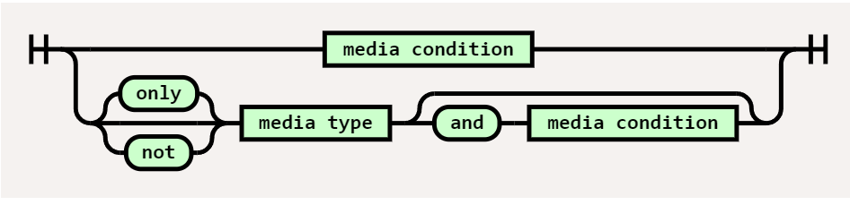
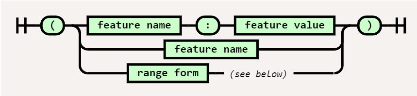
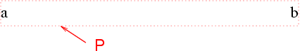

**目录：**

- [1. CSS 简介](#1-css-简介)
  - [1.1. CSS 背景](#11-css-背景)
  - [1.2. 惯例](#12-惯例)
    - [1.2.1. CSS 属性定义](#121-css-属性定义)
    - [1.2.2. 简写属性](#122-简写属性)
      - [1.2.2.1. all 属性](#1221-all-属性)
  - [1.3. 引入 CSS](#13-引入-css)
    - [1.3.1. 外部样式表](#131-外部样式表)
    - [1.3.2. 内部样式表](#132-内部样式表)
    - [1.3.3. 行内样式](#133-行内样式)
  - [1.4. CSS 处理模型](#14-css-处理模型)
    - [1.4.1. CSS 2.2 引用模型](#141-css-22-引用模型)
  - [1.5. 定义](#15-定义)
- [2. 语法和基本数据类型](#2-语法和基本数据类型)
  - [2.1. 语法](#21-语法)
    - [2.1.1. 符号化](#211-符号化)
    - [2.1.2. 关键字](#212-关键字)
      - [2.1.2.1. 厂商前缀](#2121-厂商前缀)
    - [2.1.3. 字符和大小写](#213-字符和大小写)
  - [2.2. 语句](#22-语句)
    - [2.2.1. at 规则](#221-at-规则)
    - [2.2.2. 块](#222-块)
    - [2.2.3. 规则集，声明块和选择器](#223-规则集声明块和选择器)
    - [2.2.4. 声明和属性](#224-声明和属性)
    - [2.2.5. 注释](#225-注释)
  - [2.3. 值和单位](#23-值和单位)
    - [2.3.1. 值定义语法](#231-值定义语法)
      - [2.3.1.1. 组件值类型](#2311-组件值类型)
      - [2.3.1.2. 组件值组合符](#2312-组件值组合符)
      - [2.3.1.3. 组件值重复符](#2313-组件值重复符)
      - [2.3.1.4. 组合符和重复符模式](#2314-组合符和重复符模式)
      - [2.3.1.5. 组件值和空白](#2315-组件值和空白)
      - [2.3.1.6. 属性值例子](#2316-属性值例子)
    - [2.3.2. 文本数据类型](#232-文本数据类型)
      - [2.3.2.1. 预定义关键字](#2321-预定义关键字)
      - [2.3.2.2. `<custom-ident>` 类型](#2322-custom-ident-类型)
      - [2.3.2.3. `<string>` 类型](#2323-string-类型)
      - [2.3.2.4. `<url>` 类型](#2324-url-类型)
    - [2.3.3. 数字数据类型](#233-数字数据类型)
      - [2.3.3.1. 范围限制和范围定义记法](#2331-范围限制和范围定义记法)
      - [2.3.3.2. `<integer>` 类型](#2332-integer-类型)
      - [2.3.3.3. `<number>` 类型](#2333-number-类型)
      - [2.3.3.4. 尺寸值](#2334-尺寸值)
    - [2.3.4. 百分数类型](#234-百分数类型)
    - [2.3.5. 混合百分数和尺寸](#235-混合百分数和尺寸)
    - [2.3.6. 距离单位](#236-距离单位)
      - [2.3.6.1. 相对长度单位](#2361-相对长度单位)
      - [2.3.6.2. 绝对长度单位](#2362-绝对长度单位)
    - [2.3.7. 其他量](#237-其他量)
      - [2.3.7.1. 角度单位](#2371-角度单位)
      - [2.3.7.2. 时长单位](#2372-时长单位)
      - [2.3.7.3. 频率单位](#2373-频率单位)
      - [2.3.7.4. 分辨率单位](#2374-分辨率单位)
    - [2.3.8. 其他数据类型](#238-其他数据类型)
      - [2.3.8.1. `<color>` 类型](#2381-color-类型)
      - [2.3.8.2. `<image>` 类型](#2382-image-类型)
      - [2.3.8.3. `<position>` 类型](#2383-position-类型)
    - [2.3.9. 函数记法](#239-函数记法)
      - [2.3.9.1. cal()](#2391-cal)
- [3. 选择器](#3-选择器)
  - [3.1. 选择器简介](#31-选择器简介)
  - [3.2. 选择器语法](#32-选择器语法)
  - [3.3. 选择器组](#33-选择器组)
  - [3.4. 简单选择器](#34-简单选择器)
    - [3.4.1. 类型选择器](#341-类型选择器)
      - [3.4.1.1. 类型选择器和命名空间](#3411-类型选择器和命名空间)
    - [3.4.2. 通用选择器](#342-通用选择器)
      - [3.4.2.1. 通用选择器和命名空间](#3421-通用选择器和命名空间)
    - [3.4.3. 属性选择器](#343-属性选择器)
      - [3.4.3.1. 属性存在和值选择器](#3431-属性存在和值选择器)
      - [3.4.3.2. 子串匹配属性选择器](#3432-子串匹配属性选择器)
      - [3.4.3.3. 属性选择器和命名空间](#3433-属性选择器和命名空间)
      - [3.4.3.4. DTD 中的默认属性值](#3434-dtd-中的默认属性值)
    - [3.4.4. 类选择器](#344-类选择器)
    - [3.4.5. ID 选择器](#345-id-选择器)
    - [3.4.6. 伪类](#346-伪类)
      - [3.4.6.1. 动态伪类](#3461-动态伪类)
      - [3.4.6.2. :target](#3462-target)
      - [3.4.6.3. :lang](#3463-lang)
      - [3.4.6.4. UI 元素状态伪类](#3464-ui-元素状态伪类)
      - [3.4.6.5. 结构性伪类](#3465-结构性伪类)
    - [3.4.7. 否定伪类](#347-否定伪类)
  - [3.5. 伪元素](#35-伪元素)
    - [3.5.1. ::first-line 伪元素](#351-first-line-伪元素)
      - [3.5.1.1. 第一个格式化行定义](#3511-第一个格式化行定义)
    - [3.5.2. ::first-letter 伪元素](#352-first-letter-伪元素)
    - [3.5.3. ::before 和 ::after 伪元素](#353-before-和-after-伪元素)
  - [3.6. 组合符](#36-组合符)
    - [3.6.1. 后代元素组合符](#361-后代元素组合符)
    - [3.6.2. 子元素组合符](#362-子元素组合符)
    - [3.6.3. 兄弟元素组合符](#363-兄弟元素组合符)
      - [3.6.3.1. 下一个兄弟元素组合符](#3631-下一个兄弟元素组合符)
      - [3.6.3.2. 后续兄弟元素组合符](#3632-后续兄弟元素组合符)
- [4. 层叠和继承](#4-层叠和继承)
  - [4.1. @import 规则](#41-import-规则)
    - [4.1.1. 条件 @import 规则](#411-条件-import-规则)
    - [4.1.2. 处理样式表导入](#412-处理样式表导入)
  - [4.2. 值处理](#42-值处理)
    - [4.2.1. 声明值](#421-声明值)
    - [4.2.2. 层叠值](#422-层叠值)
    - [4.2.3. 指定值](#423-指定值)
    - [4.2.4. 计算值](#424-计算值)
    - [4.2.5. 使用值](#425-使用值)
    - [4.2.6. 实际值](#426-实际值)
  - [4.3. 层叠](#43-层叠)
    - [4.3.1. 层叠顺序](#431-层叠顺序)
    - [4.3.2. 层叠来源](#432-层叠来源)
    - [4.3.3. !important 声明](#433-important-声明)
    - [4.3.4. 特指度](#434-特指度)
  - [4.4. 缺省](#44-缺省)
    - [4.4.1. 初始值](#441-初始值)
    - [4.4.2. 继承](#442-继承)
    - [4.4.3. 显式缺省](#443-显式缺省)
      - [4.4.3.1. initial 关键字](#4431-initial-关键字)
      - [4.4.3.2. inherit 关键字](#4432-inherit-关键字)
      - [4.4.3.3. unset 关键字](#4433-unset-关键字)
- [5. 媒体查询](#5-媒体查询)
  - [5.1. 媒体查询](#51-媒体查询)
    - [5.1.1. 媒体查询组](#511-媒体查询组)
    - [5.1.2. 媒体查询修饰词](#512-媒体查询修饰词)
      - [5.1.2.1. not](#5121-not)
      - [5.1.2.2. only](#5122-only)
    - [5.1.3. 媒体类型](#513-媒体类型)
    - [5.1.4. 媒体特征](#514-媒体特征)
      - [5.1.4.1. 媒体特征类型](#5141-媒体特征类型)
      - [5.1.4.2. 在布尔上下文中估值媒体特征](#5142-在布尔上下文中估值媒体特征)
      - [5.1.4.3. 在范围上下文中估值媒体特征](#5143-在范围上下文中估值媒体特征)
      - [5.1.4.4. min 和 max 前缀](#5144-min-和-max-前缀)
    - [5.1.5. 组合媒体查询](#515-组合媒体查询)
  - [5.2. 媒体查询语法](#52-媒体查询语法)
  - [5.3. 视口/页面尺寸特征](#53-视口页面尺寸特征)
    - [5.3.1. width](#531-width)
    - [5.3.2. height](#532-height)
    - [5.3.3. aspect-ratio](#533-aspect-ratio)
    - [5.3.4. orientation](#534-orientation)
  - [5.4. 显示质量特征](#54-显示质量特征)
    - [5.4.1. resolution](#541-resolution)
    - [5.4.2. scan](#542-scan)
    - [5.4.3. grid](#543-grid)
    - [5.4.4. update](#544-update)
    - [5.4.5. overflow-block](#545-overflow-block)
    - [5.4.6. overflow-inline](#546-overflow-inline)
  - [5.5. 彩色媒体特征](#55-彩色媒体特征)
    - [5.5.1. color](#551-color)
    - [5.5.2. monochrome](#552-monochrome)
    - [5.5.3. color-gamut](#553-color-gamut)
  - [5.6. 交互媒体特征](#56-交互媒体特征)
    - [5.6.1. pointer](#561-pointer)
    - [5.6.2. hover](#562-hover)
    - [5.6.3. any-pointer 和 any-hover](#563-any-pointer-和-any-hover)
- [6. 盒模型](#6-盒模型)
  - [6.1. 盒子尺寸](#61-盒子尺寸)
  - [6.2. 外边距属性](#62-外边距属性)
    - [6.2.1. 外边距折叠](#621-外边距折叠)
  - [6.3. 内边距属性](#63-内边距属性)
  - [6.4. 边框属性](#64-边框属性)
    - [6.4.1. 边框长度](#641-边框长度)
    - [6.4.2. 边框颜色](#642-边框颜色)
    - [6.4.3. 边框样式](#643-边框样式)
    - [6.4.4. 边框简写属性](#644-边框简写属性)
    - [6.4.5. 圆角边框](#645-圆角边框)
  - [6.5. 行内元素与 direction](#65-行内元素与-direction)
- [7. 视觉格式化模型](#7-视觉格式化模型)
  - [7.1. 视觉格式化模型简介](#71-视觉格式化模型简介)
    - [7.1.1. 视口](#711-视口)
    - [7.1.2. 包含块](#712-包含块)
  - [7.2. 控制盒子生成](#72-控制盒子生成)
    - [7.2.1. 块级元素和块盒子](#721-块级元素和块盒子)
      - [7.2.1.1. 匿名块盒子](#7211-匿名块盒子)
    - [7.2.2. 行内级元素和行内盒子](#722-行内级元素和行内盒子)
      - [7.2.2.1. 匿名行内盒子](#7221-匿名行内盒子)
    - [7.2.3. display 属性](#723-display-属性)
  - [7.3. 定位方案](#73-定位方案)
    - [7.3.1. position 属性](#731-position-属性)
    - [7.3.2. 盒子偏移](#732-盒子偏移)
  - [7.4. 正常流](#74-正常流)
    - [7.4.1. 块格式化上下文](#741-块格式化上下文)
    - [7.4.2. 行内格式上下文](#742-行内格式上下文)
    - [7.4.3. 相对定位](#743-相对定位)
  - [7.5. 浮动](#75-浮动)
    - [7.5.1. float 属性](#751-float-属性)
    - [7.5.2. clear 属性](#752-clear-属性)
  - [7.6. 绝对定位](#76-绝对定位)
    - [7.6.1. 固定定位](#761-固定定位)
  - [7.7. display, position 和 float 之间的关系](#77-display-position-和-float-之间的关系)
  - [7.8. 对比正常流，浮动和绝对定位](#78-对比正常流浮动和绝对定位)
    - [7.8.1. 正常流](#781-正常流)
    - [7.8.2. 相对定位](#782-相对定位)
    - [7.8.3. 浮动](#783-浮动)
    - [7.8.4. 绝对定位](#784-绝对定位)
  - [7.9. 分层显示](#79-分层显示)
    - [7.9.1. z-index 属性](#791-z-index-属性)
- [8. 视觉格式化模型细节](#8-视觉格式化模型细节)
  - [8.1. 包含块的定义](#81-包含块的定义)
  - [8.2. width 属性](#82-width-属性)
  - [8.3. 计算 width 和 margin](#83-计算-width-和-margin)
    - [8.3.1. 行内，非替换性元素](#831-行内非替换性元素)
    - [8.3.2. 行内，替换性元素](#832-行内替换性元素)
    - [8.3.3. 块级，非替换性元素，正常流](#833-块级非替换性元素正常流)
    - [8.3.4. 块级，替换性元素，正常流](#834-块级替换性元素正常流)
    - [8.3.5. 浮动，非替换性元素](#835-浮动非替换性元素)
    - [8.3.6. 浮动，替换性元素](#836-浮动替换性元素)
    - [8.3.7. 绝对定位，非替换性元素](#837-绝对定位非替换性元素)
    - [8.3.8. 绝对定位，替换性元素](#838-绝对定位替换性元素)
    - [8.3.9. 行内块级，非替换性元素，正常流](#839-行内块级非替换性元素正常流)
    - [8.3.10. 行内块级，替换性元素，正常流](#8310-行内块级替换性元素正常流)
  - [8.4. 最小与最大宽度](#84-最小与最大宽度)
  - [8.5. height 属性](#85-height-属性)
  - [8.6. 计算 height 和 margin](#86-计算-height-和-margin)
    - [8.6.1. 行内，非替换性元素](#861-行内非替换性元素)
    - [8.6.2. 第 2，4，10，6 点](#862-第-24106-点)
    - [8.6.3. 块级，非替换性元素，正常流](#863-块级非替换性元素正常流)
    - [8.6.4. 绝对定位，非替换性元素](#864-绝对定位非替换性元素)
    - [8.6.5. 复杂情况](#865-复杂情况)
    - [8.6.6. 块格式化背景根的'自动'高度](#866-块格式化背景根的自动高度)
  - [8.7. 最小与最大高度](#87-最小与最大高度)
  - [8.8. 行高的计算](#88-行高的计算)
    - [8.8.1. 领先和半领先](#881-领先和半领先)
- [9. 弹性布局](#9-弹性布局)
  - [9.1. 弹性盒子盒模型以及术语](#91-弹性盒子盒模型以及术语)
  - [9.2. 弹性容器](#92-弹性容器)
  - [9.3. 弹性子项](#93-弹性子项)
    - [9.3.1. 绝对定位的弹性子项](#931-绝对定位的弹性子项)
    - [9.3.2. 弹性子项的内外边距](#932-弹性子项的内外边距)
    - [9.3.3. 弹性子项 Z-轴顺序](#933-弹性子项-z-轴顺序)
    - [9.3.4. 折叠子项](#934-折叠子项)
    - [9.3.5. 弹性子项的自动最小大小](#935-弹性子项的自动最小大小)
  - [9.4. 顺序和方向](#94-顺序和方向)
    - [9.4.1. flex-direction 属性](#941-flex-direction-属性)
    - [9.4.2. flex-wrap 属性](#942-flex-wrap-属性)
    - [9.4.3. flex-flow 属性](#943-flex-flow-属性)
    - [9.4.4. order 属性](#944-order-属性)
  - [9.5. 弹性行](#95-弹性行)
  - [9.6. 弹性度](#96-弹性度)
    - [9.6.1. flex 简写属性](#961-flex-简写属性)
    - [9.6.2. flex-grow](#962-flex-grow)
    - [9.6.3. flex-shrink](#963-flex-shrink)
    - [9.6.4. flex-basis](#964-flex-basis)
  - [9.7. 对齐](#97-对齐)
    - [9.7.1. 自动外边距对齐](#971-自动外边距对齐)
    - [9.7.2. justify-content 属性](#972-justify-content-属性)
    - [9.7.3. align-items 和 align-self 属性](#973-align-items-和-align-self-属性)
    - [9.7.4. align-content 属性](#974-align-content-属性)
    - [9.7.5. 弹性容器基线](#975-弹性容器基线)
  - [9.8. 弹性布局算法](#98-弹性布局算法)
- [10. 网格布局](#10-网格布局)
- [11. 表格](#11-表格)
- [12. 生成内容和列表](#12-生成内容和列表)
- [13. 颜色，背景和渐变](#13-颜色背景和渐变)
  - [13.1. 颜色](#131-颜色)
  - [13.2. 背景](#132-背景)
  - [13.3. 渐变](#133-渐变)
- [14. 字体](#14-字体)
  - [14.1. font-family](#141-font-family)
  - [14.2. @font-face](#142-font-face)
  - [14.3. font-weight](#143-font-weight)
  - [14.4. font-size](#144-font-size)
    - [14.4.1. 绝对大小](#1441-绝对大小)
    - [14.4.2. 相对大小](#1442-相对大小)
    - [14.4.3. 长度单位](#1443-长度单位)
  - [14.5. font-style](#145-font-style)
  - [14.6. font-variant](#146-font-variant)
  - [14.7. font](#147-font)
- [15. 文本](#15-文本)
  - [15.1. 缩进与行内对齐](#151-缩进与行内对齐)
    - [15.1.1. text-indent](#1511-text-indent)
    - [15.1.2. text-align](#1512-text-align)
    - [15.1.3. text-align-last](#1513-text-align-last)
  - [15.2. 块级对齐](#152-块级对齐)
    - [15.2.1. line-height](#1521-line-height)
    - [15.2.2. vertical-align](#1522-vertical-align)
  - [15.3. 文本间距](#153-文本间距)
    - [15.3.1. wording-spacing](#1531-wording-spacing)
    - [15.3.2. letter-spacing](#1532-letter-spacing)
  - [15.4. text-transform](#154-text-transform)
  - [15.5. text-decoration](#155-text-decoration)
  - [15.6. text-shadow](#156-text-shadow)
  - [15.7. 处理空白](#157-处理空白)
    - [15.7.1. white-space](#1571-white-space)
    - [15.7.2. tab-size](#1572-tab-size)
  - [15.8. 换行和断字](#158-换行和断字)
    - [15.8.1. word-break](#1581-word-break)
    - [15.8.2. line-break](#1582-line-break)
    - [15.8.3. overflow-wrap](#1583-overflow-wrap)
  - [15.9. 书写模式](#159-书写模式)
    - [15.9.1. writing-mode](#1591-writing-mode)
    - [15.9.2. text-orientation](#1592-text-orientation)

# 1. CSS 简介

## 1.1. CSS 背景

自从 CSS2 规范在 1998 年成为一项提议以来，CSS 社区已经获得了大量的经验。CSS2 规范中的错误随后在 2011 年的第一个修订版[CSS21]中得到了纠正，但新的勘误是必要的。

虽然许多问题将由即将发布的 CSS3 规范来解决，但目前的状况阻碍了 CSS2 的实施和互操作性。CSS2.2 规范试图通过以下方式来解决这种情况：

- 保持与 CSS2 中被广泛接受和实施的那些部分的兼容性。
- 纳入所有公布的 CSS2 勘误。
- 在实施与 CSS2 规范有很大差异的情况下，对规范进行修改以符合普遍接受的做法。
- 删除那些由于没有被实施而被 CSS 社区拒绝的 CSS2 特性。CSS2.2 旨在反映哪些 CSS 特性被合理地广泛用于一般的 HTML 和 XML 语言(而不是只用于特定的 XML 语言，或只用于 HTML)。
- 删除将被 CSS3 淘汰的 CSS2 特性，从而鼓励采用拟议的 CSS3 特性来取代它们。
- 添加(非常)少的新属性值，当实施经验表明它们是实施 CSS2 所需要的。

因此，虽然 CSS2 样式表不一定与 CSS2.2 向前兼容，但限制自己使用 CSS2.2 特性的样式表更有可能在今天找到一个兼容的用户代理，并在将来保持向前兼容。虽然破坏向前兼容性是不可取的，但我们相信 CSS 2.2 中的修订的好处是值得的。

CSS 2.2 源于 CSS 2.1 和 CSS2，并打算以此取代 CSS2。CSS2 的某些部分在 CSS 2.2 中没有变化，某些部分被改变了，还有一些部分被移除。被删除的部分可能会在未来的 CSS3 规范中使用。未来的规范应该参考 CSS2.2(除非它们需要 CSS2 中的一些功能，而这些功能在 CSS2 中被取消了，那么它们应该只参考 CSS2 的这些功能，或者最好是在包括这些功能的相应的 CSS3 模块中参考这些功能)。

本规范的编写考虑到了两类读者：CSS 作者和 CSS 实现者。我们希望本规范能够为作者提供编写高效、有吸引力和可访问的文档所需的工具，而不会让他们过度暴露于 CSS 的实现细节。然而，实现者应该能找到他们所需要的一切，以建立符合要求的用户代理。本规范从对 CSS 的一般介绍开始，到最后变得越来越技术化和具体化。为了快速获取信息，在电子版和印刷版中都有一个总的目录，在每一节的开头都有具体的目录，还有一个索引，以方便浏览。

本规范的编写考虑到了两种表述方式：电子版和印刷版。尽管这两种表述方式无疑是相似的，但读者会发现一些差异。例如，链接在印刷版中不起作用(很明显)，而页码在电子版中不会出现。在出现差异的情况下，电子版被认为是文件的权威版本。

## 1.2. 惯例

### 1.2.1. CSS 属性定义

每个 CSS 属性定义的开头都有一个关键信息的摘要，类似于以下内容：

| 属性名   | 属性的名字         |
| -------- | ------------------ |
| 属性值   | 合法值和语法       |
| 初始值   | 初始值             |
| 适用元素 | 该属性适用的元素   |
| 可继承性 | 该属性是否可被继承 |
| 百分数值 | 百分数值解释方式   |
| 适用媒体 | 该属性适用的媒体组 |
| 计算值   | 计算值的计算方式   |

- **属性值**

这一部分规定了属性值的有效值集。一个属性值可以有一个或多个组件。

- **初始值**

这一部分指定了属性的初始值。关于样式表指定的、继承的和初始属性值之间的交互信息，请参考 [层叠](#44-层叠) 部分。

- **适用元素**

这一部分列出了该属性所适用的元素。所有的元素都被认为拥有所有的属性，但有些属性对某些类型的元素没有渲染效果。例如，'clear' 属性只影响到块级元素。

- **可继承性**

这一部分表示该属性的值是否从祖先元素继承。关于样式表指定的、继承的和初始属性值之间的交互信息，请参考 [层叠](#44-层叠) 部分。

- **百分数值**

如果百分数值出现在属性的值中，这部分表明应如何解释百分数值。如果 "N/A" 出现在这里，这意味着该属性不接受百分数值。

- **适用媒体**

这一部分表示该属性所适用的媒体组。请参见 [媒体类型](#16-媒体类型) 部分。

- **计算值**

这一部分描述了该属性的计算值。关于此定义的使用方法，请参见 [计算值](#412-计算值) 部分。

### 1.2.2. 简写属性

有些属性是 **简写属性**，意思是它们允许作者用一个属性指定几个属性的值。一个简写属性设置了它所有的长式子属性，就像在原地展开一样。

当值从简写形式中省略时，除非另有定义，否则每个“缺失的”子属性都会被分配其初始值。

这意味着一个简写属性声明总是设置其所有的子属性，甚至那些没有明确设置的子属性。如果不小心使用，这可能会导致无意中重新设置一些子属性。谨慎地使用，简写可以通过重设不经意间从其他来源串联的子属性来保证 "白板"。
例如，写 background: green 而不是 background-color: green 可以确保背景色覆盖任何先前的声明，这些声明可能将背景设置为带有 background-image 的图像。

例如，CSS level 1 'font' 属性是一个简写属性，用于一次性设置 font-style、font-variant、font-weight、font-size、line-height 和 font-family。这个例子中的多个声明：

```css
h1 {
  font-weight: bold;
  font-size: 12pt;
  line-height: 14pt;
  font-family: Helvetica;
  font-variant: normal;
  font-style: normal;
}
```

因此，可以改写为：

```css
h1 {
  font: bold 12pt/14pt Helvetica;
}
```

随着更多的字体子属性被引入到 CSS 中，简写声明也会将这些子属性重置为初始值。

在某些情况下，一个简写项可能会有不同的语法或特殊的关键字，它们并不直接对应于其子属性的值。(在这种情况下，简写项将明确地定义其值的扩展)。

在其他情况下，一个属性可能是简写属性的一个 **只重置的子属性**。像其他子属性一样，当未指定时，它被简写属性重置为其初始值，但简写属性可能不包括将该子属性设置为其任何其他值的语法。例如，border 简写属性将 border-image 重置为其初始值 none，但没有语法将其设置为任何其他值。

如果一个简写属性被指定为全局关键字之一，它就会将其所有的子属性设置为该关键字，包括任何只重置的子属性。(注意，这些关键字不能在一个声明中与其他值结合，甚至在一个简写中也不行)。

将一个简写属性声明为!important 等同于将其所有的子属性声明为!important。

#### 1.2.2.1. all 属性

| 属性名   | all        |
| -------- | ---------- | ------- | ------ |
| 值       | `initial   | inherit | unset` |
| 初始值   | 见单独属性 |
| 适用元素 | 见单独属性 |
| 可继承   | 见单独属性 |
| 百分数   | 见单独属性 |
| 计算值   | 见单独属性 |

all 属性是一个简写属性，可以重置除 'direction' 和 'unicode-bidi' 之外的所有 CSS 属性。它只接受 CSS 范围内的关键字。它不会重置自定义属性[css-variables-1]。

注意：除了方向和 unicode-bidi 之外的 CSS 属性实际上是标记级的特性，不应该在作者的样式表中设置。(它们作为 CSS 属性存在，只是为了给 UA 不支持的文档语言设置样式)。作者应该使用适当的标记，如 HTML 的 dir 属性，而不是。[css-writing-modes-3]。

例如，如果作者在一个元素上指定了 all: initial，它将阻止所有的继承并重置所有的属性，就像没有规则出现在级联的作者、用户或 user-agent 层一样。

这对包含在一个页面中的 "组件" 的根元素很有用，它不希望继承外部页面的样式。然而，请注意，任何应用于该元素的 "默认" 样式(例如，来自`<div>`等块级元素的 UA 样式表的 display: block)也将被覆盖。

## 1.3. 引入 CSS

在学习 CSS 之前，我们得首先在 HTML 关联 CSS，不然 CSS 就没法影响 HTML 文档。下面介绍 3 种引入 CSS 的方式。

### 1.3.1. 外部样式表

外部样式表式引入 CSS 最常用的方式。这种方式用到了 link 元素，例如：

```html
<!DOCTYPE html>
<html>
  <head>
    <title>外部样式表</title>
    <link rel="stylesheet" href="style.css" media="screen" />
  </head>
  <body></body>
</html>
```

上述例子向 HTML 文档中引入了一个 style.css 外部样式表。

外部样式表中没有任何 HTML 标签。外部样式表保存为纯文本文件，文件扩展名是 .css。

- link 元素的属性

link 元素的 rel 属性表示链接资源和 HTML 文档的关系，对于 CSS 文档来说，就是“stylesheet”。

link 元素的 href 属性制定了链接资源的地址。

最后的 media 属性，它的值是一个或多个媒体描述符(media descriptor)，表示什么样的媒体应该使用这个 CSS 文档。例如：

```html
<link rel="stylesheet" href="style.css" media="screen, screen" />
```

多个媒体描述符用逗号分隔。媒体描述符本书后面会详细的介绍。

link 的 type 属性现在已经不常用了，它用来指定资源的 MIME 类型，不过对于 CSS 文档，浏览器默认为 "text/css"。

- @import

@import 指令可以出现在 CSS 文档中，它的作用是链接另外一个 CSS 文档。例如：

```css
@import url(basic.css);
```

@import 指令必需放在 CSS 规则之前，否则不会有效。

### 1.3.2. 内部样式表

另外一种引入 CSS 的方式是通过 style 元素。例如：

```html
<!DOCTYPE html>
<html>
  <head>
    <title>内部样式表</title>
    <style>
      h1 {
        color: red;
      }

      h2 {
        color: maroon;
        background: black;
      }
    </style>
  </head>
  <body></body>
</html>
```

### 1.3.3. 行内样式

最后一种的方式是通过 HTML 元素的 style 全局属性。例如：

```html
<!DOCTYPE html>
<html>
  <head>
    <title>行内样式</title>
  </head>
  <body>
    <p style="color: red;">一段文本。</p>
  </body>
</html>
```

## 1.4. CSS 处理模型

本节介绍了支持 CSS 的用户代理如何工作的一个可能模型。这只是一个概念性的模型；实际的实现可能会有所不同。

在这个模型中，用户代理通过以下步骤来处理一个来源：

1. 解析源文档并创建一个文档树。
2. 识别目标媒体类型。
3. 检索所有与该文档相关的、为目标媒体类型指定的样式表。
4. 通过给适用于目标媒体类型的每个属性分配一个单一的值来注释文档树的每个元素。属性是根据层叠和继承一节中描述的机制来分配数值的。部分数值的计算取决于适合于目标媒体类型的格式化算法。例如，如果目标媒体是屏幕，用户代理会应用视觉格式化模型。
5. 从注释的文档树中，生成一个格式化结构。通常，格式化结构与文档树非常相似，但也可能有很大不同，特别是当作者使用伪元素和生成的内容时。首先，格式化结构根本不需要是 "树形" 的，结构的性质取决于实现。第二，格式化结构可能包含比文档树更多或更少的信息。例如，如果文档树中的一个元素的 'display' 属性的值是 'none'，那么这个元素在格式化结构中就不会产生任何信息。另一方面，一个列表元素可能会在格式化结构中产生更多的信息：列表元素的内容和列表样式信息(例如，一个子弹头图像)。请注意，CSS 用户代理在这个阶段不会改变文档树。特别是，由于样式表产生的内容不会被反馈给文档语言处理器(例如，用于重新解析)。
6. 将格式化结构转移到目标媒体(例如，打印结果、在屏幕上显示、渲染成语音等)。

### 1.4.1. CSS 2.2 引用模型

CSS 2.2 选择器和属性允许样式表引用文档或用户代理的以下部分：

- 文档树中的元素和它们之间的某些关系(见选择器部分)。
- 文档树中的元素的属性，以及这些属性的值(见关于属性选择器的部分)。
- 元素内容的某些部分(见 :first-line 和 :first-letter 伪元素)。
- 当文档树的元素处于某种状态时(见关于伪类的部分)。
- 文档将被渲染的画布的某些方面。
- 一些系统信息(见用户界面部分)。

## 1.5. 定义

- **样式表**

一组指定文档表现形式的语句。

样式表可能有三个不同的来源：作者、用户、和用户代理。这些来源的互交互性在 [层叠和继承](#4-层叠和继承) 一节中描述。

- **有效样式表**

样式表的有效性取决于样式表所使用的 CSS 的级别。所有有效的 CSS1 样式表都是有效的 CSS2.2 样式表，但是 CSS1 的一些变化意味着一些 CSS1 样式表在 CSS2.2 中会有轻微的语义不同。CSS2 中的一些特性不是 CSS2.2 的一部分，所以不是所有的 CSS2 样式表都是有效的 CSS2.2 样式表。

一个有效的 CSS2.2 样式表必须按照 CSS2.2 的语法来写。此外，它必须只包含本规范中定义的 at-rules、属性名称和属性值。一个非法的(无效的)at-rule、属性名或属性值是无效的。

- **源文档**

一个或多个样式表所适用的文档。这是用某种语言编码的，它把文档表示为一棵元素树。每个元素由一个识别元素类型的名称、可选择的一些属性和一个(可能是空的)内容组成。例如，源文件可以是一个 XML 或 SGML 实例。

- **文档语言**

源文档的编码语言(例如，HTML、XHTML 或 SVG)。CSS 用于描述文档语言的表现形式，CSS 并不改变文档语言的基本语义。

- **元素**

文档语言的主要语法结构。大多数 CSS 样式表规则使用这些元素的名称(如 HTML 中的 P、TABLE 和 OL)来指定这些元素应该如何被呈现。

- **替换性元素**

一个内容不在 CSS 格式化模型范围内的元素，如图像、嵌入式文档或小程序。例如，HTML IMG 元素的内容经常被其 "src" 属性指定的图像所取代。替换性元素通常有固有的尺寸：固有的宽度、固有的高度和固有的比例。例如，一个位图图像有一个以绝对单位指定的固有宽度和固有高度(固有尺寸比显然可以从这里确定)。另一方面，其他文档可能没有任何固有的尺寸(例如，一个空白的 HTML 文档)。

如果用户代理认为一个替换性元素没有任何固有的尺寸，那么这些尺寸可能会向第三方泄露敏感信息。例如，如果一个 HTML 文档根据用户的银行余额改变了固有的尺寸，那么 UA 可能希望像该资源没有固有的尺寸一样行事。

替换性元素的内容在 CSS 渲染模型中不被考虑。

- **固有尺寸**

由元素本身定义的宽度和高度，而不是由周围环境强加的。CSS 并没有定义如何找到固有尺寸。在 CSS 2.2 中，只有替换性元素可以带有固有的尺寸。对于没有可靠分辨率信息的光栅图像，必须假定每个图像源像素的尺寸为 1px 单位。

- **属性**

一个与元素相关的值，由一个名称和一个相关的(文本)值组成。

- **内容**

在源文档中与一个元素相关的内容。有些元素没有内容，在这种情况下，它们被称为 **空元素**。一个元素的内容可能包括文本，也可能包括一些子元素，在这种情况下，该元素被称为这些子元素的父元素。

- **忽略**

这个术语在本规范中有两种略有不同的含义。首先，一个 CSS 解析器在发现样式表中的未知或非法语法时必须遵循某些规则。然后，解析器必须忽略样式表的某些部分。哪些部分必须被忽略的确切规则在这些章节(声明和属性、处理解析错误的规则、不支持的值)中描述，或者可以在术语 "忽略 "出现的文本中解释。第二，一个用户代理可以(而且在某些情况下必须)不理会样式表中的某些属性或值，即使语法是合法的。例如，表列元素不能影响表列的字体，所以字体属性必须被忽略。

- **渲染内容**

一个元素的内容在根据相关样式表适用于它的渲染后被应用。一个替换性元素的内容是如何被渲染的，本规范没有定义。渲染的内容也可以是一个元素的替代文本(例如，XHTML "alt" 属性的值)，并可能包括由样式表隐含地或显式地插入的项目，如栏目、编号等。

- **文档树**
  在源文档中编码的元素树。这个树中的每个元素都有一个父元素，但根元素除外，它没有。

- **子元素**

当且仅当 B 是 A 的父元素时，一个元素 A 被称为元素 B 的子元素。

- **后代元素**

一个元素 A 被称为元素 B 的后代元素，如果(1)A 是 B 的一个子元素，或者(2)A 是某个元素 C 的子元素，而这个元素 C 是 B 的后代元素。

- **祖先元素**

当且仅当 B 是 A 的后代元素时，元素 A 被称为元素 B 的祖先元素。

- **兄弟元素**

一个元素 A 被称为元素 B 的兄弟元素，当且仅当 B 和 A 共享同一个父元素。如果元素 A 在文档树中排在元素 B 之前，它就是一个前级兄弟元素。如果元素 B 在文档树中排在 A 的后面，那么它就是一个跟随的兄弟元素。

- **前置元素**

当且仅当(1)A 是 B 的祖先或(2)A 是 B 的前面的兄弟元素时，一个元素 A 被称为元素 B 的前置元素。

- **后置元素**

当且仅当 B 是 A 的前面的元素时，一个元素 A 被称为 B 的后置元素。

- **作者**

作者是一个编写文档和相关样式表的人。编写工具是一个生成样式表的用户代理。

- **用户**

用户是与用户代理互动以查看、听取或以其他方式使用一个文件及其相关的样式表的人。用户可以提供一个编码个人偏好的个人样式表。

- **用户代理(UA)**

用户代理是任何解释以文档语言编写的文档并根据本规范的条款应用相关样式表的程序。一个用户代理可以显示一个文档，大声朗读它，使它被打印出来，把它转换成另一种格式，等等。

一个 HTML 用户代理是一个支持一个或多个 HTML 规范的用户代理。一个支持 XHTML[XHTML]，但不支持 HTML 的用户代理不被认为是一个符合本规范的 HTML 用户代理。

- **属性**

CSS 定义了一个有限的参数集，称为属性，用于指导文档的渲染。每个属性都有一个名称(例如，'color'、'font' 或 'border')和一个值(例如，'red'、'12pt' 或 'dotted')。属性通过特指度、层叠和继承等机制被附加到文档的各个部分和显示文档的页面上(见 "属性值、层叠和继承" 章节)。

# 2. 语法和基本数据类型

## 2.1. 语法

本节描述了任何级别的 CSS(包括 CSS 2.2)所共有的语法(以及向前兼容的解析规则)。未来的 CSS 更新将遵守这一核心语法，尽管它们可能会增加额外的语法约束。

这些描述是规范性的。

在本规范中，“紧接在前”或“紧接在后”的表述是指没有中间的空白或注释。

### 2.1.1. 符号化

所有级别的 CSS：level 1、level 2 和任何未来的级别，都使用相同的核心语法。这使得用户代理能够解析(尽管不能完全理解)用当时还不存在 CSS 级别编写的样式表。设计师可以利用这一特点来创建适用于较早的用户代理的样式表，同时也可以利用最新级别的 CSS。

在词法层面上，CSS 样式表由一系列的词法单元组成。CSS 的词法单元列表如下。这些定义使用了 Lex 风格的正则表达式。八进制代码参考了 ISO 10646([ISO10646])。和 Lex 一样，在有多个匹配的情况下，最长匹配决定了词法单元。

| 词法单元      | 定义                                                         |
| ------------- | ------------------------------------------------------------ | ------------------------------ | ---------------------- | ---------------------- | ---------------------- | ---------------------- | -------------- | ------------------------------- |
| IDENT         | `{ident}`                                                    |
| ATKEYWORD     | `@{ident}`                                                   |
| STRING        | `{string}`                                                   |
| BAD_STRING    | `{badstring}`                                                |
| BAD_URI       | `{baduri}`                                                   |
| BAD_COMMENT   | `{badcomment}`                                               |
| HASH          | `#{name}`                                                    |
| NUMBER        | `{num}`                                                      |
| PERCENTAGE    | `{num}%`                                                     |
| DIMENSION     | `{num}{ident}`                                               |
| URI           | `{U}{R}{L}\({w}{string}{w}\)                                 | {U}{R}{L}\({w}([!#$%&*-\[\]-~] | {nonascii}             | {escape})\*{w}\)`      |
| UNICODE-RANGE | `u\+[?]{1,6}                                                 | u\+[0-9a-f]{1}[?]{0,5}         | u\+[0-9a-f]{2}[?]{0,4} | u\+[0-9a-f]{3}[?]{0,3} | u\+[0-9a-f]{4}[?]{0,2} | u\+[0-9a-f]{5}[?]{0,1} | u\+[0-9a-f]{6} | u\+[0-9a-f]{1,6}-[0-9a-f]{1,6}` |
| CDO           | `<!--`                                                       |
| CDC           | `-->`                                                        |
| :             | `:`                                                          |
| ;             | `;`                                                          |
| {             | `\{`                                                         |
| }             | `\}`                                                         |
| (             | `\(`                                                         |
| )             | `\)`                                                         |
| [             | `\[`                                                         |
| ]             | `\]`                                                         |
| S             | `[ \t\r\n\f]+`                                               |
| COMMENT       | `\/\*[^*]*\*+([^/*][^*]*\*+)*\/`                             |
| FUNCTION      | `{ident}\(`                                                  |
| INCLUDES      | `~=`                                                         |
| DASHMATCH     | `                                                            | =`                             |
| DELIM         | 任何未被上述规则匹配的其他字符，并且既不是单引号也不是双引号 |

上面大括号({})中的宏定义如下:

| 宏          | 定义                           |
| ----------- | ------------------------------ | -------------------------------- | --------------- | ------------- | ---- |
| ident       | `[-]?{nmstart}{nmchar}*`       |
| name        | `{nmchar}+`                    |
| nmstart     | `[_a-z]                        | {nonascii}                       | {escape}`       |
| nonascii    | `[^\0-\177]`                   |
| unicode     | `\\[0-9a-f]{1,6}(\r\n          | [ \n\r\t\f])?`                   |
| escape      | `{unicode}                     | \\[^\n\r\f0-9a-f]`               |
| nmchar      | `[_a-z0-9-]                    | {nonascii}                       | {escape}`       |
| num         | `[+-]?([0-9]+                  | [0-9]\*\.[0-9]+)(e[+-]?[0-9]+)?` |
| string      | `{string1}                     | {string2}`                       |
| string1     | `\"([^\n\r\f\\"]               | \\{nl}                           | {escape})\*\"`  |
| string2     | `\'([^\n\r\f\\']               | \\{nl}                           | {escape})\*\'`  |
| badstring   | `{badstring1}                  | {badstring2}`                    |
| badstring1  | `\"([^\n\r\f\\"]               | \\{nl}                           | {escape})\*\\?` |
| badstring2  | `\'([^\n\r\f\\']               | \\{nl}                           | {escape})\*\\?` |
| badcomment  | `{badcomment1}                 | {badcomment2}`                   |
| badcomment1 | `\/\*[^*]*\*+([^/*][^*]*\*+)*` |
| badcomment2 | `\/\*[^*]*(\*+[^/*][^*]*)*`    |
| baduri      | `{baduri1}                     | {baduri2}                        | {baduri3}`      |
| baduri1     | `{U}{R}{L}\({w}([!#$%&*-~]     | {nonascii}                       | {escape})\*{w}` |
| baduri2     | `{U}{R}{L}\({w}{string}{w}`    |
| baduri3     | `{U}{R}{L}\({w}{badstring}`    |
| nl          | `\n                            | \r\n                             | \r              | \f`           |
| w           | `[ \t\r\n\f]*`                 |
| L           | `l                             | \\0{0,4}(4c                      | 6c)(\r\n        | [ \t\r\n\f])? | \\l` |
| R           | `r                             | \\0{0,4}(52                      | 72)(\r\n        | [ \t\r\n\f])? | \\r` |
| U           | `u                             | \\0{0,4}(55                      | 75)(\r\n        | [ \t\r\n\f])? | \\u` |

例如，最长匹配规则意味着 "red-->" 被词法解析为 IDENT "red--" 后面是 DELIM ">"，而不是 IDENT 后面是 CDC。

下面是 CSS 的核心语法。接下来的章节描述了如何使用它。

| 语法单元 | 定义                             |
| -------- | -------------------------------- | ---------------- | ----------------- | ------------------ | -------- | ----- | --- | ---- | ------------- | -------- | --------- | --- | ----------------- | ------------- | ------------ | ------------- | ------------ | ----------------- |
| 样式表   | `[ CDO                           | CDC              | S                 | 语句 ]*`          |
| 语句     | `规则集                          | at 规则`         |
| at 规则  | `ATKEYWORD S* any* [ 块          | ';' S* ]`       |
| 块       | `'{' S\* [ any                   | 块               | ATKEYWORD S\*     | ';' S* ]* '}' S*` |
| 规则集   | `选择器? '{' S* 声明列表 '}' S*` |
| 声明列表 | `声明 [ ';' S* 声明列表 ]?       | at 规则 声明列表 | /* empty */`      |
| 选择器   |                                   `any+`           |
| 声明     | `属性 S* ':' S* 值`              |
| 属性     | `IDENT`                          |
| 值       | `[ any                           | 块               | ATKEYWORD S* ]+` |
| any      | `[ IDENT                         | NUMBER           | PERCENTAGE        | DIMENSION          | STRING   | DELIM | URI | HASH | UNICODE-RANGE | INCLUDES | DASHMATCH | ':' | FUNCTION S* [any | unused]* ')' | '(' S* [any | unused]\* ')' | '[' S* [any | unused]* ']'] S*` |
| unused   | `块                              | ATKEYWORD S\*    | ';' S*           | CDO S*            | CDC S*` |

在 CSS 中没有使用 "unused" 语法产生式，将来也不会被任何扩展使用。它被包括在这里只是为了帮助处理错误。

COMMENT 词法单元没有出现在语法中(以保持其可读性)，但是任何数量的这些词法单元都可以出现在其他词法单元之外的任何地方。(但是请注意，在@charset 规则之前或之内的注释会禁用 @charset)。

上述语法中的词法单元 S 代表空白。只有 "空格"(U+0020)、"制表"(U+0009)、"换行"(U+000A)、"回车"(U+000D)和 "换页"(U+000C)这些字符可以出现在空白处。其他类似空白的字符，如 "em-space"(U+2003)和 "ideographic space"(U+3000)，不是空白。

### 2.1.2. 关键字

关键词具有标识符的形式。关键词不能放在引号("... "或'...')之间。因此：red 是一个关键词，但 "red" 不是。(它是一个字符串) 其他非法的例子：

```css
width: 'auto';
border: 'none';
background: 'red';
```

#### 2.1.2.1. 厂商前缀

在 CSS 中，标识符可以以 '-' (破折号)或 '\_'(下划线)开头。以 '-' 或 '\_' 开头的关键词和属性名被保留给厂商特定的扩展。这种厂商特定的扩展应该有以下格式之一：

```
'-' + 厂商标识符 + '-' + 有意义的名称
'_' + 厂商标识符 + '-' + 有意义的名称
```

例如，如果 XYZ 组织添加了一个属性来描述显示器东侧边框的颜色，他们可能称之为 -xyz-border-east-color。

其他已知的例子：

```css
-moz-box-sizing
-moz-border-radius
-wap-accesskey
```

首字母破折号或下划线被保证永远不会被任何当前或未来级别的 CSS 使用在属性或关键字中。因此，典型的 CSS 实现可能无法识别这样的属性，并可能根据处理解析错误的规则而忽略它们。然而，由于最初的破折号或下划线是语法的一部分，CSS 2.2 的实现者应该总是能够使用符合 CSS 标准的解析器，无论他们是否支持任何厂商的特定扩展。

作者应该避免厂商的特定扩展。

下表总结了常见的厂商前缀。

| 浏览器            | 前缀     |
| ----------------- | -------- |
| Chrome, Safari    | -webkit- |
| Opera             | -o-      |
| Firefox           | -moz-    |
| Internet Explorer | -ms-     |

### 2.1.3. 字符和大小写

以下规则始终有效:

- 所有的 CSS 语法在 ASCII 范围内是不区分大小写的(即[a-z]和[A-Z]是等同的)，但不在 CSS 控制范围内的部分除外。例如，HTML 属性 "id "和 "class "的值、字体名称和 URI 的大小写敏感性不在本规范的范围之内。特别要注意的是，元素名称在 HTML 中是不区分大小写的，但在 XML 中是区分大小写的。

- 在 CSS 中，标识符(包括选择器中的元素名、类和 ID)只能包含字符[a-zA-Z0-9]和 ISO 10646 字符 U+0080 及以上，加上连字符(-)和下划线(\_)；它们不能以数字、两个连字符或连字符后的数字开头。标识符也可以包含转义字符和任何作为数字代码的 ISO 10646 字符(见下一项)。例如，标识符 "B&W？"可以写成 "B\&W\？"或 "B\26 W\3F"。

请注意，Unicode 的编码与 ISO10646 相当(见[UNICODE]和[ISO10646])。

- 在 CSS 2.2 中，反斜杠(\)字符可以表示三种类型的字符转义之一。在一个 CSS 注释中，反斜杠代表它自己，如果反斜杠紧跟在样式表的末尾，它也代表它自己(即 DELIM 标记)。

首先，在一个字符串内，一个反斜杠后面的换行被忽略(即，字符串被认为不包含反斜杠或换行)。在字符串外部，反斜线后的换行代表其本身(即 DELIM 后的换行)。

第二，它取消了特殊 CSS 字符的意义。任何字符(除了十六进制数字、换行、回车或换页)都可以用反斜杠转义，以消除其特殊含义。例如，"\"是一个由一个双引号组成的字符串。样式表预处理器不能从样式表中删除这些反斜线，因为那会改变样式表的含义。

第三，反斜杠转义允许作者参考他们不容易放在文档中的字符。在这种情况下，反斜杠后面最多有六个十六进制数字(0...9A...F)，这些数字代表 ISO 10646([ISO10646])字符，这个数字不能是 0。(在 CSS 2.2 中没有定义如果一个样式表确实包含一个 Unicode 代码点为 0 的字符会发生什么。) 如果在十六进制数字后面有一个范围为[0-9a-fA-F]的字符，那么这个数字的结尾需要明确。有两种方法可以做到这一点:

  1. 用一个空格(或其他空白字符)。"\26 b"("&b")。在这种情况下，用户代理应将 "CR/LF "对(U+000D/U+000A)视为一个白色空格字符。
  2. 通过提供正好 6 个十六进制数字。"\000026b" ("&b")。

事实上，这两种方法可以结合使用。在十六进制转义之后，只有一个空白字符被忽略。请注意，这意味着转义序列后的 "真实 "空格必须是双倍的。

如果数字超出了 Unicode 允许的范围(例如"\110000 "高于当前 Unicode 允许的最大 10FFFF)，UA 可以用 "替换字符"(U+FFFD)替换转义。如果要显示该字符，UA 应该显示一个可见的符号，比如“缺失字符”字形(参见 15.2，第 5 点)。

注意：反斜线转义总是被认为是标识符或字符串的一部分(即"\7B" 不是标点符号，尽管 "{" 是，而 "\32" 允许放在类名的开头，尽管 "2" 不是)。

标识符 "te/st" 与 "test" 是完全相同的标识符。

## 2.2. 语句

一个 CSS 样式表，对于任何级别的 CSS 来说，都是由一个语句序列组成的(见上面的语法)。有两种语句：at 规则和规则集。语句周围可能有空白。

### 2.2.1. at 规则

at 规则的开头是一个 '@' 字符，后面紧跟一个标识符(例如，'@import'，'@page')。

一个 at 规则由包括下一个分号(;)或下一个块(以先到者为准)在内的所有内容组成。

CSS 2.2 的用户代理必须忽略任何出现在块内的 '@import' 规则，或者出现在任何非忽略的语句(除@charset 或@import 规则外)之后。

例如，假设一个 CSS 2.2 解析器遇到了这个样式表：

```css
@import 'subs.css';

h1 {
  color: blue;
}

@import 'list.css';
```

根据 CSS 2.2，第二个'@import'是非法的。CSS 2.2 解析器忽略了整个 at 规则，将样式表简化为：

```css
@import 'subs.css';

h1 {
  color: blue;
}
```

在下面的例子中，第二个 '@import' 规则是无效的，因为它出现在 '@media' 块内:

```css
@import 'subs.css';

@media print {
  @import 'print-main.css';

  body {
    font-size: 10pt;
  }
}

h1 {
  color: blue;
}
```

相反，为了达到只为 'print' 媒体导入样式表的效果，使用带有媒体查询语法的 @import 规则，例如：

```css
@import 'subs.css';
@import 'print-main.css' print;

@media print {
  body {
    font-size: 10pt;
  }
}

h1 {
  color: blue;
}
```

### 2.2.2. 块

一个块以左大括号({)开始，以匹配的右大括号(})结束。中间可以有任何词法单元，但小括号(())、大括号([ ])和大括号({ })必须总是成对出现，并且可以嵌套。单引号(')和双引号(")也必须出现在匹配对中，它们之间的字符被解析为一个字符串。关于字符串的定义，见上面的符号化。

下面是一个块的例子。请注意，双引号之间的右括号与块的开头括号不一致，第二个单引号是一个转义字符，因此与第一个单引号不一致:

```css
 {
  causta: '}' + ({7} * "'");
}
```

请注意，上述规则不是有效的 CSS 2.2，但它仍然是上述定义的一个块。

### 2.2.3. 规则集，声明块和选择器

一个规则集(也叫“规则”)由一个选择器和一个声明块组成。

一个 **声明块** 以左大括号({)开始，以匹配的右大括号(})结束。在这中间必须有一个 0 或更多的声明和 at 规则的序列。声明必须以分号(;)结束，除非它是列表中的最后一个。

注意：CSS level 2 没有在规则集内的 at 规则，但这种 at 规则可能会在未来的级别中被定义。

选择器(参见选择器一节)由第一个左大括号({)以前的所有内容组成(但不包括这个左括号)。一个选择器总是和一个声明块一起出现。当用户代理不能解析选择器时(即它不是有效的 CSS 2.2 选择器)，它必须忽略选择器和后面的声明块(如果有)。

CSS 2.2 对选择器中的逗号(,)赋予了特殊的含义。然而，由于不知道逗号在未来的 CSS 更新中是否会获得其他含义，如果选择器中的任何地方有错误，整个声明都应该被忽略，即使选择器的其他部分在 CSS 2.2 中看起来是合理的。

例如，由于 "&" 在 CSS 2.2 的选择器中不是一个有效的词法单元，所以 CSS 2.2 的用户代理必须忽略整个第二行，并且不能将 h3 的颜色设置为红色：

```css
h1, h2 {
  color: green;
}

h3, h4 & h5 {
  color: red;
}

h6 {
  color: black;
}
```

下面是一个更复杂的例子。前两对大括号在一个字符串内，并没有标记选择器的结束。这是一个有效的 CSS 2.2 规则:

```css
p[example='public class foo\
{\
    private int x;\
\
    foo(int x) {\
        this.x = x;\
    }\
\
}'] {
  color: red;
}
```

### 2.2.4. 声明和属性

一个 **声明** 要么是空的，要么是由一个属性名，紧接着冒号(:)，最后是一个属性值组成。每个声明的周围可能有空白。

由于选择器的工作方式，同一选择器的多个声明可以被组织成分号(;)分隔的组。

因此，以下规则：

```css
h1 {
  font-weight: bold;
}

h1 {
  font-size: 12px;
}

h1 {
  line-height: 14px;
}

h1 {
  font-family: Helvetica;
}

h1 {
  font-variant: normal;
}

h1 {
  font-style: normal;
}
```

相当于：

```css
h1 {
  font-weight: bold;
  font-size: 12px;
  line-height: 14px;
  font-family: Helvetica;
  font-variant: normal;
  font-style: normal;
}
```

一个属性名是一个标识符。任何词法单元都可以出现在属性值中。小括号("()")、中括号("[ ]")、大括号("{ }")、单引号(')和双引号(")必须成对出现，而且不在字符串中的分号必须被转义。括号、大括号和小括号可以嵌套。在引号内，字符被解析为一个字符串。

值的语法是为每个属性单独指定的，但在任何情况下，值都是由标识符、字符串、数字、长度、百分数、URI、颜色等组成的。

用户代理必须忽略具有无效的属性名或无效值的声明。每个 CSS 属性对它所接受的值都有自己的语法和语义限制。

例如，假设一个 CSS 2.2 解析器遇到了这个样式表：

```css
h1 {
  color: red;
  font-style: 12pt;
} /* 无效值: 12pt */

p {
  color: blue;
  font-vendor: any; /* 无效属性.: font-vendor */
  font-variant: small-caps;
}

em em {
  font-style: normal;
}
```

第一行的第二个声明有一个无效的值 "12pt"。第二行的第二个声明包含一个未定义的属性 "font-vendor"。CSS 2.2 解析器将忽略这些声明，将样式表简化为：

```css
h1 {
  color: red;
}

p {
  color: blue;
  font-variant: small-caps;
}

em em {
  font-style: normal;
}
```

### 2.2.5. 注释

注释以字符 `/*` 开始，以字符 `*/` 结束。它们可以出现在其他标记之外的任何地方，其内容对渲染没有影响。注释不能被嵌套。

CSS 也允许在语法定义的某些地方使用 SGML 注释定界符("<！--"和"-->")，但它们并不能给 CSS 注释定界。允许它们是为了使出现在 HTML 源文档中的样式规则(在 STYLE 元素中)可以从 HTML 3.2 之前的用户代理那里隐藏起来。

## 2.3. 值和单位

每个 CSS 属性的值定义字段可以包含关键字、数据类型(出现在<和>之间)，以及关于它们如何被组合的信息。本规范中描述了许多属性可以使用的通用数据类型(`<length>` 是最广泛使用的)，而更具体的数据类型(例如，`<spacing-limit>`)则在相应的模块中描述。

注意：本章为 [CSS Values and Units Module Level 3](https://www.w3.org/TR/css-values-3/)。

### 2.3.1. 值定义语法

这里描述的 **值定义语法** 是用来定义 CSS 属性的有效值集(以及 CSS 的许多其他部分的有效语法)。这样描述的值可以有一个或多个组件。

#### 2.3.1.1. 组件值类型

组件值类型有几种指定方式：

1. 关键词值(如 auto、disc 等)，按字面意思出现，不带引号(如 auto)。
2. 基本数据类型，出现在<和>之间(例如，`<length>`，<百分数>，等等)。对于数字数据类型，这种类型符号可以使用下面描述的括号范围符号来注释任何范围限制。
3. 与同名属性具有相同取值范围的类型(例如，`<'border-width>`，`<'background-attachment'>`，等等)。在这种情况下，类型名称是括号内的属性名称(带引号)。这样的类型不包括 CSS 范围内的关键字，如继承，也不包括任何顶层的逗号分隔的列表乘数(即如果属性配对被定义为`[<custom-ident> <integer>?]#`，那么`<'pairing'>`就相当于`[ <custom-ident> <integer>? ]`，而不是`<custom-ident> <integer> ]#`)。
4. 不与属性同名的非终结符。在这种情况下，非终端名称出现在<和>之间，如`<spacing-limit>`。注意`<border-width>`和`<'border-width'>`之间的区别：后者被定义为 border-width 属性的值，前者需要在其他地方明确展开。非终端的定义通常位于其在规范中首次出现的附近。

一些属性值的定义还包括斜线(/)、逗号(,)和/或括号作为字面意义。这些代表他们相应的词法单元。其他可能出现在组件值中的非关键字字面量字符中，如 "+"，必须写在单引号内。

**语法中指定的逗号在某些情况下是隐含的**，当用于分隔语法中的可选术语时，是可以省略的。在属性或其他 CSS 值的顶层列表中，或在一个函数的参数列表中，语法中指定的逗号必须被省略，如果。

- 逗号前面的所有项目都被省略了
- 逗号后面的所有项目都被省略了
- 由于逗号之间的项目被省略，多个逗号将是相邻的(忽略空白/注释)。

例如，如果一个函数可以依次接受三个参数，但所有参数都是可选的，那么语法可以这样写:

```css
example( first? , second? , third? )
```

鉴于这种语法，写`example(first, second, third)`是有效的，就像`example(first, second)`或`example(first, third)`或`example(second)`一样。然而，`example(first, , third)`是无效的，因为其中一个逗号不再分隔两个选项；同样，`example(,second)`和`example(first,)`也是无效的。`example(first second)`也是无效的，因为仍然需要逗号来实际分隔选项。

如果逗号不是隐含的可省略的，那么语法就必须复杂得多，才能正确地表达参数可省略的方式，从而大大掩盖了该特性的简单性。

所有的 CSS 属性也接受 CSS 范围内的关键字值作为其属性值的唯一组成部分。为了便于阅读，这些都没有在属性值的语法定义中明确列出。例如，border-color 的完整值定义是`<color>{1,4}`。| 尽管它被列为`<color>{1,4}`)。

注意：这意味着，一般来说，在同一声明中，将这些关键字与其他组件值结合起来，会导致无效的声明。例如，`background: url(corner.png) no-repeat, inherit;` 是无效的。

#### 2.3.1.2. 组件值组合符

组件值可以被放置成如下的属性值：

- 并列的组件意味着所有的组件都必须按照给定的顺序出现。
- 一个双和号(&&)分隔了两个或更多的组件，所有的组件都必须以任何顺序出现。
- 双竖线(||)分隔两个或多个选项：其中一个或多个选项必须以任何顺序出现。
- 一个竖线(||)分隔两个或更多的选项：其中一个必须出现。
- 大括号([ ])是用来分组的。

并列式比双和号强，双和号比双竖线强，而双竖线比竖线强。因此，以下几行是等同的：

```
a b | c || d && e f
[ a b ] | [ c || [ d && [ e f ]] ]
```

对于可重新排序的组合符(||，&&)，语法的排序并不重要：同一分组中的组件可以按任何顺序交错排列。因此，以下几行是等价的。

```
a || b || a
b || a || c
```

#### 2.3.1.3. 组件值重复符

每个类型、关键词或括号内的组别都可以由以下修饰词跟随：

- 一个星号(\*)表示前面的类型、词或组出现了 0 次或多次。
- 加号(+)表示前面的类型、词或组出现一次或多次。
- 问号(?)表示前面的类型、词或组是可选的(出现次数为 0 或一次)。
- 大括号中的单个数字({A})表示前面的类型、词或组出现了 A 次。
- 大括号中以逗号隔开的一对数字({A,B})表示前面的类型、词或组至少出现 A 次，最多出现 B 次。B 可以省略({A,})，表示至少要有 A 次的重复，重复的次数没有上限。
- 哈希标记(#)表示前面的类型、词或组出现了一次或多次，由逗号标记隔开(可以选择用空白和/或注释包围)。它后面可以选择使用上面的大括号形式，以精确指示重复出现的次数，如 `<length>#{1,4}`。
- 组后的感叹号(！)表示该组是必需的，必须产生至少一个值；即使该组内的项目的语法允许省略整个内容，也不能省略至少一个组件值。

对于重复的组件值(用\*、+或#表示)，UA 必须支持组件的至少 20 次重复。如果一个属性值包含的重复次数超过了支持的次数，那么该声明必须被忽略，就像它是无效的。

#### 2.3.1.4. 组合符和重复符模式

有一小部分常见的方法可以将多个独立的组件值以特定的数字和顺序组合起来。特别是，通常要表达的是，从一组分量值中，作者必须选择 0 或更多，一个或更多，或所有的分量值，并且以语法中指定的顺序或以任何顺序。

所有这些都可以用组合符和乘法器的简单模式轻松表达：

|            | 按顺序                | 任意顺序 |
| ---------- | --------------------- | -------- | --- | --- | --- | --- |
| 0 个或多个 | `A? B? C?`            | `A?      |     | B?  |     | C?` |
| 1 个或多个 | `[ A? B? C? ]!`       | `A       |     | B   |     | C`  |
| 所有       | `A B C` `A && B && C` |

请注意，所有“任意顺序”的可能性都是用组合符表达的，而“按顺序”的可能性都是并列的变体。

#### 2.3.1.5. 组件值和空白

除非另有规定，空白和/或注释可以出现在使用上述组合符和重复符组合的组件之前、之后和/或之间。

注意：在很多情况下，组件之间实际上需要有空格，以便将它们相互区分开来。例如，数值 1em2em 将被解析为一个带有数字 1 和标识符 em2em 的单一<维度标记>，这是一个无效的单位。在这种情况下，需要在 2 前面加一个空格，以使其被解析为两个长度的 1em 和 2em。

#### 2.3.1.6. 属性值例子

下面是一些属性和对应值定义字段的例子：

| 属性            | 值定义字段                                     | 例子值                                                            |
| --------------- | ---------------------------------------------- | ----------------------------------------------------------------- | ------------------------------- | ------------ | -------------- | ------------ | --- | ------ | ------------------ |
| orphans         | `<integer>`                                    | 3                                                                 |
| text-align      | `left                                          | right                                                             | center                          | justify`     | center         |
| padding-top     | `<length>                                      | <percentage>`                                                     | 5%                              |
| outline-color   | `<color>                                       | invert`                                                           | #fefefe                         |
| text-decoration | `none                                          | underline                                                         |                                 | overline     |                | line-through |     | blink` | overline underline |
| font-family     | `[ <family-name>                               | <generic-family> ]#`                                              | "Gill Sans", Futura, sans-serif |
| border-width    | `[ <length>                                    | thick                                                             | medium                          | thin ]{1,4}` | 2px medium 4px |
| text-shadow     | `[ inset? && [ <length>{2,4} && <color>? ] ]#` | none 3px 3px rgba(50%, 50%, 50%, 50%), lemonchiffon 0 0 4px inset |

### 2.3.2. 文本数据类型

**文本数据类型** 包括各种关键词和标识符，以及字符串(`<string>`)和 URL(`<url>`)。

CSS **标识符**，一般用`<ident>`表示，由符合`<ident-token>`语法的字符序列组成。[CSS3SYN]标识符不能被加引号；否则它们将被解释为字符串。

#### 2.3.2.1. 预定义关键字

在值定义字段中，具有预定义的关键词按字面意思出现。关键词是 CSS 的标识符，对 ASCII 大小写不敏感(即[a-z]和[A-Z]是等同的)。

例如，下面是 border-collapse 属性的值定义：

```
值: collapse | separate
```

下面是它的一个使用例子:

```
table { border-collapse: separate }
```

**全局关键字： initial, inherit 和 unset**

正如上面所定义的，所有的属性都接受 **全局关键字**，这些关键字可用来表示所有 CSS 属性值。

initial 关键字代表指定为该属性初始值的值。inherit 关键字表示该属性在元素的父元素上的计算值。unset 关键字的作用是 inherit 或 initial，取决于该属性是否被继承。所有这些关键字在 Cascade 模块中都有规范性的定义。[CSS3CASCADE]

其他的 CSS 规范可以定义其他的全局关键字。

#### 2.3.2.2. `<custom-ident>` 类型

一些属性接受任意的作者定义的标识符作为组件值。这种通用数据类型由`<custom-ident>`表示，它代表任何有效的 CSS 标识符，不会被误解为该属性的值定义中的预定义关键字。这样的标识符是完全区分大小写的，即使是在 ASCII 范围内(例如，example 和 EXAMPLE 是两个不同的、不相关的用户定义的标识符)。

CSS 范围内的关键字不是有效的`<custom-ident>`。默认关键字是保留的，也不是有效的`<custom-ident>`。使用`<custom-ident>`的规范必须清楚地指定哪些其他关键字被排除在`<custom-ident>`之外(如果有的话)--例如，说该属性的值定义中的任何预定义的关键字被排除。被排除的关键字在所有 ASCII 大小写中都被排除。

当解析属性值中位置不明确的关键字时，`<custom-ident>` 产生式只能在没有其他未完成的产生式可以要求该关键字的情况下要求它。

例如，简写声明 `animation: eas-in eas-out` 等同于冗长声明 `animation-timing-function: eas-in; animation-name: eas-out;`。ease-in 被属于 animation-timing-function 的 `<easing-function>` 产生式所声称，留下 ease-out 被属于 animation-name 的 `<custom-ident>` 产生式声称。

注意：当用`<custom-ident>`设计语法时，`<custom-ident>`应该总是“位置不明确”，这样它就不可能与属性中的任何关键字值冲突。

#### 2.3.2.3. `<string>` 类型

字符串用`<string>`表示，由一串用双引号或单引号限定的字符组成。它们对应于 CSS 语法模块[CSS3SYN]中的`<string-token>`产生式。

双引号不能出现在双引号内，除非转义(如"\"或"\22")。对于单引号('\''或'\27')也是如此。

```
内容: "this is a 'string'.";
内容: "this is a \"string\".;
内容: 'this is a "string".';
内容: This is a \'string\'.";
```

出于审美或其他原因，有可能将字符串分成几行，但在这种情况下，换行本身必须用反斜线(\)来转义。随后，换行符将从字符串中删除。例如，以下两个选择器是完全相同的。

```css
a[title='a 不是一个\
非常长的标题'] {
  /*...*/
}

a[title='一个不太长的标题'] {
  /*...*/
}
```

由于字符串不能直接表示换行，要在字符串中包含换行，请使用转义"\A"。(十六进制的 A 是 Unicode 中的换行字符(U+000A)，但在 CSS 中代表 "换行" 的一般概念)。

#### 2.3.2.4. `<url>` 类型

url() 函数记法，用 `<url>` 表示，代表一个 URL，它是一个指向资源的指针。一个 `<url>` 的典型语法是：`

```
<url> = url( <string> <url-modifier>* )
```

下面是一个使用 URL 作为背景图片的例子:

```css
body {
  background: url('http://www.example.com/pinkish.gif');
}
```

`<url>` 也可以不加引号地写在 URL 本身周围，在这种情况下，它会被特别地解析为一个 `<url-token>` [CSS3SYN]。

例如，下面的声明是相同的：

```css
background: url('http://www.example.com/pinkish.gif');
background: url(http://www.example.com/pinkish.gif);
```

注意：这种不加引号的语法不能接受`<url-modifier>`参数，并且有额外的转义要求：在 URL 中出现的括号、空白字符、单引号(')和双引号(")必须用反斜杠转义，例如：`url(open\(parens), url(close\)parens)`。(在带引号的 `<string>` url()中，只有换行符和用于引用字符串的字符需要被转义)。根据 URL 的类型，也可以将这些字符写成 URL 的转义(例如，url(open%28parens)或 url(close%29parens))，如[URL]中所述。

一些 CSS 上下文(比如@import)也允许`<url>`由一个光秃秃的`<string>`表示，没有 url()包装。在这种情况下，字符串的行为与包含该字符串的 url()函数相同。

例如，下面的语句是相同的：

```css
@import url('base-theme.css');
@import 'base-theme.css';
```

1. **相对 URL**

为了创建不依赖于资源绝对位置的模块化样式表，作者应该使用相对 URL。相对的 URL(如[URL]中定义的)使用一个基本的 URL 被解析成完整的 URL。RFC 3986 第 3 节定义了这一过程的规范性算法。对于 CSS 样式表，基本 URL 是样式表本身的 URL，而不是样式化的源文档的 URL。嵌入在文档中的样式表的基本 URL 与它们的容器有关。

当`<url>`出现在一个属性的计算值中时，它被解析为一个绝对的 URL，如前段所述。UA 不能解析为绝对 URL 的 URL 的计算值是指定值。

例如，假设有以下规则：

```css
body {
  background: url('tile.png');
}
```

位于一个由 URL 指定的样式表中: http://www.example.org/style/basic.css。

源文档的`<body>`的背景将用 URL 指定的资源所描述的任何图像来铺设：http://www.example.org/style/tile.png。

无论包含`<body>`的源文档的 URL 是什么，都会使用相同的图像。

2. **片段 URL**

为了解决浏览器 URL 处理中一些常见的偏心问题，CSS 对仅有片段的 URL 有特殊的行为。

如果一个 url()的值以 U+0023 数字符号(#)字符开始，那么就按照正常的 URL 解析，但另外设置 url()的本地 url 标志。

当匹配一个设置了本地 url 标志的 url()时，除了 URL 的片段外，忽略所有的东西，并针对当前文档解析该片段，相对的 URL 是针对该文档解析的。这种引用必须始终被视为同文档(而不是跨文档)。

当序列化一个设置了本地 url 标志的 url()时，它必须只序列化为片段。

3. **空 URL**

如果 url()的值是空字符串(如 url("")或 url())，url 必须解析到一个无效的资源(类似于 url about:invalid 的作用)。

注意：这与网络平台中其他地方的嵌入式资源的空 url 的行为相吻合，并且避免了由于编辑错误而导致 url()值为空，重新请求样式表或主机文档的过多流量，这几乎肯定是 url()显示的无效的资源。网络平台上的链接确实允许空的 url，所以如果/当 CSS 获得一些控制超链接的功能时，在这些情况下可以放松这一限制。

4. **URL 修饰符**

url()函数支持指定额外的`<url-modifier>`，它以某种方式改变了 URL 的含义或解释。一个`<url-modifier>`可以是一个`<ident>`或者一个功能符号。

本规范没有定义任何`<url-modifier>`，但是其他规范可能会这样做。

注意：一个没有引号或者没有用 url()符号包装的`<url>`不能接受任何`<url-modifier>`。

### 2.3.3. 数字数据类型

数字数据类型包括`<integer>`, `<number>`, `<percentage>`，以及各种尺寸，包括`<length>`, `<angle>`, `<time>`, `<frequency>`, 和`<resolution>`。

注意：虽然这里定义了通用的尺寸，但其他一些模块定义了额外的数据类型(例如，[css-grid-1]引入了 fr 单位)，其用法更加本地化。

#### 2.3.3.1. 范围限制和范围定义记法

属性可以将数字值限制在某个范围内。如果数值超出了允许的范围，那么除非另有规定，否则该声明是无效的，必须被忽略。范围限制可以在数字类型符号中使用 CSS 括号内的范围符号--[min,max]--在角括号内，在识别关键字之后，表示 min 和 max 之间(并包括)的封闭范围。例如，`<integer [0, 10]>` 表示 0 到 10 之间的整数，包括在内。

注意：CSS 值通常不允许开放范围；因此只使用方括号符号。

CSS 理论上支持所有数值类型的无限精度和无限范围；但是在现实中，实现的能力是有限的。UA 应该支持合理有用的范围和精度。理想情况下，范围的极值是无限的，并根据情况使用 ∞ 或-∞ 表示。

如果没有指明范围，无论是通过使用括号内的范围符号还是在属性描述中，那么就假定`[-∞,∞]`。

注意：在撰写本文时，括号内的范围符号是新的；因此在大多数 CSS 规范中，任何范围限制都只用散文描述。(例如，"不允许使用负值" 或 "负值无效" 表示`[0,∞]`范围)。这并没有使它们的约束力降低。

#### 2.3.3.2. `<integer>` 类型

整数值用`<integer>`来表示。

当按字面意思书写时，整数是一个或多个十进制数字 0 到 9，并对应于 CSS 语法模块[CSS3SYN]中的`<number-token>`产生式的一个子集。整数的第一个数字可以紧接着用-或+来表示整数的符号。

#### 2.3.3.3. `<number>` 类型

数值用`<number>`表示，并代表实数，可能还有小数部分。

当按字面意思书写时，数字要么是一个整数，要么是 0 个或多个小数位，后面是一个点(.)，后面是一个或多个小数位，还有一个由 "e" 或 "E" 和一个整数组成的指数。它对应于 CSS 语法模块[CSS3SYN]中的`<number-token>`产生式。与整数一样，数字的第一个字符可以紧接着用"-"或 "+"来表示该数字的符号。

#### 2.3.3.4. 尺寸值

一般来说，尺寸是指带有单位的数字；并以`<dimension>`表示。

从字面上看，尺寸是一个数字，后面紧跟着一个单位标识符，这是一个标识符。它对应于 CSS 语法模块[CSS3SYN]中的`<dimension-token>`产生式。像关键字一样，单位标识符是不区分 ASCII 大小写的。

CSS 使用`<dimension>`来指定距离(`<length>`)、持续时间(`<time>`)、频率(`<frequency>`)、分辨率(`<resolution>`)和其他数量。

**兼容性单位**

当序列化计算值[CSSOM]时，兼容的单位(那些由静态乘法因子关联的单位，比如 px 和 in 之间的 96:1 因子，或者 em 和 px 之间的计算字体大小因子)被转换为一个单一的规范单位。每一组兼容单位都定义了其中哪一个是将被用于序列化的规范单位。

当序列化作为使用值的解析值时，所有表示长度的值类型(百分数、数字、关键字等)都被认为与长度兼容。同样地，任何未来返回使用过的值的 API 必须考虑任何代表距离/长度/频率/等的值与相关的尺寸类别兼容，并相应地进行规范化。

### 2.3.4. 百分数类型

百分数用`<percentage>`表示，表示一个值是另一个参考值的某个分数。

当按字面意思书写时，百分数由一个数字紧跟一个百分号%组成。它对应于 CSS 语法模块[CSS3SYN]中的`<percentage-token>`产生式。

百分数总是相对于另一个数量，例如长度。每个允许百分数的属性也定义了百分数所指向的数量。这个数量可以是同一元素的另一个属性的值，也可以是一个祖先元素的属性的值，还可以是格式化上下文的测量值(例如，包含块的宽度)，或者其他东西。

### 2.3.5. 混合百分数和尺寸

如果`<percentage>`可以与相同分量值位置的尺寸或数字代表相同的数量，因此可以在 calc()表达式中与它们结合，那么在属性语法中可以使用以下方便的符号：

`<length-percentage>`
相当于`[ <length> | <percentage> ]`，其中的`<percentage>`将解析为`<length>`。

`<frequency-percentage>`
相当于`[ <frequency> | <percentage> ]`，其中`<percentage>`将被解析为`<frequency>`。

`<angle-percentage>`
等同于`[ <angle> | <percentage> ]`，其中`<percentage>`将解析为`<angle>`。

`<time-percentage>`
相当于`[ <time> | <percentage> ]`，其中`<percentage>`将解析为`<time>`。

`<number-percentage>`
相当于`[ <number> | <percentage> ]`，其中`<percentage>`将被解析为`<number>`。

例如，width 属性可以接受`<length>`或`<percentage>`，两者都代表距离的量度。这意味着`width: calc(500px + 50%);`是允许的--这两个值都被转换为绝对长度并加在一起。如果包含的块是 1000px 宽，那么`width: 50%;`就相当于`width: 500px`，而`width: calc(50% + 500px)`因此最终相当于`width: calc(500px + 500px)`或`width: 1000px`。
另一方面，hsl()函数的第二个和第三个参数只能用`<percentage>`来表示。虽然允许在它们的位置上使用 calc()产生式，但它们只能将百分数与自己结合起来，如`calc(10% + 20%)`。

注意：规范不应该用`<percentage>`来代替语法中的尺寸，除非它们是兼容的。

### 2.3.6. 距离单位

长度指的是距离测量，在属性定义中用`<length>`来表示。一个长度是一个维度。

对于 0 长度来说，单位标识符是可选的(也就是说，可以在语法上表示为`<number>` 0)。然而，如果 0 可以被解析为属性中的`<number>`或`<length>`(例如 line-height)，它必须被解析为`<number>`。

属性可以将长度值限制在某个范围内。如果该值超出了允许的范围，该声明是无效的，必须被忽略。

虽然有些属性允许负的长度值，但这可能会使格式化复杂化，而且可能有特定的实现限制。如果允许负的长度值但不能支持，那么必须把它转换为可以支持的最近的值。

在使用的长度不能被支持的情况下，用户代理必须在实际值中对其进行近似。

有两种类型的长度单位：相对和绝对。

#### 2.3.6.1. 相对长度单位

**相对长度单位** 指定一个相对于另一个长度的长度。使用相对单位的样式表可以更容易地从一个输出环境扩展到另一个。

相对单位是：

| 单位 | 相对于                                 |
| ---- | -------------------------------------- |
| em   | 元素的字体大小                         |
| ex   | 元素字体的 x-高度                      |
| ch   | 元素字体中 "0"(ZERO，U+0030)字样的宽度 |
| rem  | 根元素的字体大小                       |
| vw   | 为视口宽度的 1%                        |
| vh   | 为视窗高度的 1%                        |
| vmin | 视口小尺寸的 1%                        |
| vmax | 视口较大尺寸的 1%                      |

子元素不继承为其父元素指定的相对值；它们继承的是计算值。

1. **字体相关长度：em, ex, ch, rem 单位**

**字体相关长度** 指的是它们所使用的元素的字体度量，或者，在 rem 的情况下，指的是根元素的度量)。

- **em 单位**

等于它所使用的元素的 'font-size' 属性的计算值。

规则:

```css
h1 {
  line-height: 1.2em;
}
```

表示 h1 元素的行高将比 h1 元素的字体大小大 20%。另一方面：

```css
h1 {
  font-size: 1.2em;
}
```

表示 h1 元素的字体大小将比 h1 元素所继承的计算字体大小大 20%。

- **ex 单位**

等于第一个可用字体[CSS3-FONTS]的使用的 x-高度。x-高度之所以被称为 x-高度，是因为它通常等于小写字母 "x "的高度。然而，即使对于不包含 "x "的字体，也会定义一个 ex。一种字体的 x-高度可以通过不同的方式找到。有些字体包含可靠的 x-高度的度量。如果没有可靠的字体度量标准，UA 可以根据小写字母的高度来确定 x-高度。一种可能的启发式方法是看小写字母 "o "的字形在基线以下延伸了多远，然后从其边界框的顶部减去这个值。在无法确定 X-高度或不切实际的情况下，必须假定值为 0.5em。

- **ch 单位**

等于渲染字体中的 "0"(ZERO，U+0030)字形的使用提前量。(一个字形的提前量是它的提前宽度或高度，以该元素的行内轴为准)。
注意：一个字形的提前量取决于书写模式和文本方向，以及字体设置、文本变换和任何其他影响字形选择或方向的属性。

在无法确定 "0" 字形的尺寸或不切实际的情况下，必须假定它是 0.5em 宽，1em 高。因此，在一般情况下，ch 单位回落到 0.5em，而当它被直立排版时(即书写模式为 vertical-rl 或 vertical-lr，文字方向为直立)，则回落到 1em。

- **rem 单位**

等于根元素上字体大小的计算值。

如果在根元素的 'font-size' 属性中使用，或者在没有根元素的文档中，1rem 等于 'font-size' 属性的初始值。

当在它们所指的元素上的 'font-size' 属性值中使用时，这些单位指的是父元素的计算字体度量(如果元素没有父元素，则指与字体属性初始值对应的计算字体度量)。当在元素的上下文之外使用时(比如在媒体查询中)，这些单位指的是与 'font' 属性的初始值相对应的计算过的字体度量。

2. **视口-百分数长度：vw, vh, vmin, vmax 单位**

视口百分数长度是相对于初始包含块的大小而言的。当初始包含块的高度或宽度发生变化时，它们会被相应地缩放。然而，任何滚动条都被认为不存在。

对于分页媒体，视口百分数长度的确切定义被推迟到[CSS3PAGE]。

- **vw 单位**

等于初始包含块的宽度的 1%。

在下面的例子中，如果视口的宽度是 200mm，h1 元素的字体大小将是 16mm(即(8×200mm)/100)。

```css
h1 {
  字体大小: 8vw;
}
```

- **vh 单位**

等于初始包含块的高度的 1%。

- **vmin 单位**
  相当于 vw 或 vh 中较小的一个。

- **vmax 单位**
  相当于 vw 或 vh 中较大的一个。

#### 2.3.6.2. 绝对长度单位

**绝对长度单位** 是相互固定的，并锚定在一些物理测量上。它们主要在输出环境已知的情况下有用。绝对单位包括物理单位(in, cm, mm, pt, pc, Q)和视觉角度单位(px)。

| 单位 | 名称         | 等同于                 |
| ---- | ------------ | ---------------------- |
| cm   | 里面         | 1cm = 96px/2.54        |
| mm   | 毫米         | 1mm =1cm 的 10 分之一  |
| Q    | 四分之一毫米 | 1Q = 1mm 的 4 分之一   |
| in   | 英寸         | 1in = 2.54cm = 96px    |
| pc   | 皮卡         | 1pc = 1in 的 6 分之一  |
| pt   | 点数         | 1pt = 1in 的 72 分之一 |
| px   | 像素         | 1px = 1in 的 96 分之一 |

```css
h1 {
  margin: 0.5in;
} /* 英寸 */

h2 {
  line-height: 3cm;
} /* 厘米 */

h3 {
  word-spacing: 4mm;
} /* 毫米 */

h3 {
  letter-spacing: 1q;
} /* 四分之一毫米 */

h4 {
  font-size: 12pt;
} /*点数 */

h4 {
  font-size: 1pc;
} /* 皮卡 */

p {
  font-size: 12px;
} /* 像素 */
```

所有的绝对长度单位都是兼容的，px 是它们的标准单位。

对于一个 CSS 设备来说，这些尺寸的锚定方式是:

- 通过将物理单位与它们的物理测量值联系起来，或者
- 通过将像素单位与参考像素联系起来

对于典型观看距离的印刷媒体，锚定单位应该是标准物理单位之一(英寸、厘米等)。对于屏幕媒体(包括高分辨率设备)、低分辨率设备和具有不寻常观看距离的设备，建议将锚定单位改为像素单位。对于这些设备，建议像素单位指的是最接近参考像素的设备像素整数。

注意：如果锚定单位是像素单位，物理单位可能不符合他们的物理测量。或者，如果锚单位是物理单位，像素单位可能不会映射到设备像素的整数。

注意：这个像素单位和物理单位的定义与以前版本的 CSS 不同。特别是，在以前的 CSS 版本中，像素单位和物理单位没有固定的比例关系：物理单位总是与它们的物理测量值联系在一起，而像素单位则会变化以最接近参考像素。(做出这个改变是因为太多的现有内容依赖于 96dpi 的假设，而打破这个假设会破坏内容。)

注意：数值是不区分大小写的，并以小写形式序列化，例如 1Q 序列化为 1q。

**参考像素** 是在像素密度为 96dpi 的设备上一个像素的视觉角度，与读者的距离为一臂长度。对于 28 英寸的标称臂长，视觉角度因此约为 0.0213 度。对于在手臂长度上的阅读，1px 因此对应于大约 0.26 毫米(1/96 英寸)。

下面的图片说明了观看距离对参考像素尺寸的影响：71 厘米(28 英寸)的阅读距离导致参考像素为 0.26 毫米，而 3.5 米(12 英尺)的阅读距离导致参考像素为 1.3 毫米。


这第二张图片说明了设备的分辨率对像素单位的影响：在低分辨率设备(如典型的计算机显示器)中，1px 乘 1px 的区域由一个点覆盖，而在高分辨率设备(如打印机)中，同样的区域由 16 个点覆盖。


### 2.3.7. 其他量

#### 2.3.7.1. 角度单位

角度值是用`<angle>`表示的`<dimension>`。角度单位的标识符为：

- **deg**
  角度。一个完整的圆有 360 度。

- **grad**
  梯度，也被称为 "gon" 或 "grade"。一个完整的圆里有 400 个梯度。

- **rad**
  弧度。一个完整的圆里有 2π 个弧度。

- **turn**
  周。一整圈有一周。
  例如，一个直角是 90deg 或 100grad 或 0.25turn 或大约 1.57rad。

所有的`<angle>`单位都是兼容的，度是它们的典型单位。

按照惯例，当一个角度在 CSS 中表示一个方向时，它通常被解释为一个方位角，其中 0 度是屏幕上的 "上" 或 "北"，而更大的角度是更顺时针的(所以 90 度是 "右" 或 "东")。

例如，在 linear-gradient() 函数中，决定梯度方向的`<angle>`被解释为一个方位角。

注意：由于传统的原因，`<angle>`的一些用法允许裸露的 0 表示 0deg。然而，这在一般情况下是不正确的，并且不会出现在`<angle>`类型的未来使用中。

#### 2.3.7.2. 时长单位

时间值是用`<time>`表示的尺寸。时间单位的标识符为：

- **s**
  秒。

- **ms**
  毫秒。一秒钟内有 1000 毫秒。

所有的`<time>`单位都是兼容的，而 s 是它们的典型单位。

属性可以将时间值限制在某个范围内。如果该值超出了允许的范围，该声明是无效的，必须被忽略。

#### 2.3.7.3. 频率单位

频率值是以`<frequency>`表示的尺寸。频率单位的标识符为：

- **Hz**
  赫兹。它表示每秒钟发生的次数。

- **kHz**
  千赫兹(KiloHertz)。一个千赫兹是 1000 赫兹。

例如，在表示声音的音高时，200Hz(或 200hz)是低音，而 6kHz(或 6khz)是高音。

所有`<frequency>`单位都是兼容的，Hz 是它们的典型单位。

注意：数值是不区分大小写的，并以小写形式序列化，例如，1Hz 序列化为 1hz。

#### 2.3.7.4. 分辨率单位

分辨率单位是用`<resolution>`表示的尺寸。分辨率单位的标识符为：

- dpi
  每英寸的点数。

- dpcm
  每厘米的点数。

- dppx
  每 px 的点数单位。

`<resolution>` 单位表示图形表示中单个 "点" 的大小，表示这些点在 CSS 中适合多少个 in、cm 或 px。关于用途，请参见例如[MEDIAQ]中的分辨率媒体查询或[CSS3-IMAGES]中定义的图像分辨率属性。

所有`<resolution>`单位都是兼容的，dppx 是它们的标准单位。

请注意，由于 CSS in 与 CSS px 的固定比例为 1：96，1dppx 相当于 96dpi。这与 CSS 中显示的图像的默认分辨率相对应：见 image-resolution。

下面的@media 规则使用媒体查询[MEDIAQ]为每一 CSS px 单位使用两个或更多设备像素的设备分配了一些特殊的样式规则。

```css
@media (min-resolution: 2dppx) {
  ...;
}
```

### 2.3.8. 其他数据类型

一些数据类型被定义在他们自己的模块中。这个例子讲的是一些最常见的，在几个规范中使用的数据。

#### 2.3.8.1. `<color>` 类型

`<color>` 数据类型在[CSS3COLOR]中定义。支持 CSS 颜色级别 3 或其后续版本的 UA 必须按照其中的定义解释`<color>`。

#### 2.3.8.2. `<image>` 类型

`<image>`数据类型在[CSS3-IMAGES]中定义。支持 CSS 图像值第 3 级或其后续版本的 UA 必须按照其中的定义解释`<image>`。尚不支持 CSS 图像第 3 级的用户代理必须将`<image>`解释为`<url>`。

#### 2.3.8.3. `<position>` 类型

`<position>`值指定一个对象区域(如背景图像)在一个定位区域(如背景定位区域)内的位置。它被解释为对 background-position 的指定。[css3-background]

```
<position> = [
  [ left | center | right ] || [ top | center | bottom ]
|
  [ left | center | right | <length-percentage> ]
  [ top | center | bottom | <length-percentage> ]?
|
  [ [ left | right ] <length-percentage> ] &&
  [ [ top | bottom ] <length-percentage> ]
]
```

注意：'background-position'属性也接受三值语法。这已经被普遍禁止了，因为当它与属性值中的其他长度或百分数成分结合时，会产生解析上的歧义。

串行化时的标准顺序是水平组件，然后是垂直组件。

当在语法中与其它关键字、`<length>`或`<percentage>`一起指定时，`<position>`被贪婪地解析；它消耗尽可能多的组件。

例如，transform-origin 将一个 3D 位置定义为(有效地)`<position> <length>?`。像 left 50px 这样的值将被解析为一个 2 值的`<position>`，其中省略了一个 z 分量；另一方面，像 top 50px 这样的值将被解析为一个单值的`<position>`，后面还有一个`<length>`。

### 2.3.9. 函数记法

**函数记法** 是一种可以表示更复杂的类型或调用特殊处理的组件值。语法以函数的名称开始，后面紧跟一个左括号(即`<funtion-token>`)，然后是符号的参数，后面是一个右括号。紧接着括号内的空白是允许的，但也是可选的。函数可以接受多个参数，其格式类似于 CSS 属性值。

一些传统的函数记法，如 rgba()，不必要地使用逗号，但一般来说，逗号只用于分隔列表中的项目，或分隔语法中的片段，否则会产生歧义。如果用逗号来分隔参数，逗号前后的空白是可选的。

```css
background: url(http://www.example.org/image);
color: rgb(100, 200, 50);
content: counter(list-item) '. ';
width: calc(50% - 2em);
```

#### 2.3.9.1. cal()

calc()函数允许用加法(+)、减法(-)、乘法(\*)和除法(/)的数学表达式作为组件值。calc()表达式表示它所包含的数学计算的结果，使用标准的运算符优先级规则。它可以用于允许使用`<length>`, `<frequency>`, `<angle>`, `<time>`, `<percentage>`, `<number>`, 或 `<integer>` 值的地方。cal()表达式的组件可以是字面值或 attr()或 cal()表达式。

```css
section {
  float: left;
  margin: 1em;
  border: solid 1px;
  width: calc(100% / 3 - 2 * 1em - 2 * 1px);
}

p {
  margin: calc(1rem - 2px) calc(1rem - 1px);
}
```

下面的设置使字体大小正好适合视口内的 40em，确保无论屏幕大小如何，总是有大致相同数量的文本填充在屏幕上：

```css
:root {
  font-size: calc(100vw / 40);
}
```

如果设计的其他部分是用 rem 单位指定的，那么整个布局的比例将与视口宽度相匹配。

下面的例子堆叠了两张背景图片，第一张完全居中，第二张在第一张的底部和左边偏移 20px：

```css
.foo {
  background: url(top.png), url(bottom.png);
  background-repeat: no-repeat;
  background-position: 50% 50%, calc(50% + 20px) calc(50% + 20px);
}
```

这个例子展示了如何在梯度上放置颜色站，与两端的距离相等：

```css
.foo {
  background-image: linear-gradient(
    to right,
    silver,
    white 50px,
    white calc(100% - 50px),
    silver
  );
}
```

1. **语法**

calc()函数的语法是：

```
<calc()> = calc( <calc-sum> )
<calc-sum> = <calc-product> [ ['+' | '-' ] <calc-product> ]*
<calc-product> = <calc-value> [ '*' <calc-value> | '/' <calc-number-value> ]*
<calc-value> = <number> | <dimension> | <percentage> | ( <calc-sum> )
<calc-number-sum> = <calc-number-product> [ ['+' | '-' ] <calc-number-product> ]*.
<calc-number-product> = <calc-number-value> [ '*' <calc-number-value> | '/' <calc-number-value> ] *
<calc-number-value> = <number> | ( <calc-number-sum> )
```

此外，在+和-运算符的两边都需要留白。(\*和/运算符在使用时可以不在其周围留白)。

UA 必须支持至少 20 个项的 calc()表达式，其中每个 NUMBER、DIMENSION 或 PERCENTAGE 是一个项。如果一个 calc()表达式包含的术语超过支持的数量，它必须被视为无效的。

2. **类型检查**

数学表达式有一个解析类型，它是`<length>`、`<frequency>`、`<angle>`、`<time>`、`<percentage>`、`<number>`或`<integer>`中的一个。解决的类型必须对表达式放置的地方有效；否则，表达式就无效了。表达式的解析类型是由它所包含的值的类型决定的。`<number-token>`的类型是`<number>`或`<integer>`。`<dimension-token>`的类型由它的单位决定(cm 是`<length>`，deg 是`<angle>`，等等)。一个 attr()表达式的类型是由它的`<type-or-unit>`参数给出的。

注意：因为 `<number-token>` 总是被解释为` <number>` 或 `<integer>`，"无单位 0" `<length>` 在 calc() 中不被支持。也就是说，`width: calc(0 + 5px);` 是无效的，尽管`width: 0;`和`width: 5px;`都是有效的。

如果百分数在表达式的上下文中被接受，并且它们被定义为相对于除`<number>`以外的另一种类型，那么`<percent-token>`将被视为该类型。例如，在宽度属性中，百分数具有`<length>`类型。如果在该上下文中，`<percentage>`值与任何其他类型的值不兼容，那么百分数才具有`<percentage>`类型。如果百分数通常不允许代替 calc()，那么包含百分数的 calc()表达式在该上下文中是无效的。

注意：注意相对于`<number>`的`<percentage>`，比如不透明度，在 calc()中是不允许的。允许这样做会给 "单位代数"(允许`<dimension>`的乘法/除法)带来很大的问题，而且到目前为止的每一种情况下，都没有提供任何新的功能。(例如，不透明度：25%与不透明度：.25 是一样的；这只是一个微不足道的语法转换)。

注意：尽管有几个属性在使用值时，裸露的`<number>`变成了`<length>`(特别是 line-height 和 tab-size)，但在 calc()中，`<number>`从未变成 "length-like"。它们总是保持为`<number>`。

操作符形成子表达式，它们根据其参数获得类型。为了使表达式更简单，运算符对它们接受的类型有限制。在每个运算符中，左、右参数的类型被检查是否符合这些限制。如果兼容，类型就会按照下面描述的方式解决(下面为了简单起见，忽略了运算符的优先级规则):

- 在+或-处，检查两边是否有相同的类型，或者一边是`<number>`，另一边是`<integer>`。如果两边都是同一类型，则解析为该类型。如果一边是`<number>`，另一边是`<integer>`，则解析为`<number>`。
- 在\*处，检查至少有一条边是`<number>`。如果两边都是`<integer>`，解析为`<integer>`。否则，解析为另一边的类型。
- 在/，检查右边是否是`<number>`。如果左边是`<integer>`，解析为`<number>`。否则，解析为左边的类型。

如果一个运算符没有通过上述检查，那么该表达式是无效的。另外，除以 0 也是无效的。这既包括除以字面数字 0，也包括任何求值为 0 的数字表达式(因为纯数字表达式在解析时不需要任何额外的信息就可以被求值)。

注意：代数简化并不影响 calc()表达式的有效性或其解析类型。例如，calc(5px - 5px + 10s)和 calc(0 \* 5px + 10s)都是无效的，因为它们试图添加一个长度和一个时间。

3. **计算值**

calc()表达式的计算值是所有组件都被计算的表达式。

如果百分数在计算值时没有被解决，它们就不会在 calc() 表达式中被解决，例如，calc(100% - 100% + 1em) 被解决为 calc(1em + 0%)，而不是 1em。如果在一个值中有计算百分数的特殊规则(例如高度属性)，那么只要 calc()表达式包含百分数，它们就会适用。

例如，font-size 在计算值时计算百分数值，以便可以计算字体的相对长度单位，而 background-position 对于百分数值有依赖布局的行为，因此在使用值时才会解决百分数问题。

由于这个原因，background-position 的计算在 calc()中保留了百分数，而 font-size 将直接把这种表达式计算成长度。

鉴于表格单元格和表格元素的宽度和高度计算的复杂性，在自动和固定布局的表格中，涉及表格列、表格列组、表格行、表格行组和表格单元格的宽度和高度的百分数的数学表达式，可能会被视为指定了自动。

4. **范围检查**

在 calc()中不进行数值的解析时范围检查，因此超出范围的数值不会导致声明无效。然而，由表达式产生的值必须被钳制在目标上下文允许的范围内。在可能的范围内对计算的值进行夹紧，如果计算不能充分简化表达式以允许范围检查，也对使用的值进行夹紧。(不对指定的值进行钳制)。

注意：这要求所有接受 calc()的上下文将其允许的值定义为一个封闭(而不是开放)的区间。

由于不允许小于 0px 的宽度，这三种声明是等同的：

```css
width: calc(5px - 10px);
width: calc(-5px);
width：0px;
```

但是请注意，width: -5px 并不等同于 width: calc(-5px)! calc()之外的超范围值在语法上是无效的，会导致整个声明被删除。

# 3. 选择器

注意：本章为 [Selectors Level 3](https://www.w3.org/TR/selectors-3/)。

## 3.1. 选择器简介

一个选择器代表一个结构。这个结构可以作为一个条件(例如在 CSS 规则中)，决定选择器在文档树中匹配哪些元素，或者作为对应于该结构的 HTML 或 XML 片段的平面描述。

选择器的范围可以从简单的元素名称到丰富的上下文表示。

下表总结了选择器的语法：

| 模式                           | 代表元素                                                                     | 描述                                                                         | 级别       |
| ------------------------------ | ---------------------------------------------------------------------------- | ---------------------------------------------------------------------------- | ---------- | --- |
| \*                             | 任何元素                                                                     | 通用选择器                                                                   | 2          |
| E                              | 一个 E 类型的元素                                                            | 类型选择器                                                                   | 1          |
| E[foo]                         | 一个具有 "foo" 属性的 E 元素                                                 | 属性选择器                                                                   | 2          |
| E[foo="bar"]                   | 一个 E 元素，其 "foo" 属性值正好等于 "bar"                                   | 属性选择器                                                                   | 2          |
| E[foo~="bar"]                  | 一个 E 元素，其 "foo" 属性值是一个以空白分隔的值，其中一个正好等于 "bar"     | 属性选择器                                                                   | 2          |
| E[foo^="bar"]                  | 一个 E 元素，它的 "foo" 属性值正好以字符串 "bar" 开始                        | 属性选择器                                                                   | 3          |
| E[foo$="bar"]                  | 一个 E 元素，其 "foo" 属性值正好以字符串 "bar" 结束                          | 属性选择器                                                                   | 3          |
| E[foo*="bar"]                  | 一个 E 元素，其 "foo" 属性值包含子串 "bar"                                   | 属性选择器                                                                   | 3          |
| E[foo                          | ="en"]                                                                       | 一个 E 元素，其 "foo" 属性有一个以 "en" 开头的连字符分隔的值列表(从左边开始) | 属性选择器 | 2   |
| E:root                         | 一个 E 元素，文档的根结构                                                    | 伪类                                                                         | 3          |
| E:nth-child(n)                 | 一个 E 元素，是其父元素的第 n 个子元素                                       | 结构性伪类                                                                   | 3          |
| E:nth-last-child(n)            | 一个 E 元素，是其父元素的第 n 个子元素，从最后一个开始计算                   | 结构性伪类                                                                   | 3          |
| E:nth-of-type(n)               | 一个 E 元素，是其类型的第 n 个兄弟元素                                       | 结构性伪类                                                                   | 3          |
| E:nth-last-of-type(n)          | 一个 E 元素，它的类型的第 n 个兄弟元素，从最后一个开始计算                   | 结构性伪类                                                                   | 3          |
| E:first-child                  | 一个 E 元素，是其父元素的第一个子元素                                        | 结构性伪类                                                                   | 2          |
| E:last-child                   | 一个 E 元素，是其父元素的最后一个子元素                                      | 结构性伪类                                                                   | 3          |
| E:first-of-type                | 一个 E 元素，其类型的第一个兄弟元素                                          | 结构化伪类                                                                   | 3          |
| E:last-of-type                 | 一个 E 元素，其类型的最后一个兄弟元素                                        | 结构性伪类                                                                   | 3          |
| E:only-child                   | 一个 E 元素，是其父元素的唯一子元素                                          | 结构性伪类                                                                   | 3          |
| E:only-of-type                 | 一个 E 元素，是其类型的唯一兄弟元素                                          | 结构性伪类                                                                   | 3          |
| E:empty                        | 一个 E 元素，没有子节点(包括文本节点)                                        | 结构性伪类                                                                   | 3          |
| E:link 和 E:visited            | 一个 E 元素是一个超链接的锚点，其目标尚未被访问(:link)或已经被访问(:visited) | 链接伪类                                                                     | 1          |
| E:active 和 E:hover 和 E:focus | 在某些用户操作期间的一个 E 元素                                              | 用户操作伪类                                                                 | 1 和 2     |
| E:target                       | 一个 E 元素，是引用 URI 的目标                                               | target 伪类                                                                  | 3          |
| E:lang(fr)                     | 一个语言为 "fr" 的 E 类型元素(文件语言指定如何确定语言)                      | :lang 伪类                                                                   | 2          |
| E:enabled 和 E:disabled        | 一个用户界面元素 E，它被启用或禁用                                           | UI 元素状态伪类                                                              | 3          |
| E:checked                      | 一个被选中的用户界面元素 E(例如一个单选按钮或复选框)                         | UI 元素说明伪类                                                              | 3          |
| E::first-line                  | 一个 E 元素的第一个格式化行                                                  | ::first-line 伪元素                                                          | 1          |
| E::first-letter                | 一个 E 元素的第一个格式化的字母                                              | ::first-letter 伪元素                                                        | 1          |
| E::before                      | 在 E 元素之前生成的内容                                                      | ::before 伪元素                                                              | 2          |
| E::after                       | 在一个 E 元素之后生成的内容                                                  | ::after 伪元素                                                               | 2          |
| E.warning                      | 一个 E 元素，它的类是 "warning"(文档语言指定类是如何确定的)                  | 类选择器                                                                     | 1          |
| E#myid                         | 一个 E 元素，ID 等于 "myid"                                                  | ID 选择器                                                                    | 1          |
| E:not(s)                       | 一个 E 元素，不符合简单选择器 s                                              | 否定伪类                                                                     | 3          |
| E F                            | 一个 E 元素的 F 元素的后代元素                                               | 后代元素组合符                                                               | 1          |
| E > F                          | 一个 E 元素的 F 元素的子元素                                                 | 子元素组合符                                                                 | 2          |
| E + F                          | 一个 F 元素紧挨着一个 E 元素的后置元素                                       | 下一个下一个兄弟元素组合符                                                   | 2          |
| E ~ F                          | 一个 F 元素前面有一个 E 元素                                                 | 后续兄弟元素组合符                                                           | 3          |

## 3.2. 选择器语法

一个 **选择器** 是由组合符分隔的一个或多个简单选择器序列组成的链条。一个伪元素可以被附加到一个选择器中最后一个简单选择器序列上。

一个 **简单选择器序列** 是一个没有被组合符分开的简单选择器链。它总是以一个类型选择器或一个通用选择器开始。在这个序列中不允许有其他类型选择器或通用选择器。

一个简单的选择器是一个类型选择器、通用选择器、属性选择器、类选择器、ID 选择器或伪类。

**组合符** 是：空白、"大于号"(U+003E，>)、"加号"(U+002B，+)和 "倾斜号"(U+007E，~)。在组合符和它周围的简单选择器之间可以出现空白。只有 "空格"(U+0020)、"制表"(U+0009)、"换行"(U+000A)、"回车"(U+000D)和 "换页"(U+000C)这些字符可以出现在空白处。其他类似空格的字符，如 "em-space"(U+2003)和 "ideographic space"(U+3000)，从来不是空白的一部分。

一个选择器所代表的文档树的元素是 **选择器的对象**。一个由简单选择器的单一序列组成的选择器代表任何满足其要求的元素。将另一个简单选择器序列和一个组合符预置到一个序列中，会施加额外的匹配约束，所以选择器的主体总是最后一个简单选择器序列所代表的元素的一个子集。

一个空的选择器，不包含任何简单选择器序列和伪元素，是一个无效的选择器。

根据与 CSS 相同的转义规则，选择器中的字符可以用反斜杠转义。[CSS21].

某些选择器支持命名空间前缀。命名空间前缀的声明机制应该由使用选择器的语言来指定。如果该语言没有指定命名空间前缀的声明机制，那么就不会声明前缀。在 CSS 中，命名空间前缀是用 @namespace 规则声明的。[css3namespace]

## 3.3. 选择器组

逗号分隔的选择器列表表示列表中每个单独的选择器所选择的所有元素的并集。(逗号是 U+002C。)例如，在 CSS 中，当几个选择器共享相同的声明时，它们可以被归入一个逗号分隔的列表。逗号之前和/或之后可以出现空白。

CSS 的例子：

在这个例子中，我们将三个具有相同声明的规则压缩为一个。因此：

```css
h1 {
  font-family: sans-serif;
}

h2 {
  font-family: sans-serif;
}

h3 {
  font-family: sans-serif;
}
```

相当于：

```css
h1,
h2,
h3 {
  font-family: sans-serif;
}
```

警告：在这个例子中，等价关系是真实的，因为所有的选择器都是有效的选择器。如果这些选择器中只有一个是无效的，那么整组选择器都将是无效的。这将使所有三个标题元素的规则失效，而在前一种情况下，只有三个单独的标题规则中的一个会被废止。

无效的 CSS 例子：

```css
h1 {
  font-family: sans-serif;
}

h2...foo {
  font-family: sans-serif;
}

h3 {
  font-family: sans-serif;
}
```

并不等同于:

```css
h1,
h2...foo,
h3 {
  font-family: sans-serif;
}
```

因为上面的选择器(h1, h2...foo, h3)是完全无效的，整个样式规则被放弃。(当选择器没有分组时，只有 h2...foo 的规则被放弃。)

## 3.4. 简单选择器

### 3.4.1. 类型选择器

**类型选择器** 是使用 CSS 限定名称[CSS3NAMESPACE]的语法编写的文档语言元素类型的名称。一个类型选择器代表文档树中元素类型的一个实例。

下面的选择器表示文档树中的 h1 元素：

```css
h1 {
}
```

#### 3.4.1.1. 类型选择器和命名空间

类型选择器允许一个可选的命名空间组件：先前已经声明的命名空间前缀可以被预加到元素名称中，由命名空间分隔符 "垂直条"(U+007C，|)分隔。(参见，例如，[XML-NAMES]，关于 XML 中命名空间的使用)。

命名空间组件可以留空(在命名空间分隔符前没有前缀)，以表明选择器只代表没有命名空间的元素。

命名空间前缀可以使用星号，表示选择器代表任何命名空间的元素(包括没有命名空间的元素)。

没有命名空间组件(没有命名空间分隔符)的元素类型选择器代表元素，不考虑元素的命名空间(相当于 "\*|")，除非已经为命名空间选择器声明了一个默认的命名空间(例如，在 CSS 中，在样式表中)。如果已经声明了一个默认的命名空间，这样的选择器将只代表默认命名空间的元素。

含有命名空间前缀的类型选择器是一个无效的选择器，这个前缀之前没有为命名空间选择器声明。

在一个具有名字空间意识的客户端中，元素类型选择器的名字部分(名字空间分隔符之后的部分，如果它存在的话)将只与元素的限定名称的本地部分相匹配。

总而言之：

- `ns|E`
  命名空间 ns 中名称为 E 的元素

- `\*|E`
  在任何命名空间中具有 E 名称的元素，包括没有命名空间的元素

- `|E`
  名称为 E 的元素，没有命名空间

- `E`
  如果没有为选择器声明默认命名空间，这相当于\*|E。否则就等同于 ns|E，其中 ns 是默认命名空间。

```css
@namespace foo url(http://www.example.com);

foo|h1 {
  color: blue;
} /* 第一条 rule */

foo|* {
  color: yellow;
} /* 第2条 rule */

|h1 {
  color: red;
} /* ...*/

*|h1 {
  color: green;
}

h1 {
  color: green;
}
```

第一条规则(不算@namespace at-rule)将只匹配 "http://www.example.com "命名空间中的 h1 元素。

第二条规则将匹配 "http://www.example.com "命名空间中的所有元素。

第三条规则将只匹配没有命名空间的 h1 元素。

第四条规则将匹配任何命名空间的 h1 元素(包括没有任何命名空间的元素)。

最后一条规则等同于第四条规则，因为没有定义默认命名空间。

### 3.4.2. 通用选择器

**通用选择器** 用星号(`*` U+002A)作为名称，代表任何元素类型的限定名。如果没有为选择器指定默认的命名空间，它代表文档树中任何命名空间的任何单一元素(包括没有命名空间的元素)。如果指定了一个默认的命名空间，请看下面的通用选择器和命名空间。

如果一个由`*`代表的通用选择器(即没有命名空间前缀)不是简单选择器选择器序列的唯一组成部分，或者紧接着一个伪元素，那么`*`可以被省略，通用选择器的存在被暗示。

例如：

```css
*[hreflang|=en] 等同于 [hreflang|=en]
*.warning 等同于 .warning
*#myid 等同于 #myid
```

注意：建议不要省略`*`，因为它减少了诸如 `div :first-child` 和 `div:first-child` 之间的潜在混淆。这里，`div *:first-child` 更易读。

#### 3.4.2.1. 通用选择器和命名空间

通用选择器允许一个可选的命名空间组件。它的使用方法如下。

- `ns|*`
  命名空间 ns 中的所有元素

- `*|*`
  所有元素

- `|*`
  所有没有命名空间的元素

- `*`
  如果没有指定默认命名空间，这等同于`*|*`。否则，它等同于`ns|*`，其中 ns 是默认的命名空间。

包含先前未声明的命名空间前缀的通用选择器是一个无效的选择器。

### 3.4.3. 属性选择器

**属性选择器** 允许代表一个元素的属性。当一个选择器被用作表达式来匹配一个元素时，如果一个元素有一个与属性选择器所代表的属性相匹配的属性，那么属性选择器必须被认为是匹配该元素。

#### 3.4.3.1. 属性存在和值选择器

CSS2 引入了以下 4 种属性选择器：

- `[att］`
  代表一个带有 att 属性的元素，无论该属性的值是多少。

- `[att=val]`
  代表一个带有 att 属性的元素，其值正好是 val。

- [att~=val]
  代表一个带有 att 属性的元素，其值是一个用空格分隔的单词列表，其中一个正好是 val。如果 val 包含空格，它将永远不会代表任何东西(因为这些词是由空格分隔的)。同样，如果 val 是空字符串，它也不会代表任何东西。

- [att|=val]
  代表一个带有 att 属性的元素，其值要么正好是 val，要么以 val 开头，后面紧跟"-"(U+002D)。这主要是为了允许 BCP47([BCP47])或其后续版本中描述的语言子代码匹配(例如，HTML 中 a 元素的 hreflang 属性)。对于 lang(或 xml:lang)语言子代码的匹配，请参见:lang 伪类。

属性值必须是 CSS 标识符或字符串。[CSS21]选择器中的属性名称和值的大小写敏感性取决于文档语言。

下面的属性选择器表示一个携带 title 属性的 h1 元素，无论其值如何：

```css
h1[title]
```

在下面的例子中，该选择器代表一个 span 元素，其 class 属性的值正好是 "example"：

```css
span[class='example']
```

多属性选择器可以用来表示一个元素的几个属性，或同一属性的几个条件。这里，选择器表示一个 span 元素，其 hello 属性的值正好是 "Cleveland"，其 goodbye 属性的值正好是 "Columbus"：

```css
span[hello='Cleveland'][goodbye='Columbus']
```

下面的 CSS 规则说明了"="和"~="之间的区别。第一个选择器将匹配，例如，一个在 rel 属性上有 "copyright copyleft copyeditor" 值的 a 元素。第二个选择器将只匹配一个带有精确值 "http://www.w3.org/"的href属性的a元素：

```css
a[rel~='copyright']
a[href="http://www.w3.org/"]
```

下面的选择器表示一个 a 元素，其 hreflang 属性正好是 "fr"：

```css
a[hreflang='fr']
```

下面的选择器代表一个 a 元素，其 hreflang 属性的值以 "en" 开头，包括 "en"、"en-US "和 "en-scouse"。

```css
a[hreflang|='en']
```

下面的选择器代表 DIALOGUE 元素，只要它有两个不同的属性字符值之一：

```css
DIALOGUE[character='romeo']
DIALOGUE[character='juliet']
```

#### 3.4.3.2. 子串匹配属性选择器

三个额外的属性选择器可以用于匹配属性值中的子字符串：

- `[att^=val］`
  代表一个具有 att 属性的元素，其值以前缀 val 开始。如果 val 是空字符串，那么该选择器不代表任何东西。

- `[att$=val]`
  代表一个带有 att 属性的元素，其值以后缀 val 结束。如果 val 是空字符串，那么该选择器不代表任何东西。

- `[att*=val`
  代表一个具有 att 属性的元素，其值至少包含一个子串 val 的实例。如果 val 是空字符串，那么该选择器不代表任何东西。

属性值必须是 CSS 标识符或字符串。[CSS21] 选择器中的属性名称的大小写敏感度取决于文档语言。

下面的选择器表示一个 HTML 对象，引用一个图像：

```css
object[type^="image/"]
```

下面的选择器表示一个 HTML 锚点 a，其 href 属性的值以".html "结尾：

```css
a[href$=".html"]
```

下面的选择器表示一个 HTML 段落，其标题属性的值包含子串 "hello"：

```css
p[title*="hello"]
```

#### 3.4.3.3. 属性选择器和命名空间

属性选择器中的属性名是以 CSS 限定名的形式给出的：先前已声明的命名空间前缀可以预加到属性名中，并以命名空间分隔符 "竖条"(|)分隔。为了与 XML 中的命名空间建议保持一致，默认的命名空间并不适用于属性，因此没有命名空间成分的属性选择器只适用于没有命名空间的属性(相当于"|attr")。名称空间前缀可以使用星号，表示选择器要匹配所有属性名称，而不考虑属性的名称空间。

一个属性选择器，其属性名包含一个先前未被声明的名称空间前缀，是一个无效的选择器。

```css
@namespace foo 'http://www.example.com';

[foo|att='val'] {
  color: blue;
}

[*|att] {
  color: yellow;
}

[|att] {
  color: green;
}

[att] {
  color: green;
}
```

第一条规则将只匹配在 "http://www.example.com "命名空间中具有 att 属性的元素，其值为 "val"。

第二条规则将只匹配具有 att 属性的元素，而不考虑该属性的命名空间(包括没有命名空间)。

最后两条规则是等价的，将只匹配具有 att 属性的元素，而该属性不在一个命名空间中。

#### 3.4.3.4. DTD 中的默认属性值

属性选择器代表文档树中的属性值。文档树是如何构建的，这不在选择器的范围之内。在一些文档格式中，默认的属性值可以在 DTD 或其他地方定义，但只有当它们出现在文档树中时才能被属性选择器选择。选择器应该被设计成无论默认值是否包括在文档树中，它们都能发挥作用。

例如，XML UA 可以(但不需要)读取 DTD 的 "外部子集"，但需要在文档的 "内部子集 "中寻找默认属性值。(例如，见[XML10]对这些子集的定义。)根据 UA，在 DTD 的外部子集中定义的缺省属性值可能出现在文档树中，也可能不出现。

识别 XML 命名空间的 UA 可以(但不需要)使用它对该命名空间的知识来处理缺省属性值，就像它们存在于文档中一样。(例如，XHTML UA 不需要使用它对 XHTML DTD 的内置知识。关于 XML 1.0 中命名空间的详情，请参见[XML-NAMES])。

注意：通常情况下，实现者会选择忽略外部子集。这与 XML 规范所定义的非验证处理器的行为相对应。

考虑一个元素 EXAMPLE，它的属性 radix 的默认值是 "十进制"。DTD 片段可能是：

```xml
<!ATTLIST EXAMPLE radix (decimal,octal) "decimal">
```

如果样式表包含规则：

```css
EXAMPLE[radix='decimal'] {
  /*...默认属性设置 ...*/
}
EXAMPLE[radix='octal'] {
  /*...其他设置...*/
}
```

第一条规则可能无法匹配 radix 属性是默认设置的元素，即没有明确设置。为了抓住所有的情况，必须放弃默认值的属性选择器。

```css
EXAMPLE {
  /*...默认属性设置 ...*/
}
EXAMPLE[radix='octal'] {
  /*...其他设置...*/
}
```

在这里，因为选择器 EXAMPLE[radix=octal]比单独的类型选择器更具体，对于 radix 属性值为 "八进制 "的元素，第二条规则中的样式声明将覆盖第一条规则中的声明。必须注意的是，所有只适用于默认情况的属性声明在非默认情况的样式规则中被覆盖。

### 3.4.4. 类选择器

在使用 HTML 时，作者可以使用 "." 符号(U+002E，.)来替代 `~=` 符号来表示类属性。因此，对于 HTML 来说，div.value 和 `div[class~=value]` 具有相同的含义。属性值必须紧跟在句号(.)之后。

如果 UA 具有特定于命名空间的知识，可以确定哪个属性是各自命名空间的 "class" 属性，那么 UA 可以在 XML 文档中应用使用句号(.)符号的选择器。命名空间特定知识的一个例子是特定命名空间规范中的散文(例如，SVG 1.1 [SVG11]描述了 SVG 类属性以及 UA 应该如何解释它，同样，MathML [MATHML3]描述了 MathML 类属性)。

我们可以给所有带有`class~="pastoral"`的元素分配样式信息，如下所示:

```css
*.pastoral {
  color: green;
} /*所有带有class~=pastoral的元素 */
```

或只是：

```css
.pastoral {
  color: green;
} /*所有具有class~=pastoral的元素 */
```

以下是只给`class~="pastoral"` 的 H1 元素分配样式：

```css
h1.pastoral {
  color: green;
} /* 具有class~=pastoral的H1元素 */
```

鉴于这些规则，下面的第一个 H1 实例不会有绿色文本，而第二个则会：

```html
<h1>不是绿色的</h1>
<h1 class="pastoral">绿色</h1>
```

下面的规则匹配任何 P 元素，该元素的 class 属性被分配了一个包括 pastoral 和 marine 的空白分隔值的列表：

```css
p.pastoral.marine {
  color: green;
}
```

这条规则在`class="pastoral blue aqua marine"`时匹配，但在`class="pastoral blue"`时不匹配。

注意：由于 CSS 给了 "class" 属性相当大的权力，作者可以设想在几乎没有相关表现形式的元素(如 HTML 中的 DIV 和 SPAN)基础上设计自己的 "文档语言"，并通过 "class" 属性分配样式信息。作者应该避免这种做法，因为文档语言的结构元素往往有公认的和接受的含义，而作者定义的类可能没有。

注意：如果一个元素有多个类属性，在搜索类之前，必须将它们的值连接起来，并在值之间加上空格。然而，到目前为止，工作组还不知道有什么方式可以达到这种情况，所以这种行为在本规范中是明确的非规范性的。

### 3.4.5. ID 选择器

文档语言可能包含被声明为 ID 类型的属性。ID 类型属性的特殊之处在于，在一个符合要求的文档中，没有两个这样的属性可以有相同的值，无论承载它们的元素是什么类型；无论文档语言是什么，一个 ID 类型的属性可以用来唯一地识别其元素。在 HTML 中，所有的 ID 属性都被命名为 "id"；XML 应用程序可以以不同的方式命名 ID 属性，但同样的限制也适用。

一个文档语言的 ID 类型的属性允许作者为文档树中的一个元素实例指定一个标识符。一个 ID 选择器包含一个 "#"(U+0023，#)，紧接着是 ID 值，它必须是一个 CSS 标识符。一个 ID 选择器代表一个元素实例，它的标识符与 ID 选择器中的标识符相匹配。

选择器没有规定 UA 如何知道一个元素的 ID 类型的属性。UA 可以，例如，阅读文档的 DTD，有硬编码的信息或询问用户。

下面的 ID 选择器代表一个 h1 元素，其 ID 类型属性的值为 "chapter1"：

```css
h1#chapter1
```

下面的 ID 选择器代表任何 ID 属性值为 "chapter1 "的元素：

```css
#chapter1
```

下面的选择器代表任何元素，其 ID 属性的值为 "z98y"：

```css
*#z98y
```

注意：在 XML 1.0 [XML10]中，关于哪个属性包含一个元素的 ID 的信息是包含在 DTD 或模式中。当解析 XML 时，UA 并不总是阅读 DTD，因此可能不知道一个元素的 ID 是什么(尽管 UA 可能有特定命名空间的知识，允许它确定哪个属性是该命名空间的 ID 属性)。如果一个样式表作者知道或怀疑一个 UA 可能不知道一个元素的 ID 是什么，他应该使用正常的属性选择器来代替。[name=p371]而不是#p371。

如果一个元素有多个 ID 属性，为了 ID 选择器的目的，所有这些属性必须被视为该元素的 ID。这种情况可以使用 xml:id、DOM、XML DTD 和命名空间特定知识的混合物来达成。

### 3.4.6. 伪类

伪类概念的引入是为了允许根据文档树之外的信息或不能用其他简单选择器表达的信息进行选择。

伪类总是由一个 "冒号"(:)组成，后面是伪类的名称，也可以选择括号内的值。

伪类在一个选择器中包含的所有简单选择器序列中都是允许的。伪类允许出现在简单选择器序列中开头的类型选择器或通用选择器(可能省略)之后的任何地方。伪类的名字是不区分大小写的。一些伪类是相互排斥的，而其他伪类可以同时应用于同一个元素。伪类可以是动态的，也就是说，当用户与文档交互时，一个元素可以获得或失去一个伪类。

#### 3.4.6.1. 动态伪类

动态伪类根据元素的名称、属性或内容以外的特征对其进行分类，原则上这些特征不能从文档树中推断出来。

动态伪类不会出现在源文档或文档树中。

1. **:link 和 :visted**

用户代理通常以不同的方式显示未访问的链接和先前访问的链接。选择器提供了 :link 和 :visited 的伪类来区分它们。

- :link 伪类适用于尚未被访问的链接。
- :visited 伪类适用于一旦被用户访问过的链接。

经过一段时间后，用户代理可以选择将已访问的链接返回到(未访问的)':link'状态。

这两种状态是相互排斥的。

下面的选择器表示携带外部类并且已经访问过的链接：

```css
a.external: visited;
```

注意：样式表作者有可能滥用:link 和:visited 伪类来确定用户在未经用户同意的情况下访问过哪些网站。

因此，UA 可以将所有链接视为未访问的链接，或实施其他措施来保护用户的隐私，同时以不同的方式呈现已访问和未访问的链接。

2. **:hover，:active 和 :focus**

交互式用户代理有时会根据用户的操作改变渲染。选择器提供了三个伪类来选择用户正在操作的元素。

- `:hover` 伪类在用户用指向设备指定一个元素时适用，但不一定会激活它。例如，一个视觉的用户代理可以在光标(鼠标指针)悬停在一个由元素产生的盒子上时应用这个伪类。不支持交互式媒体的用户代理不需要支持这个伪类。一些支持交互式媒体的符合要求的用户代理可能无法支持这个伪类(例如，一个不检测悬停的笔设备)。
- 当一个元素被用户激活时，`:active` 伪类适用。例如，在用户按下鼠标按钮和释放它的时间之间。在有一个以上的鼠标按钮的系统中，`:active` 只适用于主要的或主要的激活按钮(通常是鼠标左键)，以及其任何别名。
- 当一个元素拥有焦点(接受键盘或鼠标事件，或其他形式的输入)时，`:focus` 伪类适用。

在哪些元素可以成为 `:active` 或获得 `:focus` 时，可能会有文档语言或实施的特定限制。

这些伪类并不相互排斥。一个元素可以同时匹配几个伪类。

选择器并没有定义一个元素的父元素是否也处于 `:active` 或 `:hover` 状态。

注意：如果 `:hover` 状态适用于一个元素，因为它的子元素被一个指向设备所指定，那么 `:hover` 就有可能适用于一个不在指向设备下面的元素：

```css
a:link /*未访问的链接 */
a:visited /* visited links */
a:hover /* 用户悬停 */
a:active /* 活动链接 */
```

一个结合动态伪类的例子：

```css
a:focus
a:focus:hover
```

最后一个选择器匹配处于伪类 `:focus` 和伪类 `:hover` 中的元素。

注意：一个元素可以同时是 `:visited` 和 `:active` (或 `:link` 和 `:active`)。

#### 3.4.6.2. :target

有些 URI 指的是资源中的一个位置。这种 URI 以一个 "数字符号"(#)结尾，后面是一个锚定标识符(称为片段标识符)。

带有片段标识符的 URI 链接到文档中的某个元素，称为 targte 元素。例如，这里是一个 URI，指向 HTML 文档中名为 section_2 的锚点：http://example.com/html/top.html#section_2。

一个目标元素可以用 `:target` 伪类来表示。如果文档的 URI 没有片段标识符，那么该文档就没有 target 元素。

```css
p.note: target;
```

这个选择器表示一个 note 类的 p 元素，是引用 URI 的 target 元素。

这里，`:target` 伪类被用来使目标元素变成红色，并在它前面放置一个图像，如果有的话：

```css
*:target {
  color: red;
}

*:target::before {
  content: url(target.png);
}
```

#### 3.4.6.3. :lang

如果文档语言规定了如何确定一个元素的人类语言，那么就有可能根据元素的语言来编写表示该元素的选择器。例如，在 HTML[HTML401]中，语言是由 lang 属性和可能来自元元素或协议(如 HTTP 头文件)的信息共同决定的。XML 使用一个叫做 xml:lang 的属性，也可能有其他针对文档语言的方法来确定语言。

:lang(C)这个伪类代表了一个使用 C 语言的元素。一个元素是否被:lang()选择器所代表，完全基于该元素的语言值(必要时规范化为 BCP 47 语法)等于标识符 C，或者以标识符 C 紧跟"-"(U+002D)开始。在 ASCII 范围内，C 与元素的语言值的匹配是不分大小写的。标识符 C 不一定是一个有效的语言名称。

C 必须是一个有效的 CSS 标识符[CSS21]，而且不能是空的。(否则，选择器是无效的)。

注意：建议文档和协议使用 BCP47[BCP47]或其后续版本的代码来指示语言，如果是基于 XML 的文档，则使用 "xml:lang "属性[XML10]。见 "常见问题。双字母或三字母语言代码"。

下面两个选择器代表一个比利时法语或德语的 HTML 文档。接下来的两个选择器代表比利时法语或德语的任意元素中的 q 引号：

```css
html:lang(fr-be)
html:lang(de)
:lang(fr-be) > q
:lang(de) > q
```

`:lang(C)` 和 `'|='` 操作符之间的区别是，`'|='` 操作符只对元素上的特定属性进行比较，而 `:lang(C)` 伪类使用 UA 对文档语义的了解来进行比较。

在这个 HTML 例子中，只有 BODY 匹配[lang|=fr](因为它有一个 LANG 属性)，但 BODY 和 P 都匹配 :lang(fr) (因为两者都是法语)。P 不匹配[lang|=fr]，因为它没有一个 LANG 属性：

```html
<body lang="fr">
  <p>Je suis français.</p>
</body>
```

#### 3.4.6.4. UI 元素状态伪类

1. **:enabled 和 :disabled**

:enabled 伪类代表处于启用状态的用户界面元素；这样的元素有一个相应的禁用状态。

反之，:disabled 伪类代表处于禁用状态的用户界面元素；这样的元素有一个相应的启用状态。

构成启用状态、禁用状态和用户界面元素的内容是依赖于语言的。在一个典型的文档中，大多数元素既不是:enabled 也不是:disabled。

注意：可能会影响用户与一个给定的用户界面元素互动的 CSS 属性并不影响它是否符合:enabled 或:disabled；例如，显示和可见性属性对一个元素的启用/禁用状态没有影响。

2. **:checked**

单选和复选框元素可以由用户来切换。一些菜单项在用户选择它们时被 "选中"。当这些元素被切换为 "开启" 时，:checked 伪类就会被应用。虽然:checked 伪类在本质上是动态的，并且可以通过用户的操作而改变，因为它也可以基于文档中语义属性的存在，它适用于所有的媒体。例如，:checked 伪类最初适用于 HTML4 第 17.2.1 节中描述的具有 HTML4 选择和检查属性的元素，当然，用户可以切换 "关闭 "这些元素，这样的话，:checked 伪类就不再适用了。

#### 3.4.6.5. 结构性伪类

选择器引入了结构性伪类的概念，允许根据位于文档树中但不能由其他简单选择器或组合符表示的额外信息进行选择。

在计算一个元素在其兄弟元素列表中的位置时，独立的文本和其他非元素节点不被计算在内；索引的编号从 1 开始。

1. **:root 伪类**

:root 伪类代表一个元素，它是文档的根。在 HTML 4 中，这总是 HTML 元素。

2. **:nth-child() 伪类**

`:nth-child(an+b)` 伪类符号表示一个元素在文档树中有 an+b-1 个兄弟元素，对于任何正整数或 0 值的 n，它不需要有一个父元素。对于 a 和 b 的值大于 0，这有效地将元素的子代分为 a 元素组(最后一组取余数)，并选择每组中的第 b 个元素。例如，这允许选择器处理表格中的每一行，并可用于在四个循环中交替使用段落文本的颜色。a 和 b 的值必须是整数(正、负或 0)。一个元素的第一个子元素的索引是 1。

除此之外，:nth-child()可以接受 'odd' 和 'even' 作为参数来代替。'odd' 的含义与 2n+1 相同，而 'even' 的含义与 2n 相同。

`:nth-child()` 的参数必须符合下面的语法，其中 INTEGER 匹配标记[0-9]+，其余的标记化由 10.2 节中的词汇扫描器给出。

```
nth
  : S* [ ['-'|'+']? INTEGER? {N} [ S* ['-'|'+'] S* INTEGER ]? |
         ['-'|'+']? INTEGER | {O}{D}{D} | {E}{V}{E}{N} ] S*
  ;
```

```css
tr:nth-child(2n+1) /*代表HTML表格的每一个奇数行 */
tr:nth-child(odd) /*相同 */
tr:nth-child(2n+0) /*代表HTML表格中的每一条偶数行 */
tr:nth-child(even) /*相同 */

/* 在CSS中替代段落的颜色 */
p:nth-child(4n+1) {
  color: navy;
}

p:nth-child(4n + 2) {
  color: green;
}

p:nth-child(4n + 3) {
  color: maroon;
}

p:nth-child(4n + 4) {
  color: purple;
}
```

当值 b 前面有一个负号时，表达式中的 "+" 字符必须被删除(它实际上被表示 b 的负值的"-"字符取代)。

```css
:nth-child(10n-1) /*代表第9、19、29等元素 */
:nth-child(10n+9) /*相同 */
:nth-child(10n+1) /*语法上无效，会被忽略 */
```

当 a=0 时，an 部分不需要包含(除非 b 部分已经省略)。当 an 不包括在内且 b 为非负数时，b 前面的+号(当允许时)也可以省略。在这种情况下，语法简化为:nth-child(b)。

```css

foo:nth-child(0n+5) /*表示一个元素foo是其父元素的第5个子元素*/
foo:nth-child(5) /*相同 */
```

当 a=1，或 a=-1 时，规则中的 1 可以省略。因此，下面的选择器是等同的:

```css
bar:nth-child(1n+0) /*代表所有bar元素，特指度(0,1,1) */
bar:nth-child(n+0) /*相同 */
bar:nth-child(n) /*相同 */
bar /*相同，但特指度较低(0,0,1) */
```

如果 b=0，那么每一个第 a 个元素都会被选中。在这种情况下，+b(或-b)部分可以省略，除非 a 部分已经被省略了。

```css
tr:nth-child(2n+0) /*代表一个HTML表格的每一个偶数行 */
tr:nth-child(2n) /*相同 */
```

在"("之后，") "之前，以及在分隔 an 和 b 部分的 "+"或"-"的两侧，如果都存在的话，允许留白：

有空白的有效例子：

```css
:nth-child( 3n + 1 )
:nth-child( +3n - 2 )
:nth-child( -n+ 6)
:nth-child( +6 )
```

有空白的无效例子：

```css
:nth-child(3 n)
:nth-child(+ 2n)
:nth-child(+2)
```

如果 a 和 b 都等于 0，则该伪类在文档树中不代表任何元素。

a 的值可以是负的，但是只有 an+b 的正值，对于 n>=0，才可以代表文档树中的一个元素。

```css
html|tr: nth-child(-n + 6); /*代表XHTML表格的第6行 */
```

3. **:nth-last-child()伪类**

`:nth-last-child(an+b)` 伪类符号表示一个元素在文档树中有一个+b-1 个兄弟元素，对于任何正整数或 0 值的 n，它不需要有一个父元素。它的参数语法见 `:nth-child()` 伪类。它也接受 'even' 和 'odd' 值作为参数。

例子：

```css
tr:nth-last-child(-n+2) /*代表HTML表格的最后两行 */

foo:nth-last-child(odd) /*代表其父元素中所有奇数的foo元素。
                              从最后一个开始计算 */
```

4. **:nth-of-type() 伪类**

`:nth-of-type(an+b)` 伪类符号表示一个元素在文档树中有一个+b-1 个具有相同扩展元素名称的兄弟元素，对于任何 0 或正整数值的 n，它不需要有一个父元素。关于其参数的语法，请参见:nth-child() 伪类。它也接受 'even' 和 'odd' 值。

这允许作者交替使用浮动图像的位置：

```css
img:nth-of-type(2n + 1) {
  float: right;
}

img:nth-of-type(2n) {
  float: left;
}
```

5. **:nth-last-of-type() 伪类**

`:nth-last-of-type(an+b)` 伪类符号表示一个元素在文档树中有一个 +b-1 个具有相同扩展元素名称的兄弟元素，对于任何 0 或正整数值的 n，它不需要有一个父元素。它的参数语法见 `:nth-child()` 伪类。它也接受 'even' 和 'odd' 值。

要表示一个 XHTML 主体的所有 h2 子节点，除了第一个和最后一个，可以使用下面的选择器：

```css
body > h2:nth-of-type(n+2):nth-last-of-type(n+2)
```

在这种情况下，我们也可以使用:not()，尽管选择器最终会变得一样长:

```css
body > h2:not(:first-of-type):not(:last-of-type)
```

6. **:first-child 伪类**

与 `:nth-child(1)` 相同。`:first-child` 伪类表示一个元素在一个兄弟元素的列表中是第一个。

下面的选择器表示一个 p 元素是一个 div 元素的第一个子元素：

```css
div > p:first-child
```

这个选择器可以代表下面片段的 div 里面的 p:

```html
<p>注释前的最后一个P。</p>
<div class="note">
  <p>注释里面的第一个P。</p>
</div>
```

但不能代表下面片段中的第二个 P：

```html
<p>音符前的最后一个P。</p>
<div class="note">
  <h2>注释</h2>
  <p>注释里面的第一个P。</p>
</div>
```

以下两个选择器通常是等同的：

```css
*> a:first-child /* a是任何元素的第一个子元素 */
a:first-child /*相同(假设a不是根元素) */
```

7. **:last-child 伪类**

与 :nth-last-child(1)相同。:last-child 伪类表示一个元素在兄弟元素的列表中是最后一个。

下面的选择器表示一个列表项 li 是一个有序列表 ol 的最后一个子元素：

```css
ol > li:last-child
```

8. **:first-of-type 伪类**

与 `:nth-of-type(1)` 相同。`:first-of-type` 伪类表示一个元素是其类型的第一个兄弟元素。

下面的选择器表示一个定义列表 dl 内的定义标题 dt，这个 dt 是其父元素的子列表中的第一个类型。

```css
dl dt:first-of-type
```

在下面的例子中，它对前两个 dt 元素的描述是有效的，但对第三个 dt 元素的描述是无效的：

```html
<dl>
  <dt>gigogne</dt>
  <dd>
    <dl>
      <dt>fusée</dt>
      <dd>多级火箭</dd>
      <dt>表</dt>
      <dd>嵌套表</dd>
      。
    </dl>
  </dd>
</dl>
```

9. **:last-of-type 伪类**

与 `:nth-last-of-type(1)` 相同。`:last-of-type` 伪类表示一个元素是其类型的最后一个兄弟元素。

下面的选择器代表一个表格行 tr 的最后一个数据单元 td:

```css
tr > td:last-of-type
```

10. **:only-child 伪类**

`:only-child` 伪类代表一个没有兄弟元素的元素。与 `:first-child:last-child` 或 `:nth-child(1):nth-last-child(1)` 相同，但特指度较低。

11. **:only-of-type 伪类**

`:only-of-type` 伪类代表一个没有相同扩展元素名的同级元素。与 `:first-of-type:last-of-type 或 :nth-of-type(1):nth-last-of-type(1)` 相同，但特指度较低。

12. **:empty 伪类**

`:empty` 伪类代表一个完全没有子元素的元素。就文档树而言，只有元素节点和内容节点(如 DOM [DOM-LEVEL-3-CORE] 文本节点、CDATA 节点和实体引用)的数据具有非 0 长度，必须被视为影响空性；注释、处理指令和其他节点不得影响元素是否被视为空。

p:empty 是下面这个片段的有效表示：

```html
<p></p>
```

foo:empty 不是以下片段的有效表示：

```html
<foo>bar</foo>
<foo><bar>bla</bar></foo>
<foo>
  这不是
  <bar>:empty</bar>
</foo>
```

### 3.4.7. 否定伪类

否定伪类，`:not(X)`，是一个函数记法，以一个简单的选择器(不包括否定伪类本身)作为参数。它表示一个不被其参数所代表的元素。

否定不能被嵌套；`:not(:not(...))`是无效的。还要注意的是，由于伪元素不是简单的选择器，它们不是 `:not()` 的有效参数。

下面的选择器可以匹配一个 HTML 文档中所有没有被禁用的按钮元素：

```css
button: not([DISABLED]);
```

下面的选择器表示除了 FOO 元素以外的所有元素：

```css
*: not(FOO);
```

下面这组选择器代表除链接以外的所有 HTML 元素：

```css
html|*:not(:link):not(:visited)
```

默认的命名空间声明并不影响否定伪类的参数，除非该参数是一个通用选择器或一个类型选择器。

假设默认命名空间被绑定为 "http://example.com/"，下面的选择器代表所有不在该命名空间中的元素。

```css
*|*: not(*);
```

下面的选择器匹配任何没有被悬停的元素，无论其命名空间如何。特别是，它不限于只匹配默认命名空间中没有被悬停的元素，不在默认命名空间中的元素在被悬停时也不匹配该规则。

```css
*|*: not(: hover);
```

注意： :not() 伪类允许编写无用的选择器。例如`:not(*|*)`，表示没有任何元素，或者`foo:not(bar)`，等同于`foo`，但有更高的特指度。

## 3.5. 伪元素

伪元素创造了关于文档树的抽象，超出了文档语言所规定的内容。例如，文档语言不提供访问一个元素内容的第一个字母或第一行的机制。伪元素允许作者参考这些本来无法访问的信息。伪元素还可以为作者提供一种方法来引用源文件中不存在的内容(例如，::before 和::after 的伪元素可以访问生成的内容)。

伪元素是由两个冒号(::)组成，后面是伪元素的名称。

这个::的符号是由当前的文件引入的，目的是在伪类和伪元素之间建立一个区分。为了与现有的样式表兼容，用户代理也必须接受以前在 CSS 第 1 和第 2 级中引入的伪元素的单引号符号(即:第一行、:第一字母、:前和:后)。对于本规范中引入的新的伪元素，这种兼容性是不允许的。

每个选择器只能出现一个伪元素，如果出现，它必须出现在代表选择器主体的简单选择器序列之后。注意：本规范的未来版本可能允许每个选择器出现多个伪元素。

### 3.5.1. ::first-line 伪元素

::first-line 伪元素描述了一个元素的第一行格式化的内容。

```css
p::first-line {
  text-transform: uppercase;
}
```

上述规则意味着 "将每个 p 元素的第一行的字母改为大写"。

选择器`p::first-line`并不匹配任何真正的文档元素。它确实匹配一个伪元素，符合要求的用户代理会在每个 p 元素的开头插入这个伪元素。

请注意，第一行的长度取决于许多因素，包括页面的宽度、字体大小等等。因此，一个普通的 HTML 段落，如：

```html
<p>
  This is a somewhat long HTML paragraph that will be broken into several lines.
  The first line will be identified by a fictional tag sequence. The other lines
  will be treated as ordinary lines in the paragraph.
</p>
```

它的行数恰好被打断，如下所示：

```
THIS IS A SOMEWHAT LONG HTML PARAGRAPH THAT
will be broken into several lines. The first
line will be identified by a fictional tag
sequence. The other lines will be treated as
ordinary lines in the paragraph.
```

这个段落可能被用户代理 "改写"，以包括::第一行的虚构标签序列。这个虚构的标签序列有助于显示属性是如何被继承的：

```html
<p>
  <P::first-line>This is a somewhat long HTML paragraph that</P::first-line>
  will be broken into several lines. The first line will be identified by a
  fictional tag sequence. The other lines will be treated as ordinary lines in
  the paragraph.
</p>
```

如果一个伪元素分割了一个真实的元素，所需要的效果通常可以通过一个虚构的标签序列来描述，这个标签序列关闭然后重新打开该元素。因此，如果我们用 span 元素来标记前面的段落：

```html
<p>
  <span class="test">
    This is a somewhat long HTML paragraph that will be broken into several
    lines.
  </span>
  The first line will be identified by a fictional tag sequence. The other lines
  will be treated as ordinary lines in the paragraph.
</p>
```

当为::first-line 插入虚构的标签序列时，用户代理可以模拟 span 的开始和结束标签：

```html
<p>
  <P::first-line>
    <span class="test">This is a somewhat long HTML paragraph that will</span>
  </P::first-line>
  <span class="test">be broken into several lines.</span>
  The first line will be identified by a fictional tag sequence. The other lines
  will be treated as ordinary lines in the paragraph.
</p>
```

#### 3.5.1.1. 第一个格式化行定义

在 CSS 中，::first-line 伪元素只有在连接到一个类似于块状的容器(如块状框、inline-block、table-caption 或 table-cell)时才能产生作用。在这种情况下，它指的是该容器的 **第一个格式化行**。

一个元素的第一个格式化行可能会出现在同一个流程中的块级下级中(即，一个没有因为浮动或定位而脱离流程的块级下级)。例如，`<DIV><P>This line...</P></DIV>` 中的 DIV 的第一行是 P 的第一行(假设 P 和 DIV 都是块级的)。

表格单元或 inline-block 的第一行不能是一个祖先元素的第一行格式。因此，在 `<DIV><P STYLE="display: inline-block">Hello<BR>Goodbye</P> etcetera</DIV>` 中，DIV 的第一个格式化行不是 "Hello "这一行。

注意：注意这个片段中 p 的第一行。`<p><br>First...`不包含任何字母(假设 HTML 4 中 br 的默认样式)。"First "这个词并不在第一行格式化的地方。

UA 应该像::第一行伪元素的虚构开始标签一样，正好嵌套在最内层的包围块级元素里面。(由于 CSS1 和 CSS2 对这种情况没有规定，作者不应该依赖这种行为)。例如，虚构的标签序列为：

```html
<div>
  <p>第一段</p>
  <p>第二段</p>
</div>
```

是：

```html
<DIV>
  <P><DIV::first-line><P::first-line>第一段</P::first-line><DIV::first-line></P>
  <P><P::first-line>第二段</P::first-line></P>。
</DIV>
```

::first-line 伪元素与行内级元素类似，但有某些限制。下列 CSS 属性适用于::第一行伪元素：字体属性、颜色属性、背景属性、"字间距"、"字母间距"、"文本装饰"、"文本变换"、"行高"。UA 也可以应用其他属性。

在 CSS 继承过程中，出现在第一行的子元素部分只从::第一行伪元素继承适用于::第一行伪元素的属性。对于所有其他的属性，都是从第一行伪元素的非伪元素父元素继承。(不出现在第一行的子元素的部分总是继承自该子元素的父元素)。

### 3.5.2. ::first-letter 伪元素

::first-letter 伪元素代表一个元素的第一个字母，如果它前面没有任何其他内容(如图像或行内表格)的话。::first-letter 伪元素可用于 "首字母大写 "和 "小写"，这是常见的排版效果。

标点符号(即 Unicode 中定义的 "开放"(Ps)、"关闭"(Pe)、"初始"(Pi)的字符。"最后"(Pf)和 "其他"(Po)的标点符号)，在第一个字母之前或之后都应包括在内。[UNICODE]

在第一个字母之前的引号应被包括在内。

如果第一个字母实际上是一个数字，例如，"6700 万美元是很多钱 "中的 "6"，那么:第一字母也适用。

注意：在某些情况下，::first-letter 伪元素应该包括多于一行中的第一个非标点符号。例如，组合字符必须与它们的基本字符一起保留。此外，一些语言可能有关于如何处理某些字母组合的具体规则。UA 对::first-letter 的定义至少应包括 UAX29 所定义的默认字母群，并可根据情况包括更多。例如，在荷兰语中，如果字母组合 "ij "出现在一个元素的开头，那么这两个字母应该被认为是在::first-letter 伪元素中。[UAX29]

如果构成::第一个字母的字母不在同一个元素中，例如`<p>'<em>T...`中的`'T`，UA 可以从其中一个元素、两个元素中创建一个::第一个字母伪元素，或者干脆不创建伪元素。

同样，如果块的第一个字母不在行的开头(例如由于双向重新排序)，那么 UA 不需要创建伪元素。

下面的 CSS 和 HTML 例子说明了重叠的伪元素如何交互。每个 P 元素的第一个字母将是绿色的，字体大小为 "24pt"。第一行格式化的其余部分将是'蓝色'，而该段的其余部分将是'红色'。

```css
p {
  color: red;
  font-size: 12pt;
}
p::first-letter {
  color: green;
  font-size: 200%;
}
p::first-line {
  color: blue;
}
```

```html
<p>一些结束于两行的文字</p>
```

假设在 "结束" 一词之前会有一个换行，这个片段的虚构标签序列可能是：

```html
<P>
<P::first-letter>
<P::first-letter>
S
</P::first-letter>ome text that
</P::first-line>
ends up on two lines
</P>
```

注意::first-letter 元素是在::first-line 元素里面。在::first-line 上设置的属性由::first-letter 继承，但如果在::first-letter 上设置了相同的属性，则会被覆盖。

第一个字母必须出现在第一个格式化的行上。例如，在这个 HTML 片段中。`<p><br>First...` 第一行不包含任何字母，并且::first-letter 不匹配任何东西(假设 HTML 4 中 br 的默认样式)。特别是，它不匹配 "First" 的 "F"。

### 3.5.3. ::before 和 ::after 伪元素

`::before` 和 `::after` 伪元素可以用来在一个元素的内容之前或之后插入生成的内容。它们在生成文本部分有解释。

```css
h1::before {
  content: counter(chapno, upper-roman) '. ';
}
```

当 `::first-letter` 和 `::first-line` 伪元素被应用于一个有使用 `::before` 和 `::after` 生成的内容的元素时，它们适用于该元素的第一个字母或行，包括生成的内容。

```css
p.special::before {
  content: 'Special! ';
}
p.special::first-letter {
  color: #ffd800;
}
```

这将使 "Special！"的 "S"呈现为金色。

## 3.6. 组合符

组合使用不同的选择器可以匹配更特定的元素。有的组合选择器能将目标样式应用到更多元素，有的组合选择器则会锁定更少元素，总之会让你的选择非常具体。在接下来的几节中，我会为你展示组合使用选择器的各种方法。

### 3.6.1. 后代元素组合符

有时，作者可能希望选择器描述一个元素是文档树中另一个元素的后代元素(例如，"一个包含在 H1 元素中的 EM 元素")。后代元素组合符表达了这样一种关系。后代元素组合符是分隔两个简单选择器序列的空白。一个 "A B "形式的选择器代表一个元素 B，它是某个祖先元素 A 的任意后代元素。

例如，考虑下面这个选择器:

```css
h1 em
```

它表示一个 em 元素是 h1 元素的后代元素。它是对以下片段的正确和有效的描述，但也是部分描述：

```css
<h1>这个<span class="myclass">标题
是<em>非常</em>重要的</span></h1>。
```

下面的选择器：

```css
div * p
```

代表一个 p 元素，它是 div 元素的孙子元素或后面的后代元素。注意 "\*" 两边的空白不是通用选择器的一部分；空白是一个组合符，表示 div 必须是某个元素的祖先元素，而该元素必须是 p 的祖先元素。

下面的选择器结合了后代元素组合符和属性选择器，表示一个元素：(1)设置了 href 属性；(2)位于本身位于 div 内的 p 内。

```css
div p *[href]
```

### 3.6.2. 子元素组合符

一个子元素组合符描述了两个元素之间的父子关系。子组合符由 "大于号"(U+003E，>)字符组成，并将两个简单选择器的序列分开。

下面的选择器表示一个 p 元素是 body 的子元素：

```css
body > p
```

下面的例子结合了后代元素组合符和子元素组合符：

```css
div ol>li p
```

它表示一个 p 元素是 li 元素的后代元素；li 元素必须是 ol 元素的子元素；ol 元素必须是 div 的后代元素。请注意，">"组合符周围的可选空白已经被省略。

关于选择一个元素的第一个子元素的信息，请看上面的 :first-child 伪类的部分。

### 3.6.3. 兄弟元素组合符

有两个不同的兄弟元素组合符：下一个兄弟元素组合符和后续兄弟元素组合符。在这两种情况下，在考虑元素的相邻关系时，非元素节点(如元素之间的文本)被忽略。

#### 3.6.3.1. 下一个兄弟元素组合符

下一个同族组合符是由 "加号"(U+002B，+)字符组成的，它将两个简单选择器的序列分开。这两个序列所代表的元素在文档树中共享同一个父元素，第一个序列所代表的元素紧接在第二个序列所代表的元素之前。

下面的选择器表示一个 p 元素紧随一个数学元素之后：

```css
math + p
```

下面的选择器在概念上与前面的例子相似，只是它增加了一个属性选择器--它给 h1 元素增加了一个约束条件，即它必须有 class="opener"：

```css
h1.opener + h2
```

#### 3.6.3.2. 后续兄弟元素组合符

后续兄弟元素组合符是由 "tilde"(U+007E，~)字符组成的，它将两个简单选择器的序列分开。这两个序列所代表的元素在文档树中共享同一个父元素，第一个序列所代表的元素在第二个序列所代表的元素之前(不一定马上)。

```css
h1 ~ pre
```

表示一个 pre 元素在 h1 之后。这是一个正确的、有效的、但部分的描述：

```html
<h1>函数a的定义</h1>
<p>函数a(x)必须应用于表格中的所有数字。</p>
<pre>函数a(x) = 12x/13.5</pre>
```

# 4. 层叠和继承

CSS 的基本设计原则之一是层叠，它允许几个样式表影响一个文档的呈现。当不同的声明试图为相同的元素/属性组合设置一个值时，必须以某种方式解决这些冲突。

当没有声明试图为一个元素/属性组合设置一个值时，就会出现相反的问题。在这种情况下，可以通过继承的方式或通过查看属性的初始值来找到一个值。

层叠和缺省过程将一组声明作为输入，并为每个元素的每个属性输出一个指定值。

本规范中描述了为文档中所有元素上的所有属性寻找指定值的规则。在页面上下文及其外边距盒子中寻找指定值的规则在[css-page-3]中描述。

注意：本章为 [CSS Cascading and Inheritance Level 3](https://www.w3.org/TR/css-cascade-3/)。

## 4.1. @import 规则

@import 规则允许用户从其他样式表导入样式规则。如果一个@import 规则指的是一个有效的样式表，用户代理必须把该样式表的内容当作是代替@import 规则而写的，但有两个例外：

- 如果一个特性（如@namespace 规则）明确地定义了它只适用于一个特定的样式表，而不是任何导入的样式表，那么它就不适用于导入的样式表。

- 如果一个特性依赖于样式表中两个或多个结构体的相对排序（比如要求@namespace 规则前面不能有除@import 以外的任何其他规则），那么它只适用于同一样式表中的结构体之间。

例如，从导入的样式表中的声明与层叠交互，就像它们在@import 的地方被写进样式表一样。

任何@import 规则必须先于样式表中所有其他有效的 at-rules 和样式规则（忽略@charset），否则@import 规则是无效的。@import 的语法是:

```css
@import [ <url> | <string> ] <media-query-list>?;
```

其中`<url>`或`<string>`给出了要导入的样式表的 URL，而可选的`<media-query-list>`（导入条件）说明了它所适用的条件。

如果提供了一个`<string>`，它必须被解释为一个具有相同值的`<url>`。

下面几行的意思是相等的，并说明了两种@import 语法（一种是 url()，一种是裸字符串）。

```css
@import 'mystyle.css' @import url('mystyle.css');
```

### 4.1.1. 条件 @import 规则

条件导入允许取决于媒体的导入。在没有任何导入条件的情况下，导入是无条件的。(为`<media-query-list>`指定所有条件也有同样的效果。)如果导入条件不匹配，导入的样式表中的规则就不适用，就像导入的样式表被包裹在一个具有给定媒体查询的@media 块中一样。

下面的规则说明了如何使 @import 规则依赖于媒体：

```css
@import url('xl.css') (width >= 960px);
@import url('mobile.css') (hover: none) and (pointer: coarse);
```

因此，只要媒体查询不匹配，用户代理可以避免获取一个依赖媒体的导入。

导入条件的估值和完整语法由媒体查询规范定义。

### 4.1.2. 处理样式表导入

当同一个样式表在多个地方被导入或链接到一个文档时，用户代理必须处理（或仿佛处理）每个链接，仿佛该链接是指向一个独立的样式表。

注意：这并没有对获取资源作任何要求，只是要求样式表如何反映在CSSOM中并用于像这样的规范中。假设有适当的缓存，一个UA只获取一次样式表是完全合适的，即使它被链接或导入多次。

但实际上，并不推荐使用 @import 导入规则。因为 @import 导入的样式表会在导入它的那个样式表下载完毕之后才开始下载（而 link 则是会并行下载）。

一个导入的样式表的来源是导入它的样式表的来源。

一个导入的样式表的环境编码是导入它的样式表的编码。

## 4.2. 值处理

一旦用户代理解析了一个文档并构建了一个文档树，它就必须为文档树中的每个元素以及格式化结构中的每个盒子分配一个适用于目标媒体类型的属性值。

一个特定元素或盒子的 CSS 属性的最终值是一个多步骤计算的结果：

1. 首先，收集适用于一个元素的所有声明值，每个元素上的每个属性都是如此。适用于该元素的声明值可能是 0 或许多。
2. 层叠产生层叠值。每个元素的每个属性最多只有一个层叠值。
3. 缺省产生指定值。每个元素的每个属性正好有一个指定值。
4. 解决属性值的依赖会产生计算值。每个元素的每个属性正好有一个计算值。
5. 格式化文档会产生使用值。一个元素只有在一个给定的属性适用于该元素时才有一个使用值。
6. 最后，根据显示环境的限制，使用的值被转换为实际值。和使用值一样，一个元素上可能有也可能没有一个给定属性的实际值。

### 4.2.1. 声明值

每个应用于元素的属性声明都会为与该元素相关的该属性贡献一个声明值。

为了找到声明值，实现必须首先确定适用于每个元素的所有声明。一个声明适用于一个元素时，下列条件必须成立：

- 它属于一个当前适用于这个文档的样式表。
- 它没有被条件规则[CSS-CONDITIONAL-3]中的一个错误条件所限定。
- 它属于一个样式规则，其选择器与该元素相匹配。[SELECT]
- 它在语法上是有效的：声明的属性是一个已知的属性名，而且声明值与该属性的语法相符。

适用的声明值，对于每个元素上的每个属性，形成一个声明值的列表。

层叠机制对这个列表进行优先级排序。以选择一个单一的“获胜值”。

### 4.2.2. 层叠值

层叠的值代表层叠的结果：它是赢得层叠的声明值（在层叠的输出中被排序在前）。如果层叠的输出是一个空列表，就没有层叠的值。

### 4.2.3. 指定值

指定的值是样式表作者为该元素设计的给定属性的值。它是把层叠的值通过默认过程的结果，保证每个元素上的每个属性都存在一个指定的值。

在许多情况下，指定值是层叠值。然而，如果根本就没有层叠值，指定的值就会被缺省。当全局关键字是一个属性的层叠值时，会被特别处理，按照该关键字的要求设置指定值，见缺省。

### 4.2.4. 计算值

计算值是按照属性定义表的 "计算值" 一行中的定义对指定值进行解析的结果，通常是将其绝对化以准备继承。

注意：计算值是在继承过程中从父元素转移到子元素的值。由于历史原因，它不一定是 getComputedStyle() 函数返回的值，该函数有时会返回使用值。[CSSOM]此外，计算值是一个抽象的数据表示：它们的定义反映了该数据表示，而不是该数据如何被序列化。例如，序列化规则通常允许省略某些在解析过程中隐含的值；但这些值仍然是计算值的一部分。

一个指定值可以是绝对值（即不相对于另一个值，如 red 或 2mm）或相对值（即相对于另一个值，如 auto，2em）。计算一个相对值通常会将其绝对化。

相对单位的值（em、ex、vh、vw）必须通过与适当的参考尺寸相乘而成为绝对值
某些关键词（例如，smaller，bolder）必须根据其定义进行替换。
某些属性的百分数必须乘以一个参考值（由属性定义）。
有效的相对 URL 必须被解析为绝对的。

注意：一般来说，计算值尽可能地解决指定值，而不需要铺设文档或执行其他昂贵的或难以并行的操作，如解决网络请求或从元素和它的父元素以外的地方检索值。

即使属性不适用时，计算值也存在。然而，一些属性可能会根据该属性是否适用于该元素而改变它们确定计算值的方式。

### 4.2.5. 使用值

使用值是将计算值和完成任何剩余计算的结果，使其成为文档格式化中使用的绝对理论值。

例如，在不知道该元素的祖先布局的情况下，width: auto 的声明不能被解析为一个长度，所以计算值是 auto，而使用值是一个绝对长度，例如 100px。[CSS2]

另一个例子是，一个`<div>`可能有一个计算的 break-before 值为 auto，但通过其第一个子元素的传播而获得一个使用的 break-before 值为 page。[css-break-3]

如果一个属性不适用于这个元素或盒子类型--如其 "适用于 "行中所指出的--那么它对该类型的盒子或元素没有直接的格式化效果，因此对该属性没有使用值。

例如，flex 属性对不是弹性子项目的元素没有使用价值。

注意：一些不适用于某些元素或盒子的属性仍然可能有间接的格式化效果：它们的计算值可能会在计算其他对元素或盒子有影响的属性或单元时被考虑进去；继承的属性也经常被设置在它们不适用于的元素上，以便让它们继承到它们适用的后代中，包括这些后代是匿名盒子的情况。

即使书写模式和文本方向不适用于表格行，在这样的盒子上设置它们仍然会影响字体相对单位的计算，例如 ch，因此可能会影响任何需要`<length>`的属性。

在 HTML p 元素（默认为 display: block）上设置 text-transform 会有影响，尽管 text-transform 只适用于行内盒子，因为该属性会继承到段落的匿名根行内盒子。

注意：一个定义为适用于 "所有元素" 的属性适用于所有元素和显示类型，但不一定适用于所有伪元素类型，因为伪元素通常有自己的特定渲染模型或其他限制。然而，::before 和::after 伪元素被定义为几乎完全像正常元素一样生成盒子，因此被定义为接受所有适用于 "所有元素 "的属性。关于伪元素的更多信息，请参见[CSS-PSEUDO-4]。

### 4.2.6. 实际值

一个用过的值原则上是可以使用的，但用户代理可能无法在特定的环境中使用这个值。例如，用户代理可能只能呈现整数像素宽度的边框，因此可能必须近似使用的宽度。另外，一个元素的字体大小可能需要根据字体的可用性或字体大小调整属性的值来调整。实际值是进行任何此类调整后的使用值。

注意：通过探测元素的实际值，可以了解到很多关于文档是如何布局的。然而，并非所有的信息都记录在实际值中。例如，page-break-after 属性的实际值并不反映该元素之后是否有分页符。同样地，孤儿的实际值并不反映某个元素中有多少个孤儿行。见下表的例子（j）和（k）。

## 4.3. 层叠

**层叠** 接收一个无序的列表，该列表是给定元素上给定属性的声明值，按照下面确定的声明优先级对它们进行排序，并输出一个单一的层叠值。

### 4.3.1. 层叠顺序

层叠会根据以下标准对声明进行排序，优先级由高到低排列：

- **来源和重要性**
  一个声明的来源是基于它的来源，而它的重要性是指它是否用 !important 声明（见下文）。各种来源的优先级是，按降序排列：

1. 过渡声明 [css-transitions-1]
2. 重要的用户代理声明
3. 重要的用户声明
4. 重要的作者声明
5. 动画声明 [css-animations-1]
6. 正常的作者声明
7. 正常的用户声明
8. 正常的用户代理声明

来自这个列表中较早来源的声明会覆盖自较晚来源的声明。

- **特指度**
  选择器模块[SELECT]描述了如何计算一个选择器的特指度。每个声明的特指度与它所出现的样式规则相同。在这一步中，不属于一个样式规则的声明（比如一个样式属性的内容）被认为具有比任何选择器更高的特指度。具有最高特指度的声明会被选择。

- **出现顺序**
  文档顺序中最后的声明获胜。为了这个目的。
  来自导入的样式表的声明被排序，就像它们的样式表被替换成了@import 规则一样。
  来自独立于原生文档的样式表的声明被视为以链接顺序连接起来的，由主文档语言决定。
  来自样式属性的声明是根据样式属性出现的元素的文档顺序来排序的，并且都放在任何样式表之后。

**层叠的输出** 是一个（可能是空的）排序的列表，其中包括每个元素上的每个属性的声明值。

### 4.3.2. 层叠来源

每个样式规则都有一个层叠来源，它决定了它在哪里进入层叠。CSS 定义了三个核心来源：

- **作者来源**
  作者根据文档语言的惯例为一个源文档指定样式表。例如，在 HTML 中，样式表可以包含在文档中，也可以从外部链接。

- **用户来源**
  用户可能能够为一个特定的文档指定样式信息。例如，用户可以指定一个包含样式表的文件，或者用户代理可以提供一个生成用户样式表的界面（或者表现得像它一样）。

- **用户代理来源**
  符合要求的用户代理必须应用一个默认的样式表（或者表现得像他们一样）。一个用户代理的默认样式表应该以满足文档语言的一般表现期望的方式呈现文档语言的元素（例如，对于视觉浏览器，HTML 中的 em 元素使用斜体字呈现）。例如，见 HTML 用户代理样式表。[HTML]

对 CSS 的扩展定义了以下额外的来源：

- **动画来源**
  CSS 动画[css-animations-1]在运行时产生代表其效果的 "虚拟" 规则。

- **过渡来源**
  与 CSS 动画一样，CSS 过渡[css-transitions-1]在运行时产生代表其效果的 "虚拟" 规则。

### 4.3.3. !important 声明

CSS 试图在作者和用户的样式表之间建立一种权力平衡。默认情况下，作者的样式表中的规则优先于用户的样式表中的规则，而用户的样式表又优先于用户代理的默认样式表中的规则。为了平衡这一点，一个声明可以被标记为重要的，这将增加它在层叠中的权重并颠倒优先顺序。

一条声明是 **重要的**，如果它有一个 !important 注解，也就是说，声明的值中的最后两个（非空格，非注释）符号是分隔符号 "!"，之后紧跟着是标识符符号 "impotant"。所有其他的声明称为 **正常的**。

```css
[hidden] {
  display: none !important;
}
```

一个重要的声明优先于一个正常的声明。作者和用户的样式表可以包含重要声明，而用户的重要声明优先于作者的重要声明。这个 CSS 特性通过给有特殊要求的用户（大字体、颜色组合等）对表现形式的控制来提高文档的可访问性。

所有来源的重要声明都优先于动画的声明。这允许作者在重要情况下覆盖动画值。(动画值通常优先于所有其他规则。) [css-animations-1] 。

用户代理样式表也可能包含重要的声明。这些声明覆盖了所有作者和用户的声明。

在下面的例子中，用户样式表的第一条规则包含一个!important 声明，它覆盖了作者样式表的相应声明。第二条规则中的声明也会因为被标记为!important 而获胜。然而，用户样式表中的第三个声明不是!important 的，因此会输给作者样式表中的第二条规则（它恰好在一个简写属性上设置样式）。另外，第三个作者规则将输给第二个作者规则，因为第二个声明是!important 的。这表明!important 声明在作者样式表中也有作用。

```css
/* 来自用户代理样式表 */
p {
  text-indent: 1em !important;
}
p {
  font-style: italic !important;
}
p {
  font-size: 18pt;
}

/* 来自作者样式表 */
p {
  text-indent: 1.5em !important;
}
p {
  font: normal 12pt sans-serif !important;
}
p {
  font-size: 24pt;
}
```

| 属性        | 获胜值     |
| ----------- | ---------- |
| text-indent | 1em        |
| font-style  | italic     |
| font-size   | 12pt       |
| font-family | sans-serif |

### 4.3.4. 特指度

一个选择器的特指度计算如下：

- 计算选择器中 ID 选择器的数量(= a)
- 计算选择器中的类选择器、属性选择器和伪类的数量(= b)
- 计算选择器中类型选择器和伪元素的数量(=c)
- 忽略通用选择器

否定伪类里面的选择器和其他的选择器一样被计算，但是否定本身并不作为一个伪类计算。

将 a-b-c 这三个数字串联起来（在一个有大基数的数字系统中），就可以得到特指度。

例如：

```css
*  /* a=0 b=0 c=0 -> 特指度=0 */
LI /* a=0 b=0 c=1 -> 特指度=1 */
UL LI /* a=0 b=0 c=2 --> 特指度=2 */
UL OL+LI /* a=0 b=0 c=3 --> 特指度=3 */
H1 + _[REL=up] /* a=0 b=1 c=1 -> 特指度=11 */
UL OL LI.red /* a=0 b=1 c=3 -> 特指度=13 */
LI.red.level /* a=0 b=2 c=1 -> 特指度=21 */
#x34y /* a=1 b=0 c=0 -> 特指度=100 */
#s12:not(FOO) /* a=1 b=0 c=1 -> 特指度=101 \*/
```

注意：同一简单选择器的重复出现是允许的，并且确实增加了特指度。

注意：样式属性中的声明适用于该属性所属的元素。在层叠中，这些声明被认为具有作者的来源和比任何选择器更高的特定性。CSS2.1 定义了样式表和样式属性是如何层叠的。

## 4.4. 缺省

当层叠不产生一个值时，必须以其他方式找到指定值。可继承的属性通过继承从它们的父元素中获取它们的默认值；所有其它的属性都采取它们的初始值。作者可以通过 inherit 和 initial 关键字显式要求值为继承值或初始值。

### 4.4.1. 初始值

每个属性都有一个初始值，在该属性的定义表中定义。如果该属性不是一个可继承的属性，并且层叠没有产生一个值，那么该属性的指定值就是其初始值。

### 4.4.2. 继承

继承将属性值从父元素传播到它们的子元素。一个元素上的属性的继承值是该元素的父元素上的属性的计算值。对于根元素，它没有父元素，继承值是属性的初始值。

伪元素根据为每个伪元素描述的虚构的标签序列来继承。[SELECT]

有些属性是继承的属性，这在其属性定义表中有定义。这意味着，除非层叠的结果是一个值，否则该值将由继承来决定。

一个属性也可以明确地被继承。参见继承关键字。

注意：继承遵循文档树，不被匿名框拦截，也不被框树的操作所影响。

### 4.4.3. 显式缺省

下面定义了几个 CSS 范围内的属性值；声明一个属性拥有这些值，明确地指定了一个特定的默认行为。正如 CSS 值和单位级别 3[css-values-3]中所规定的，所有的 CSS 属性都可以接受这些值。

#### 4.4.3.1. initial 关键字

如果一个属性的层叠值是 initial 关键字，那么该属性的指定值就是其初始值。

#### 4.4.3.2. inherit 关键字

如果一个属性的层叠值是 inherit 关键字，那么该属性的指定值和计算值就是继承值。

#### 4.4.3.3. unset 关键字

如果一个属性的层叠值是 unset 关键字，那么如果它是一个继承的属性，这将被视为继承值，如果它不是，这将被视为初始值。这个关键字有效地抹去了在层叠中较早出现的所有声明的值，正确地继承或不继承都适合于该属性（或一个简写的所有长文）。

# 5. 媒体查询

注意：本章为 [Media Queries Level 4](https://www.w3.org/TR/mediaqueries-4/)。

HTML4[HTML401]定义了一种机制来支持依赖于媒体的样式表，为不同的媒体类型量身定做。例如，一个文档可以为屏幕和印刷品使用不同的样式表。在 HTML 中，这可以被写成：

```html
<link rel="stylesheet" type="text/css" media="screen" href="style.css" />
<link rel="stylesheet" type="text/css" media="print" href="print.css" />
```

CSS 通过其 @media 和 @import 规则适应并扩展了这一功能，增加了查询单个特征值的能力。

在一个 CSS 样式表内，人们可以声明某些部分适用于某些媒体类型：

```css
@media screen {
  * {
    font-family: sans-serif;
  }
}
```

同样地，样式表可以根据媒体查询有条件地导入：

```css
@import 'print-styles.css' print;
```

媒体查询可用于 HTML、XHTML、XML[xml-stylesheet]和 CSS 的@import 和 @media 规则。

下面是用 HTML、XHTML、XML、@import 和 @media 写的同一个例子：

```html
<link
  media="screen and (color), projection and (color)"
  rel="stylesheet"
  href="example.css"
/>

<link
  media="screen and (color), projection and (color)"
  rel="stylesheet"
  href="example.css"
/>
```

```xml
<?xml-stylesheet media="screen and (color), projection and (color)"
                 rel="stylesheet" href="example.css" ?>
```

```css
@import url(example.css) screen and (color), projection and (color);

@media screen and (color), projection and (color) { … }
```

## 5.1. 媒体查询

**媒体查询** 是一种检测用于显式文档的用户代理或设备的特征的方法。媒体查询(几乎)总是独立于文档的内容、其样式或任何其他内部方面；它们只依赖于“外部”信息，除非另一个特征明确指定它影响媒体查询的分辨率。

媒体查询的语法由一个可选的媒体查询修饰词、一个可选的媒体类型和 0 个或多个媒体特征组成：



媒体查询是一个逻辑表达式，要么是真，要么是假。在下列情况下，一个媒体查询是真的：

- 媒体类型，如果指定的话，与用户代理正在运行的设备的媒体类型相匹配，并且

- 媒体特征为真

这是一个用 HTML 写的例子：

```html
<link rel="stylesheet" href="example.css" media="screen and (color)" />
```

这个例子表示某个样式表(example.css)适用于具有某种特征(必须是彩色屏幕)的特定媒体类型(屏幕)的设备。

这个例子和上面的例子是相同的，不过使用 CSS 导入规则来写：

```css
@import url('example.css') screen and (color);
```

用户代理必须根据他们所知道的用户环境的变化来重新估值媒体查询，例如，如果设备从横向平铺到纵向，就相应地改变任何依赖于这些媒体查询的行为。

### 5.1.1. 媒体查询组

若干个媒体查询可以组合成一个以逗号分隔的 **媒体查询序列**。

如果一个媒体查询序列的任何一个组成部分都是真的，那么它就是真的，只有当它的所有组成部分的媒体查询都是假的，才是假的。

例如，如果媒体类型是屏幕并且是彩色设备，或者媒体类型是投影并且是彩色设备，下面的媒体查询序列就是真的：

```css
@media screen and (color), projection and (color) {  }
```

一个空的媒体查询序列被估值为真。

例如，以下 2 条媒体查询示相同的：

```css
@media all {
}

@media {
}
```

### 5.1.2. 媒体查询修饰词

一个媒体查询可以选择以一个媒体查询修饰语为前缀，修饰语是一个单独的关键词，它改变了下面媒体查询的含义。

#### 5.1.2.1. not

一个单独的媒体查询可以通过在它前面加上关键字 not 来否定其结果。如果媒体查询通常会估值为真，那么在它前面加上 not 会使它估值为假，反之亦然。

例如，以下内容将适用于除彩色屏幕以外的所有东西。注意，整个媒体查询被否定了，而不仅仅是媒体类型。

```html
<link rel="stylesheet" media="not screen and (color)" href="example.css" />
```

#### 5.1.2.2. only

媒体查询的概念起源于 HTML4[HTML401]。该规范只定义了媒体类型，但有一个向前兼容的语法，可以容纳未来的概念，如媒体特征：它将消费媒体查询的字符，直到第一个非字母数字字符，并将其解释为媒体类型，忽略其余部分。例如，媒体查询'screen and (color)' 将被截断为只有 'screen'。

不幸的是，这意味着使用这种错误处理行为的传统用户代理将忽略媒体查询中的任何媒体特征，即使它们比查询中的媒体类型重要得多。这可能会导致样式在不适当的情况下被意外地应用。

为了从传统的用户代理那里隐藏这些媒体查询，可以在媒体查询的前缀加上关键字 only。only 关键字对媒体查询的结果没有影响，但会导致媒体查询被传统的用户代理解析为指定未知的媒体类型 "only"，从而被忽略。

在这个例子中，由`<link>`元素指定的样式表不会被传统的用户代理使用，即使他们通常会与屏幕媒体类型相匹配。

```html
<link rel="stylesheet" media="only screen and (color)" href="example.css" />
```

注意：注意 only 关键字只能用在媒体类型之前。一个仅由媒体特征组成的媒体查询，或者一个带有其他媒体查询修饰语(如 not)的媒体查询，将被传统的用户代理自动视为假的。

注意：在发布本规范时，这样的遗留用户代理极为罕见，因此使用 only 修饰符是很少的，如果有必要的话。

### 5.1.3. 媒体类型

媒体类型是一个广泛的用户代理设备类别，可以在其上显示文档。最初的一组媒体类型是在 HTML4 中定义的，用于 `<link>` 元素的媒体属性。

不幸的是，媒体类型已被证明不足以区分具有不同风格需求的设备。有些类别原本是很有区别的，比如屏幕和手持设备，在发明之后的几年里已经有了很大的融合。其他的，如 tty 或 tv，暴露了与全功能计算机显示器的标准的有用差异，因此对不同风格的目标有潜在的用处，但媒体类型的定义是相互排斥的，这使得很难以合理的方式使用它们；相反，它们的排斥性方面最好表达为媒体特征，如 "grid" 或 "scan"。

因此，以下媒体类型被定义为在媒体查询中使用：

- **all**
  匹配所有的设备。

- **print**
  匹配打印机，以及旨在复制打印显示的设备，例如在“打印预览”中显示文档的网络浏览器。

- **screen**
  匹配所有没有被打印匹配的设备。

此外，还定义了以下废弃的媒体类型。作者不得使用这些媒体类型；相反，建议他们选择适当的媒体特征，以更好地代表他们试图针对的设备方面的样式。

用户代理必须承认以下媒体类型是有效的，但必须使它们什么都不匹配。

tty
tv
projection
handheld
braille
embossed
aural
speech

注：预计所有的媒体类型也将被废弃，因为适当的媒体特征被定义后，可以捕捉到媒体类型之间的重要差异。

### 5.1.4. 媒体特征

媒体特征是一个比媒体类型更细的检测，媒体特征可以检测用户代理或显示设备的一个特定特征。

从语法上讲，媒体特性类似于 CSS 属性：它们由一个特性名称、一个冒号和一个检测值组成。它们也可以写成布尔形式，仅仅是一个特征名称，或者用比较运算符写成范围形式。



然而，属性和媒体特征之间有几个重要的区别：

- 属性是用来提供关于如何呈现文档的信息。媒体特征用于描述输出设备的要求。
- 媒体特征总是用圆括号包裹，并与和或关键字结合，如(颜色)和(最小宽度：600px)，而不是用分号分隔。
- 一个媒体特征可以只给出它的名字(省略冒号和值)，以便在布尔环境中估值该特征。这是一个方便的速记，用于表示有一个代表 0 或 'none' 的合理值的特征。例如，如果彩色媒体特征不为 0，(color)为真。
- 具有“范围”类型的媒体特征可以写在范围上下文中，它使用标准的数学比较运算符而不是冒号，或者在其特征名称前加上 "min-"或 "max-"。

属性有时接受复杂的值，例如，涉及其他几个值的计算。媒体特征只接受单一的值：一个关键词，一个数字，等等。
如果一个媒体特征引用了一个在 UA 运行的设备上不存在的概念(例如，语音 UA 没有 "width" 的概念)，该媒体特征必须总是估值为 false。

媒体特征 device-aspect-ratio 只适用于视觉设备。因此，在语音设备上，涉及 device-aspect-ratio 的表达式将总是错误的：

```html
<link
  media="speech and (device-aspect-ratio: 16/9)"
  rel="stylesheet"
  href="example.css"
/>
```

#### 5.1.4.1. 媒体特征类型

每个媒体特征在其定义表中都将其“类型”定义为“范围”或“离散”。

“离散”媒体特征，像指针一样，从一个集合中获取其值。这些值可能是关键字或布尔数字(0 和 1)，但共同点是它们没有内在的 "顺序"--没有一个值是 "小于" 或 "大于" 彼此的。

另一方面，像宽度这样的“范围”媒体特征，从一个范围中获取它们的值。任何两个值都可以进行比较，看看哪个更小，哪个更大。

这两种类型的唯一显著区别是，“范围”媒体特征可以在一个范围内被估值，并在其名称上接受 "min-"和 "max-"前缀。做到这些中的任何一个，都会改变特征的含义--当特征与给定值完全匹配时，媒体特征不是真的，而是当特征大于/小于/等于给定值时才匹配。

当视口的宽度为 600px 或以上时，`(width >= 600px)` 媒体特征为真。

另一方面，`(width: 600px)` 本身只有在视口的宽度正好是 600px 时才是真的。如果它小于或大于 600px，它将是假的。

#### 5.1.4.2. 在布尔上下文中估值媒体特征

虽然媒体特征通常有一个类似于 CSS 属性的语法，但它们也可以更简单地写成只有特征名称，如(color)。

当这样写的时候，媒体特征是在一个布尔环境中被估值的。如果该特性对于数字 0、数值为 0 的`<dimension>`或关键字 none 以外的任何数值都是真的，那么媒体特性就会被估值为真。否则，它将被估值为假。

一些媒体特征被设计成这样的写法：

例如，`update` 通常被写成 `(update)` 来测试是否有任何形式的更新，或者不写 `(update)` 来检查相反的情况。

它也可以被赋予一个明确的值，`(update: fast)` 或 `(update: slow)` 等于 `(update)`，而 `(update: none)` 等于 `not (update)`。

一些数字媒体特征，比如说宽度，在布尔上下文中很少有意义，因为它们的值几乎总是大于零。其他的，比如 `color`，有意义的零值：`(color)` 与 `(color>0)` 是相同的，表明设备根本能够显示颜色。

只有一些接受关键字的媒体特征在布尔上下文中是有意义的。

例如，`(pointer)` 是有用的，因为 'pointer' 有一个 'none' 的值，表示设备上根本没有指向设备。另一方面，`(scan)` 只是永远是真的或永远是假的(取决于它是否适用于设备)，因为没有一个值表示“假”。

#### 5.1.4.3. 在范围上下文中估值媒体特征


具有“范围”类型的媒体特征可以交替写在一个范围的上下文中，利用它们的值是有序的这一事实，使用普通的数学比较运算符。

注意：这种语法是 Mediaqueries 第 4 级的新语法，因此目前没有像 min-/max-前缀那样被广泛支持。

基本形式是由一个特征名称、一个比较运算符和一个值组成，如果关系为真，则返回真。

例如，`(height > 600px)` (或者 `(600px < height)`) 如果视口高度大于 600px 则返回 true。

其余的形式，特征名称嵌套在两个值的比较之间，如果两个比较都为真，则返回真。

例如，`(400px < width < 1000px)` 如果视口宽度在 400px 和 1000px 之间(但不等于其中之一)，则返回真。
一些具有“范围”类型的媒体特征在负值范围内被说成是假的。这意味着负值是有效的，必须被解析，而且查询媒体特征是否等于、小于、小于或等于任何这样的负值必须估值为假。如果关系是真实的，查询媒体特征是否大于或大于或等于一个负值，则估值为真。

注意：如果负值在解析时被拒绝，那么根据错误处理规则，它们将被视为未知。然而，在现实中，一个设备的分辨率是否为-300dpi 并不是未知的，它是已知的假的。同样，对于任何视觉设备来说，已知目标显示区域的宽度大于 -200px 上述规则反映了这一点，使直觉与 UA 的做法相匹配。

下面的例子在所有视觉设备上都会产生绿色背景:

```css
@media not (width <= -100px) {
  body {
    background: green;
  }
}

@media (height > -100px) {
  body {
    background: green;
  }
}

@media not (resolution: -300dpi) {
  body {
    background: green;
  }
}
```

与媒体查询第三级[MEDIAQUERIES-3]相比，这是一个行为上的变化，当时这些属性上的负值会导致语法错误。在第 3 级中，语法错误(包括禁止值)会导致整个媒体查询为假，而不是本级中定义的未知处理。从第 3 级更新的实现应该确保在增加对第 2.5 节中定义的更丰富的语法的支持时改变对相关属性的负值的处理，以避免引入非预期的语义。

#### 5.1.4.4. min 和 max 前缀

与上述在范围上下文中估值“范围”类型的媒体特征不同，该特征可以被写成普通的媒体特征，但在特征名称上有 `min-`或 `max-` 的前缀。

这相当于在一个范围上下文中估值该特征，如下所示。

在特征名称上使用 `min-` 前缀等同于使用 `>=` 运算符。例如，`(min-height: 600px)` 相当于 `(height >= 600px)`。

在特征名称上使用 `max-` 前缀等同于使用 `<=` 运算符。例如，`(max-width: 40em)` 相当于 `(width <= 40em)`。

注意：因为 `min-` 和 `max-` 都等同于包含数值的范围比较，所以在某些情况下它们可能会有限制。

例如，作者试图使用 `min-` 和 `max-` 在视口宽度的断点上定义不同的样式，通常会抵消他们所比较的值，以确保两个查询不会同时估值为真。假设断点在 320px，作者可以在概念上使用：

```css
@media (max-width: 320px) {
  /* 样式适用于是视口宽度小于等于 320px */
}

@media (min-width: 321px) {
  /* 样式适用于是视口宽度大于等于 321px */
}
```

虽然这确保了当视口宽度为 320px 时，两套样式不会同时应用，但它没有考虑到由于非整数像素密度(例如在高 DPI 显示器上或由于缩放的结果)而可能出现的零星视口尺寸。任何在 320px 和 321px 之间的视口宽度都会导致没有任何样式被应用。

解决这个问题的一个方法是提高用于比较的数值的精度。使用上面的例子，将第二个比较值改为 320.01px，可以大大减少设备上的视口宽度会落在缝隙之间的变化：

```css
@media (max-width: 320px) {
  /* 样式适用于是视口宽度小于等于 320px */
}

@media (min-width: 320.01px) {
  /* 样式适用于是视口宽度大于等于 321px */
}
```

然而，在这些情况下，范围上下文查询(不限于 `>=` 和 `<=` 的比较)提供了一个更合适的解决方案：

```css
@media (width <= 320px) {
  /* 样式适用于是视口宽度小于等于 320px */
}

@media (width > 320px) {
  /* 样式适用于是视口宽度大于等于 321px */
}
```

“离散”类型属性不接受 `min-` 或 `max-` 前缀。在“离散”类型的媒体特性上添加这样的前缀，只会导致一个未知的特性名称。

例如，`(min-grid: 1)` 是无效的，因为 grid 是一个“离散”媒体特征，所以不接受前缀。(尽管 grid 媒体特征似乎是数字的，因为它接受 0 和 1 的值)。

试图在布尔上下文中估值 min/max 前缀的媒体特征是无效的，是一个语法错误。

### 5.1.5. 组合媒体查询

多个媒体特征可以使用完整的布尔代数(not、and、or)组合成一个媒体特征。

任何媒体特征都可以通过在其前面放置 `not` 来否定。例如，`not (color)` 反转了 `(color)` 的含义：因为 `(color)` 匹配的是具有任何种类的彩色显示器的设备，而 `not (color)` 匹配的是没有任何种类的彩色显示器的设备。

两个或更多的媒体特征可以连接在一起，这样，只有当所有的媒体特征都是真的时候，查询才是真的，方法是把 `and` 放在它们之间。例如，`(width < 600px) and (height < 600px)` 只匹配屏幕在两个尺寸上都小于 600px 宽的设备。

另外，两个或更多的媒体特征可以被连接起来，这样，如果任何一个媒体特征为真，查询就为真，方法是将 `or` 放在它们之间。例如，`(update: slow) or (hover: none)` 如果设备更新屏幕的速度很慢(比如电子阅读器)，或者主要的指向设备没有悬停功能，就可以与之匹配，也许这表明应该使用一个显示更多信息的布局，而不是紧凑地隐藏信息直到用户悬停。

媒体特征可以通过用小括号 `()` 包裹来分组，然后可以像单个媒体查询一样嵌套在一个条件中。例如，`(not (color)) or (hover)` 在单色和/或有悬停功能的设备上是真的。如果人们想查询一个单色且没有悬停功能的设备，则必须写成 `not ((color) or (hover))` 或者 `(not (color)) and not (hover))`。

在媒体查询的同一优先级上，混合使用 `and` 和 `or` 是无效的。例如，`(color) and (pointer) or (hover)` 是非法的，因为不清楚是什么意思。相反，小括号可以用来用一个特定的连接关键词来分组，产生 `(color) and ((pointer) or (hover))` 或者 `((color) and (pointer)) or (hover)`。这两个有非常不同的含义：如果只有 `(hover)` 是真的，第一个估值为假，但第二个估值为真。

## 5.2. 媒体查询语法

媒体查询语法的非正式描述出现在前几节的散文和铁路图中。正式的媒体查询语法在本节中描述，规则/属性语法在[CSS-SYNTAX-3]和[CSS-VALUES-3]中定义。

要解析一个`<media-query-list>`产生式，先解析一个逗号分隔的组件值列表，然后将返回列表中的每个条目解析为一个`<media-query>`。它的值是这样产生的`<media-query>`的列表。

注意：这种对`<media-query-list>`解析的明确定义对于使媒体查询列表的错误恢复行为得到良好的定义是必要的。

注意：这个`<media-query-list>`解析的定义有意接受一个空列表。

注意：根据[CSS-SYNTAX-3]，标记是不区分 ASCII 大小写的。

```bnf
<media-query> = <media-condition>
             | [ not | only ]? <media-type> [ and <media-condition-without-or> ]?
<media-type> = <ident>

<media-condition> = <media-not> | <media-in-parens> [ <media-and>* | <media-or>* ]
<media-condition-without-or> = <media-not> | <media-in-parens> <media-and>*
<media-not> = not <media-in-parens>
<media-and> = and <media-in-parens>
<media-or> = or <media-in-parens>
<media-in-parens> = ( <media-condition> ) | <media-feature> | <general-enclosed>

<media-feature> = ( [ <mf-plain> | <mf-boolean> | <mf-range> ] )
<mf-plain> = <mf-name> : <mf-value>
<mf-boolean> = <mf-name>
<mf-range> = <mf-name> <mf-comparison> <mf-value>
           | <mf-value> <mf-comparison> <mf-name>
           | <mf-value> <mf-lt> <mf-name> <mf-lt> <mf-value>
           | <mf-value> <mf-gt> <mf-name> <mf-gt> <mf-value>
<mf-name> = <ident>
<mf-value> = <number> | <dimension> | <ident> | <ratio>
<mf-lt> = '<' '='?
<mf-gt> = '>' '='?
<mf-eq> = '='
<mf-comparison> = <mf-lt> | <mf-gt> | <mf-eq>

<general-enclosed> = [ <function-token> <any-value> ) ] | ( <ident> <any-value> )
```

`<media-type>`产生式不包括关键字 only、not、and、and or。

在 "<" 或">" `<delim-token>`和后面的"="`<delim-token>`之间不允许有空格，如果它存在的话。

注意：在 "not"、"and"、"or "关键字和下面的"("字符之间需要留白，因为如果没有留白，就会被解析为`<function-token>`。这一点没有被明确规定为无效，因为它已经被上面的语法所覆盖。然而，在()和后面的关键词之间有空白是可以的。

当解析`<media-in-parens>`产生式时，只有当输入不匹配前面的任何一个分支时，才必须选择`<general-enclosed>`分支。`<general-enclosed>`的存在是为了允许将来以合理的兼容方式对语法进行扩展。

## 5.3. 视口/页面尺寸特征

### 5.3.1. width

| 属性名 | width      |
| ------ | ---------- |
| 用于   | @media     |
| 值     | `<length>` |
| 类型   | 范围       |

宽度媒体特征描述了输出设备的目标显示区域的宽度。对于连续媒体，这是视口的宽度，包括渲染的滚动条的尺寸(如果有)。对于分页媒体，这是页面框的宽度。

width 在负值范围内是假的。

例如，这个媒体查询表达了该样式表用于宽度超过 25cm 的打印输出:

```html
<link rel="styleheet" media="print and (min-width: 25cm)" href="http://..." />
```

这个媒体查询表达了样式表用于视口(屏幕/纸张上呈现文档的部分)宽度在 400 和 700 像素之间的设备上:

```css
@media (400px <= width <= 700px) {
}
```

这个媒体查询表示，如果视口的宽度大于 20em，就使用样式表。

```css
@media (min-width: 20em) {
}
```

em 值是相对于 font-size 的初始值而言的。

### 5.3.2. height

| 属性名 | height     |
| ------ | ---------- |
| 用于   | @media     |
| 值     | `<length>` |
| 类型   | 范围       |

高度媒体特征描述了输出设备的目标显示区域的高度。对于连续媒体，这是视口的高度，包括渲染的滚动条的大小(如果有的话)。对于分页媒体，这是指页面框的高度。

height 在负值范围内是假的。

### 5.3.3. aspect-ratio

| 属性名 | aspect-ratio |
| ------ | ------------ |
| 用于   | @media       |
| 值     | `<ratio>`    |
| 类型   | 范围         |

长宽比媒体特征被定义为宽度媒体特征值与高度媒体特征值的比率。

### 5.3.4. orientation

| 属性名 | orientation |
| ------ | ----------- | ---------- |
| 用于   | @media      |
| 值     | `portrait   | landscape` |
| 类型   | 离散        |

- **portrait**
  当高度媒体特征的值大于或等于宽度媒体特征的值时，方向媒体特征为纵向。

- **landscape**
  否则方向是横向的。

下面的媒体查询测试的是“纵向方向”，就像一个直立的手机:

```css
@media (orientation: portrait);
```

## 5.4. 显示质量特征

### 5.4.1. resolution

| 属性名 | resolution    |
| ------ | ------------- | --------- |
| 用于   | @media        |
| 值     | `<resolution> | infinite` |
| 类型   | 范围          |

分辨率媒体特征描述了输出设备的分辨率，即像素的密度，考虑到了页面缩放，但假设手指捏合缩放为 1.0。

分辨率媒体特征在负值范围内是假的。

当查询具有非正方形像素的媒体时，分辨率查询垂直维度的密度。

对于打印机来说，这对应于加网分辨率(打印任意颜色的点的分辨率)。打印机对于灰度打印可能有不同的分辨率。

对于那些对分辨率没有物理限制的输出媒介(比如输出到矢量图)，这个特征必须与无限值相匹配。为了在范围上下文中估值这个媒体特征，无限必须被视为大于任何可能的 `<resolution>`。(也就是说，像`(resolution>1000dpi)`这样的查询对于一个无限的媒体来说将是真的)。

这个媒体查询只是检测“高分辨率”的屏幕(那些硬件像素与 CSS px 的比例至少为 2)：

```css
@media (resolution >= 2dppx);
```

例如，这个媒体查询表达了一个样式表在分辨率大于 300 点数/CSS 的设备上使用：

```css
@media (min-resolution: 300dpi);
```

这个媒体查询是等效的，但使用的是 CSS 厘米单位：

```css
@media print and (min-resolution: 118dpcm);
```

`<resolution>` 不是指每个物理长度单位的设备像素数，而是指每个 css 单位的设备像素数。这种映射是由用户代理完成的，所以它总是为用户代理所知。

如果用户代理不知道物理像素的几何形状，或者知道物理像素的几何形状，并且它们是(足够接近)正方形的，它就不会沿着每个轴映射每 css 像素的不同设备像素数，因此垂直和水平分辨率之间就没有区别。

否则，如果 UA 选择沿每个轴映射一个不同的数字，这将是对物理像素也不是正方形的回应。UA 是如何获得这一知识的超出了范围，但有足够的信息来做出这一决定，如果设备被旋转 90 度，它就可以反过来进行映射。

### 5.4.2. scan

| 属性名 | scan       |
| ------ | ---------- | ------------ |
| 用于   | @media     |
| 值     | `interlace | progressive` |
| 类型   | 离散       |

扫描媒体功能描述了一些输出设备的扫描过程。

- **interlace**
  CRT 和某些类型的等离子电视屏幕使用 "隔行扫描 "渲染，视频帧在只指定屏幕上的 "偶数 "线和只指定 "奇数 "线之间交替进行，利用各种自动心理图像校正能力来产生平滑运动。这使他们能够以一半的带宽成本模拟出更高的 FPS 广播。

- **progressive**
  使用“逐行”渲染的屏幕可以完全显示每个屏幕，不需要特殊处理。

大多数现代屏幕，以及所有的计算机屏幕都使用逐行渲染。

例如，衬线字体中字母的“feet”是非常小的特征，在隔行扫描设备上会引发“twitter”。扫描媒体功能可以用来检测这一点，并使用另一种出现“twitter”的可能性较小的字体。

```css
@media (scan: interlace) {
  body {
    font-family: sans-serif;
  }
}
```

注意：在撰写本文时，所有已知的实现都与 scan: progressive 相匹配，而不是 scan: interlace。

### 5.4.3. grid

| 属性名 | grid           |
| ------ | -------------- |
| 用于   | @media         |
| 值     | `<mq-boolean>` |
| 类型   | 离散           |

网格媒体特征用于查询输出设备是网格还是位图。如果输出设备是基于网格的(例如，“tty”终端，或只有一种固定字体的电话显示器)，该值将是 1。否则，该值将是 0。

`<mq-boolean>` 值类型是 `<integer>`，值为 0 或 1。任何其他的整数值都是无效的。注意，-0 在 CSS 中总是等同于 0，所以也被接受为一个有效的 `<mq-boolean>` 值。

注意：`<mq-boolean>` 类型的存在只是为了遗留的目的。如果这个功能是今天设计的，它将使用适当的命名关键字来表示它的值。

下面是一个检测狭窄控制台屏幕的例子：

```css
@media (grid) and (max-width: 15em);
```

注意：在写这篇文章的时候，所有已知的实现都匹配 `grid: 0`，而不是 ``grid: 1`.。

### 5.4.4. update

| 属性名 | update |
| ------ | ------ | ---- | ----- |
| 用于   | @media |
| 值     | ` none | slow | fast` |
| 类型   | 离散   |

刷新媒体功能用于查询输出设备在内容被渲染后修改其外观的能力。它接受以下值：

- **none**
  一旦它被渲染，版面就不能再被刷新。例如：打印在纸上的文件。

- **slow**
  布局可以根据 CSS 的通常规则动态变化，但输出设备无法快速渲染或显示变化，以至于不能被视为平滑的动画。例如。电子墨水屏幕或功率严重不足的设备。

- **fast**
  布局可以根据 CSS 的通常规则动态变化，而输出设备在速度上没有异常的限制，所以可以使用定期刷新的东西，如 CSS 动画。例如：电脑屏幕。

例如，如果一个页面将其链接的样式改为只在悬停时添加下划线，那么它可能希望在打印时始终显示下划线：

```css
@media (update) {
  a {
    text-decoration: none;
  }

  a:hover,
  a:focus {
    text-decoration: underline;
  }
}
/* 在非刷新的UA中，链接在任何时候都会得到其默认的下划线。*/
```

### 5.4.5. overflow-block

| 属性名 | overflow-block |
| ------ | -------------- | ------ | ------ |
| 用于   | @media         |
| 值     | `none          | scroll | paged` |
| 类型   | 离散           |

溢出块媒体特征描述了当内容溢出块轴中的初始包含块时，设备的行为：

- **none**
  块轴没有溢出；任何溢出的内容都不会被显示。例如：广告牌

- **scroll**
  块轴中的溢出内容通过允许用户滚动来显示。例子：电脑屏幕

- **paged**
  内容被分割成不连续的页面；块轴中溢出一页的内容被显示在下一页。例如：打印机、电子书阅读器
  匹配无或滚动的媒体被称为连续媒体，而匹配分页的媒体则被称为分页媒体

注意：这个媒体特征的其他值可能会在未来被添加，以描述具有混合行为的用户代理类别，结合连续和分页媒体的各个方面。例如，Presto 布局引擎(现已停产)采用了类似于连续的半分页表现模式行为，除了它尊重强制分页。由于不知道目前有什么用户代理具有这种类型的行为，工作组决定不在这个级别中增加这样一个值，以避免误导任何这样的用户代理。我们鼓励任何实施一个没有被上述任何数值充分描述的用户代理的人与工作组联系，以便考虑对这个媒体特性的扩展。

### 5.4.6. overflow-inline

| 属性名 | overflow-inline |
| ------ | --------------- | ------- |
| 用于   | @media          |
| 值     | `none           | scroll` |
| 类型   | 离散            |

溢出行内媒体特征描述了当内容溢出行内轴中的初始包含块时，设备的行为。

- **none**
  在行内轴中没有溢出的能力；任何溢出的内容都不会被显示。

- **scroll**
  行内轴中的溢出内容会通过允许用户滚动来显示。

注意：没有已知的行内溢出内容的分页实现，而且这个概念似乎没有什么意义，所以故意没有为 overflow-inline 提供分页值。

## 5.5. 彩色媒体特征

### 5.5.1. color

| 属性名 | color       |
| ------ | ----------- |
| 用于   | @media      |
| 值     | `<integer>` |
| 类型   | 范围        |

彩色媒体特征描述了输出设备的每一个颜色组成的位数。如果设备不是彩色设备，该值为零。

color 在负值范围内是假的。

例如，这两个媒体查询表达了一个样式表适用于所有颜色设备：

```css
@media (color) {
}

@media (min-color: 1) {
}
```

这个媒体查询表达了一个样式表适用于每个颜色组成至少有 8 位的颜色设备：

```css
@media (color >= 8) {
}
```

如果不同的颜色组成由不同的位数表示，则使用最小的数字。

例如，如果一个 8 位颜色系统用 3 位表示红色组成，用 3 位表示绿色组成，用 2 位表示蓝色组成，那么彩色媒体特征的值将是 2。

在具有索引颜色的设备中，使用查找表中每个颜色分量的最小比特数。

注意：所描述的功能只能在表面上描述颜色能力。color-gamut，一般来说与作者的需求更相关。如果需要进一步的功能，RFC2879[RFC2879]提供了更具体的媒体功能，这些功能可能在以后的阶段得到支持。

### 5.5.2. monochrome

| 属性名 | monochrome  |
| ------ | ----------- |
| 用于   | @media      |
| 值     | `<integer>` |
| 类型   | 范围        |

单色媒体特征描述了单色帧缓冲器中每个像素的位数。如果设备不是单色设备，输出设备值将为 0。

monochrome 在负值范围内是假的。

例如，下面这个样式表适用于所有单色设备：

```css
@media (monochrome) {
}
```

表示一个样式表适用于每像素超过 2 位数的单色设备：

```css
@media (monochrome >= 2) {
}
```

表示有一个样式表用于彩色页面，另一个用于单色：

```html
<link rel="style sheet" media="print and (color)" href="http://..." />
<link rel="styleheet" media="print and (monochrome)" href="http://..." />
```

### 5.5.3. color-gamut

| 属性名 | color-gamut |
| ------ | ----------- | --- | -------- |
| 用于   | @media      |
| 值     | `srgb       | p3  | rec2020` |
| 类型   | 离散        |

color-gamut 媒体特征描述了 UA 和输出设备所支持的色域。也就是说，如果 UA 接收到具有指定空间的颜色的内容，它可以使输出设备渲染适当的颜色，或适当地接近的颜色。

注意：该查询使用近似的范围，有几个原因。首先，显示硬件有很多差异。例如，一个设备可能声称支持 "Rec.2020"，但实际上渲染的全色域范围要低得多。其次，不同的设备支持很多不同的色彩范围，列举它们将是很乏味的。在大多数情况下，作者不需要知道显示器的确切能力，只需要知道它是否优于 sRGB，或明显优于 sRGB。这样，他们就可以向用户提供适当的图像，并贴上颜色配置文件的标签。

- **srgb**
  UA 和输出设备可以支持大约 sRGB 色域或更多。

注：预计绝大多数的彩色显示器都能对这种类型的查询返回真值。

- **p3**
  UA 和输出设备可以支持 DCI P3 色彩空间所指定的近似色域或更多。

注：P3 色域大于并包括 srgb 色域。

- **rec2020**
  UA 和输出设备可以支持 ITU-R 建议的 BT.2020 色彩空间所规定的大约色域或更多。

注：rec2020 色域大于并包括 p3 色域。

注：上表没有包含足够的信息来完全描述这些色彩空间，但足以确定输出设备是否大约涵盖了它们各自的色域。关于 sRGB 的更多信息，请参见[SRGB]；关于 DCI P3 的更多信息，请参见[SMPTE-EG-432-1-2010]和[SMPTE-RP-431-2-2011]；关于 ITU-R Recommendation BT.2020 的更多信息，请参见[ITU-R-BT-2020-2]。

例如，当显示器支持 DCI P3 色域时，这个媒体查询适用：

```css
@media (color-gamut: p3) {
}
```

注意：如果一个输出设备的完整输出色域足够大，或者一个色域是另一个支持的色域的子集，那么这个媒体特性的多个值都可以返回真。因此，这个特性最好以“升序”的方式使用，当 `(color-gamut: srgb)` 为真时，设置一个基础值，然后在`(color-gamut: p3)` 为真时覆盖它，等等。

注意：有些输出设备，如单色显示器，甚至不能支持 srgb 色域。为了测试这些设备，你可以用否定布尔上下文的方式使用这个功能：`not (color-gamut)`。

## 5.6. 交互媒体特征

交媒体特征反映了用户与页面互动的各个方面。

匹配指针和悬停组合的设备的典型例子：

|                | `poniter: none`                        | `poniter: coarse`         | `poniter: fine`                                                             |
| -------------- | -------------------------------------- | ------------------------- | --------------------------------------------------------------------------- |
| `hover: none`  | 只用键盘控制，顺序/空间(d-pad)焦点导航 | 智能手机，触摸屏          | 基本的触控笔数字化仪(Cintiq、Wacom 等)                                      |
| `hover: hover` |                                        | 任天堂 Wii 控制器，Kinect | 鼠标、触摸板、先进的触控笔数字化仪(Surface、三星 Note、Wacom Intuos Pro 等) |

'pointer' 和 'hover' 功能与“主要”指向设备的特性有关，而 `any-pointer` 和 `any-hover` 可用于查询所有潜在可用的指向设备的属性。

注意：虽然本规范没有定义用户代理应该如何决定什么是“主要”指向设备，但期望用户代理应该通过结合他们正在运行的设备/环境的知识、可用的指向设备的数量和类型，以及这些设备中通常和/或当前正在使用的概念，来做出这一决定。在一个设备的主要输入机制不是指向设备，但有一个次要的--不经常使用的--输入是指向设备的情况下，用户代理可以决定将非指向设备作为主要的(导致 `pointer: none`)。用户代理也可以决定动态地改变哪种类型的指向设备被认为是主要的，以响应用户环境的变化或用户与 UA 交互的方式。

注意：'pointer', 'hover', 'any-pointer' 和 'any-hover' 特征只与指向设备的特性或完全不存在有关，不能用于检测非指向设备输入机制(如键盘)的存在。作者应该考虑到非指向设备输入的潜在存在，无论在查询这些特征时哪些值是匹配的。

虽然 'pointer' 和 'hover' 可以用来设计页面的主要风格和交互模式，以适应主要的输入机制(基于主要指向设备的特征或完全不存在)，但作者应强烈考虑使用任意指针和任意悬停，以考虑到所有已检测到的可能的指向设备类型。

### 5.6.1. pointer

| 属性名 | pointer |
| ------ | ------- | ------ | ----- |
| 用于   | @media  |
| 值     | `none   | coarse | fine` |
| 类型   | 离散    |

'pointer' 媒体特征用于查询指向设备(如鼠标)的存在和准确性。如果存在多个指向设备，'pointer' 媒体特征必须反映“主要”指向设备的特性，这是由用户代理决定的。(要查询任何可用的指向设备的能力，请参见 'any-pointer' 媒体特征)。

- **none**
  该设备的主要输入机制不包括指向设备。

- **coarse**
  该设备的主要输入机制包括一个精度有限的指向设备。例如，触摸屏和运动检测传感器(如 Xbox 的 Kinect 外围设备。)

- **fine**
  设备的主要输入机制包括一个精确的指向设备。例子包括鼠标、触摸板和绘图手写笔。

'coarse' 的和 'fine' 都表示有一个指向设备的存在，但在精确度上有所不同。在放缩系数为 1 的情况下，如果一个指向设备很难或不可能可靠地从几个相邻的小目标中挑选一个，那么它就可以被称为 'coarse'。改变缩放级别不影响该媒体特征的价值。

注意：由于 UA 可能为用户提供缩放的能力，或者由于次级指向设备可能具有不同的精度，即使该媒体特征的值是 coarse，用户也能进行准确的点击。这个媒体特征并不表明用户永远无法准确地点击，只是表明他们不方便这样做。作者应通过设计不依赖准确点击的页面来对 coarse 值作出反应。

出于可访问性的原因，即使在指向设备可以被描述为 'fine' 的设备上，UA 也可以给这个媒体查询一个 'coarse' 或 'none' 的值，以表明用户难以准确或根本无法操纵指向设备。此外，即使主要的指向设备具有 'fine' 的指向精度，用户也可能有额外的 'coarse' 指向设备可用。作者可能希望查询任意指针媒体功能，以考虑到这些其他 'coarse' 潜在指向设备。

```css
/* 如果我们有一个不准确的主要指向设备，让单选按钮和复选框变大 */
@media (pointer: coarse) {
  input[type='checkbox'],
  input[type='radio'] {
    min-width: 30px;
    min-height: 40px;
    background: transparent;
  }
}
```

### 5.6.2. hover

| 属性名 | hover  |
| ------ | ------ | ------ |
| 用于   | @media |
| 值     | `none  | hover` |
| 类型   | 离散   |

'hover' 媒体特征用于查询用户使用主要指向设备在页面上悬停元素的能力。如果一个设备有多个指向设备，'hover' 媒体功能必须反映“主要”指向设备的特性，这由用户代理决定。(要查询任何可用的指向设备的能力，请参见 'any-hover' 媒体功能)。

- **none**
  表示主要的指向设备不能悬停，或者没有指向设备。例子包括触摸屏和使用基本绘图手写笔的屏幕。
  可以悬停的指向设备，但这样做是不方便的，也不是正常使用方式的一部分，也符合这个值。例如，一个长按被视为悬停的触摸屏将匹配 `hover: none`。

- **hover**
  表示主要的指向设备可以很容易地在页面的某些部分上悬停。例子包括鼠标和物理上指向屏幕的设备，如任天堂 Wii 控制器。

例如，在一个也可以由可选鼠标控制的触摸屏设备上，悬停媒体功能应该与悬停：无相匹配，因为主要的指向设备(触摸屏)不允许用户悬停。
然而，尽管如此，可选的鼠标确实允许用户悬停。因此，作者应该小心，不要认为 `:hover` 伪类在 `hover:none` 为真的设备上永远不会匹配，但他们应该设计不依赖悬停的布局，使其完全可用。

出于可访问性的考虑，即使在支持悬停的设备上，UA 也可以给这个媒体查询一个 `hover:none` 的值，以选择在没有悬停的情况下也能正常工作的布局。请注意，即使主要的输入机制具有 `hover: hover` 的能力，用户可能还有其他不提供 hover 功能的输入机制。

```css
/* 只在能够方便地悬停的设备上使用悬停激活的下拉菜单。*/
@media (hover) {
  .menu > li {
    display: inline-block;
  }

  .menu ul {
    display: none;
    position: absolute;
  }

  .menu li:hover ul {
    display: block;
    list-style: none;
    padding: 0;
  }
  /* ... */
}
```

### 5.6.3. any-pointer 和 any-hover

| 属性名 | any-pointer |
| ------ | ----------- | ------ | ----- |
| 用于   | @media      |
| 值     | `none       | coarse | fine` |
| 类型   | 离散        |

| 属性名 | any-hover |
| ------ | --------- | ------ |
| 用于   | @media    |
| 值     | `none     | hover` |
| 类型   | 离散      |

'any-pointer' 和 'any-hover' 媒体特征与指针和悬停媒体特征相同，但它们对应于用户可用的所有指向设备的能力的结合。在 'any-pointer' 的情况下，如果不同的指向设备有不同的特性，可以匹配多个值。

'any-pointer' 和 'any-hover' 只能在所有的指向设备都与相应的查询中的 none 相匹配，或者根本就没有指向设备的情况下，才能匹配 none。

'any-pointer' 是用来查询指向设备的存在和准确性。它不考虑任何额外的非指向设备的输入，也不能用来测试其他输入机制的存在，如 D-pad 或纯键盘控制，它们不会移动屏幕上的指针。`any-pointer:none` 只有在完全没有指向设备的情况下才会估值为真。

在一个有鼠标和键盘的传统桌面环境中，`any-pointer:none` 将是假的(由于鼠标的存在)，尽管非指针输入(键盘)也存在。

`any-hover:none` 只有在没有指向设备，或者所有指向设备都缺乏悬停功能的情况下才会估值为真。因此，它应该被理解为测试是否有任何可悬停的指向设备存在的查询，而不是任何指向设备是否不能悬停的查询。后者的情况目前无法使用 any-hover 或任何其他交互媒体功能来确定。此外，它没有考虑到任何非指向设备的输入，如 D-pad 或纯键盘控制，就其本质而言，这些设备也是不能悬停的。

在带有鼠标和触摸屏的触摸功能的笔记本电脑上，`any-hover:none` 将估值为假(由于存在可悬停的鼠标)，即使也存在不可悬停的指向设备(触摸屏)。目前不可能为不同的指向设备具有不同的悬停能力的情况提供不同的样式。

仅仅因为 'any-hover' 或 'any-pointer' 表明至少有一种可用的输入机制具有这些能力，就设计一个依赖悬停或准确指向的页面，这很可能会导致糟糕的体验。然而，作者可以利用这一信息，根据用户可用的任何额外的指向设备，来决定他们希望提供的风格和功能。

一些智能电视带有控制屏幕光标的方法，但它通常是相当基本的控制器，很难准确操作。

这样的智能电视中的浏览器会把 'coarse' 作为 'pointer' 和 'any-pointer' 的值，允许作者提供一个具有大的和容易到达的点击目标的布局。

用户可能还将蓝牙鼠标与电视配对，并偶尔使用它以获得额外的便利，但这个鼠标并不是操作电视的主要方式。'pointer' 仍然匹配 'coarse'，而 'any-pointer' 现在既匹配 'coarse' 也匹配 'fine'。

基于`(any-pointer: fine)`现在是真的这一事实而切换到小的点击目标并不合适。这不仅会让用户感到惊讶，因为它提供的体验与他们在电视上所期望的不一致，而且还可能相当不方便：鼠标不是控制电视的主要方式，它可能无法触及，被藏在沙发的某个垫子下面......

相比之下，考虑在同一台电视上滚动。如果没有一个准确的指向设备，滚动条是很难操作的。在准备了另一种方式来表示基于`(pointer: coarse)`为真，有更多的内容要看，如果 `(any-pointer: fine)` 为真，作者可能希望仍然显示额外的滚动条，或者如果 `(any-pointer: fine)` 为假，则完全隐藏它们以减少视觉混乱。

# 6. 盒模型

CSS 描述了源文档中的每个元素和每个文本字符串是如何通过将文档树转化为一组盒子来布置的，这些盒子在画布上的大小、位置和堆叠程度取决于其 CSS 属性的值。

每个 CSS 盒子都有一个矩形的内容区，内容周围有一圈内边距，内边距周围有一个边框，边框外有一个外边距。尺寸属性[css-sizing-3]，连同其他各种控制布局的属性，定义了内容区的尺寸。盒子样式属性 padding 及其冗长属性，border 及其冗长属性，margin 及其冗长属性，定义了这些其他区域的大小。

## 6.1. 盒子尺寸

每个盒子都有一个内容区(如文本、图像等)和可选的内边距、边框和外边距。每个区域的大小由下面定义的属性指定。下图显示了这些区域的关系，以及用来指代这些区域的术语。


外边距、边框和内边距可以细分为上、右、下、左四个部分(例如，在图中，"LM" 表示左外边距，"RP" 表示右内边距，"TB" 表示上边框，等等)。

四个区域(内容、内边距、边框和外边距)中的每个区域的周长被称为 "边缘"，因此每个盒子都有四个边缘。

- **内容边缘或内边**
  内容边缘围绕着盒子的宽度和高度所给出的矩形，这往往取决于元素的渲染内容。四条内容边缘定义了盒子的 **内容盒**。
- **内边距边缘**
  内边距边缘围绕着盒子的内边距。如果内边距的宽度为 0，则内边距边缘与内容边缘相同。四个内边距边缘定义了盒子的 **内边距盒**。
- **边框边缘**
  边框边缘围绕着盒子的边框。如果边框的宽度为 0，则边框边缘与内边距边缘相同。四条边框边缘定义了盒子的 **边框盒子**。
- **边距边或外边**
  外边距边缘围绕着盒子的外边距。如果外边距的宽度为 0，那么外边距边缘与边框边缘相同。四条外边距边缘定义了盒子的 **外边距盒子**。

每种边缘都可以细分为上、右、下、左四个边缘。

盒子的内容区的尺寸--内容宽度和内容高度--取决于几个因素：生成盒子的元素是否设置了 "width" 或 "height"属性，盒子是否包含文本或其他盒子，盒子是否是一个表格，等等。盒子的宽度和高度将在视觉格式化模型章节中讨论。

盒子的内容、内边距和边框区域的背景样式由生成元素的 "background" 属性指定。外边距的背景总是透明的。

## 6.2. 外边距属性

外边距属性指定一个盒子的外边距区域的宽度。margin 简写属性设置了所有四边的外边距，而其他的外边距属性只设置了各自的边。这些属性适用于所有元素，但垂直外边距不会对非替换的行内元素产生任何影响。

本节中定义的属性指的是 `<margin-width>` 值类型，它可以取以下值之一。

`<margin-width>` 的值类型，它可以采取以下值之一：

- `<length>`
  指定一个固定的宽度。

- `<percentage>`
  该百分数是相对于生成盒的包含块的宽度计算的。注意，这对 'margin-top' 和 'margin-bottom' 也是如此。

- `auto`
  参见第 8 章的 [计算宽度和外边距](#83-计算-width-和-margin) 部分。

margin 属性的负值是允许的，但可能有特定的实施限制。

| 属性名   | margin-top, margin-bottom                                                            |
| -------- | ------------------------------------------------------------------------------------ | -------- |
| 值       | `<margin-width>                                                                      | inherit` |
| 初始值   | 0                                                                                    |
| 适用元素 | 所有元素，但具有除 table-caption、table 和 inline-table 以外的表格显示类型的元素除外 |
| 可继承   | 否                                                                                   |
| 百分数   | 相对于包含块的 width 属性值                                                          |
| 计算值   | 指定的百分数或绝对长度                                                               |

这些属性对非替换性行内元素没有效果：

| 属性名   | margin-left, margin-right                                                            |
| -------- | ------------------------------------------------------------------------------------ | -------- |
| 值       | `<margin-width>                                                                      | inherit` |
| 初始值   | 0                                                                                    |
| 适用元素 | 所有元素，但具有除 table-caption、table 和 inline-table 以外的表格显示类型的元素除外 |
| 可继承   | 否                                                                                   |
| 百分数   | 相对于包含块的 width 属性值                                                          |
| 计算值   | 指定的百分数或绝对长度                                                               |

| 属性名   | margin                                                                               |
| -------- | ------------------------------------------------------------------------------------ | -------- |
| 值       | `<margin-width>{1,4}                                                                 | inherit` |
| 初始值   | 0                                                                                    |
| 适用元素 | 所有元素，但具有除 table-caption、table 和 inline-table 以外的表格显示类型的元素除外 |
| 可继承   | 否                                                                                   |
| 百分数   | 相对于包含块的 width 属性值                                                          |
| 计算值   | 指定的百分数或绝对长度                                                               |

margin 属性是一个简写属性，用于在样式表的同一位置设置 "margin-top"、"margin-right"、"margin-bottom "和 "margin-left"。

如果只有一个组件值，它适用于所有的边。如果有两个值，顶部和底部的边距被设置为第一个值，而右侧和左侧的边距被设置为第二个值。如果有三个值，顶部被设置为第一个值，左边和右边被设置为第二个值，底部被设置为第三个值。如果有四个值，它们分别适用于顶部、右侧、底部和左侧。

```css
body {
  margin: 2em;
} /* 所有边距都设置为2em */

body {
  margin: 1em 2em;
} /* 顶部和底部=1em，右侧和左侧=2em */

body {
  margin: 1em 2em 3em;
} /* 顶部=1em，右侧=2em /* top=1em, right=2em, bottom=3em, left=2em */
```

上面例子的最后一条规则等同于下面的例子：

```css
body {
  margin-top: 1em;
  margin-right: 2em;
  margin-bottom: 3em;
  margin-left: 2em;
}
```

### 6.2.1. 外边距折叠

在 CSS 中，两个或多个盒(可能是也可能不是同级别的)的相邻外边距可以合并成一个外边距。以这种方式组合的外边距被称为折叠，由此产生的组合外边距被称为 **折叠外边距**。

相邻的垂直外边距会折叠，除了以下情况：

- 根元素盒子的外边距不会折叠。
- 如果一个有间隙的元素的顶部和底部外边距是相邻的，它的外边距就会与下面的兄弟元素的相邻外边距一起折叠，但产生的外边距不会与父块的底部外边距一起折叠。
- 如果一个具有非 0 计算的 "min-height" 和 "auto" 计算的 "height" 的盒子的顶部外边距与它的最后一个正常流中的子块的底部外边距折叠，那么子块的底部外边距不会与父块的底部外边距折叠。

水平外边距永远不会折叠。

两个边距是 **相邻的**，当且仅当：

- 两者都属于参与同一块格式化上下文的正常流中的块级盒子
- 没有行盒子，没有间隙，没有内边距，也没有边框将它们分开(注意，某些 0 高度的行盒子(见 9.4.2)在此被忽略)。
- 两者都属于垂直相邻的盒子边缘，即形成以下一对之一：
  - 盒子的上边缘和它的第一个正常流中的子的上边缘
  - 盒子的底边和它的下一个正常流中的兄弟盒子的顶边
  - 如果父元素有 "auto" 计算的高度，最后一个正常流中的子方的底边和父方的底边
  - 没有建立一个新的块格式化上下文，并且计算的 "min-height" 为 0，计算的 "height" 为 0 或 "auto"，并且没有正常流中的子代的盒子的顶部和底部外边距。

如果一个折叠的外边距与另一个外边距相邻，它的任何组成部分的外边距都被视为与该外边距相邻。

注意。邻接外边距可以由没有兄弟或父关系的元素产生。

注意上述规则意味着：

- 浮动盒子和任何其他盒子之间的外边距不会折叠(甚至在浮动盒子和它的正常流中的子之间也不会折叠)。
- 建立新的块格式化上下文的元素(如浮动和具有 'visible' 以外的 'overflow' 的元素)的外边距不会与它们的正常流中的子代一起折叠。
- 绝对定位的盒子的边距不会折叠(甚至不会与它们的正常流中的子元素折叠)。
- inline-block 盒子的边距不会折叠(甚至不会与它们的正常流中的子元素一起折叠)。
- 一个正常流中的块级元素的底外边距总是与它的下一个正常流中的块级同级元素的顶边距一起折叠，除非该同级元素有间隙。
- 如果一个正常流中的块元素没有上边框，没有顶部内边距，并且该元素没有间隙，那么该元素的上外边距将与它的第一个正常流中的块级子元素的上外边距一起折叠。
- 高度为'auto'的正常流中的块盒子的底外边距与它的最后一个正常流中的块级子元素的底外边距一起折叠，如果：
  - 盒子没有底部内边距，以及
  - 盒子没有底部边框，以及
  - 子节点的底外边距既不会与有间隙的顶外边距一起折叠，也不会(如果盒子的最小高度不为 0)与盒子的顶外边距一起折叠。
- 如果一个盒子的 'min-height' 属性为 0，并且它既没有顶部或底部边框，也没有顶部或底部内边距，并且它的 'height' 为 0 或 'auto'，并且它不包含一个行盒子，并且它的所有正常流中的子盒子的边框(如果有的话)都会折叠。

当两个或多个外边距折叠时，产生的外边距宽度是折叠的外边距宽度的最大值。如果是负的外边距，负的相邻外边距的绝对值的最大值将从正的相邻外边距的最大值中扣除。如果没有正外边距，相邻外边距的绝对值的最大值被从 0 中扣除。

如果一个盒子的顶部和底部的外边距是相邻的，那么外边距有可能通过它折叠。在这种情况下，元素的位置取决于它与其他元素的外边距被折叠的关系：

- 如果元素的边距与它的父元素的上外边距一起折叠，那么盒子的上边框边缘就被定义为与父元素的边框相同。
- 否则，要么元素的父元素不参与外边距折叠，要么只涉及父元素的底边。元素的上边框边缘的位置与该元素有非 0 下边框时的位置相同。

注意，被折叠过的元素的位置对其他元素的位置没有影响，它们的外边距被折叠了。顶层边框边缘的位置只在放置这些元素的子元素时需要。

## 6.3. 内边距属性

内边距属性指定了一个盒子的内边距区域的宽度。padding 简写属性设置了所有四边的内边距，而其他内边距属性只设置各自的一边。

本节中定义的属性指的是`<padding-width>`值类型，它可以取以下值之一。

- `<length>`
  指定一个固定的宽度。

- `<percentage>`
  百分数是相对于生成的盒子的包含块的宽度计算的，即使是 'padding-top' 和 'padding-bottom'。

与外边距属性不同，内边距的值不能是负数。和外边距属性一样，内边距属性的百分数指的是生成盒子的包含块的宽度。

| 属性名   | padding-top, padding-right, padding-bottom, padding-left                                                                   |
| -------- | -------------------------------------------------------------------------------------------------------------------------- | -------- |
| 值       | `<padding-width>                                                                                                           | inherit` |
| 初始值   | 0                                                                                                                          |
| 适用元素 | 除了 table-row-group、table-header-group、table-footer-group、table-row、table-column-group 和 table-column 以外的所有元素 |
| 可继承   | 否                                                                                                                         |
| 百分数   | 相对于包含块的 width 属性值                                                                                                |
| 计算值   | 指定的百分数或绝对长度                                                                                                     |

| 属性名   | padding                                                                                                                    |
| -------- | -------------------------------------------------------------------------------------------------------------------------- | -------- |
| 值       | `<padding-width>{1,4}                                                                                                      | inherit` |
| 初始值   | 0                                                                                                                          |
| 适用元素 | 除了 table-row-group、table-header-group、table-footer-group、table-row、table-column-group 和 table-column 以外的所有元素 |
| 可继承   | 否                                                                                                                         |
| 百分数   | 相对于包含块的 width 属性值                                                                                                |
| 计算值   | 指定的百分数或绝对长度                                                                                                     |

padding 属性是一个简写属性，用于在样式表的同一位置设置 'padding-top'、'padding-right'、'padding-bottom'和'padding-left'。

如果只有一个组件值，它适用于所有的边。如果有两个值，顶部和底部的内边距被设置为第一个值，右侧和左侧的内边距被设置为第二个值。如果有三个值，顶部被设置为第一个值，左右被设置为第二个，底部被设置为第三个。如果有四个值，它们分别适用于顶部、右侧、底部和左侧。

内边距区域的表面颜色或图像是通过 "background" 属性指定的。

```css
h1 {
  background: white;
  padding: 1em 2em;
}
```

上面的例子指定了一个'1em'的垂直内边距('padding-top'和'padding-bottom')和一个'2em'的水平内边距('padding-right'和'padding-left')。em 单位是相对于元素的字体大小而言的：'1em' 等于使用的字体大小。

## 6.4. 边框属性

边框属性指定了一个盒子的边框区域的宽度、颜色和样式。这些属性适用于所有元素。

### 6.4.1. 边框长度

边框宽度属性指定了边框区域的宽度。本节中定义的属性指的是 `<border-width>` 值类型，它可以取以下值之一。

- thin
  一个薄的边框。

- medium
  一个中等厚度的边框。

- thick
  一个厚边框。

- `<length>`
  边框的厚度有一个明确的值。明确的边框宽度不能是负值。

前三个值的解释取决于用户代理。不过，以下关系必须成立。

'thin'<='medium'<='thick'。

此外，这些宽度在整个文档中必须是恒定的。

| 属性名   | border-top-width, border-right-width, border-bottom-width, border-left-width |
| -------- | ---------------------------------------------------------------------------- | -------- |
| 值       | `<border-width>                                                              | inherit` |
| 初始值   | medium                                                                       |
| 适用元素 | 所有                                                                         |
| 可继承   | 否                                                                           |
| 百分数   | 不适用                                                                       |
| 计算值   | 绝对长度；如果 border-style 为'none'或'hidden'，则为'0'。                    |

这个属性设置了一个盒子的顶部、右侧、底部和左侧边框的宽度：

| 属性名   | border-width                                              |
| -------- | --------------------------------------------------------- | -------- |
| 值       | `<border-width>{1,4}                                      | inherit` |
| 初始值   | medium                                                    |
| 适用元素 | 所有                                                      |
| 可继承   | 否                                                        |
| 百分数   | 不适用                                                    |
| 计算值   | 绝对长度；如果 border-style 为'none'或'hidden'，则为'0'。 |

这个属性是在样式表的同一个地方设置 "border-top-width"、"border-right-width"、"border-bottom-width "和 "border-left-width "的简写属性。

如果只有一个组件值，它适用于所有边框。如果有两个值，顶部和底部的边框被设置为第一个值，右侧和左侧被设置为第二个值。如果有三个值，顶部被设置为第一个值，左边和右边被设置为第二个值，底部被设置为第三个值。如果有四个值，它们分别适用于顶部、右侧、底部和左侧。

在下面的例子中，注释指出了顶部、右侧、底部和左侧边框的结果宽度。

```css
h1 {
  border-width: thin;
} /* thin thin thin thin */
h1 {
  border-width: thin thick;
} /* thin thick thick */
h1 {
  border-width: thin thick medium;
} /* thin thick medium thick */
```

### 6.4.2. 边框颜色

边框颜色属性指定了一个盒子的边框的颜色。

| 属性名   | border-top-color, border-right-color, border-bottom-color, border-left-color |
| -------- | ---------------------------------------------------------------------------- | ----------- | -------- |
| 值       | `<color>                                                                     | transparent | inherit` |
| 初始值   | color 属性的值                                                               |
| 适用元素 | 所有                                                                         |
| 可继承   | 否                                                                           |
| 百分数   | 不适用                                                                       |
| 计算值   | 当取自'color'属性时，是'color'的计算值；否则，按照规范执行                   |

| 属性名   | border-color                                               |
| -------- | ---------------------------------------------------------- | ----------------- | -------- |
| 值       | `[<color>                                                  | transparent]{1,4} | inherit` |
| 初始值   | color 属性的值                                             |
| 适用元素 | 所有                                                       |
| 可继承   | 否                                                         |
| 百分数   | 不适用                                                     |
| 计算值   | 当取自'color'属性时，是'color'的计算值；否则，按照规范执行 |

border-color 属性设置了四个边框的颜色。值有以下含义。

- `<color>`
  指定一个颜色值。

- transparent
  边框是透明的(尽管它可能有宽度)。

border-color 属性可以有 1 到 4 个分量值，值的设置与 "border-width" 一样在不同的边上。

如果一个元素的边框颜色没有用 border 属性指定，用户代理必须使用该元素的'color'属性的值作为边框颜色的计算值。

在这个例子中，边框将是一条实心黑线。

```css
p {
  color: black;
  background: white;
  border: solid;
}
```

### 6.4.3. 边框样式

边框样式属性指定了盒子的边框的线条样式(实线、双线、虚线，等等)。本节中定义的属性指的是`<border-style>`值类型，它可以取以下值之一：

- none
  没有边框；计算出的边框宽度为 0。

- hidden
  与'无'相同，除了在表格元素的边界冲突解决方面。

- dotted
  边框是一系列的点。

- dashed
  边框是一系列的短线段。

- solid
  边框是一个单一的线段。

- double
  边框是两条实线。两条线和它们之间的空间之和等于'border-width'的值。

- groove
  边框看起来好像是刻在画布上的。

- ridge
  与'凹槽'相反：边框看起来就像从画布里出来的一样。

- inset
  边框使盒子看起来好像嵌入了画布中。

- outset
  与 "inset" 相反：边框使盒子看起来像是从画布中出来的。

所有的边框都是在盒子的背景上画的。对于'groove'、'ridge'、'inset'和'outset'的值所绘制的边框的颜色取决于元素的边框颜色属性，但是用户可以选择自己的算法来计算实际使用的颜色。例如，如果'border-color'的值是'silver'，那么用户可以使用从白色到深灰色的渐变色来表示一个倾斜的边框。

| 属性名   | border-top-style, border-right-style, border-bottom-style, border-left-style |
| -------- | ---------------------------------------------------------------------------- | -------- |
| 值       | `<border-style>                                                              | inherit` |
| 初始值   | none                                                                         |
| 适用元素 | 所有                                                                         |
| 可继承   | 否                                                                           |
| 百分数   | 不适用                                                                       |
| 计算值   | 按照规范执行                                                                 |

| 属性名   | border-color         |
| -------- | -------------------- | -------- |
| 值       | `<border-style>{1,4} | inherit` |
| 初始值   | none                 |
| 适用元素 | 所有                 |
| 可继承   | 否                   |
| 百分数   | 不适用               |
| 计算值   | 按照规范执行         |

border-style 属性设置了四个边框的样式。它可以有 1 到 4 个分量的值，而且这些值是在不同的边上设置的，就像上面的 'border-width'。

```css
#xy34 {
  border-style: solid dotted;
}
```

在上面的例子中，水平边框将是'solid'，垂直边框将是'dotted'。

由于边框样式的初始值是 'none'，所以除非设置了边框样式，否则不会有边框可见。

### 6.4.4. 边框简写属性

| 属性名   | border-top, border-right, border-bottom, border-left |
| -------- | ---------------------------------------------------- | --- | -------------- | --- | ---------------------- | -------- |
| 值       | `[ <border-width>                                    |     | <border-style> |     | <'border-top-color'> ] | inherit` |
| 初始值   | 见单个属性                                           |
| 适用元素 | 所有                                                 |
| 可继承   | 否                                                   |
| 百分数   | 不适用                                               |
| 计算值   | 见单个属性                                           |

这是一个简写属性，用于设置一个盒子的顶部、右侧、底部和左侧边界的宽度、样式和颜色。

```css
h1 {
  border-bottom: thick solid red;
}
```

上述规则将设置 h1 元素下方边框的宽度、样式和颜色。省略的值被设置为其初始值。因为下面的规则没有指定边框的颜色，所以边框将具有'color'属性所指定的颜色。

```css
h1 {
  border-bottom: thick solid;
}
```

| 属性名   | border            |
| -------- | ----------------- | --- | -------------- | --- | ---------------------- | -------- |
| 值       | `[ <border-width> |     | <border-style> |     | <'border-top-color'> ] | inherit` |
| 初始值   | 见单个属性        |
| 适用元素 | 所有              |
| 可继承   | 否                |
| 百分数   | 不适用            |
| 计算值   | 见单个属性        |

border 属性是一个简写属性，用于为一个盒子的所有四个边框设置相同的宽度、颜色和样式。与简写的'margin'和'padding'属性不同，'border'属性不能在四个边框上设置不同的值。要做到这一点，必须使用一个或多个其他的边框属性。

例如，下面的第一条规则等同于它后面显示的四条规则集合。

```css
p {
  border: solid red;
}

p {
  border-top: solid red;
  border-right: solid red;
  border-bottom: solid red;
  border-left: solid red;
}
```

因为在某种程度上，这些属性有重叠的功能，所以指定规则的顺序很重要。

考虑一下这个例子。

```css
blockquote {
  border: solid red;
  border-left: double;
  color: black;
}
```

在上面的例子中，左边边框的颜色是黑色，而其他边框是红色。这是由于'border-left'设置了宽度、样式和颜色。由于颜色值不是由'border-left'属性给出的，它将从'color'属性中获取。事实上，'color'属性是在'border-left'属性之后设置的，这与此无关。

### 6.4.5. 圆角边框

| 属性名   | border-top-left-radius, border-top-right-radius, border-bottom-right-radius, border-bottom-left-radius |
| -------- | ------------------------------------------------------------------------------------------------------ |
| 值       | `<length-percentage [0,∞]>{1,2}`                                                                       |
| 初始值   | 0                                                                                                      |
| 适用元素 | 所有                                                                                                   |
| 可继承   | 否                                                                                                     |
| 百分数   | 相对于对应边框盒子的尺寸                                                                               |
| 计算值   | `<length-percentage>` 计算值对                                                                         |

| 属性名   | border-radius                                                          |
| -------- | ---------------------------------------------------------------------- |
| 值       | `<length-percentage [0,∞]>{1,4} [ / <length-percentage [0,∞]>{1,4} ]?` |
| 初始值   | 见单个属性                                                             |
| 适用元素 | 所有                                                                   |
| 可继承   | 否                                                                     |
| 百分数   | 相对于对应边框盒子的尺寸                                               |
| 计算值   | 见单个属性                                                             |

'border-\*-radius' 属性的两个`<length-percentage>`值定义了一个四分之一椭圆的半径，该椭圆定义了外边框边缘的角的形状(见下图)。第一个值是水平半径，第二个是垂直半径。如果省略了第二个值，它就是从第一个值复制的。如果任何一个长度为 0，角是方形的，不是圆角。水平半径的百分数是指边界框的宽度，而垂直半径的百分数是指边界框的高度。负值是无效的。


这个例子画出了宽 15em、高 10em 的椭圆：

```css
div.standout {
  width: 13em;
  height: 8em;
  border: solid black 1em;
  border-radius: 7.5em 5em;
}
```

border-radius 速记法设置所有四个 border-\*-radius 属性。如果在斜线前后都给了值，那么斜线之前的值设置水平半径，斜线之后的值设置垂直半径。如果没有斜线，那么这些值就会平等地设置两个半径。每个半径的四个值是按照左上角、右上角、右下角、左下角的顺序给出的。如果省略了左下角，则与右上角相同。如果省略右下角，则与左上角相同。如果省略了右上角，则与左上角相同。

```css
border-radius: 4em;
```

相当于：

```css
border-top-left-radius: 4em;
border-top-right-radius: 4em;
border-bottom-right-radius: 4em;
border-bottom-left-radius: 4em;
```

```css
border-radius: 2em 1em 4em / 0.5em 3em;
```

相当于：

```css
border-top-left-radius: 2em 0.5em;
border-top-right-radius: 1em 3em;
border-bottom-right-radius: 4em 0.5em。
border-bottom-left-radius: 1em 3em;
```

## 6.5. 行内元素与 direction

对于每个行内盒子，用户代理必须采取为每个元素生成的行内盒子，并按照视觉顺序(而不是逻辑顺序)渲染边距、外边距和内边距。

当元素的'direction'属性为'ltr'时，元素出现的第一个行内盒子的最左边生成的盒子有左外边距、左边框和左内边距，而元素出现的最后一个行内盒子的最右边生成的盒子有右内边距、右边框和右外边距。

当元素的'direction'属性为'rtl'时，元素出现的第一个行内盒子的最右边生成的盒子有右内边距、右边框 和右外边距，而元素出现的最后一个行内盒子的最左边生成的盒子有左外边距、左边框 和左内边距。

# 7. 视觉格式化模型

## 7.1. 视觉格式化模型简介

本章和下一章描述了视觉格式化模型：用户代理如何处理视觉媒体的文档树。

在视觉格式化模型中，文档树中的每个元素都会根据盒模型生成 0 个或多个盒子。这些盒子的布局受以下因素制约：

- 盒子的尺寸和类型。
- 定位方案(正常流、浮动和绝对定位)。
- 文档树中元素之间的关系。
- 外部信息(例如，视口尺寸、图像的固有尺寸等)。

### 7.1.1. 视口

连续媒体的用户代理通常为用户提供一个视口(屏幕上的一个窗口或其他观察区域)，用户通过它来查阅文档。当视口被调整大小时，用户代理可能会改变文档的布局(见 [初始包含块](#81-包含块的定义))。

当视口小于渲染文档的画布的面积时，用户代理应该提供一个滚动机制。每个画布最多只有一个视口，但用户代理可以渲染到一个以上的画布上(即提供同一文档的不同视图)。

### 7.1.2. 包含块

在 CSS 2.2 中，许多盒子的位置和大小都是相对于一个叫做包含块的矩形盒子的边缘计算的。一般来说，生成盒子作为后代盒子的包含块；我们说一个盒子为其后代盒子“建立”了包含块。短语“盒子的包含块”是指“盒子所处的包含块”，而不是它所生成的那个。

每个盒子都有一个相对于其包含块的位置，但它并不被这个包含块所限制；它可以溢出。

下一章将描述如何计算一个包含块的尺寸的细节。

## 7.2. 控制盒子生成

下面的章节描述了在 CSS 2.2 中可能生成的盒子的类型。一个盒子的类型部分地影响了它在视觉格式化模型中的行为。下面描述的 'display' 属性指定了一个盒子的类型。

'display' 属性的某些值会使源文档中的一个元素生成一个 **主盒子**，该主盒子包含了后代盒子和生成的内容，以及任何定位方案中涉及的盒子。一些元素可能在主盒子之外产生额外的盒子: list-item 元素。这些额外的盒子是相对于主盒子放置的。

### 7.2.1. 块级元素和块盒子

**块级元素**，即源文档中那些在视觉上被格式化为块的元素(例如，p 元素)，是产生块级主盒子的元素。使元素成为块级的 'display' 属性的值包括：'block', 'list-item' 和 'table'。**块级盒子** 是参与块格式化上下文的盒子。

在 CSS 2.2 中，块级盒子也是块容器盒子，除非它是表格盒子或替换性元素的主盒子。一个 **块容器盒子** 要么只包含块级盒子，要么建立一个行内格式化上下文，因此要么只包含行内级盒子。一个主盒子是块容器盒子的元素是一个 **块容器元素**。使一个非替换性元素生成一个块容器的 'display' 属性的值包括 'block'、'list-item'和'inline-block'。并非所有的块容器盒子都是块级盒子：非替换性行内块和非替换性表格单元格是块容器，但不是块级。同时也是块容器的块级盒子被称为 **块盒子**。

这三个术语“块级盒子”，“块容器盒子”和“块盒子”有时在不明确的情况下被缩写为“块”。

#### 7.2.1.1. 匿名块盒子

在这样的一个文档中：

```html
<div>
  Some text
  <p>More text</p>
</div>
```

(假设 div 和 p 都有 'display: block')，div 看起来既有行内内容又有块内容。为了便于定义格式，我们假设 "一些文本" 周围有一个匿名的块盒子。

换句话说：如果一个块容器盒子(比如上面为 div 生成的)里面有一个块级盒子(比如上面的 p)，那么我们强制它里面只有块级盒子。

当一个行内盒子包含一个正常流的块级盒子时，行内盒子(及其在同一行内盒子的行内祖先盒子)会围绕块级盒子(以及任何连续的或仅由可折叠的空白和/或脱离正常流的元素分隔的块级兄弟盒子)断开，将行内盒子分割成两个盒子(即使任何一边是空的)，在块级盒子的两侧各一个。断裂前和断裂后的行内盒子被包围在匿名块级盒子中，而块级盒子成为这些匿名盒子的兄弟盒子。当这样的行内盒子受到相对定位的影响时，任何产生的平移也会影响到行内盒子中包含块级盒子。

这个模式将适用于以下例子，如果以下规则：

```css
p {
  display: inline;
}

span {
  display: block;
}
```

被用于该 HTML 文档:

```html
<!DOCTYPE html PUBLIC "-//W3C//DTD HTML 4.01//EN">
<head>
  <title>匿名文本被一个块阻断</title>
</head>
<body>
  <p>
    这是在 span 之前的匿名文本。
    <span>这是span的内容</span>
    这是在 span 之后的匿名文本。
  </p>
</body>
```

P 元素包含一大块(C1)匿名文本，后面是一个块级元素，后面是另一大块(C2)匿名文本。由此产生的盒子将是一个代表 BODY 的块盒子，包含 C1 周围的一个匿名块盒子：SPAN 块盒子，以及 C2 周围的另一个匿名块盒子。

匿名盒子的属性是从包围的非匿名盒子中继承的(例如，在 "匿名块盒子" 小节标题下的例子中，DIV 的属性)。非继承的属性有其初始值。例如，匿名盒子的字体是继承自 DIV 的，但外边距将是 0。

在元素上设置的导致生成匿名块盒子的属性仍然适用于该元素的盒子和内容。例如，如果在上例中的 P 元素上设置了边框，那么边框将围绕 C1(在行末开放)和 C2(在行首开放)绘制。

一些用户代理以其他方式在包含块的行内上实现边框，例如，通过将这些嵌套的块包裹在 "匿名行盒子 "内，从而在这些行盒子周围绘制行内边框。由于 CSS1 和 CSS2 没有定义这种行为，只有 CSS1 和 CSS2 的用户代理可以实现这种替代模型，并且仍然声称符合 CSS 2.2 的这一部分。这不适用于本规范发布后开发的用户代理。

在解析引用它的百分数值时，匿名块盒子会被忽略：会使用最接近的非匿名的祖先盒子。例如，如果上面 DIV 内的匿名块盒子的子盒子需要知道其包含块的高度来解决百分数高度，那么它将使用 DIV 形成的包含块的高度，而不是匿名块盒子的高度。

### 7.2.2. 行内级元素和行内盒子

**行内级元素** 是源文档中那些不形成新的内容块的元素；内容分布在行中(例如，段落中的强调文本，行内图像，等等)。下列 "display" 属性的值使元素成为行内级："inline"、"inline-table" 和 "inline-block"。行内级元素产生 **行内级盒子**，这是参与行内格式化上下文的盒子。

一个 **行内盒子** 是一个既是行内级的，其内容又参与其包含的行内格式化上下文的盒子。一个 "display" 值为 "inline" 的非替换性元素会产生一个行内盒子。不是行内盒子的行内级盒子(如替换性行内级元素、inline-block 元素和inline-table 元素)被称为 **原子行内级盒子**，因为它们作为一个单一的不透明盒子参与其行内格式化上下文。

#### 7.2.2.1. 匿名行内盒子

任何直接包含在块容器元素内的文本(不在行内元素内)必须被视为匿名行内元素。

在一个具有这样的 HTML 标记的文档中:

```html
<p>
  一些
  <em>强调的</em>
  文本
</p>
```

`<p>` 产生了一个块盒子，里面有几个行内盒子。用来“强调”的盒子是由行内元素(`<em>`)生成的行内盒子，但其他的盒子("一些"和 "文本")是由块级元素(`<p>`)生成的行内盒子。后者被称为匿名行内盒子，因为它们没有一个相关的行内级元素。

这种匿名行内盒子从其父块盒子继承可继承的属性。非继承的属性有其初始值。在这个例子中，匿名行内盒子的颜色是从 P 中继承的，但背景是透明的。

根据'white-space'属性，随后会被折叠掉的空白不会产生任何匿名行内盒子。

如果从上下文中可以清楚地知道是指哪种类型的匿名盒子，匿名行内盒子和匿名块盒子在本规范中都被简单地称为匿名盒子。

在格式化表格时，还有更多类型的匿名盒子出现。

### 7.2.3. display 属性

| 属性名   | display  |
| -------- | -------- | ----- | --------- | ------------ | ----- | ------------ | --------------- | ------------------ | ------------------ | --------- | ------------------ | ------------ | ---------- | ------------- | ---- | -------- |
| 值       | `inline  | block | list-item | inline-block | table | inline-table | table-row-group | table-header-group | table-footer-group | table-row | table-column-group | table-column | table-cell | table-caption | none | inherit` |
| 初始值   | inline   |
| 适用元素 | 所有元素 |
| 可继承性 | 否       |
| 百分数值 | N/A      |
| 适用媒体 | 所有     |
| 计算值   | 参见本书 |

此属性的值有以下含义：

- **block**
  这个值会使一个元素产生一个主块盒子。

- **inline-block**
  这个值会使一个元素产生一个主要的行内块容器。(这个盒子的内部被格式化为一个块级，而元素本身被格式化为一个原子行内级盒子。)

- **inline**
  这个值使一个元素产生一个或多个行内盒子。

- **list-item**
  这个值使一个元素(例如 HTML 中的 LI)产生一个主块盒子和一个标记盒子。

- **none**
  这个值使一个元素不出现在格式化结构中(即在视觉媒体中，该元素不产生盒子，对布局没有影响)。后代元素也不产生任何盒子；该元素及其内容完全从格式化结构中移除。这种行为不能通过在子元素上设置 'display' 属性而被推翻。
  请注意，'none' 的显示并不创建一个不可见的盒子；它根本就不创建任何盒子。CSS 包括一些机制，使一个元素能够在格式化结构中生成影响格式化但本身不可见的盒子。详情请参考可见性一节。

- **table, inline-table, table-row-group, table-column, table-column-group, table-header-group, table-footer-group, table-row, table-cell, and table-caption**
  这些值使一个元素表现得像一个表格元素(受制于关于表格的章节中描述的限制)。

计算值与指定值相同，除了定位和浮动元素(见 display, position 和 float 之间的关系)和根元素。对于根元素来说，计算值会按照 display, position 和 float 之间的关系一节中的描述来改变。

注意，虽然 'display' 的初始值是 'inline'，但用户代理的默认样式表中的规则可能会覆盖这个值。

一些关于 display 属性的例子：

```css
p {
  display: block;
}
em {
  display: inline;
}
li {
  display: list-item;
}
img {
  display: none;
} /* 不会显示图片 */
```

## 7.3. 定位方案

在 CSS 2.2 中，一个盒子可以按照三种定位方案来放置。

1. **正常流**。在 CSS 2.2 中，正常流包括块级盒子的块格式化，行内级盒子的行内格式化，以及块级和行内级盒子的相对定位。

2. **浮动**。在浮动模型中，一个盒子首先按照正常流放置，然后从正常流中取出并尽可能向左或向右移动。内容可以沿着浮动的一侧流动。

3. **绝对定位**。在绝对定位模型中，一个盒子被完全从正常流中移除(它对后面的兄弟元素没有影响)，并相对于一个包含块分配一个位置。

如果一个元素是浮动的，绝对定位的，或者是根元素，它就被称为 **脱离正常流(out of flow)**。如果一个元素不是脱离正常流的，则称为在 **正常流中(正常流中的)**。一个元素 A 的流是由 A 和所有在正常流中元素组成的集合，这些元素的最近的脱离正常流的祖先元素是 A。

注意。CSS 2.2 的定位方案可以帮助作者使他们的文档更容易访问，因为他们可以避免用于布局效果的标记技巧(例如，看不见的图像)。

### 7.3.1. position 属性

'position' 和 'float' 属性决定了哪个 CSS 2.2 定位算法被用来计算一个盒子的位置。

| 属性名   | position |
| -------- | -------- | -------- | -------- | ----- | -------- |
| 值       | `static  | relative | absolute | fixed | inherit` |
| 初始值   | static   |
| 适用元素 | 所有元素 |
| 可继承性 | 否       |
| 百分数值 | N/A      |
| 适用媒体 | 视觉     |
| 计算值   | 参见规范 |

此属性的值有以下含义：

- **static**
  该盒子是一个正常的盒子，按照正常流放置。'top', 'bottom', 'left', 'right' 属性不适用。

- **relative**
  盒子的位置是根据正常流计算的(这被称为正常流中的位置)。然后盒子相对于它的正常位置进行偏移。当一个盒子 B 被相对定位时，后面的盒子的位置被计算出来，就像 B 没有被偏移一样。position:relative 对 table-row-group、table-header-group、table-footer-group、table-row、table-column-group、table-column、table-cell 和 table-caption 元素的影响未定义。

- **absolute**
  盒子的位置(可能还有大小)是用 'top', 'right', 'bottom' 和 'left' 属性指定的。这些属性指定了相对于盒子的包含块的偏移量。绝对定位的盒子被从正常流中取出。这意味着它们对后来的兄弟元素的布局没有影响。另外，尽管绝对定位盒子有外边距，但它们不会与任何其他外边距一起折叠。

- **fixed**
  盒子的位置是根据绝对模型计算的，但除此之外，盒子相对于某些参考物是固定的。与绝对模型一样，盒子的外边距不会与任何其他外边距一起折叠。在手持、投影、屏幕、TTY 和电视媒体类型的情况下，盒子相对于视口是固定的，滚动时不会移动。在打印媒体类型的情况下，盒子在每个页面上都被呈现，并且相对于页面盒子是固定的，即使页面是通过视口看到的(例如，在打印预览的情况下)。对于其他媒体类型，呈现方式是未定义的。作者可能希望以一种依赖于媒体的方式来指定 fixed。例如，作者可能希望一个盒子在屏幕上保持在视口的顶部，但在每个打印页的顶部则不需要。这两种规格可以通过使用@media 规则来区分，如：

```css
@media screen {
  h1#first {
    position: fixed;
  }
}
@media print {
  h1#first {
    position: static;
  }
}
```

用户代理可以将根元素上的位置视为 'static'。

### 7.3.2. 盒子偏移

如果一个元素的'position'属性有一个'static'以外的值，那么它就被称为 **定位** 了。被定位的元素会产生被定位的盒子，根据四个属性来放置：

| 属性名   | top                                                                                 |
| -------- | ----------------------------------------------------------------------------------- | ------------ | ---- | -------- |
| 值       | `<length>                                                                           | <pencentage> | auto | inherit` |
| 初始值   | auto                                                                                |
| 适用元素 | 定位元素                                                                            |
| 可继承性 | 否                                                                                  |
| 百分数值 | 相对于包含块的高度                                                                  |
| 适用媒体 | 视觉                                                                                |
| 计算值   | 如果指定为长度，则为相应的绝对长度；如果指定为百分数值，则为指定值；否则为 'auto'。 |

这个属性指定了一个绝对定位的盒子的顶部边缘在该盒子的包含块的顶部边缘之下的偏移量。对于相对定位的盒子，偏移是相对于盒子本身的顶部边缘而言的(即，盒子在正常流中被赋予一个位置，然后根据这些属性从该位置偏移)。

| 属性名   | right                                                                               |
| -------- | ----------------------------------------------------------------------------------- | ------------ | ---- | -------- |
| 值       | `<length>                                                                           | <pencentage> | auto | inherit` |
| 初始值   | auto                                                                                |
| 适用元素 | 定位元素                                                                            |
| 可继承性 | 否                                                                                  |
| 百分数值 | 相对于包含块的宽度                                                                  |
| 适用媒体 | 视觉                                                                                |
| 计算值   | 如果指定为长度，则为相应的绝对长度；如果指定为百分数值，则为指定值；否则为 'auto'。 |

像'top'一样，但指定了一个盒子的右边缘向该盒子的包含块的右边缘的左边偏移的程度。对于相对位置的盒子，偏移是相对于盒子本身的右边缘而言的。

| 属性名   | bottom                                                                              |
| -------- | ----------------------------------------------------------------------------------- | ------------ | ---- | -------- |
| 值       | `<length>                                                                           | <pencentage> | auto | inherit` |
| 初始值   | auto                                                                                |
| 适用元素 | 定位元素                                                                            |
| 可继承性 | 否                                                                                  |
| 百分数值 | 相对于包含块的高度                                                                  |
| 适用媒体 | 视觉                                                                                |
| 计算值   | 如果指定为长度，则为相应的绝对长度；如果指定为百分数值，则为指定值；否则为 'auto'。 |

和'top'一样，但指定一个盒子的底部外边距边缘在该盒子包含块的底部以上偏移的程度。对于相对定位的盒子，偏移量是相对于盒子本身的底边而言的。

| 属性名   | left                                                                                |
| -------- | ----------------------------------------------------------------------------------- | ------------ | ---- | -------- |
| 值       | `<length>                                                                           | <pencentage> | auto | inherit` |
| 初始值   | auto                                                                                |
| 适用元素 | 定位元素                                                                            |
| 可继承性 | 否                                                                                  |
| 百分数值 | 相对于包含块的宽度                                                                  |
| 适用媒体 | 视觉                                                                                |
| 计算值   | 如果指定为长度，则为相应的绝对长度；如果指定为百分数值，则为指定值；否则为 'auto'。 |

和'top'一样，但指定一个盒子的左边距边缘偏移到该盒子所包含块的左边缘的右边有多远。对于相对位置的盒子，偏移是相对于盒子本身的左边缘而言的。

这四个属性的值有以下含义：

- **<length>**
  偏移量是与参考边缘的一个固定距离。允许使用负值。

- **<percentage>**
  偏移是包含块的宽度(对于 "'left' 或 'right')或高度(对于 'top' 和 "底")的百分数。允许使用负值。

- **auto**
  对于非替换的元素，这个值的效果取决于哪些相关属性的值也是'auto'。详见关于绝对定位的非替换元素的宽度和高度的章节。对于替换性元素，这个值的效果只取决于被替换内容的内在尺寸。详见绝对定位的被替换元素的宽度和高度部分。

## 7.4. 正常流

正常流的盒子属于一个格式化上下文，在 CSS 2.2 中可以是表格、块或行内。在未来的 CSS 级别中，将引入其他类型的格式化上下文。块级盒子属于块格式化上下文。行内级盒子参与到行内格式化上下文中。表格的格式化上下文在关于表格的章节中描述。

### 7.4.1. 块格式化上下文

浮动、绝对定位的元素、不是块盒子的块容器(如 inline-blocks、table-cell 和 table-captions)，以及 "overflow" 不是 "visible" 的块盒子(除非该值已被传播到视口)为其内容建立新的块状格式化上下文。

在一个块格式化上下文中，盒子是一个接一个垂直排列的，从包含块的顶部开始。两个同级盒子之间的垂直距离由 "margin" 属性决定。在块格式化上下文中，相邻的块级盒子之间的垂直外边距会折叠。

在块格式化上下文中，每个盒子的左外边缘都会接触到包含块的左边缘(对于从右到左的格式化，右边缘会接触)。即使在有浮动的情况下也是如此(尽管一个盒子的行盒子可能会因为浮动而缩小)，除非该盒子建立了一个新的块格式化上下文(在这种情况下，盒子本身可能会因为浮动而变得更窄)。

### 7.4.2. 行内格式上下文

行内格式化上下文是由一个不包含块级盒子的块容器盒子建立的。在一个行内格式化上下文中，盒子是水平排列的，一个接一个，从包含块的顶部开始。这些盒子之间的水平外边距、边框和内边距都得到尊重。这些盒子可以用不同的方式在垂直方向上对齐：它们的底部或顶部可以对齐，或者它们内部的文本基线可以对齐。包含形成一条线的盒子的矩形区域被称为 **行盒子**。

行盒子的宽度由一个包含块和浮动的存在决定。行盒子的高度由行高计算一节中给出的规则决定。

一个行盒子的高度总是足以容纳它所包含的所有行盒子。然而，它可能比它所包含的最高的盒子要高(例如，如果盒子被对齐，使基线排成一行)。当一个盒子 B 的高度小于包含它的行盒子的高度时，行盒子内 B 的垂直对齐由'vertical-align' 属性决定。当几个行内级的盒子不能在水平方向上适合于一个行盒子时，它们会被分配到两个或多个垂直堆叠的行盒子中。因此，一个段落是一个垂直堆叠的行盒子。行盒子的堆叠没有垂直分隔(除非在其他地方指定)，而且它们从不重叠。

一般来说，行盒子的左边缘触及其包含块的左边缘，右边缘触及其包含块的右边缘。然而，浮动盒子可能会出现在包含块边缘和行盒子边缘之间。因此，尽管同一行内格式的行盒子通常具有相同的宽度(即包含块的宽度)，但如果可用的水平空间因浮动而减少，它们的宽度就会不同。同一行内格式化上下文下的行盒子通常在高度上有所不同(例如，一行可能包含一个高的图像，而其他行只包含文本)。

当一行中的行内级盒子的总宽度小于包含它们的行盒子的宽度时，它们在行盒子中的水平分布由'text-align'属性决定。如果该属性的值为'justify'，则用户代理可能会将行内盒子(但不包括 inline-table 和 inline-block 盒子)中的空格和文字也拉伸。

当一个行内盒子超过一个行盒子的宽度时，它就会被分割成几个盒子，这些盒子被分布在几个行盒子中。如果一个行内盒子不能被分割(例如，如果行内盒子包含一个字符，或者语言的特定断字规则不允许在行内盒子内断字，或者行内盒子受到 nowrap 或 pre 的白空间值的影响)，那么行内盒子会溢出行盒子。

当一个行内盒子被分割时，边距、边框和填充在发生分割的地方(或在任何分割处，当有几个分割时)没有视觉效果。

由于双向文本处理，行内盒子也可能在同一行盒子内被分割成几个盒子。

行盒子是根据需要创建的，以便在行内格式化上下文下容纳行内级内容。不包含文本、不保留空白、不包含具有非 0 外边距、内边距或边框的行内元素，以及不包含其他行内内容(如图像、行内块或行内表)，并且不以保留的换行结束的行盒子必须被视为 0 高度的行盒子，以便确定其内部任何元素的位置，并且必须被视为不存在任何其他目的。

下面是一个行内盒子结构的例子。以下段落(由 HTML 块级元素 P 创建)包含匿名文本，其中穿插了元素 EM 和 STRONG：

```html
<p>
  几个
  <em>强调的词语</em>
  出现
  <strong>在这个</strong>
  句子中，伙计。
</p>
```

P 元素生成了一个块盒子，其中包含五个行内盒子，其中三个是匿名的：

- 匿名："几个"
- EM："强调的词语"
- 匿名："出现"
- STRONG："在这个"
- 匿名："句子中，伙计。"

为了格式化该段落，用户代理将五个盒子流入行盒子。在这个例子中，为 P 元素生成的盒子建立了行盒子的包含块。如果包含块足够宽，所有的行内盒子都可以放入一个行盒子中:

```
几个强调的词语出现在这个句子中，伙计。
```

如果不是，行内盒子将被拆开，分布在几个行盒子中。前面的段落可能会被分割如下：

```
有几个强调的词语出现在
在这个句子中，伙计。
```

或像这样:

```
有几个强调的
词语出现在这个
句子中，伙计。
```

在前面的例子中，EM 盒子被分割成两个 EM 盒子(称之为 "split1 "和 "split2")。在 split1 之后或 split2 之前，外边距、边框、内边距或文本装饰都没有可见效果。

### 7.4.3. 相对定位

一旦一个盒子按照正常流布局或浮动，它就可以相对于这个位置进行移动。这就是所谓的 **相对定位**。以这种方式偏移一个盒子(B1)，对后面的盒子(B2)没有影响。B2 的位置就像 B1 没有被偏移一样，在 B1 的偏移被应用后，B2 不会被重新定位。这意味着，相对定位可能会导致盒子重叠。然而，如果相对定位导致 "overflow: auto"或 "overflow: scroll"盒子有溢出，UA 必须允许用户访问这些内容(在其偏移位置)，通过创建滚动条，可能会影响布局。

一个相对定位的盒子会保持其正常流大小，包括换行和原来为其保留的空间。关于包含块的章节解释了相对定位的盒子何时建立一个新的包含块。

对于相对定位的元素，'left' 和 'right' 水平移动盒子，而不改变其大小。'left' 将盒子向右移动，而 'right' 将它们向左移动。因为盒子不会因为 'left' 或 'right' 而被分割或拉伸，所以使用的值总是：left = -right。

如果 'left' 和 'right' 都是 'auto'(它们的初始值)，使用的值是 '0'(也就是说，盒子保持在它们的原始位置)。

如果 'left' 是 'auto'，它的使用值是减去 'right' 的值(也就是说，盒子向左移动的值是 'right' 的值)。

如果 'right' 被指定为 'auto'，它的使用值是减去 'left' 的值。

如果 'left' 和 'right' 都不是 'auto'，位置就会被过度限制，其中一个必须被忽略。如果包含块的 'direction' 属性是 'ltr'，'left'的值就会赢，'right' 就会变成 -'left'。如果包含块的 'direction' 是 'rtl'，'right' 获胜，'left' 被忽略。

例子。以下三条规则是等价的:

```css
div.a8 {
  position: relative;
  direction: ltr;
  left: -1em;
  right: auto;
}

div.a8 {
  position: relative;
  direction: ltr;
  left: auto;
  right: 1em;
}

div.a8 {
  position: relative;
  direction: ltr;
  left: -1em;
  right: 5em;
}
```

top'和'bottom'属性将相对定位的元素向上或向下移动，而不改变其大小。顶部 "将盒子向下移动，而 'bottom' 将它们向上移动。因为盒子不会因为'top'或'bottom'而被分割或拉伸，所以使用的值总是：top = -bottom。如果两者都是'auto'，它们的使用值都是'0'。如果其中一个是 'auto'，它就成为另一个的负值。如果两者都不是 'auto'，'bottom' 就会被忽略(即 'bottom' 的使用值将减去 'top' 的值)。

注意。相对定位的盒子的动态移动可以在脚本环境中产生动画效果(另见 'visibility' 属性)。虽然相对定位可以作为上标和下标的一种形式，但行高不会自动调整以考虑到定位。更多信息请参见行高计算的描述。

在比较正常流、浮动和绝对定位的章节中提供了相对定位的例子。

## 7.5. 浮动

浮动是一个在当前行中向左或向右移动的盒子。浮动盒子的最有趣的特征是，内容可以沿其侧面流动(或被 'clear' 属性禁止这样做)。内容在左浮动盒子的右侧流动，在右浮动盒子的左侧流动。下面是关于浮动定位和内容流动的介绍；关于浮动行为的确切规则在 'float' 属性的描述中给出。

一个浮动盒子会向左或向右移动，直到它的外边缘接触到包含块的边缘或另一个浮动盒子的外边缘。如果有一个行盒子，浮动盒子的外顶部与当前行盒子的顶部对齐。

如果没有足够的水平空间容纳浮动，它将被向下移动，直到它适合或没有更多的浮动存在。

由于浮动不在流程中，在浮动盒子之前和之后创建的非定位块盒子垂直流动，就像浮动不存在一样。然而，在浮子旁边创建的当前和后续的行盒子会根据需要缩短，以便为浮子的边框腾出空间。

当存在一个满足所有这四个条件的垂直位置时，一个行盒子就在一个浮动的旁边。(a)在行盒子的顶部或下面，(b)在行盒子的底部或上面，(c)在浮动的顶部边缘以下，和(d)在浮动的底部边缘以上。

注意：这意味着外高为 0 或外高为负的浮动体不会缩短行盒子。

如果缩短后的行盒子太小，不能容纳任何内容，那么行盒子就会向下移动(并且重新计算其宽度)，直到有内容适合或者没有更多的浮子存在。在浮动盒子之前的当前行中的任何内容都会在浮动盒子的另一侧的同一行中回流。换句话说，如果在遇到适合剩余行盒子空间的左浮动之前，行内的行内盒子被放置在行内，左浮动被放置在该行，与行盒子的顶部对齐，然后已经在行内的行内盒子被相应地移动到浮动的右边(右边是左浮动的另一边)，反之，rtl 和右浮动也是如此。

表格的边框、替换性块级元素、或正常流中建立新的块格式化上下文的元素(比如 'overflow' 不是 'visible' 的元素)的边框不得与元素本身在同一块格式化上下文中的任何浮动重叠。如果有必要，实现者应该通过将其放置在任何前面的浮子下面来清除上述元素，但如果有足够的空间，可以将其放置在这些浮子的旁边。他们甚至可以使上述元素的边框比第 10.3.3 节所定义的更窄。CSS2 没有定义 UA 何时可以将所述元素放在浮动的旁边，也没有定义所述元素可以变窄多少。

### 7.5.1. float 属性

| 属性名   | float  |
| -------- | ------ | ----- | ---- | -------- |
| 值       | `left  | right | none | inherit` |
| 初始值   | none   |
| 适用元素 | 所有   |
| 可继承性 | 否     |
| 百分数值 | N/A    |
| 适用媒体 | 视觉   |
| 计算值   | 见规定 |

这个属性指定一个盒子是否应该向左、向右或根本不浮动。它可以为任何元素设置，但只适用于产生非绝对定位的盒子的元素。这个属性的值有以下含义：

- **left**
  该元素生成一个向左浮动的块状框。内容在盒子的右侧流动，从顶部开始(受'clear'属性限制)。
- **right**
  类似于'left'，除了盒子向右浮动，内容在盒子的左边流动，从顶部开始。
- **none**
  盒子没有被浮动。

用户代理可以将根元素上的浮动视为'none'。

下面是管理浮动行为的精确规则：

1. 左浮动盒子的左外边缘不能在其包含块的左边缘的左边。一个类似的规则适用于右浮动的元素。
2. 如果当前的盒子是左浮动的，并且在源文档中存在任何由早期元素生成的左浮动盒子，那么对于每个这样的早期盒子，要么当前盒子的左外边缘必须在早期盒子的右外边缘的右边，要么其顶部必须低于早期盒子的底部。类似的规则适用于右浮动的盒子。
3. 左浮动盒子的右外缘不能在它旁边的任何右浮动盒子的左外缘的右边。类似的规则适用于右浮动的元素。
4. 一个浮动盒子的外部顶部不得高于其包含块的顶部。当浮动盒子出现在两个塌陷的边缘之间时，浮动盒子的位置就像它有一个空的匿名块父本参与流动一样。这样一个父块的位置由边距折叠部分的规则来定义。
5. 浮动盒子的外顶不能高于源文档中较早的元素所产生的任何块或浮动盒子的外顶。
6. 一个元素的浮动盒子的外顶不能高于源文档中较早的一个元素所产生的任何包含框的线框的外顶。
7. 一个左浮动盒子的左边有另一个左浮动盒子，它的右外边缘不能在其包含块的右边缘的右边。(宽泛地说：一个左浮动盒子不能伸出右边缘，除非它已经尽可能地靠左了)。一个类似的规则适用于右浮动的元素。
8. 一个浮动的盒子必须被放在尽可能高的位置。
9. 左浮动的盒子必须尽可能地放在左边，右浮动的盒子尽可能地放在右边。相对于更靠左/靠右的位置，更高的位置是首选。

但在 CSS 2.2 中，如果在块格式化的上下文中，有一个正常流中的负垂直外边距，使得浮动的位置高于它在所有这些负外边距被设置为 0 时的位置，那么浮动的位置就没有被定义。

在这些规则中，对其他元素的引用仅指与浮动元素格式化上下文相同的其他元素。

这个 HTML 片段的结果是 b 浮动在右边:

```html
<p>
  a
  <span style="float: right">b</span>
</p>
```

如果 P 元素的宽度足够大，a 和 b 就会并排在一起。它可能看起来像这样：



### 7.5.2. clear 属性

| 属性名   | clear    |
| -------- | -------- | ---- | ----- | ---- | -------- |
| 值       | `none    | left | right | both | inherit` |
| 初始值   | none     |
| 适用元素 | 块级元素 |
| 可继承性 | 否       |
| 百分数值 | N/A      |
| 适用媒体 | 视觉     |
| 计算值   | 见规定   |

这个属性表明一个元素的盒子的哪一边不能与先前的浮动盒子相邻。'clear' 属性不考虑元素本身或其他块格式化上下文下的浮动。

当应用于非浮动块级盒子时，其值具有以下含义：

- **left**
  要求盒子的顶部边界低于源文档中早期元素产生的任何左浮动盒子的底部外边缘。
- **right**
  要求盒子的顶部边界低于源文件中早期元素产生的任何右浮动盒子的底部外缘。
- **both**
  要求盒子的顶部边界低于源文件中早期元素产生的任何右浮动和左浮动盒子的底部外缘。
- **none**
  对盒子的浮动位置没有约束。

除了 'none' 以外的值可能会引入间隙。空隙抑制了边缘的折叠，并作为元素的边缘顶部的间隔。它被用来将元素垂直推过浮点。

计算一个设置了'clear'的元素的间隙，首先要确定该元素的上边界的假设位置。这个位置是如果元素的'clear'属性是'none'的话，实际的上边界会在哪里。

如果元素顶部边界的这个假设位置没有超过相关的浮动，那么就会引入间隙，并且根据 8.3.1 中的规则折叠边缘。

然后，间隙量被设置为以下两者中的较大者：

1. 将块的边框边缘与要清除的最低浮子的底部外边缘连在一起所需的量。
2. 将块的顶部边界置于其假设位置所需的量。

或者，间隙被精确地设置为将块的边界边缘与要清除的最低浮子的底部外边缘相平所需的量。

注意：这两种行为都是允许的，等待估值它们与现有网络内容的兼容性。未来的 CSS 规范将要求两者之一。

注意：间隙可以是负数或 0。

当该属性被设置在浮动元素上时，会导致对浮动元素定位规则的修改。一个额外的约束(#10)被添加。

浮动的顶部外缘必须低于所有早期的左浮动盒子的底部外缘(在 'clear: left' 的情况下)，或所有早期的右浮动盒子(在 'clear: right' 的情况下)，或两者('clear: both')。

注意。这个属性适用于 CSS1 中的所有元素。因此，实施方案可能在所有元素上都支持这个属性。在 CSS2 和 CSS2.2 中，'clear' 属性只适用于块级元素。因此，作者应该只在块级元素上使用这个属性。如果一个实现在行内元素上支持清除，而不是像上面解释的那样设置清除，该实现应该强制中断，并有效地插入一个或多个空行盒子(或者像第 9.5 节中描述的那样向下移动新的行盒子)，将清除的行内的行盒子顶部移动到各自的浮动盒子下面。

## 7.6. 绝对定位

在绝对定位模型中，一个盒子相对于其包含块是明确偏移的。它被完全从正常流中移除(它对后来的兄弟元素没有影响)。一个绝对定位的盒子为正常流的子代和绝对(但不是固定)定位的后代建立了一个新的包含块。然而，一个绝对定位的元素的内容并不在任何其他盒子周围流动。它们可能会掩盖另一个盒子的内容(或者自己被掩盖)，这取决于重叠的盒子的堆叠级别。

本规范中对 **绝对位置元素**(或其盒子)的引用意味着该元素的 'position' 属性值为 'absolute' 或 'fixed'。

### 7.6.1. 固定定位

固定定位是绝对定位的一个子类别。唯一的区别是，对于固定定位的盒子，包含块是由视口确定的。对于连续媒体，固定盒子在文档滚动时不会移动。在这一点上，它们与固定的背景图像类似。对于分页媒体，具有固定位置的盒子在每一页都会重复出现。这对于在每一页的底部放置签名等非常有用。固定位置的盒子如果大于页面面积，就会被剪掉。固定位置的盒子中在初始包含块中不可见的部分将不会被打印。

## 7.7. display, position 和 float 之间的关系

影响盒子生成和布局的三个属性：'display'、'position'和'float'--交互作用如下：

1. 如果'display'的值是'none'，那么'position'和'float'就不适用。在这种情况下，该元素不会生成任何盒子。
2. 否则，如果'position'的值是'absolute'或'fixed'，盒子就会被绝对定位，'float'的计算值是'none'，而 display 则根据下表设置。盒子的位置将由'top'、'right'、'bottom'和'left'属性以及盒子的包含块决定。
3. 否则，如果'float'的值不是'none'，盒子就会被浮动，'display'将按照下表设置。
4. 否则，如果该元素是根元素，'display'将根据下表进行设置，只是在 CSS 2.2 中没有定义'list-item'的指定值是否成为'block'或'list-item'的计算值。
5. 否则，其余的'display'属性值按规定适用。

| 指定值                                                                                                                                                  | 计算值     |
| ------------------------------------------------------------------------------------------------------------------------------------------------------- | ---------- |
| inline-table                                                                                                                                            | table      |
| `inline, table-row-group, table-column, table-column-group, table-header-group, table-footer-group, table-row, table-cell, table-caption, inline-block` | block      |
| 其他                                                                                                                                                    | 和规定相同 |

## 7.8. 对比正常流，浮动和绝对定位

为了说明正常流、相对定位、浮动和绝对定位之间的区别，我们根据以下 HTML 提供了一系列的例子：

```html
<!DOCTYPE html PUBLIC "-//W3C//DTD HTML 4.01//EN">
<html>
  <head>
    <title>定位方案的对比</title>
  </head>
  <body>
    <p>
      body 内容的开头
      <span id="outer">
        外层内容的开头
        <span id="inner">内部内容</span>
        外层内容的结束
      </span>
      body 内容的结束
    </p>
  </body>
</html>
```

在本文档中，我们假设以下规则：

```css
body {
  display: block;
  font-size: 12px;
  line-height: 200%;
  width: 400px;
  height: 400px;
}

p {
  display: block;
}

span {
  display: inline;
}
```

在每个例子中，由外部和内部元素产生的盒子的最终位置是不同的。在每个插图中，插图左边的数字表示双倍行距(为清晰起见)的正常流动位置。

注意。本节中的图表是说明性的，不按比例。它们旨在强调 CSS 2.2 中各种定位方案之间的差异，而不打算作为所举例子的参考效果。

### 7.8.1. 正常流

请考虑以下不改变盒子正常流的外层和内层的 CSS 声明：

```css
#outer {
  color: red;
}

#inner {
  color: blue;
}
```

P 元素包含所有行内内容：匿名行内文本和两个 SPAN 元素。因此，所有的内容都将在一个行内格式化的背景下，在由 P 元素建立的包含块中布置出来，产生类似的效果：

### 7.8.2. 相对定位

为了看到相对定位的效果，我们指定。

```css
#outer {
  position: relative;
  top: -12px;
  color: red;
}
#inner {
  position: relative;
  top: 12px;
  color: blue;
}
```

文本正常地流向外部元素。然后，外部文本在第 1 行的末尾被流向其正常的流动位置和尺寸。然后，包含文本的行内盒子(分布在三行)作为一个单位被移位 '-12px'(向上)。

inner 的内容，作为 outer 的一个子项，通常会在 "of outer contents"(在第 1.5 行)之后流动。然而，内部内容本身相对于外部内容偏移了'12px'(向下)，回到了它们在第 2 行的原始位置。

请注意，outer 后面的内容不受外层相对位置的影响。

### 7.8.3. 浮动

现在考虑通过以下规则将内部元素的文本浮动到右边的效果。

```css
#outer {
  color: red;
}
#inner {
  float: right;
  width: 130px;
  color: blue;
}
```

文本正常流向 inner 盒子，inner 盒子被拉出流向并浮动到右边的空白处(其 'width' 已被明确分配)。浮动左边的线框被缩短，而文档中的剩余文本则流向它们。

### 7.8.4. 绝对定位

最后，我们考虑一下绝对定位的效果。考虑一下下面的外层和内层的 CSS 声明。

#outer {
position: absolute;
top: 200px; left: 200px;
宽度：200px。
颜色：红色。
}
#inner { color: blue }
导致外框的顶部相对于其包含块被定位。一个被定位的盒子的包含块是由最近的被定位的祖先建立的(或者，如果没有的话，就像我们的例子一样，初始包含块)。外围框的顶部在包含块的顶部以下'200px'，左侧在左侧的'200px'。outer 的子框相对于它的父框来说是正常流动的。

下面的例子显示了一个绝对定位的盒子，它是一个相对定位的盒子的孩子。尽管父元素的 outerbox 实际上没有偏移，但将其 'position' 属性设置为 'relative' 意味着它的 box 可以作为定位的后代的包含块。由于外框是一个被分割成几行的行内盒子，第一个行内盒子的顶部和左侧边缘(在下图中用粗虚线描述)作为 "顶部 "和 "左侧" 偏移的参考。

#outer {
位置：相对。
颜色：红色
}
#inner {
位置：绝对。
顶部：200px；左侧：-100px。
高度：130px；宽度：130px。
颜色：蓝色。
}

## 7.9. 分层显示

### 7.9.1. z-index 属性

| 属性名   | z-index  |
| -------- | -------- | --------- | -------- |
| 值       | `auto    | <integer> | inherit` |
| 初始值   | auto     |
| 适用元素 | 定位元素 |
| 可继承性 | 否       |
| 百分数值 | N/A      |
| 适用媒体 | 视觉     |
| 计算值   | 见规定   |

对于一个定位的盒子，'z-index'属性指定。

盒子在当前堆叠上下文中的堆叠级别。
盒子是否建立了一个堆叠上下文。
值有以下含义。

- `<integer>`
  这个整数是生成的盒子在当前堆叠上下文中的堆叠级别。盒子也会建立一个新的堆叠上下文。
- auto
  生成的盒子在当前堆叠上下文中的堆叠级别为 0。如果盒子有'position: fixed'或者它是根，它也建立一个新的堆叠上下文。

在本节中，"在前面" 的表述是指在用户面对屏幕时离用户更近。

在 CSS 2.2 中，每个盒子都有一个三维的位置。除了它们的水平和垂直位置外，盒子还位于 "Z 轴" 上，并被格式化为一个在另一个之上。当盒子在视觉上重叠时，Z 轴的位置尤其重要。本节讨论了盒子如何沿 Z 轴定位的问题。

渲染树在画布上的顺序是用堆叠上下文来描述的。堆叠上下文可以包含进一步的堆叠上下文。从其父元素堆叠上下文的角度来看，一个堆叠上下文是原子性的；其他堆叠上下文中的盒子不能出现在其任何盒子之间。

每个盒子属于一个堆叠上下文。在一个给定的堆叠上下文中，每个定位的盒子都有一个整数的堆叠级别，这是它在 Z 轴上相对于同一堆叠上下文中其他堆叠级别的位置。具有较大堆积层的盒子总是排在具有较低堆积层的盒子前面。盒子可以有负的堆叠级别。在一个堆叠上下文中具有相同堆叠级别的盒子按照文档树的顺序从后往前堆叠。

根元素形成根堆叠上下文。其他的堆叠上下文是由任何有 "z-index "计算值而不是 "auto "的定位元素(包括相对定位的元素)产生的。堆叠上下文不一定与包含块有关。在未来的 CSS 级别中，其他属性可能会引入堆叠上下文，例如 "不透明度"[CSS3COLOR]。

在每个堆叠上下文中，以下各层是按从后到前的顺序绘制的。

1. 形成堆叠上下文的元素的背景和边框。
2. 具有负的堆积层的子堆积上下文(最负的先)。
3. 正常流的、非行内级别的、非定位的子元素。
4. 非定位的浮子。
5. 正常流、行内级的、非定位的子代，包括行内表和行内块。
6. 堆栈级别为 0 的子堆栈上下文和堆栈级别为 0 的定位后裔。
7. 具有正的堆叠级别的子堆叠上下文(最少的正的先)。

在每个堆叠上下文中，堆叠级别为 0 的定位元素(在第 6 层)、非定位浮子(第 4 层)、行内块(第 5 层)和行内表(第 5 层)被涂抹，就像这些元素本身产生了新的堆叠上下文一样，除了它们的定位后裔和任何可能的子堆叠上下文参与到当前的堆叠上下文。

这种涂抹顺序被递归地应用于每个堆叠上下文。这个关于堆叠上下文绘画顺序的描述构成了附录 E 中详细规范性定义的概述。

# 8. 视觉格式化模型细节

## 8.1. 包含块的定义

一个元素的盒子的位置和大小有时是相对于某个矩形计算的，这个矩形称为元素的 **包含块**。一个元素的包含块定义如下：

1. 根元素所在的包含块是一个被称为 **初始包含块** 的矩形。对于连续媒体，它具有视口的尺寸，并被锚定在画布原点；对于分页媒体，它是页面区域。初始包含块的 "direction" 属性与根元素的相同。
2. 对于其他元素，如果该元素的 position 是 "relative" 或 'static'，则包含块由最近的祖先元素的内容边缘形成，该盒子是一个块容器或建立了一个格式化的上下文。
3. 如果元素有'position: fixed'，在连续媒体的情况下，包含块由视口建立，在分页媒体的情况下，包含块由页面区域建立。
4. 如果该元素有'position: absolute'，包含块由最近的祖先元素建立，其'position'为'absolute'、'relative'或'fixed'，方式如下：
   1. 如果该祖先元素是一个行内元素，那么包含块就是为该元素生成的第一个和最后一个行内盒子的内边距内边距周围的边界。在 CSS 2.2 中，如果行内元素被分割成多行，那么包含块是未定义的。
   2. 否则，包含块是由祖先的内边距边缘形成的。

如果没有这样的祖先元素，包含块就是初始包含块。

在分页媒体中，一个绝对定位的元素是相对于它的包含块定位的，忽略任何分页(就像文档是连续的)。该元素随后可能在几个页面上被分割。

对于绝对定位的内容，如果它被解析到一个页面上的某个位置，而不是正在排版的页面(当前页面)，或者被解析到当前页面上已经被渲染打印的位置，打印机可以将内容放在：

- 在当前页的另一个位置上
- 在随后的页面上，或者
- 可以省略它。

请注意，一个被分割在几个页面上的块级元素在每个页面上的宽度可能不同，而且可能有特定的设备限制。

## 8.2. width 属性

| 属性名   | width                                    |
| -------- | ---------------------------------------- | ------------ | ---- | -------- |
| 值       | `<length>                                | <percentage> | auto | inherit` |
| 初始值   | auto                                     |
| 适用元素 | 除了行内非替换性元素，表格行，列组的元素 |
| 可继承性 | 否                                       |
| 百分数值 | 相对于包含块的宽度                       |
| 适用媒体 | 视觉                                     |
| 计算值   | 百分数，auto 见规定，或绝对长度          |

此属性指定了盒子的内容宽度。

这个属性不适用于非替换的行内元素。非替换的行内元素盒子的内容宽度是其内渲染内容的宽度(在任何子元素的相对偏移之前)。回顾一下，行内盒子流向行盒子。行盒子的宽度由其包含块给出，但可能会因为浮子的存在而被缩短。

属性值有以下含义：

- `<length>`
  用长度单位指定内容区的宽度。

- `<percentage>`
  指定一个百分数的宽度。这个百分数是相对于生成的盒子的包含块的宽度计算的。如果包含块的宽度取决于这个元素的宽度，那么产生的布局在 CSS 2.2 中是未定义的。注意：对于绝对定位的元素，其包含的块是基于一个块容器元素的，百分数是相对于该元素的内边距盒子的宽度计算的。这是对 CSS1 的一个改变，在 CSS1 中，百分数宽度总是根据父元素的内容盒子来计算。

- auto
  宽度取决于其他属性的值。见下面的章节。

'width' 的负值是非法的。

## 8.3. 计算 width 和 margin

一个元素的 'width'、'margin-left'、'margin-right'、'left' 和 'right' 属性用于布局的值取决于生成的盒子的类型和相互之间的关系。(用于布局的值有时被称为使用值。)原则上，使用值与计算值相同，'auto' 被一些合适的值取代，百分数根据包含块计算，但也有例外。以下情况需要加以区分：

1. 行内，非替换性元素
2. 行内，替换性元素
3. 块级，非替换性元素，正常流
4. 块级，替换性元素，正常流
5. 浮动，非替换性元素
6. 浮动，替换性元素
7. 绝对定位，非替换性元素
8. 绝对定位，替换性元素
9. 行内块级，非替换性元素，正常流
10. 行内块级，替换性元素，正常流

对于第 1-6 点和第 9-10 点，在相对定位元素的情况下，'left' 和 'right' 的值由[相对定位](#643-相对定位)章节的规则决定。

注意。下面计算的 'width' 的使用值是一个暂定值，可能要计算多次，取决于 'min-width' 和 'max-width'，见下面的最小和最大宽度部分。

### 8.3.1. 行内，非替换性元素

'width' 属性不适用。'margin-left' 或 'margin-right' 的计算值 'auto' 会变成一个使用值 '0'。

### 8.3.2. 行内，替换性元素

如果 'margin-left' 或 'margin-right' 的计算值为 'auto'，则使用值为 '0'。

如果 'height' 和 'width' 的计算值都是 'auto'，并且该元素也有一个固有的宽度，那么这个固有的宽度就是 'width'的使用值。

如果 'height' 和 'width' 的计算值都是 'auto'，元素没有固有宽度，但有固有高度和固有比例；或者如果 'width' 的计算值是 'auto'，'height' 有其他计算值，而元素确实有固有比例；那么 'width' 的使用值是：

```
(使用的高度) * (固有比例)
```

如果 'height' 和 'width' 的计算值都是 'auto'，而元素有一个固有比例，但没有固有高度或宽度，那么 'width' 的使用值在 CSS 2.2 中是未定义的。然而，我们建议，如果包含块的宽度本身并不取决于替换性元素的宽度，那么 'width' 的使用值将从正常流中用于块级非替换元素的约束方程中计算。

否则，如果 'width' 的计算值为 'auto'，而该元素有一个固有宽度，那么这个固有宽度就是 'width' 的使用值。

否则，如果 'width' 的计算值是 'auto'，但没有满足上述条件，那么 'width' 的使用值就变成 300px。如果 300px 太宽而无法适应设备，那么 UA 应该使用具有 2:1 比例且适合设备的最大矩形的宽度来代替。

### 8.3.3. 块级，非替换性元素，正常流

在其他属性的使用值中，以下约束必须成立：

```
'margin-left' + 'border-left-width' + 'padding-left' + 'width' + 'padding-right' + 'border-right-width' + 'margin-right' = 包含块的宽度
```

如果 'width' 不是 'auto'，并且 'border-left-width'+'padding-left'+'width'+'padding-right'+'border-right-width'(加上任何不是'auto'的'margin-left'或'margin-right')大于包含块的宽度，那么对于以下规则，任何 'margin-left '或 'margin-right' 的 auto 值将被视为 0。

如果上述所有的计算值都不是 'auto'，那么这些值被称为 "过度约束"，其中一个使用值将不得不与它的计算值不同。如果包含块的 'direction' 属性的值是 'ltr'，那么 'margin-right' 的指定值就会被忽略，该值会被计算出来，以便使方程两边相等。如果 'direction' 的值是 'rtl'，这将发生在 'margin-left' 上。

如果正好有一个值被指定为 'auto'，那么它的使用值就会从方程中产生。

如果 'width' 被设置为 'auto'，任何其他的 'auto' 值都会变成 '0'，而 'width' 会从方程中产生。

如果 'margin-left' 和 'margin-right' 都是 'auto'，它们的使用值是相等的。这将使元素在水平方向上相对于包含块的边缘居中。

### 8.3.4. 块级，替换性元素，正常流

'width' 的使用值被确定为行内替换性元素。然后应用非替换性块级元素的规则来确定外边距。

### 8.3.5. 浮动，非替换性元素

如果 'margin-left' 或' margin-right' 被计算为 'auto'，它们的使用值是 '0'。

如果 'width' 被计算为 'auto'，使用值是“收缩到适合”的宽度。

收缩宽度的计算与使用自动表格布局算法计算表格单元的宽度类似。大致是：通过格式化内容，计算出首选的宽度，除了明确的换行之外，不需要换行，还可以计算出首选的最小宽度，例如，通过尝试所有可能的换行。CSS 2.2 并没有定义确切的算法。第三，找到可用的宽度：在这种情况下，这是包含块的宽度减去 "margin-left"、"border-left-width"、"padding-left"、"padding-right"、"border-right-width"、"margin-right "的使用值，以及任何相关滚动条的宽度。

然后，收缩到合适的宽度是：min(max(首选最小宽度，可用宽度), 首选宽度)。

### 8.3.6. 浮动，替换性元素

如果 'margin-left' 或 'margin-right' 被计算为 'auto'，它们的使用值是 '0'。'width' 的使用值与行内替换性的元素一样确定。

### 8.3.7. 绝对定位，非替换性元素

在本节和下一节中，术语“静态位置”(一个元素)大致指一个元素在正常流动中的位置。更确切地说：

- **静态位置的包含块** 是一个假设的盒子的包含块，如果其指定的 'position' 值为 'static'，其指定的 'float' 为 'none'，则该盒子将成为该元素的第一个盒子。

- 'left' 的静态位置是指如果元素的 'position' 属性为 'static'，'float' 为 'none'，那么从包含块的左边缘到一个假设的盒子的左边缘的距离，这个盒子将是元素的第一个盒子。如果假设的盒子是在包含块的左边，那么这个值是负的。

- 'right' 的静态位置是指从包含块的右边缘到上述同一假设盒子的右边缘的距离。如果假设的盒子在包含块边缘的左边，这个值就是正的。

但是，用户代理并没有实际计算该假设盒子的尺寸，而是自由地猜测其可能的位置。

为了计算静态位置，固定位置元素的包含块是初始包含块，而不是视口，所有可滚动的盒子都应该被假定为滚动到原点。

决定这些元素的使用值的约束条件是：

```
'left' + 'margin-left' + 'border-left-width' + 'padding-left' + 'width' + 'padding-right' + 'border-right-width' + 'margin-right' + 'right' = 包含块的宽度
```

如果 'left'、'width'、'right'三者都是'auto'。首先将'margin-left'和'margin-right'的任何'auto'值设置为 0。然后，如果建立静态位置的元素的'direction'属性是'ltr'，则将'left'设置为静态位置，并应用下面的第三条规则；否则，将'right'设置为静态位置，并应用下面的第一条规则。

如果这三条都不是'auto'：如果'margin-left'和'margin-right'都是'auto'，在两个边距得到相等值的额外约束下求解方程，除非这会使它们变成负值，在这种情况下，当包含块的方向是'ltr'('rtl')，将'margin-left'('margin-right')设置为 0，求解为'margin-right'('margin-left')。如果'margin-left'或'margin-right'中的一个是'auto'，求解该值的方程。如果数值被过度限制，忽略'left'(如果包含块的'direction'属性是'rtl')或'right'(如果'direction'是'ltr')的数值，并求解该数值。

否则，将'margin-left'和'margin-right'的'auto'值设置为 0，并从以下六条规则中选择一条适用。

1. 'left'和'width'都是'auto'，而'right'不是'auto'，那么宽度就会被收缩到合适的范围。然后解决'left'的问题
2. 'left'和'right'是'auto'，'width'不是'auto'，那么如果建立静态位置的元素的'direction'属性是'ltr'，则将 3. 'left'设为静态位置，否则将'right'设为静态位置。然后求解'left'(如果'方向是'rtl')或'right'(如果'direction'是'ltr')。
3. 如果'width'和'right'是'auto'，而'left'不是'auto'，那么宽度就会被收缩到合适的位置。然后求解'right'。
4. 'left'是'auto'，'width'和'right'不是'auto'，那么求解'left'。
5. 'width'是'auto'，'left'和'right'都不是'auto'，那么求'width'。
6. 'right'是'auto'，'left'和'width'不是'auto'，那么求'right'。

收缩至合适宽度的计算与使用自动表格布局算法计算表格单元的宽度类似。大致是：通过格式化内容，计算首选的宽度，除了明确的换行之外，不需要换行，同时计算首选的最小宽度，例如，尝试所有可能的换行。CSS 2.2 并没有定义确切的算法。第三，计算可用的宽度：在将 'left'(情况 1)或 'right'(情况 3)设置为 0 之后，通过求解 'width' 来找到。

然后，收缩到合适的宽度是：min(max(首选最小宽度，可用宽度)，首选宽度)。

### 8.3.8. 绝对定位，替换性元素

在这种情况下，上一节节适用于包括约束方程在内的所有内容，但上一节的其余部分被以下规则所取代：

1. 'width'的使用值与行内替换元素一样确定。如果'margin-left'或'margin-right'被指定为'auto'，其使用值由以下规则决定。
2. 如果'left'和'right'的值都是'auto'，那么如果建立静态位置包含块的元素的'direction'属性是'ltr'，将'left'设置为静态位置；否则如果'direction'是'rtl'，将'right'设置为静态位置。
3. 如果'left'或'right'是'auto'，将'margin-left'或'margin-right'上的任何'auto'改为'0'。
4. 如果此时'margin-left'和'margin-right'仍然是'auto'，在两个边距必须相等的额外约束下求解方程，除非这将使它们变成负值，在这种情况下，当包含块的方向是'ltr'('rtl')，将'margin-left'('margin-right')设置为 0，并求解'margin-right'('margin-left')。
5. 如果这时有一个'auto'的左边，求解这个值的方程。
6. 如果这时数值被过度限制，忽略'left'(如果包含块的'方向'属性是'rtl')或'right'(如果'方向'是'ltr')的数值并求解该数值。

### 8.3.9. 行内块级，非替换性元素，正常流

如果'width'是'auto'，使用的值是浮动元素的收缩宽度。

如果'margin-left'或'margin-right'的计算值为'auto'，则使用值为'0'。

### 8.3.10. 行内块级，替换性元素，正常流

与行内替换性元素完全相同。

## 8.4. 最小与最大宽度

| 属性名   | min-width                                |
| -------- | ---------------------------------------- | ------------ | -------- |
| 值       | `<length>                                | <percentage> | inherit` |
| 初始值   | 0                                        |
| 适用元素 | 除了行内非替换性元素，表格行，列组的元素 |
| 可继承性 | 否                                       |
| 百分数值 | 相对于包含块的宽度                       |
| 适用媒体 | 视觉                                     |
| 计算值   | 百分数，auto 见规定，或绝对长度          |

| 属性名   | max-width                                |
| -------- | ---------------------------------------- | ------------ | ---- | -------- |
| 值       | `<length>                                | <percentage> | none | inherit` |
| 初始值   | none                                     |
| 适用元素 | 除了行内非替换性元素，表格行，列组的元素 |
| 可继承性 | 否                                       |
| 百分数值 | 相对于包含块的宽度                       |
| 适用媒体 | 视觉                                     |
| 计算值   | 百分数，auto 见规定，或绝对长度          |

这两个属性允许作者将内容宽度限制在一定范围内。值有以下含义：

- `<length>`
  指定一个固定的最小或最大使用宽度。
- `<percentage>`
  指定用于确定使用值的百分比。这个百分比是相对于生成的盒子的包含块的宽度计算的。如果包含块的宽度为负数，则使用值为 0。如果包含块的宽度取决于这个元素的宽度，那么生成的布局在 CSS 2.2 中是未定义的。
- none
  (仅适用于'max-width')对盒子的宽度没有限制。

'min-width' 和 'max-width' 的负值是非法的。

在 CSS 2.2 中，'min-width' 和'max-width'对表格、行内表格、表格单元格、表格列和列组的影响是未定义的。

下面的算法描述了这两个属性如何影响 'width' 属性的使用值。

暂时使用的宽度是按照上面 "计算宽度和边距 "的规则计算的(不包括'min-width'和'max-width')。
如果暂定使用的宽度大于'max-width'，则再次应用上述规则，但这次使用'max-width'的计算值作为'width'的计算值。
如果结果宽度小于'min-width'，则再次应用上面的规则，但这次使用'min-width'的值作为'width'的计算值。
这些步骤并不影响上述属性的真实计算值。

然而，对于有内在比例的替换性元素，并且'width'和'height'都指定为'auto'，算法如下：

从表中选择适当的违反约束的高度和宽度的解析值。将最大宽度和最大高度作为 max(min, max)，使 min≤max 成立。在这个表中，w 和 h 代表宽度和高度的计算结果，忽略了 "最小宽度"、"最小高度"、"最大宽度 "和 "最大高度 "属性。通常情况下，这些是内在的宽度和高度，但在有内在比例的替换元素的情况下，它们可能不是。

注意：在设置了明确的宽度或高度，而其他维度是自动的情况下，在自动侧应用最小或最大约束会导致过度约束的情况。规范中的行为是明确的，但可能不是作者所期望的。在这种情况下，可以使用 CSS3 对象拟合属性来获得不同的结果。

| 违反约束的情况 | 解决的宽度 | 解决的高度 |
| -------------- | ---------- | ---------- |
| none           | w          | h          |

w > max-width max-width max(max-width _ h/w, min-height)
w < min-width min-width min(min-width _ h/w, max-height)
h > max-height max(max-height _ w/h, min-width) max-height
h < min-height min(min-height _ w/h, max-width) min-height
(w>最大宽度)和(h>最大高度)，其中(最大宽度/w≤ 最大高度/h) 最大宽度 max(最小高度，最大宽度*h/w)
(w>最大宽度)和(h>最大高度)，其中(max-width/w>max-height/h) max(min-width, max-height * w/h) max-height
(w < 最小宽度) 和 (h < 最小高度)，其中 (最小宽度/w ≤ 最小高度/h) min(最大宽度，最小高度 _ w/h) 最小高度
(w<最小宽度)和(h<最小高度)，其中(最小宽度/w>最小高度/h) min-width min(max-height, min-width _ h/w)
(w < min-width) and (h > max-height) min-width max-height
(w>最大宽度)和(h<最小高度)最大宽度最小高度
然后应用上面 "计算宽度和边距 "下的规则，就像'width'被计算为这个值一样。

## 8.5. height 属性

| 属性名   | height                                   |
| -------- | ---------------------------------------- | ------------ | ---- | -------- |
| 值       | `<length>                                | <percentage> | auto | inherit` |
| 初始值   | auto                                     |
| 适用元素 | 除了行内非替换性元素，表格行，列组的元素 |
| 可继承性 | 否                                       |
| 百分数值 | 见规范                                   |
| 适用媒体 | 视觉                                     |
| 计算值   | 百分数，auto 见规定，或绝对长度          |

此属性指定了盒子的内容高度。

此属性不适用于非替换的行内元素。请参阅关于计算非替换的行内元素的高度和边距的章节，了解所使用的规则。

值有以下含义。

<length></length>
用一个长度值来指定内容区的高度。
<percentage>
指定一个百分比的高度。这个百分比是相对于生成的方框的包含块的高度计算的。如果没有明确指定包含块的高度(即取决于内容高度)，并且这个元素不是绝对定位的，那么所使用的高度就像指定了'auto'那样被计算。根元素上的百分比高度是相对于初始包含块的。注意：对于绝对定位的元素，其包含块是基于块级元素的，百分比的计算是相对于该元素的填充框的高度。这是对 CSS1 的一个改变，在 CSS1 中，百分比总是相对于父元素的内容框来计算的。
自动
的高度取决于其他属性的值。见下面的散文。
请注意，绝对定位元素的包含块的高度与元素本身的大小无关，因此这样的元素上的百分比高度总是可以被解决。然而，可能在文档中较晚的元素被处理之前，高度是不知道的。

高度 "的负值是非法的。

例如，下面的规则将段落的内容高度设置为 100 像素。

```css
p {
  height: 100px;
}
```

内容高度超过 100 像素的段落将根据'overflow'属性溢出。

## 8.6. 计算 height 和 margin

为了计算 "top"、"margin-top"、"height"、"margin-bottom "和 "bottom "的值，必须区分各种类型的盒子。

1. 行内，非替换性元素
2. 行内，替换性元素
3. 块级，非替换性元素，正常流
4. 块级，替换性元素，正常流
5. 浮动，非替换性元素
6. 浮动，替换性元素
7. 绝对定位，非替换性元素
8. 绝对定位，替换性元素
9. 行内块级，非替换性元素，正常流
10. 行内块级，替换性元素，正常流

对于 1-6 和 9-10 点，'top'和'bottom'的使用值由[相对定位](#743-相对定位)的规则决定。

注意：这些规则适用于根元素，就像适用于任何其他元素一样。

请注意。下面计算的'高度'的使用值是一个暂定值，可能要计算多次，取决于'最小高度'和'最大高度'，见下面的最小和最大高度部分。

### 8.6.1. 行内，非替换性元素

高度 "属性并不适用。内容区的高度应该基于字体，但本规范没有规定如何确定。UA 可以，例如，使用 em-box 或字体的最大升序和降序。(后者可以确保部分高于或低于 em-box 的字形仍然落在内容区域内，但会导致不同字体的盒子大小不同；前者可以确保作者可以控制相对于 "行高 "的背景样式，但会导致字形被画在内容区域之外)。

注意：CSS 的第 3 级可能会包括一个属性，用于选择内容高度所使用的字体尺度。

一个行内的、未被替换的方框的垂直填充、边框和边距从内容区域的顶部和底部开始，与 "行高 "无关。但在计算行框的高度时，只使用'行高'。

如果使用了一种以上的字体(当字形出现在不同的字体中时可能会发生这种情况)，本规范没有定义内容区的高度。然而，我们建议选择这样的高度，即内容区的高度刚好能满足(1)em-boxes，或(2)元素中所有字体的最大升序和降序。请注意，这个高度可能会大于所涉及的任何字体大小，这取决于字体的基线对齐情况。

### 8.6.2. 第 2，4，10，6 点

如果'margin-top'或'margin-bottom'是'auto'，它们的使用值是 0。

如果'height'和'width'的计算值都是'auto'，并且该元素也有一个固有的高度，那么这个固有的高度就是'height'的使用值。

否则，如果'height'的计算值是'auto'，而该元素有一个内在的比率，那么'height'的使用值是。

(使用的宽度) / (内在的比率)

否则，如果'height'的计算值是'auto'，而元素有一个固有的高度，那么这个固有的高度就是'height'的使用值。

否则，如果'height'的计算值为'auto'，但不符合上述条件，那么'height'的使用值必须被设置为最大的矩形的高度，该矩形的比例为 2：1，高度不超过 150px，宽度不超过设备宽度。

### 8.6.3. 块级，非替换性元素，正常流

本节也适用于正常流程中的块级非替换元素，当'overflow'没有计算到'visible'，但已经被传播到视口。

如果'margin-top'或'margin-bottom'是'auto'，它们的使用值是 0。 如果'height'是'auto'，高度取决于该元素是否有任何块级的子元素以及是否有填充或边界。

该元素的高度是其顶部内容边缘到以下第一个适用的距离。

最后一行框的底边，如果该框建立了一个或多个行的行内格式化环境的话
如果子元素的底边不与元素的底边一起折叠，则为其最后一个流内子元素的底边(可能是折叠的)的底边
最后一个流内子元素的底边，该元素的上边距不与该元素的底边距一起折叠。
零，否则
只有正常流程中的子代被考虑在内(即浮动框和绝对位置的框被忽略，相对位置的框被考虑，但不考虑其偏移)。请注意，子框可能是一个匿名的块框。

### 8.6.4. 绝对定位，非替换性元素

在本节和下一节中，术语 "静态位置"(一个元素)大致是指一个元素在正常流程中的位置。更准确地说，"top "的静态位置是指从包含块的顶部边缘到一个假设的盒子的顶部边缘的距离，如果它指定的 "position "值是 "static"，它指定的 "float "是 "none"，它指定的 "clear "是 "none"，那么这个盒子将成为该元素的第一个盒子。(注意，由于第 9.7 节的规则，这可能需要为'display'假设一个不同的计算值)。如果假设的盒子在包含块的上方，那么这个值就是负的。

但是，用户代理可以自由地猜测其可能的位置，而不是实际计算那个假设的盒子的尺寸。

为了计算静态位置，固定位置的元素的包含块是初始包含块，而不是视口。

对于绝对位置的元素，垂直尺寸的使用值必须满足这个约束条件。

top' + 'margin-top' + 'border-top-width' + 'padding-top' + 'height' + 'padding-bottom' + 'border-bottom-width' + 'margin-bottom' + 'bottom' = 包含块的高度

如果'top'、'height'和'bottom'三者都是自动的，就把'top'设置为静态位置并应用下面的第三条规则。

如果三者都不是自动的：如果'margin-top'和'margin-bottom'都是自动的，在两个边距得到相等值的额外约束下解决这个方程。如果'margin-top'或'margin-bottom'中的一个是'auto'，就用这个值解方程。如果这些值被过度约束，忽略'底部'的值，用该值求解。

否则，从以下六条规则中选择一条适用。

'top'和'height'是'auto'，'bottom'不是'auto'，那么高度是基于 10.6.7 的内容，将'margin-top'和'margin-bottom'的'auto'值设为 0，并求解'top'。
'top'和'bottom'是'auto'，'height'不是'auto'，那么将'top'设置为静态位置，将'margin-top'和'margin-bottom'的'auto'值设置为 0，并求解'bottom'。
'height'和'bottom'都是'auto'，而'top'不是'auto'，那么高度将基于 10.6.7 中的内容，将'margin-top'和'margin-bottom'的'auto'值设置为 0，并求解'bottom'。
'top'是'自动'，'height'和'bottom'不是'自动'，那么将'margin-top'和'margin-bottom'的'自动'值设为 0，并求解'top'。
高度 "是 "自动"，"顶部 "和 "底部 "不是 "自动"，那么 "margin-top "和 "margin-bottom "的 "自动 "值被设置为 0，然后求解 "高度"。
底部 "是 "自动"，"顶部 "和 "高度 "不是 "自动"，那么将 "margin-top "和 "margin-bottom "的 "自动 "值设置为 0，然后求解 "底部"。
10.6.5 绝对定位的、被替换的元素
这种情况与上一种情况类似，只是元素有一个固有的高度。现在的替换顺序是。

高度 "的使用值和行内替换元素一样被确定。如果'margin-top'或'margin-bottom'被指定为'auto'，其使用值由以下规则决定。
如果'top'和'bottom'的值都是'auto'，用元素的静态位置替换'top'。
如果'bottom'是'auto'，用'0'替换'margin-top'或'margin-bottom'上的任何'auto'。
如果此时'margin-top'和'margin-bottom'仍然是'auto'，在两个边距必须得到相等的值的额外约束下解方程。
如果这时只剩下一个'自动'，就用这个值解方程。
如果在这一点上，数值被过度限制，忽略'底部'的数值，并对该数值进行求解。

### 8.6.5. 复杂情况

本节适用于。

当'overflow'不计算为'visible'时，正常流程中的块级、非替换的元素(除非'overflow'属性的值已经传播到视口)。
'Inline-block'，非置换元素。
浮动的、非替换的元素。
如果'margin-top'或'margin-bottom'是'auto'，它们的使用值是 0。如果'height'是'auto'，高度取决于该元素的子元素，根据 10.6.7。

对于'inline-block'元素，在计算线框的高度时，会使用 margin box。

### 8.6.6. 块格式化背景根的'自动'高度

在某些情况下(例如，见上文 10.6.4 和 10.6.6 节)，建立块格式化上下文的元素的高度计算如下。

如果它只有行内级的子元素，其高度是最上面的行框的顶部和最下面的行框的底部之间的距离。

如果它有块级的子代，高度是最上面的块级子代框的上边距和最下面的块级子代框的下边距之间的距离。

绝对位置的子框被忽略，相对位置的子框被认为没有其偏移。请注意，子框可能是一个匿名的块框。

此外，如果该元素有任何浮动的后代，其底部边缘低于该元素的底部内容边缘，那么高度将被增加，以包括这些边缘。只有参与这个块格式化上下文的浮子才会被考虑在内，例如，绝对定位的子代内的浮子或其他浮子不会被考虑。

## 8.7. 最小与最大高度

有时将元素的高度限制在某个范围内是很有用的。有两个属性提供了这个功能。

| 属性名   | min-height                                                                           |
| -------- | ------------------------------------------------------------------------------------ | ------------ | -------- |
| 值       | `<length>                                                                            | <percentage> | inherit` |
| 初始值   | 0                                                                                    |
| 适用元素 | 所有元素，但具有除 table-caption、table 和 inline-table 以外的表格显示类型的元素除外 |
| 可继承   | 否                                                                                   |
| 百分数   | 见规范                                                                               |
| 计算值   | 指定的百分数或绝对长度                                                               |

| 属性名   | max-height                                                                           |
| -------- | ------------------------------------------------------------------------------------ | ------------ | ---- | -------- |
| 值       | `<length>                                                                            | <percentage> | none | inherit` |
| 初始值   | 0                                                                                    |
| 适用元素 | 所有元素，但具有除 table-caption、table 和 inline-table 以外的表格显示类型的元素除外 |
| 可继承   | 否                                                                                   |
| 百分数   | 见规范                                                                               |
| 计算值   | 指定的百分数或绝对长度                                                               |

这两个属性允许作者将盒子的高度限制在一个特定的范围内。值有以下含义。

<length></p><p><p>指定一个固定的最小或最大的计算高度。
指定一个固定的最小或最大计算高度。
<百分比>
指定用于确定使用值的百分比。这个百分比是相对于生成的方框的包含块的高度计算的。如果没有明确指定包含块的高度(即取决于内容高度)，并且这个元素不是绝对定位的，百分比值将被视为'0'(对于'最小高度')或'无'(对于'最大高度')。
无
(仅在'max-height'上)对盒子的高度没有限制。
最小高度 "和 "最大高度 "的负值是非法的。

在 CSS 2.2 中，'最小高度'和'最大高度'对表格、行内表格、表格单元格、表格行和行组的影响是未定义的。

下面的算法描述了这两个属性如何影响'高度'属性的使用值。

暂时使用的高度是按照上面 "计算高度和边距 "的规则计算的(不包括'最小高度'和'最大高度')。
如果这个暂定高度大于'max-height'，上述规则将再次被应用，但这次使用'max-height'的值作为'height'的计算值。
如果得出的高度小于'min-height'，上述规则将再次被应用，但这次使用'min-height'的值作为'height'的计算值。
这些步骤不会影响'高度'的真实计算值。因此，举例来说，它们不会影响边缘的折叠，因为边缘的折叠取决于计算值。

然而，对于'宽度'和'高度'都计算为'自动'的被替换元素，使用上面最小和最大宽度下的算法来找到使用的宽度和高度。然后应用上面 "计算高度和边距 "下的规则，使用所得的宽度和高度，就像它们是计算值一样。

## 8.8. 行高的计算

正如在关于行内格式化上下文的章节中所描述的，用户代理将行内级的方框流入垂直堆叠的行方框。行框的高度是按以下方式确定的。

行框中每个行内级框的高度被计算。对于被替换的元素、inline-block 元素和 inline-table 元素，这是其边框的高度；对于行内框，这是其 "行高"。(见 "计算高度和边距 "和 "领先和半领先 "中的行内框高度)。
行内框根据其'垂直对齐'属性垂直对齐。如果它们是 "顶部 "或 "底部 "对齐的，它们的对齐方式必须使行框的高度最小。如果这样的盒子足够高，有多种解决方案，而且 CSS 2.2 并没有定义线框的基线位置(即支线的位置，见下文)。
线条框的高度是最上面的框顶和最下面的框底之间的距离。(这包括支杆，在下面的 "线高 "中解释)。
空的行内元素产生空的行内框，但这些框仍然有边距、填充、边框和行高，因此像有内容的元素一样影响这些计算。

### 8.8.1. 领先和半领先

CSS 假定每一种字体都有字体度量，指定了基线以上的特征高度和基线以下的深度。在本节中，我们用 A 来表示这个高度(对于一个给定尺寸的字体)，用 D 表示深度。我们还定义了 AD=A+D，即从顶部到底部的距离。(注意，这些都是字体整体的度量，不需要与任何单个字形的升序和降序相对应。

用户代理必须通过其相关的基线将非替换的行内框中的字形相互对齐。然后，为每个字形确定 A 和 D。请注意，单个元素中的字形可能来自不同的字体，因此不一定都有相同的 A 和 D。如果行内框根本不包含字形，它将被视为包含一个具有该元素第一个可用字体的 A 和 D 的支柱(宽度为零的不可见字形)。

还是对每个字形，确定要添加的前导 L，其中 L='行高'-AD。一半的前导被添加到 A 上面，另一半添加到 D 下面，从而使字形及其前导在基线以上的总高度为 A'=A+L/2，总深度为 D'=D+L/2。

注意。L 可以是负数。

行内框的高度包括了所有字形及其每边的半引号，因此正好是 "线高"。子元素的盒子不影响这个高度。

尽管非替换元素的边距、边框和填充物不进入行框的计算，但它们仍然在行内框周围被渲染。这意味着，如果'line-height'指定的高度小于所包含的盒子的内容高度，那么填充物和边框的背景和颜色可能会 "渗入 "相邻的线框中。用户代理应该按照文档顺序渲染方框。这将导致后面几行的边框在前面几行的边框和文本上涂抹。

注意。CSS 2.2 没有定义行内框的内容区域是什么(见上文 10.6.1)，因此不同的用户代理可能会在不同的地方绘制背景和边框。

注意。建议使用 OpenType 或 TrueType 字体的实现者使用字体 OS/2 表中的 A 和 D 的度量 "sTypoAscender "和 "sTypoDescender"(在缩放到当前元素的字体大小后)。如果没有这些指标，应该使用 HHEA 表中的 "Ascent "和 "Descent "指标。

| 属性名   | line-height                                       |
| -------- | ------------------------------------------------- | -------- | -------- | ------------ | -------- |
| 值       | `normal                                           | <number> | <length> | <percentage> | inherit` |
| 初始值   | normal                                            |
| 适用元素 | 所有元素                                          |
| 可继承   | 否                                                |
| 百分数   | 相对于元素本身的字体大小                          |
| 计算值   | `<length>` 和 `<percentage>` 为绝对值，其他见规范 |

在一个内容由行内级元素组成的块状容器元素上，'line-height'指定了该元素中行框的最小高度。这个最小高度由基线以上的最小高度和基线以下的最小深度组成，完全就像每个行框从一个零宽度的行内框开始，具有该元素的字体和行高属性。我们把这个假想的盒子称为 "支杆"。(这个名字是受 TeX 的启发)。

基线上下的字体的高度和深度被假定为包含在字体中的度量。(更多细节，请参见 CSS 第 3 级)。

在一个非替换的行内元素上，'line-height'指定了计算线框高度时使用的高度。

这个属性的值有以下含义。

正常
告诉用户代理，根据元素的字体，将使用的值设置为一个 "合理 "的值。该值与<number>的含义相同。我们建议'normal'的使用值在 1.0 到 1.2 之间。计算值是'正常'。
<length>(长度
在计算线框高度时使用指定的长度。负值是非法的。
<数>
该属性的使用值是这个数字乘以元素的字体大小。负值是非法的。计算出来的值与指定的值相同。
<百分数>
该属性的计算值是这个百分比乘以该元素的计算字体大小。负值是非法的。
下面例子中的三个规则有相同的结果线高。

div { line-height: 1.2; font-size: 10pt } /_ 数字 _/
div { line-height: 1.2em; font-size: 10pt } /_长度_/_。 /_ 长度 */
div { line-height: 120%; font-size: 10pt }/*百分比*/\*\*。 /* 百分比 \*/
当一个元素包含以多种字体呈现的文本时，用户代理可以根据最大的字体大小来确定 "正常 "的 "行高 "值。

注意。当一个块状容器框中的所有行内框只有一个'行高'值，并且它们都是相同的字体(并且没有替换的元素、行内框元素等)，上述做法将确保连续的行的基线正好相隔'行高'。当不同字体的文本列必须对齐时，这一点很重要，例如在一个表格中。

| 属性名   | vertical-align                                    |
| -------- | ------------------------------------------------- | --- | ----- | --- | -------- | ------ | ------ | ----------- | ------------ | -------- | -------- |
| 值       | ` baseline                                        | sub | super | top | text-top | middle | bottom | text-bottom | <percentage> | <length> | inherit` |
| 初始值   | baseline                                          |
| 适用元素 | 行内级和表格单元格                                |
| 可继承   | 否                                                |
| 百分数   | 相对于元素本身的行高                              |
| 计算值   | `<length>` 和 `<percentage>` 为绝对值，其他见规范 |

此属性影响线框内由 inline-level 元素生成的方框的垂直定位。

注意。此属性的值在表格的背景下有不同的含义。详情请参考表格高度算法一节。

下面的值只对父元素行内元素有意义，或对父元素块状容器元素的支柱有意义。

在下面的定义中，对于行内非替换元素，用于对齐的盒子是高度为 "行高 "的盒子(包含盒子的字形和每边的半引号，见上文)。对于所有其他元素，用于对齐的方框是边距方框。

基线
将方框的基线与父方框的基线对齐。如果盒子没有基线，则将底部边缘与父盒子的基线对齐。
中间
将盒子的垂直中点与父盒子的基线加上父盒子的一半 X 高度对齐。
子
将方框的基线降低到父方框的下标的适当位置。(这个值对元素文本的字体大小没有影响)。
超级
将方框的基线提高到父方框的上标的适当位置。(这个值对元素文本的字体大小没有影响。)
text-top
将盒子的顶部与父元素内容区的顶部对齐(见 10.6.1)。
text-bottom
将方框的底部与父内容区的底部对齐(见 10.6.1)。
<百分数
将方框提高(正值)或降低(负值)这个距离("行高 "值的百分比)。值'0%'意味着与'基线'相同。
<length>(长度
将方框提高(正值)或降低(负值)这个距离。值'0cm'表示与'基线'相同。
下面的值是将元素相对于线框对齐。由于该元素可能有相对于它对齐的子元素(这些子元素又可能有相对于它们对齐的子元素)，这些值使用对齐子树的边界。一个行内元素的对齐子树包含该元素和所有子联元素的对齐子树，其计算的'垂直对齐'值不是'顶'或'底'。对齐的子树的顶部是子树中方框顶部的最高值，底部也是类似的。

顶部
将对齐的子树的顶部与线框的顶部对齐。
底部
将已对齐的子树的底部与线框的底部对齐。
inline-table "的基线是该表第一行的基线。

一个'inline-block'的基线是它在正常流程中最后一个行框的基线，除非它没有流内行框，或者它的'overflow'属性的计算值不是'visible'，在这种情况下，基线是底部边缘。

# 9. 弹性布局

注意：本章为 [Flexible Box Layout Module Level 1](https://www.w3.org/TR/css-flexbox-1/)。

CSS 2.1 定义了四种布局模式：根据盒子与同级和祖先盒子的关系来确定盒子的大小和位置的算法：

- 块布局，设计用于布居文档
- 行内布局，设计用于布局文本
- 表格布局，设计用于以表格的形式布局 2D 数据
- 定位布局，设计用于非常明确的定位，而不考虑文档中的其他元素

本模块引入了一种新的布局模式：**弹性布局**，它是为布局更复杂的应用程序和网页而设计的。

弹性布局从表面上看与块布局相似。它缺乏许多可用于块布局的更复杂的以文本或文档为中心的属性，如浮动和列。作为回报，它获得了简单而强大的工具，用于分配空间，并以网络应用和复杂网页经常需要的方式对齐内容。弹性容器的内容：

- 可以按任何流动方向布局(向左、向右、向下，甚至向上！)。
- 可以在样式层颠倒显示顺序或重新排列(即视觉顺序可以独立于源和语音顺序)。
- 可以沿单一(主)轴线性布局，或沿次要(交叉)轴包装成多个行
- 可以“放缩”它们的尺寸以应对可用的空间
- 可以相对于它们的容器或彼此在副轴(交叉轴)上对齐
- 可以沿主轴动态地折叠或松开，同时保留容器的交叉尺寸

## 9.1. 弹性盒子盒模型以及术语

**弹性容器** 是由一个 display 计算为 flex 或 inline-flex 的元素生成的盒子。弹性容器的流内子项被称为 **弹性子项**，并使用弹性布局模型进行布局。

与块和行内布局不同，其布局计算偏向于块和行流内动方向，而弹性布局则偏向于 **弹性方向**。为了更容易地谈论弹性布局，本节定义了一组与弹性流相关的术语。Flex-flow 值和书写模式决定了这些术语如何映射到物理方向(上/右/下/左)、轴(垂直/水平)和尺寸(宽/高)。


- **主轴/主尺寸**
  弹性容器的 **主轴** 是布置弹性子项的主要轴线。它在 **主尺寸** 上延伸。
- **主起点/主终点**
  弹性子项被放置在容器内，从主起点一侧开始，向主终点一侧前进。
- **主大小/主大小属性**
  弹性容器或弹性子项的宽度或高度(以主尺寸为准)是该盒子的主尺寸。因此，它的主大小属性是它的宽度或高度属性，无论哪一个在主尺寸中。同样，它的最小和最大主尺寸属性是它的最小宽度/最大宽度或最小高度/最大高度属性，以在主尺寸上为准，并确定其最小/最大主尺寸。
- **交叉轴/交叉尺寸**
  垂直于主轴的轴称为十字轴。它在交叉尺寸中延伸。
- **交叉起点/交叉终点**
  弹性线装满物品，从弹性容器的交叉起点一侧开始，向交叉终点一侧放入容器中。
- **交叉大小/交叉大小属性**
  一个弹性容器或弹性子项的宽度或高度，无论哪一个在交叉尺寸中，都是该盒子的交叉尺寸。因此，它的交叉尺寸属性是它的宽度或高度属性，无论哪一个在交叉尺寸中。同样，它的最小和最大交叉尺寸属性是它的最小宽度/最大宽度或最小高度/最大高度属性，以在交叉维度中的哪个为准，并确定其最小/最大交叉尺寸。

本规范中使用的其他尺寸术语在 CSS 内在和外在尺寸中定义。[CSS-SIZING-3]

## 9.2. 弹性容器

| 属性名     | display |
| ---------- | ------- | ------------ |
| 新的属性值 | `flex   | inline-flex` |

- **flex**
  这个值会使一个元素产生一个弹性容器，当放置在流布局中时是块级的。
- **inline-flex**
  此值使元素在流布局中产生一个弹性容器，它是行内级的。

一个弹性容器为其内容建立一个新的弹性格式化上下文。这与建立一个块格式化上下文是一样的，只是使用的是弹性布局而不是块布局。例如，浮动盒子不会侵入弹性容器，弹性容器的外边距不会随其内容的外边距折叠。弹性容器为其内容形成一个包含块，就像块容器一样。[CSS21] 'overflow' 属性适用于弹性容器。

弹性容器不是块容器，因此，一些以块布局为假设而设计的属性并不适用于弹性布局。特别是：

- float 和 clear 不会创建浮动或清除弹性项目，也不会使其脱离流。

- vertical-align 对 flex item 没有影响。

- ::first-line 和 ::first-letter 伪元素不适用于弹性容器，并且弹性容器不会为其祖先提供第一个格式化的行或第一个字母。

如果一个元素的指定显示方式是 inline-flex，那么它的显示属性在某些情况下会计算为 flex：CSS 2.1 第 9.7 节中的表格被修改为包含一个额外的行，inline-flex 在 "指定值" 列，flex 在 "计算值 "列。

## 9.3. 弹性子项

宽泛地讲，一个弹性容器的弹性项子是代表其流内内容的盒子。

弹性容器的每个流内子项都成为一个弹性子项，而每个连续的子文本运行序列都被包裹在一个匿名的块容器弹性子项中。然而，如果整个子文本运行序列只包含空白(即可以被 white-space 属性影响的字符)，它反而不会被渲染(就像它的文本节点是 display:none 一样)。

### 9.3.1. 绝对定位的弹性子项

### 9.3.2. 弹性子项的内外边距

### 9.3.3. 弹性子项 Z-轴顺序

### 9.3.4. 折叠子项

### 9.3.5. 弹性子项的自动最小大小

## 9.4. 顺序和方向

### 9.4.1. flex-direction 属性

### 9.4.2. flex-wrap 属性

### 9.4.3. flex-flow 属性

### 9.4.4. order 属性

## 9.5. 弹性行

## 9.6. 弹性度

### 9.6.1. flex 简写属性

### 9.6.2. flex-grow

### 9.6.3. flex-shrink

### 9.6.4. flex-basis

## 9.7. 对齐

### 9.7.1. 自动外边距对齐

### 9.7.2. justify-content 属性

### 9.7.3. align-items 和 align-self 属性

### 9.7.4. align-content 属性

### 9.7.5. 弹性容器基线

## 9.8. 弹性布局算法

# 10. 网格布局

# 11. 表格

# 12. 生成内容和列表

# 13. 颜色，背景和渐变

## 13.1. 颜色

## 13.2. 背景

## 13.3. 渐变

# 14. 字体

设计字体属性是样式表常见的用途之一。

## 14.1. font-family

我们熟知的字体包含多个变体：粗体，斜体等。例如，Times 字体实际上有：TimesRegular, TimesBold, TimesItalic 等。Times 的这些变体都是来自于一个字体族，而不是一种字体。

使用 font-family 可以指定字体族。例如，让一个文档使用无衬线字体，你可以这样写：

```css
body {
  font-family: sans-serif;
}
```

在一些情况，用户的电脑可能没有安装一个字体。这时，我们可以使用字体族序列指定 font-family:

```css
body {
  font-family: Georgia, serif;
}
```

这样做，如果用户电脑没有安装 Georgia，则文档就会显示 serif。

## 14.2. @font-face

@font-face 的作用是让你在设计中使用自定义的字体。这个特性首次出现在 CSS2 中。

假设你想使用的字体没有广泛安装，而是个特殊的字体。借助 @font-face，你可以定义一个专门的字体族名称，对应服务器上的一个字体文件。用户代理将下载那个文件，使用它渲染。

例如：

```css
@font-face {
  font-family: 'SwitzeraADF';
  src: url('SwitzeraADF-Regular.otf');
}
```

## 14.3. font-weight

font-weight 属性可以精确控制字重。一般来说，自重越大，字体越黑，越粗。

font-weight 属性值可以取 100 到 900 的正一百值。还可以取 normal, bold, bolder, lighter 这几个关键字。不过一般而言，还是推荐使用关键字。

## 14.4. font-size

font-size 属性用于控制字体的大小。

### 14.4.1. 绝对大小

font-size 支持的绝对大小值有：xx-small, x-small, small, medium, large, x-large, 和 xx-large。这个几个关键字没有固定的大小是相对而言的。

### 14.4.2. 相对大小

关键字 larger 和 smaller 相对简单，它们根据父元素的字号增大或减少一定比例。

百分数也可以用作字号，百分数始终根据父元素的字号计算。

em 这个相对单位和百分数相似，1em 相当于 100%。

### 14.4.3. 长度单位

font-size 可以设置为任何的长度值。

## 14.5. font-style

font-style 设置字体在 normal(常规)，italic(斜体)，和 oblique(倾斜体之间做选择)。

斜体和倾斜体之间的区别是，斜体是一种单独的字型，字母的构造有改动。而倾斜体只是竖直体的倾斜版本。

## 14.6. font-variant

font-variant 设置了字体的一些变形信息。

## 14.7. font

font 属性是 font-style, font-size, font-family 属性的简写。

# 15. 文本

本章讨论关于文本属性的控制。不过在此之前，我们要明白“行内”和“块级”这两个术语。文本书写的块级方向是指文本是竖直放置的，就像一个个段落那样。而行内书写方向是横向的，可能是从左至右(比如英语)，也可能是从右往左(阿拉伯语)。

## 15.1. 缩进与行内对齐

### 15.1.1. text-indent

多数语言在排版时，会缩进第一段的第一行。以前，要想达到缩进效果，会在第一行的左边放一个透明的图像。CSS 为缩进文本提供了一个更好的方法：text-indent。

text-indent 属性把元素第一行文本缩进指定的长度。这个属性常用作缩进段落的第一行。

例如：

```css
p {
  text-indent: 2em;
}
```

text-indent 可以用于任何块级元素上，但不能用于行内元素或替换性元素。

### 15.1.2. text-align

text-align 可以控制元素中每行文本的对齐方式。这个属性的值可以取 start，end，left，right，center，justify。

left，right，和 center 取值从字面意思就可以看出它们的含义。left 代表各行文本靠左对齐。right 则是靠右。center 是居中对齐。

CSS3 添加了 start 和 end。这是由于一些语言，如阿拉伯语默认情况下就是从右往左书写的。新修订的 start 值表示文本与元素盒子的起始边对齐。end 表示和元素盒子的终止边对齐。

justify 值表示两端对齐。

### 15.1.3. text-align-last

有时候，你可能希望对齐最后一行。此时，你可以使用 text-align-last。它的取值和 text-align 基本一致。

## 15.2. 块级对齐

讲完行内文本对齐后，我们开始讲块级文本对齐。

### 15.2.1. line-height

line-height 可以控制文本行的高度。在讲解之前我们首先得了解行高是由什么构成的。

实际上，一个文本行的高度并不是字体的大小，而是加上了行距。一般而言，如果字体大小是 16px，那么浏览器会设置行高为 16px 的 1.2 倍，这样字的上下方就各有 (16px \* 1.2 - 16px) = 0.6px 的行距，这样文本行之间显得就不是很紧密。

如果我们设置了 line-height 为 18px，那么相当于增大了行距，假设字体大小为 16px，那么行距为：(18px - 16px)/2 = 1px。

### 15.2.2. vertical-align

vertical-align 可以控制行内元素文本竖直方向的对齐。它可以取值：baseline，sub，super，bottom，text-bottom，middle，top 和 text-top。

当 vertical-align 取 baseline(默认值)时，会使得元素的基线和父元素的基线对齐。如果目标元素没有基线，例如替换性元素，那么元素的底端和父元素的基线对齐。

当 vertical-align 取 sub 值时，元素的基线低于父元素的基线，此时我们说目标元素位于下标位置。不同的浏览器对于目标元素的下沉距离实现不同。

和 sub 类似，super 值使得目标元素位于上标位置。

当 vertical-align 取 bottom 值时，目标元素和父元素的文本行底部对齐。

和 bottom 类似，top 值使得目标元素和父元素的文本行顶部对齐。

## 15.3. 文本间距

本节来讨论单词间距和字符间距。

### 15.3.1. wording-spacing

word-spacing 属性用来指定文本的单词间距。默认值为 0。对于单词的定义，不能适用于象形文字。

### 15.3.2. letter-spacing

letter-spacing 属性用来指定文本的字符间距。默认值为 0。这个属性可以用于象形文字。

## 15.4. text-transform

text-transform 用于转换文本，可以取值：none(默认值), lowercase, uppercase, 和 captalize。

lowercase 用于将文本转为小写。uppercase 用于将文本转为大写。captalize 用于将单词的首字母大写。

## 15.5. text-decoration

text-decoration 用于装饰文本。可以取值：none(默认值), underline, overline, line-through, blink。

underline 在文本下面加上下划线，overline 在文本上面加上一条线。line-through 绘制一条穿过文本的线，也叫删除线。

## 15.6. text-shadow

text-shadow 用于给文本加上阴影。这个属性的默认值为 none。

这个属性可以多次使用，相当于给文本加上多个阴影。

下面的例子演示了一个文本阴影：

```css
p {
  text-shadow: black 5px 2px;
}
```

第一个参数表示阴影的颜色，第 2 个参数表示阴影的横向偏移，在这个例子中阴影向右边偏移了 5px，第 3 个参数表示纵向偏移。

## 15.7. 处理空白

### 15.7.1. white-space

white-space 属性用于处理 HTML 源码中的空格，换行符，制表符。

white-space 属性可以取值：normal(默认值), nowrap, pre, pre-wrap, pre-line。

normal 值表示 HTML 文档中，文本之间连续的空格默认会被合并为 1 个：

```html
<p>有 很多 空格 的 文 本。</p>
```

这个 p 元素实际上和下面的是相同的：

```html
<p>有 很多 空格 的文 本。</p>
```

然而，我们可以设置 white-space 为 pre，这样连续的空格不会被忽略。但不仅如此，回车符，制表符也会得到保留。

nowrap 禁止元素中的文本换行，除非使用了 br 元素。

pre-wrap 和 pre-line 是 CSS2.1 引入的，设为 pre-wrap 时，文本中的空白可以保留，但文本将换行。pre-line 则是合并连续空白，但是保留换行。

下表进行了总结：

| 值       | 空白 | 换行符 | 自动换行 |
| -------- | ---- | ------ | -------- |
| normal   | 合并 | 忽略   | 允许     |
| nowrap   | 合并 | 忽略   | 禁止     |
| pre-line | 合并 | 保留   | 允许     |
| pre-wrap | 保留 | 保留   | 允许     |
| pre      | 保留 | 保留   | 禁止     |

### 15.7.2. tab-size

既然 white-space 取某些值时空白保留下来，那么制表符就会被保留下来。但一个制表符等于多少个空格呢？tab-size 属性就派上了用场。

默认情况下，一个制表符相当于 8 个连续的空格。不过，可以使用 tab-size 属性改变。

## 15.8. 换行和断字

### 15.8.1. word-break

word-break 属性用于控制文本换行。可以取值：normal, break-all, keep-all。

默认值 normal 的意思是文本在单词之间换行。如果使用 break-all，换行可以出现在任意字符之间。keep-all 禁止在字符之间换行。

### 15.8.2. line-break

line-break 适用于中文，日文以及韩文语言的换行。这个属性可以取值：auto，loose，normal，和 strict。

### 15.8.3. overflow-wrap

overflow-wrap 用于文本行超出容器时的处理。可以取值：normal 和 break-word。当取 normal 时，按照单词之间换行。使用 break-word 时可以在单词内部换行。

## 15.9. 书写模式

英语是从左向右从上到下排列的，然而其他语言并不都是这样。

### 15.9.1. writing-mode

writing-mode 可以指定书写模式。可以取值：horizontal-tb(默认值)，vertical-rl，vertical-lr。

默认值 horizontal-tb 表示行内方向为横向，块级方向为从上到下。后 2 个值得行内方向时纵向，块级方向分别为从右到左和从
左到右。

### 15.9.2. text-orientation

选定书写模式后，可能还想改变文本行中字符的方向。这就要用到 text-orientation。可以取值：mixed(默认)，upright，sideways。

当书写模式取值 vertical-lr 时，中英文的字符方向并不统一，这是因为 text-orientation 默认取值 mixed。当取值 sideways 时，2 种字符都是一个方向向侧边。而 upright 则是从上到下的方向。
